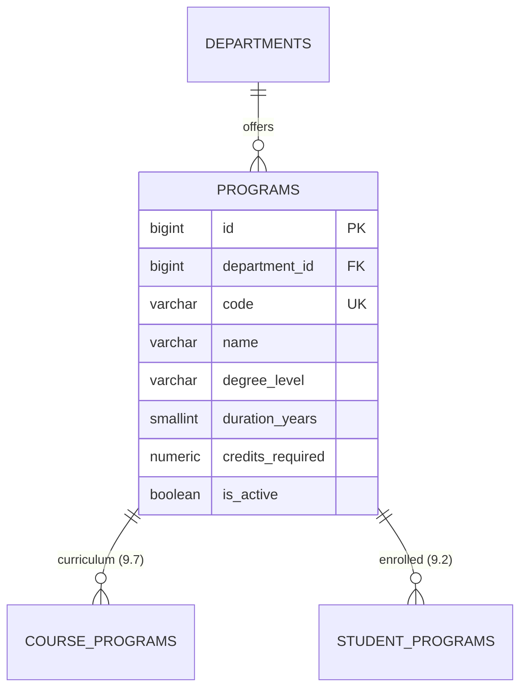
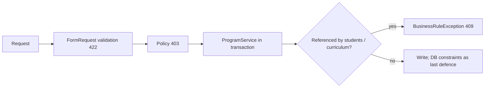

# 10 — Program Management Report (Module 9.5)

- **Date:** 2026-10-01
- **Module:** 9.5 Program Management (business-overview §9.5)
- **Status:** `[Implemented]` — the curriculum editor shipped with 9.7 ([report](11_Course-Management-Report.md))
- **Depends on:** 9.4 Faculty & Department ([report](7_Faculty-and-Department-Report.md))

---

## 1. Scope

Programs (degree tracks) offered by departments: create, edit, archive,
reactivate, delete (guarded), list/filter, with a web UI and a REST API.

Out of scope:

- **Curriculum (program ↔ course)** — was deferred here and delivered with 9.7:
  `POST/PATCH/DELETE /api/programs/{program}/courses`, see the 9.7 report.
- Student assignment to programs (`student_programs`, 9.2).

## 2. Data model

One additive migration,
`2026_10_01_090000_add_department_name_uniqueness_to_programs.php`, adds
`uq_programs_department_id_name` — names are unique **within a department**
(skill §4). No column was dropped, renamed or retyped. `programs` has no
`deleted_at`: `is_active` is the archive (skill §6).

## 3. Backend

| Class | Responsibility |
|---|---|
| `Models/Program` | `department()`; `search`/`active` scopes; `DEGREE_LEVELS` (associate, bachelor, master, doctorate) |
| `Models/Department` | gained `programs()` hasMany |
| `Dto/UniversityStructure/ProgramListFilters` | `search`, `filters[faculty_id\|department_id\|degree_level\|is_active]`, whitelisted `sort_by`, capped `per_page` |
| `Services/ProgramService` | `paginate`, `create`, `update`, `archive`, `reactivate`, `delete` |
| `Policies/ProgramPolicy` | view: super/university/faculty admin · write: super/university admin |
| `Http/Requests/Store\|UpdateProgramRequest` | validation, per-department name uniqueness, active department only |
| `Http/Controllers/ProgramController`, `Api/ProgramController` | thin; authorize then call the service |
| `Database/Seeders/ProgramSeeder` | 7 programs, idempotent by `code` |

### 3.1 Business rules

| Rule | Enforced by | Failure |
|---|---|---|
| `code` globally unique | request + `uq_programs_code` | `422` |
| `name` unique within a department | request + `uq_programs_department_id_name` | `422` |
| Program only under an **active** department | `Rule::exists(...)->whereNull('deleted_at')` | `422` |
| Delete refused while `student_programs` or `course_programs` rows exist | `ProgramService::delete()` | `409` (web: flash error) |
| Plain update cannot flip `is_active` | service ignores it; use archive/reactivate | — |

`course_programs` is `ON DELETE CASCADE` in the schema, so the service guard is
what stops a delete from silently wiping curriculum history (skill §12).

## 4. Authorization matrix

| Ability | Super Admin | University Admin | Faculty Admin | Lecturer | Student |
|---|:-:|:-:|:-:|:-:|:-:|
| List / view | ✓ | ✓ | ✓ | 403 | 403 |
| Create / edit / archive / delete | ✓ | ✓ | 403 | 403 | 403 |

Faculty Admin is read-only because the user record carries no faculty/department
scope yet (same limitation as `FacultyPolicy`).

## 5. Endpoints

Web (Inertia): `GET /programs`, `POST /programs`, `GET /programs/{id}/edit`,
`PUT /programs/{id}`, `POST /programs/{id}/archive|reactivate`,
`DELETE /programs/{id}`.

API (`auth:sanctum`): `GET/POST /api/programs`,
`GET/PUT/PATCH/DELETE /api/programs/{program}`,
`POST /api/programs/{program}/archive|reactivate` — all OpenAPI-annotated
(`University Structure` tag) and listed in `docs/api/api-audit.md`.

## 6. UI

- `Programs/Index` — filter bar (search, faculty, level, status), `BaseTable`
  with level/duration/credits/status, create modal, archive/reactivate/delete
  through the shared confirm dialog, read-only state for Faculty Admin.
- `Programs/Edit` — same form; `components/programs/ProgramForm.vue` is shared
  by the modal and the page and provides the faculty → department cascade.
- Sidebar: **Programs** under *Academic structure*; dashboard metric and
  management tile now link to it (see `skills/admin-navigation/SKILL.md`).

## 7. Tests

`backend/tests/Feature/Programs/ProgramManagementTest.php` — 24 tests: 401/403
per role, Faculty Admin read-only, web and API CRUD cycles, validation and
unique rules (code global, name per department, self-update, archived
department, move between departments), DB-level uniqueness, list
search/filters/sort whitelist/page cap, archive/reactivate, delete guards for
students and curriculum, department delete now blocked by programs, seeder
idempotency. Full suite: 174 passed. Pint clean; `npm run build` clean.

## 8. Decisions and follow-ups

- Hard delete (no soft delete) because the schema has `is_active` and no
  `deleted_at`; deletes are only possible when nothing references the program.
- Curriculum editor was deferred to 9.7 rather than inventing a Course model here (now delivered).
- Program ↔ student reassignment rules arrive with 9.2.
- Not verified in a browser (none available in this session): the two Vue
  pages are covered by Inertia component-existence tests and a clean build only.
