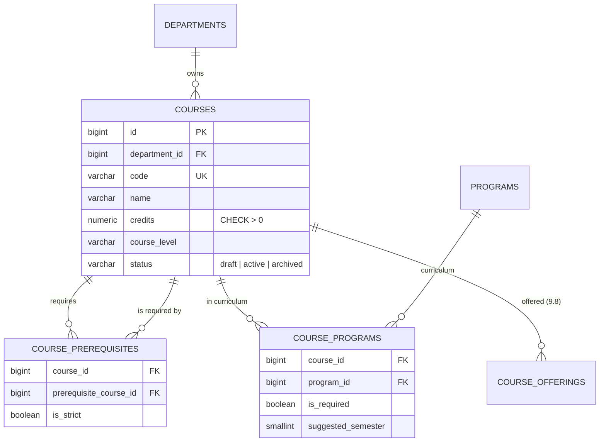
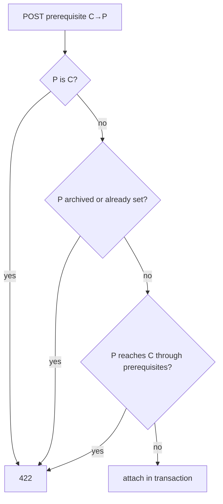

# 11 — Course Management Report (Module 9.7)

- **Date:** 2026-10-01
- **Module:** 9.7 Course Management (business-overview §9.7)
- **Status:** `[Implemented]` — offerings and sections `[Planned]` (9.8)
- **Depends on:** 9.4 Faculty & Department, 9.5 Programs ([report](10_Program-Management-Report.md))

---

## 1. Scope

The course catalog, course prerequisites, and the program **curriculum** (which
courses belong to which program) that module 9.5 deferred.

Out of scope, and **not** claimed as implemented:

- **Course offerings and sections** — an offering is a course in a semester and a
  section needs a lecturer, room and schedule. Those depend on 9.3 Lecturers,
  9.8 Class/Section and 9.10 Timetable. `course_offerings` is only *guarded*: a
  course with offerings cannot be deleted.
- Enforcing prerequisites at enrollment (9.9) — this module stores and validates
  them; enrollment will consume them.

## 2. Data model

**No schema change.** The base migrations already provide every column and
constraint used (`uq_courses_code`, `ck_courses_credits`, `ck_courses_status`,
`uq_course_programs`, `uq_course_prerequisites`, the self-reference check).

Value domain added by the application: `course_level` ∈ `introductory`,
`intermediate`, `advanced`, `graduate` (the column is free text in the schema;
this keeps it filterable).

## 3. Backend

| Class | Responsibility |
|---|---|
| `Models/Course` | `department()`, `programs()`, `prerequisites()`, `dependents()`; status constants; `search` scope |
| `Models/Program` | gained `courses()` (curriculum, with pivot `is_required`, `suggested_semester`) |
| `Dto/UniversityStructure/CourseListFilters` | `search`, `filters[faculty_id|department_id|program_id|status|course_level]`, whitelisted sort, capped page size |
| `Services/CourseService` | `paginate`, `create`, `update`, `archive`, `reactivate`, `delete`, `addPrerequisite`, `removePrerequisite` |
| `Services/ProgramService` | `addCourse`, `updateCourse`, `removeCourse`, `isInCurriculum` — membership stays with the program (skill §12) |
| `Policies/CoursePolicy` | view: super/university/faculty admin · write: super/university admin |
| Requests | `Store|UpdateCourseRequest`, `StoreCoursePrerequisiteRequest`, `Store|UpdateProgramCourseRequest` |
| Controllers | `CourseController`, `Api/CourseController`; curriculum actions on `ProgramController` / `Api/ProgramController` |
| `CourseSeeder` | 10 courses, 5 prerequisite links, 15 curriculum placements — idempotent |

### 3.1 Business rules

| Rule | Enforced by | Failure |
|---|---|---|
| `code` globally unique; `credits` > 0 (≤ 99.99) | request + DB constraints | `422` |
| `status` may be set to `draft`/`active` only; archiving is its own action | request + service | `422` |
| An archived course keeps its status on a plain edit; use *reactivate* | `CourseService::update` | — |
| Prerequisite ≠ the course itself | `CourseService` (+ DB check) | `422` |
| Prerequisite must exist, not be archived, not already be set | request + service | `422` |
| **No prerequisite cycles**, direct or transitive | `CourseService::reaches()` — iterative graph walk | `422` |
| Course only under an **active** department | `Rule::exists(...)->whereNull('deleted_at')` | `422` |
| Delete refused while a curriculum, a dependent course or an offering references the course | `CourseService::delete()` | `409` |
| Archived course cannot join a curriculum; no duplicate course per program | `StoreProgramCourseRequest` + `uq_course_programs` | `422` |
| Removing a course from a curriculum removes only the link | `ProgramService::removeCourse` | — |

A course's *own* prerequisite rows cascade on delete (schema), so deleting a
course that merely *has* prerequisites is allowed; deleting one that is *someone
else's* prerequisite is not.

## 4. Authorization matrix

| Ability | Super Admin | University Admin | Faculty Admin | Lecturer | Student |
|---|:-:|:-:|:-:|:-:|:-:|
| List / view courses | ✓ | ✓ | ✓ | 403 | 403 |
| Create / edit / archive / delete, prerequisites, curriculum | ✓ | ✓ | 403 | 403 | 403 |

The skill allows lecturers and students to browse the catalog and Faculty Admin
to manage "within scope". Faculty Admin scoping needs a faculty/department on
the user record, which does not exist yet, so Faculty Admin is read-only; the
lecturer/student catalog views arrive with their dashboards.

## 5. Endpoints

Web: `GET /courses`, `POST /courses`, `GET /courses/{id}/edit`,
`PUT /courses/{id}`, `POST /courses/{id}/archive|reactivate`,
`DELETE /courses/{id}`, `POST /courses/{id}/prerequisites`,
`DELETE /courses/{id}/prerequisites/{prerequisite}`; curriculum:
`POST /programs/{id}/courses`, `PUT|DELETE /programs/{id}/courses/{course}`.

API (`auth:sanctum`, all OpenAPI-annotated, listed in `docs/api/api-audit.md`):
`GET/POST /api/courses`, `GET/PUT/PATCH/DELETE /api/courses/{course}`,
`POST /api/courses/{course}/archive|reactivate`,
`POST /api/courses/{course}/prerequisites`,
`DELETE /api/courses/{course}/prerequisites/{prerequisite}`,
`POST /api/programs/{program}/courses`,
`PATCH|DELETE /api/programs/{program}/courses/{course}`.
`GET /api/programs/{program}` now includes the curriculum.

## 6. UI

- `Courses/Index` — filters (search, faculty, program, level, status), table with
  credits, prerequisite/program counts and status, create modal, archive /
  reactivate / delete via the shared confirm dialog, read-only for Faculty Admin.
- `Courses/Edit` — `components/courses/CourseForm.vue` (shared with the modal),
  `PrerequisiteEditor` (add/remove, shows the server's cycle message), and a
  read-only "Used in programs" card linking to each program.
- `Programs/Edit` — new `ProgramCurriculum` card: add a course, toggle
  required/elective and set the suggested semester inline, remove; shows planned
  credits against `credits_required`.
- Sidebar: **Courses** (Super Admin under *Academics*; University/Faculty Admin
  under *Academic structure*); dashboard tile links to it
  (`skills/admin-navigation/SKILL.md`).

## 7. Tests

`backend/tests/Feature/Courses/CourseManagementTest.php` — 32 tests: 401/403 per
role, Faculty Admin read-only (incl. prerequisites and curriculum), web and API
CRUD, validation (code, credits, level, status, archived department), list
filters/sort whitelist/page cap, archive/reactivate and "edit cannot un-archive",
all three delete guards (curriculum, prerequisite dependent, offering) and the
department guard, prerequisite add/remove, self / duplicate / archived / unknown,
direct and **transitive** cycles plus a diamond that must stay legal, curriculum
add/update/remove, duplicate and archived rejection, multi-program membership,
404s, the Inertia payloads for `Courses/*` and `Programs/Edit`, and seeder
idempotency + acyclicity. Full suite: **206 passed**. Pint clean; `npm run build`
clean.

## 8. Decisions and follow-ups

- Hard delete only when unreferenced; otherwise archive (skill §12).
- Prerequisite cycle detection walks the graph iteratively and tolerates bad
  legacy data without looping.
- `is_strict` is stored and shown; enforcement belongs to enrollment (9.9).
- Not verified in a browser (none available this session): the new pages are
  covered by Inertia component tests and a clean build only.
- Next dependencies: 9.3 Lecturers → 9.8 Sections/offerings → 9.9 Enrollment.
