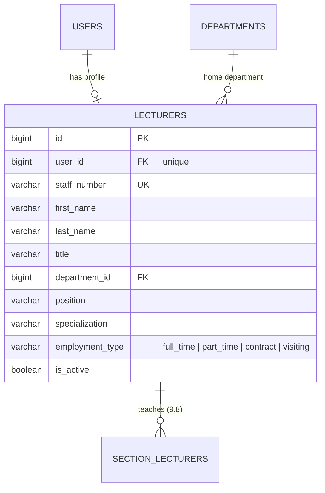
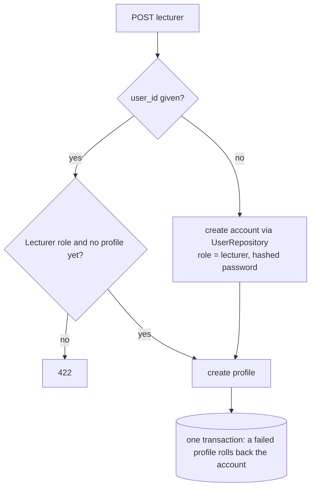

# 12 — Lecturer Management Report (Module 9.3)

- **Date:** 2026-10-01
- **Module:** 9.3 Lecturer Management (business-overview §9.3)
- **Status:** `[Implemented]` — teaching assignments `[Planned]` (9.8 Class / Section)
- **Depends on:** Users & roles, 9.4 Faculty & Department

---

## 1. Scope

Lecturer profiles (staff number, names, title, home department, position,
specialization, employment type, active state), each linked to a login account
with the `lecturer` role.

Out of scope, and **not** claimed as implemented:

- **Teaching assignments** (`section_lecturers`) and
  `GET /api/lecturers/{lecturer}/sections` — sections arrive with 9.8. The edit
  page shows a placeholder card; deletion is already guarded against
  assignments.
- **Lecturer editing their own profile** — a lecturer can *read* their own
  profile through the API; self-service editing comes with the lecturer
  dashboard.

## 2. Data model

**No schema change.** Existing constraints are relied on: `uq_lecturers_user`,
`uq_lecturers_staff_number`, `ck_lecturers_employment`, and RESTRICT foreign keys
to `users` and `departments`. One lecturer belongs to exactly one department
(N–1, skill §2 — made explicit).

## 3. Backend

| Class | Responsibility |
|---|---|
| `Models/Lecturer` | `user()`, `department()`, `fullName()`, `search` scope (incl. account email) |
| `Models/User` | gained `lecturer()` hasOne |
| `Dto/People/LecturerListFilters` | `search`, `filters[faculty_id\|department_id\|employment_type\|is_active]`, whitelisted sort, capped page size |
| `Services/LecturerService` | `paginate`, `create`, `update`, `deactivate`, `reactivate`, `delete` |
| `Policies/LecturerPolicy` | list: super/university/faculty admin · view: those + the lecturer themself · write: super/university admin |
| `Http/Requests/Store\|UpdateLecturerRequest` | validation incl. "link existing account" rules |
| `LecturerController`, `Api/LecturerController` | thin; authorize then call the service |
| `LecturerSeeder` | 6 lecturers with accounts (dev password `lecturer@123`) |

### 3.1 Account handling

- The account is created through `UserRepository`, so hashing and attributes
  match Users management; the account name is kept as "first last".
- Updating a lecturer keeps the account's name in step, and `email`/`phone`
  update the account.
- **Deactivate / reactivate** set `is_active` on the profile *and* the account;
  an inactive account cannot sign in (see §8).
- **Delete** removes the profile and marks the account inactive; the account is
  not deleted (removing accounts stays a Super Admin action in Users).

### 3.2 Business rules

| Rule | Enforced by | Failure |
|---|---|---|
| `staff_number` unique; account email unique | requests + DB | `422` |
| Linked account must have the Lecturer role and no profile | request (+ service re-check) | `422` |
| Account *or* email + password must be given | `required_without` / `prohibits` | `422` |
| Home department must be active | `Rule::exists(...)->whereNull('deleted_at')` | `422` |
| Delete refused while assigned to sections | `LecturerService::delete()` | `409` |
| Department delete refused while lecturers reference it | existing `DepartmentService` guard | `409` |

## 4. Authorization matrix

| Ability | Super Admin | University Admin | Faculty Admin | Lecturer | Student |
|---|:-:|:-:|:-:|:-:|:-:|
| List lecturers | ✓ | ✓ | ✓ | 403 | 403 |
| View a lecturer | ✓ | ✓ | ✓ | own only | 403 |
| Create / edit / deactivate / delete | ✓ | ✓ | 403 | 403 | 403 |

Faculty Admin is read-only because the user record has no faculty/department
scope yet (same limitation as the structure modules).

## 5. Endpoints

Web: `GET /lecturers`, `POST /lecturers`, `GET /lecturers/{id}/edit`,
`PUT /lecturers/{id}`, `POST /lecturers/{id}/deactivate|reactivate`,
`DELETE /lecturers/{id}`.

API (`auth:sanctum`, tag `People`, OpenAPI-annotated, in `docs/api/api-audit.md`):
`GET/POST /api/lecturers`, `GET/PUT/PATCH/DELETE /api/lecturers/{lecturer}`,
`POST /api/lecturers/{lecturer}/deactivate|reactivate`.

## 6. UI

- `Lecturers/Index` — filters (search incl. email, faculty, type, status), table,
  "New lecturer" modal with **create new account** or **link existing lecturer
  account** (lists Lecturer-role accounts without a profile), deactivate /
  reactivate / delete via the shared confirm dialog, read-only for Faculty Admin.
  *(Update 2026-10-07: Lecturer-role accounts without a profile, such as the
  seeded `lecturer@educore.kh`, are no longer invisible here. A notice above
  the filters, shown to managers only, names each one; its "Create lecturer
  profile" action opens the modal in link mode with that account selected
  (`components/UnlinkedAccountsNotice.vue`, shared with `Students/Index`).)*
- `Lecturers/Edit` — account (email, phone) + profile form
  (`components/lecturers/LecturerForm.vue`, shared with the modal), status
  toggle, and a teaching-assignments placeholder.
- Sidebar: **Lecturers** under *People* for Super Admin, University Admin and
  Faculty Admin; dashboard management tile links to it; dashboard stats now
  include `total_courses`, `total_lecturers`, `active_lecturers`.

## 7. Tests

`backend/tests/Feature/Lecturers/LecturerManagementTest.php` — 23 tests: 401/403
per role, lecturer can read only their own profile (and cannot list or edit),
Faculty Admin read-only, Inertia payloads, create with a new account (role,
hashed password, account name), link an existing account, reject non-lecturer
or already-linked accounts, account-or-credentials requirement, profile
validation and uniqueness, archived department, **transaction rollback leaves no
orphan account**, update syncs account name/email/phone, own vs other
uniqueness, web create/update, list search (incl. email)/filters/sort
whitelist/page cap, deactivate/reactivate mirror onto the account, delete keeps
the account inactive, section-assignment delete guard, department guard,
seeder idempotency. Full suite: **232 passed** (incl. 3 login tests). Pint clean; `npm run build` clean.

## 8. Decisions and follow-ups

- **Inactive accounts cannot sign in** (approved follow-up, same change set).
  `LoginRequest::authenticate()` — used by both web and API login — now requires
  `is_active = true`. Per `skills/authentication`, an inactive account gets the
  same generic "credentials do not match" error and the attempt counts toward
  the rate limit, so the response never reveals that the account exists.
  Tests: `tests/Feature/Auth/LoginTest.php` (inactive web login, inactive API
  token, reactivated account). **Not covered:** a session or API token that
  was issued *before* deactivation stays valid until logout/expiry.
- One home department per lecturer (N–1), per the schema.
- Not verified in a browser (none available this session).
- Next: 9.2 Students (same account + profile pattern), then 9.8 sections with
  lecturer assignment.
