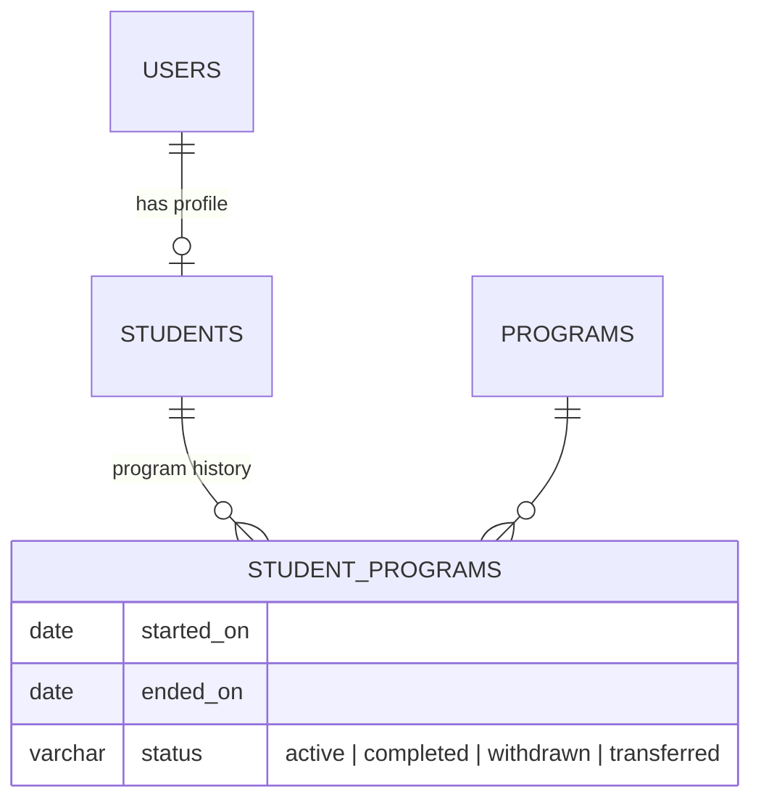
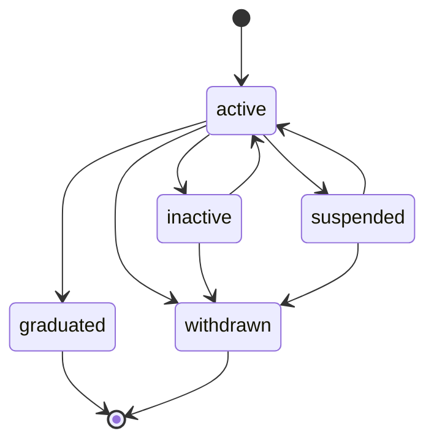

# 13 — Student Management Report (Module 9.2)

- **Date:** 2026-10-01
- **Module:** 9.2 Student Management (business-overview §9.2)
- **Status:** `[Implemented]` — enrollments/grades/documents views `[Planned]` with their modules
- **Depends on:** Users & roles, 9.5 Programs

## 1. Scope

Student profiles linked to Student-role login accounts, the status lifecycle,
and program history (`student_programs`). Out of scope and **not** claimed:
student sub-resources (`/students/{id}/enrollments|grades|documents|invoices`),
lecturer read access to students in their sections (needs sections), and
Student-ID login (login is by email today).

## 2. Data model

**No schema change.** Relies on `uq_students_user`, `uq_students_student_number`,
`uq_students_national_id`, the gender/status checks, and the partial unique
index `uq_student_programs_active` (one active program per student).

## 3. Rules

| Rule | Enforced by | Failure |
|---|---|---|
| Student ID unique, format `^[A-Za-z0-9-]{4,50}$`; email, national ID unique | requests + DB | `422` |
| Account: link an existing Student-role account without a profile, or create one (same transaction) | request + `StudentService` | `422` |
| First program must be active; opens the first `student_programs` row | request + service | `422` |
| Transitions per the diagram; graduated/withdrawn are final | `Student::TRANSITIONS` | `409` |
| Graduation/withdrawal closes the active period (`completed`/`withdrawn`, `ended_on`) | service | — |
| Closing/transfer date not before the period start | service | `422` |
| Sign-in allowed only for `active` and `graduated` (account `is_active` mirrored) | service + login check | — |
| Program transfer: active students only, different active program, no pending/confirmed enrollments; old period closed `transferred`, new one opened | service | `409`/`422` |
| Delete only without enrollments, GPA, documents, invoices, internships; program rows go with the profile, account kept inactive | service | `409` |
| Program delete blocked while students reference it | existing `ProgramService` guard | `409` |

## 4. Authorization

| Ability | Super Admin | University Admin | Faculty Admin | Lecturer | Student |
|---|:-:|:-:|:-:|:-:|:-:|
| List | ✓ | ✓ | ✓ | 403 | 403 |
| View | ✓ | ✓ | ✓ | 403 | own only |
| Create / edit / status / transfer / delete | ✓ | ✓ | 403 | 403 | 403 |

## 5. Endpoints

Web: `GET /students`, `POST /students`, `GET /students/{id}/edit`,
`PUT /students/{id}`, `POST /students/{id}/status`, `POST /students/{id}/program`,
`DELETE /students/{id}`.
API (tag `People`, OpenAPI-annotated, listed in `docs/api/api-audit.md`):
`GET/POST /api/students`, `GET/PUT/PATCH/DELETE /api/students/{student}`,
`POST /api/students/{student}/status`, `POST /api/students/{student}/program`.

## 6. Backend / UI

`Models/Student`, `Models/StudentProgram`, `User::student()`,
`Dto/People/StudentListFilters`, `Services/StudentService`,
`Policies/StudentPolicy`, four requests, `StudentResource` (no credentials),
web + API controllers, `StudentFactory`, `StudentSeeder` (10 students, dev
password `student@123`). UI: `Students/Index` (filters, create modal with new or
linked account + program), `Students/Edit` (`StudentLifecycle`: status change
with confirmation, program transfer, history; profile form; delete). Sidebar
**Students** under *People*; dashboard tile and `total_students`/`active_students`.

*(Update 2026-10-07: the list shows profiles, not accounts, so a Student-role
account created in Users management (or the seeded `student@educore.kh`) was
missing from it with no hint why — Users showed two students, Students one.
`Students/Index` now shows a notice above the filters, for managers only,
naming each Student-role account without a profile (the existing
`unlinkedAccounts` prop); its "Create student profile" action opens the New
student modal with *Link an existing student account* and that account
already selected. Shared component: `components/UnlinkedAccountsNotice.vue`.
No backend change.)*

## 7. Tests

`backend/tests/Feature/Students/StudentManagementTest.php` — 21 tests covering
role scoping (student own-only), screens, create (new/linked account, program
period), validation/uniqueness/format, update sync, every transition rule incl.
final states and sign-in gating, closing-date guard, transfer history and
guards (same/inactive program, non-active student, open enrollments), delete
guard, program delete guard, list filters/sort whitelist, web flow, seeder
idempotency. Full suite: **253 passed**.

## 8. Decisions

- Graduates keep sign-in (transcripts/documents); inactive, suspended and
  withdrawn students cannot sign in. Existing sessions are not cut (open item).
- Re-admission after graduation/withdrawal is not supported yet.
- Not verified in a browser.
