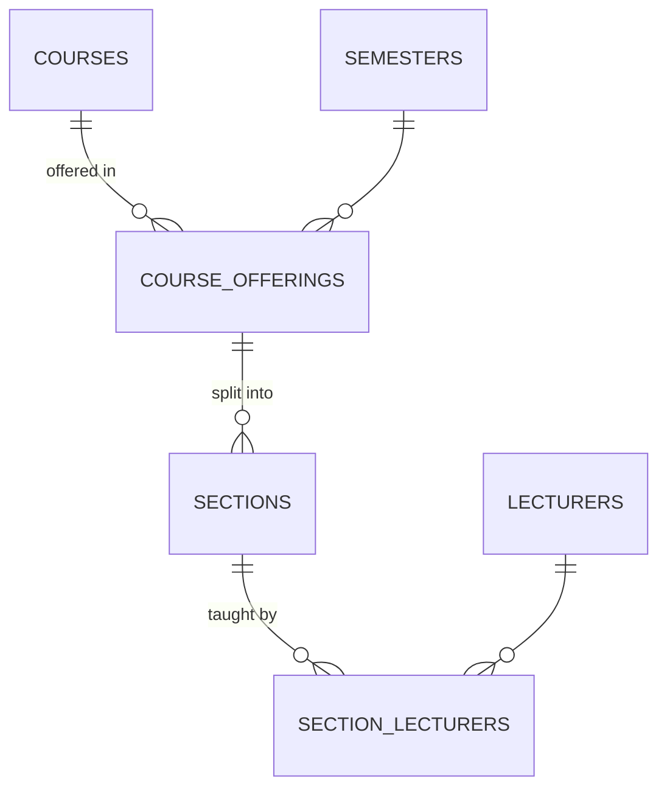

# 14 — Class / Section Report (Module 9.8)

- **Date:** 2026-10-01
- **Module:** 9.8 Class / Section Management (business-overview §9.8)
- **Status:** `[Implemented]` — rooms and weekly schedules `[Planned]` (9.10 Timetable)
- **Depends on:** 9.6 Academic calendar, 9.7 Courses, 9.3 Lecturers

## 1. Scope

Course offerings (a course in a semester), their sections (A, B…, capacity,
status) and lecturer assignments (primary / assistant / tutor), plus a
lecturer's teaching load. Not built and **not** claimed: rooms, schedule
entries and conflict detection (9.10), enrollment (9.9).

## 2. Data model

**No schema change.** Uses `uq_course_offerings (course_id, semester_id)`,
`uq_sections_offering_code`, `uq_section_lecturers`, and the status/role checks.

## 3. Rules

| Rule | Enforced by | Failure |
|---|---|---|
| One offering per course per semester | request + DB | `422` |
| Only active courses can be offered | `CourseOfferingService` | `422` |
| No offerings, sections or lecturer changes in a **completed** semester | service | `409` |
| Course/semester of an offering are immutable | update request | — |
| Offering delete refused while it has sections | service | `409` |
| Section code unique per offering, `^[A-Za-z0-9-]+$`; capacity 1–1000 | request + DB | `422` |
| Capacity never below open (pending/confirmed) enrollments | service | `422` |
| Section delete refused with schedule entries, enrollments, attendance, assignments or exams; lecturer links cascade | service | `409` |
| Assign only **active** lecturers, no duplicates, at most one **primary** | service + DB | `422` |
| Course delete and lecturer delete guards now see offerings / assignments | existing services | `409` |

## 4. Authorization

| Ability | Super Admin | University Admin | Faculty Admin | Lecturer | Student |
|---|:-:|:-:|:-:|:-:|:-:|
| View offerings / sections | ✓ | ✓ | ✓ | 403 | 403 |
| Manage offerings, sections, assignments | ✓ | ✓ | 403 | 403 | 403 |
| Lecturer teaching load | ✓ | ✓ | ✓ | own only | 403 |

## 5. Endpoints

Web: `GET /offerings`, `POST /offerings`, `GET|PUT|DELETE /offerings/{id}`,
`POST /offerings/{id}/sections`, `PUT|DELETE /sections/{id}`,
`POST /sections/{id}/lecturers`, `DELETE /sections/{id}/lecturers/{lecturer}`.
API (tag `Academics`, OpenAPI-annotated, in `docs/api/api-audit.md`):
`GET/POST /api/offerings`, `GET/PUT/PATCH/DELETE /api/offerings/{offering}`,
`POST /api/offerings/{offering}/sections`, `GET/PUT/PATCH/DELETE /api/sections/{section}`,
`POST /api/sections/{section}/lecturers`, `DELETE /api/sections/{section}/lecturers/{lecturer}`,
`GET /api/lecturers/{lecturer}/sections`.

## 6. Backend / UI

`CourseOffering`, `Section` models (+ `Course::offerings`, `Lecturer::sections`),
`CourseOfferingService`, `CourseOfferingPolicy` (sections authorize through
their offering), five requests, two resources, web + two API controllers,
factories, `CourseOfferingSeeder` (open semester, 6 offerings, 8 sections, 8
assignments). UI: `Offerings/Index` (filters, create modal limited to
non-completed semesters and active courses), `Offerings/Show` (offering
settings, `SectionCard` per section with seat bar, edit, lecturer assign/remove,
add section; read-only when the semester is completed), lecturer edit page now
lists the teaching load. Sidebar **Offerings & sections**; dashboard tile and
`total_offerings` / `total_sections` stats.

## 7. Tests

`backend/tests/Feature/Offerings/CourseOfferingManagementTest.php` — 12 tests:
roles, offering CRUD + screens, duplicate / inactive course / completed semester /
bad status, delete guards (offering, course), filters, section CRUD and code /
capacity rules, capacity vs open enrollments and the history delete guard,
completed-semester lock, every lecturer-assignment rule incl. lecturer delete
guard, teaching load scoping, web flow, seeder idempotency. Full suite:
**265 passed** (run twice).

Also fixed: `AcademicYearFactory` drew a unique `code` from only 11 years, so
tests creating several semesters collided intermittently; it now draws unique
years from a wide range.

## 8. Decisions

- Room and time-slot conflicts are deliberately left to the Timetable
  (`skills/timetable`) rather than half-implemented here.
- Not verified in a browser.
