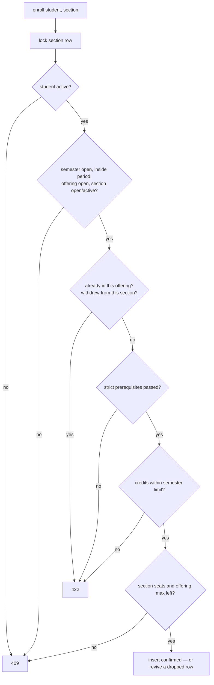

# 15 — Enrollment Report (Module 9.9)

- **Date:** 2026-10-01
- **Module:** 9.9 Course Registration / Enrollment (business-overview §9.9)
- **Status:** `[Implemented]` — timetable-clash check added with 9.10
- **Depends on:** 9.2 Students, 9.7 Courses (prerequisites), 9.8 Sections

## 1. Scope

Student registration into sections: admin-assisted and student self-service,
one shared rule engine (`EnrollmentService::enroll()`), drop with history, a
manual "complete" action (until grading exists), and student/staff screens.

## 2. Rule engine

- **Passed prerequisite** = a `completed` enrollment in any offering of that
  course whose grade, if one exists, is not `F` / 0 points. Non-strict
  prerequisites are advisory. Grading (9.14) will supply real results.
- **Credit limit** = `config('academics.max_semester_credits')`, env
  `MAX_SEMESTER_CREDITS`, default 24; counts pending + confirmed enrollments.
- **Race safety:** the whole check-and-insert runs in one transaction holding
  `lockForUpdate` on the section, so two requests cannot take the last seat.
- **Drop** keeps the row: `dropped`, or `withdrawn` when attendance or a grade
  exists. A student who *withdrew* cannot re-enroll in the same section; a
  *dropped* row is revived (unique `(student_id, section_id)`).
- **Complete** (managers): confirmed → completed.

## 3. Authorization

| Ability | Super / University Admin | Faculty Admin | Student |
|---|:-:|:-:|:-:|
| List all enrollments | ✓ | ✓ | 403 |
| View one / a student's list | ✓ | ✓ | own only |
| Enroll | any student | 403 | self only (`student_id` prohibited) |
| Drop | ✓ | 403 | own only |
| Complete | ✓ | 403 | 403 |

## 4. Endpoints

API (tag `Academics`): `GET/POST /api/enrollments`,
`GET/DELETE /api/enrollments/{enrollment}` (DELETE = drop, keeps history),
`POST /api/enrollments/{enrollment}/complete`,
`GET /api/students/{student}/enrollments`.
Web: `GET /enrollments`, `POST /enrollments`, `POST /enrollments/{id}/drop|complete`
(staff); `GET /registration`, `POST /registration`,
`POST /registration/{id}/drop` (students).

## 5. Implementation

`Models/Enrollment` (soft deletes available, never used for drops),
`Student::enrollments`, `Section::enrollments`, `EnrollmentService`,
`EnrollmentPolicy`, `StoreEnrollmentRequest`, `EnrollmentResource`, API + web
controllers, `RegistrationController`, `config/academics.php`,
`EnrollmentFactory`, `EnrollmentSeeder` (enrolls seeded students in open
sections of their curriculum **through the service**). UI: `Enrollments/Index`
(staff: enroll form with seats left, filters, complete/drop) and
`Registration/Index` (student: credits bar, my courses with drop, open sections
with the reason a section can't be chosen — enrolled, closed, missing
prerequisites, full, over the credit limit). Sidebar: *Enrollments* for staff,
*Course registration* for students. No schema change.

## 6. Tests

`backend/tests/Feature/Enrollments/EnrollmentTest.php` — 14 tests: admin
enroll, student self-enroll with forged `student_id` rejected, read scoping,
inactive student / closed semester / period ended / offering not open / section
draft, capacity and offering maximum, freed seat after drop, duplicate and
second section of the same offering, revive after drop, strict prerequisite
(missing, failed grade, passing grade; non-strict ignored), credit limit,
drop → dropped / withdrawn and 409 on second drop, complete permissions and
state, web screens + self-service flow, seeder obeys rules and is idempotent.
Full suite: **279 passed**.

## 7. Follow-ups

- Timetable clashes between a student's sections — implemented in 9.10 (`TimetableService::assertStudentFree`).
- Pending/approval workflow is not used: valid enrollments are confirmed.
