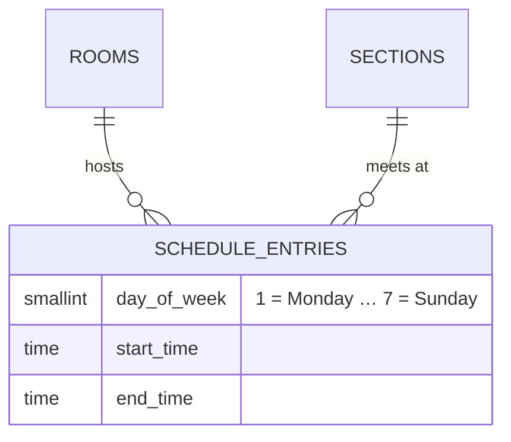

# 16 — Timetable Report (Module 9.10)

- **Date:** 2026-10-01
- **Module:** 9.10 Timetable Management (business-overview §9.10)
- **Status:** `[Implemented]`
- **Depends on:** 9.8 Sections, 9.3 Lecturers, 9.9 Enrollment

## 1. Scope

Rooms, recurring weekly meetings per section (`schedule_entries`), every
conflict rule from `skills/timetable` §4, and personal weekly timetables for
students and lecturers. Enrollment and lecturer assignment now also refuse
timetable clashes.

## 2. Data model and schema change

**One migration:** `2026_10_01_120000_drop_global_room_slot_uniqueness_from_schedule_entries`
drops `uq_schedule_room_slot (room_id, day_of_week, start_time, end_time)`.
Schedule entries are weekly slots with no semester column, so that constraint
made a room's slot unique **across all semesters** — the same room could never
be used at the same time in a later semester — while still missing partial
overlaps. Room conflicts are now enforced per semester (incl. partial overlap)
by `TimetableService` under a `lockForUpdate` on the room row. The other
constraints stay: `uq_schedule_section_slot`, `ck_schedule_dow`,
`ck_schedule_times`, `uq_rooms_code`, room capacity/type checks.

## 3. Conflict rules

All within the section's semester; overlap = `a.start < b.end AND a.end > b.start`
(touching slots are fine).

| Rule | Where | Failure |
|---|---|---|
| Day 1–7, `HH:MM`, end after start, within 06:00–22:00 | request + service | `422` |
| Room active | service | `422` |
| Room seats ≥ current open enrollments of the section | service | `422` |
| Section does not meet twice at once | service (+ DB) | `422` |
| Room not double-booked | service (room row lock) | `422` |
| No lecturer of the section teaches elsewhere at that time | service | `422` |
| No enrolled student has another class at that time | service | `422` |
| Completed semester: timetable frozen | service | `409` |
| Enrolling a student whose classes would clash | `EnrollmentService` → `TimetableService::assertStudentFree` | `422` |
| Assigning a lecturer who teaches elsewhere at that time | `CourseOfferingService` → `assertLecturerFree` | `422` |
| Room delete while classes are scheduled | service | `409` |

## 4. Authorization

| Ability | Super / University Admin | Faculty Admin | Lecturer | Student |
|---|:-:|:-:|:-:|:-:|
| View rooms / section schedules | ✓ | ✓ | 403 | 403 |
| Manage rooms and schedules | ✓ | 403 | 403 | 403 |
| Personal timetable (API) | any | any | own | own |
| `/timetable` page | — | — | own | own |

## 5. Endpoints

API (tag `Timetable`): `GET/POST /api/rooms`, `GET/PUT/PATCH/DELETE /api/rooms/{room}`,
`GET/POST /api/sections/{section}/schedule`,
`PUT/PATCH/DELETE /api/schedule-entries/{entry}`,
`GET /api/timetable/student/{student}`, `GET /api/timetable/lecturer/{lecturer}`.
Web: `GET /rooms`, `POST /rooms`, `PUT|DELETE /rooms/{id}`,
`POST /sections/{id}/schedule`, `DELETE /schedule-entries/{id}`, `GET /timetable`.

## 6. Implementation

`Room`, `ScheduleEntry` models (+ `Section::scheduleEntries`), `TimetableService`,
`RoomPolicy`, `RoomRequest`, `ScheduleEntryRequest`, resources, web
`RoomController` / `TimetableController`, API `RoomController` /
`ScheduleController`, factories, `RoomSeeder` (7 rooms) and `ScheduleSeeder`
(two meetings per open section through the service, conflict-free by
construction; runs before `EnrollmentSeeder`). UI: `Rooms/Index` (CRUD modal,
deactivate), schedule editor inside each section card on the offering page
(`SectionSchedule`, server errors under the field), `Timetable/Index` weekly
grid (Mon–Fri, weekend only when used). Sidebar: *Rooms* for staff,
*My timetable* for students and lecturers.

## 7. Tests

`backend/tests/Feature/Timetable/TimetableTest.php` — 11 tests: room CRUD,
roles and delete guard; slot shape/bounds/inactive room; room conflict incl.
partial and touching; same room in another semester allowed; section double
meeting; lecturer conflict when scheduling and when assigning; student conflict
when scheduling and when enrolling; room capacity vs enrollment; move/remove and
completed-semester lock; personal timetables and scoping; seeders conflict-free
and idempotent. Full suite: **290 passed** (run twice).
