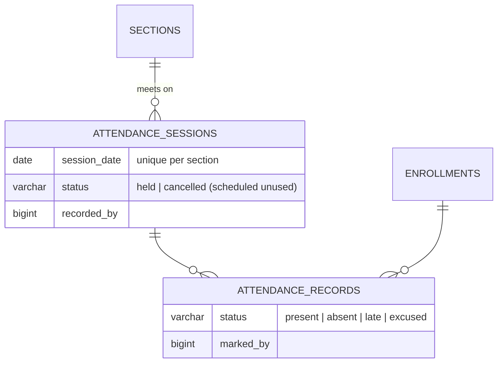
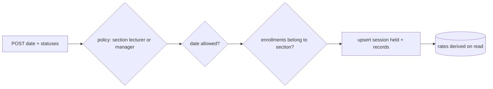

# 17 — Attendance Report (Module 9.11)

- **Date:** 2026-10-01
- **Module:** 9.11 Attendance (business-overview §9.11)
- **Status:** `[Implemented]`
- **Depends on:** 9.9 Enrollment, 9.10 Timetable

## 1. Scope

Dated attendance sessions per section, bulk recording of student statuses, derived
attendance rates, session cancellation, and lecturer / staff / student screens.
Audit trail of corrections is not built (9.24 Audit Logs).

## 2. Data model

**No schema change.** Relies on `uq_attendance_sessions_section_date`,
`uq_attendance_records_session_enrollment` and the status checks.

## 3. Rules and decisions

| Rule | Where | Failure |
|---|---|---|
| Bulk upsert per date; only listed students are touched | `AttendanceService::record` | — |
| Date: `Y-m-d`, not in the future, inside the semester | request + service | `422` |
| Section with a weekly schedule: only on its scheduled weekdays; session times copied from that slot | service | `422` |
| Completed semester: read-only | service | `409` |
| Only enrollments of the section with status pending / confirmed / completed | service | `422` |
| Recording into a cancelled session refused until restored | service | `409` |
| **Rate** = (present + late) ÷ (present + late + absent) over *held* sessions; excused, unmarked and cancelled excluded; `null` when nothing counts | SQL aggregation, never stored | — |
| Dropping an enrollment that has attendance becomes a withdrawal | `EnrollmentService` (9.9) | — |

Lateness counts as attended (one documented choice, skill §4). Unmarked
students are neither present nor absent.

## 4. Authorization

| Ability | Manager | Faculty Admin | Lecturer of the section | Other lecturer | Student |
|---|:-:|:-:|:-:|:-:|:-:|
| Record / cancel | ✓ | 403 | ✓ (while active) | 403 | 403 |
| Read register & rates | ✓ | ✓ | ✓ | 403 | 403 |
| Read a student's summary | ✓ | ✓ | — | — | own only |

`AttendancePolicy` is registered explicitly (`Gate::policy`) because it
authorizes per section / student rather than per model instance.

## 5. Endpoints

API (tag `Attendance`): `GET/POST /api/sections/{section}/attendance`,
`GET /api/sections/{section}/attendance/summary`,
`POST /api/attendance-sessions/{session}/cancel`,
`GET /api/students/{student}/attendance`.
Web: `GET /attendance` (lecturer), `GET|POST /attendance/sections/{section}`,
`POST /attendance-sessions/{session}/cancel`, `GET /my-attendance` (student).

## 6. UI

- `Attendance/Classes` — a lecturer's sections with *Take attendance*.
- `Attendance/Section` — scheduled class dates up to today (taken / cancelled /
  not taken), date picker, register with one-tap statuses and *mark all*,
  optional topic, cancel/restore class, per-student rate table (rates under 75%
  highlighted). Read-only for Faculty Admin and in completed semesters.
  Staff reach it via *Attendance register* on each section card.
- `Attendance/Mine` — a student's rate per course with counts.
- Sidebar: *Attendance* (lecturer), *My attendance* (student).

## 7. Tests

`backend/tests/Feature/Attendance/AttendanceTest.php` — 9 tests (time frozen):
bulk record with times from the schedule, re-save and partial save, date policy
(future, unscheduled weekday, before semester, bad format, completed semester),
only markable enrollments of the section, derived rates incl. late / excused /
cancelled and restore, null rate, full authorization matrix incl. inactive
lecturer, web pages, drop-after-attendance → withdrawn. Full suite: **299 passed**
(run twice). `AttendanceSeeder` records the first six meetings of each open
section through the service.
