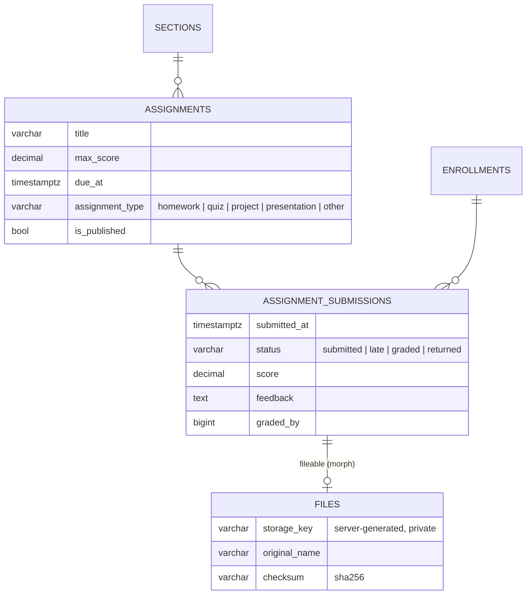
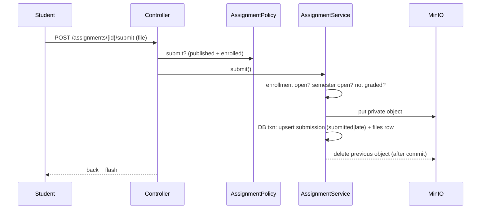

# 18 — Assignments Report (Module 9.12)

- **Date:** 2026-10-01
- **Module:** 9.12 Assignments (business-overview §9.12)
- **Status:** `[Implemented]`
- **Depends on:** 9.8 Class / Section, 9.9 Enrollment, MinIO (`skills/file-storage`)

## 1. Scope

Section coursework: lecturers create draft assignments, publish them, review
and grade submissions; enrolled students upload one private file per
assignment (replaceable until graded), with late work flagged. Staff get a
read-only view. Not built: lecturer-attached materials, rubrics, plagiarism
checks, notifications (9.19/9.20), and feeding scores into grades (9.14).

## 2. Data model

**No schema change.** Uses the existing `assignments`, `assignment_submissions`
(unique per assignment + enrollment) and polymorphic `files` tables. New models:
`Assignment`, `AssignmentSubmission`, `StoredFile` (table `files`).

## 3. Rules and decisions

| Rule | Where | Failure |
|---|---|---|
| New assignments start as drafts; students only see published ones | service + `listFor` | — |
| Due date must be in the future and within the semester (checked on create and when changed) | `AssignmentService` | `422` |
| `max_score` > 0 and never below a score already awarded | request + service | `422` |
| Completed semester: coursework is frozen | service | `409` |
| Unpublish / delete refused once anything is submitted | service | `409` |
| Only students with a pending/confirmed enrollment in the section may submit | policy + service | `403` / `409` |
| One submission per student; re-upload replaces the file (old object deleted after commit) until graded | service | `409` once graded |
| Submitted after `due_at` → status `late` (accepted, flagged) | service | — |
| File: pdf, docx, zip, png, jpg, jpeg; max 10 MB (`config/academics.php`) | `SubmitAssignmentRequest` | `422` |
| Score ≤ `max_score`; grading sets `graded`, grader and time | service | `422` |

Files are private objects on the uploads disk (`UPLOADS_DISK`, default `s3` =
MinIO) at `assignments/{course}/{assignment}/submissions/{student}/{uuid}.ext`.
The API never exposes the key or a MinIO URL — downloads stream through the
authorized `/submissions/{id}/file` route. The object is uploaded before the
transaction and removed if the database work fails.

## 4. Authorization

`AssignmentPolicy` (shares `Policies/Concerns/ChecksSectionTeaching` with
`AttendancePolicy`); registered for `AssignmentSubmission` via `Gate::policy`.

| Ability | Manager | Faculty Admin | Lecturer of the section | Other lecturer | Enrolled student | Other student |
|---|:-:|:-:|:-:|:-:|:-:|:-:|
| List section assignments | ✓ | ✓ | ✓ | 403 | published only | 403 |
| Create / edit / publish / delete | ✓ | 403 | ✓ (while active) | 403 | 403 | 403 |
| See all submissions | ✓ | ✓ | ✓ | 403 | 403 | 403 |
| Grade | ✓ | 403 | ✓ | 403 | 403 | 403 |
| Submit | — | — | — | — | ✓ (published) | 403 |
| Download a submission file | ✓ | ✓ | ✓ | 403 | own only | 403 |

## 5. Endpoints

API (tag `Assignments`): `GET|POST /api/sections/{section}/assignments`,
`GET|PUT|PATCH|DELETE /api/assignments/{assignment}`,
`POST /api/assignments/{assignment}/publish`,
`GET|POST /api/assignments/{assignment}/submissions`,
`POST /api/submissions/{submission}/grade`,
`GET /api/submissions/{submission}/file`.
Web: `GET|POST /coursework/sections/{section}`, `PUT|DELETE /assignments/{id}`,
`POST /assignments/{id}/publish`, `POST /assignments/{id}/submit`,
`POST /submissions/{id}/grade`, `GET /submissions/{id}/file`,
`GET /my-assignments` (student).

## 6. UI

- `Coursework/Section` — per section: assignment cards (type, draft/published,
  due date highlighted when past), *New assignment* / edit modal (local
  date-time sent as an absolute instant), publish/unpublish/delete with
  confirmation, collapsible submission list with download links and a grade
  modal (score + feedback). Enrolled students see the published work with an
  upload control instead. Reached from *Assignments* on the lecturer's section
  cards (`Attendance/Classes`) and on staff section cards (`Offerings/Show`).
- `Coursework/Mine` — a student's published assignments across current
  sections, soonest due first, with upload / replace, score and feedback.
- `components/coursework/SubmitWork.vue` — shared upload control (accepted
  types, size limit, late warning, locked once graded).
- Sidebar: *My assignments* (student).

## 7. Tests

`backend/tests/Feature/Assignments/AssignmentTest.php` — 10 tests
(`Storage::fake('s3')`, time frozen): lecturer CRUD + publish, validation (due
date, semester bounds, max score) and completed semester, role matrix incl.
Faculty Admin and draft visibility, private submit + replace until graded,
who may submit (draft, other student, dropped student), late flag, file
type/size, grading bounds, download authorization, web
pages. Full suite: **309 passed**. `AssignmentSeeder` adds published and draft
assignments per open section with sample submissions stored in MinIO.

## 8. Incident and safeguards

While building this module, a cached configuration
(`php artisan optimize` in the container entrypoint) made the test suite ignore
`DB_DATABASE=educore_test` and `RefreshDatabase` wiped the development
database. Demo data was restored with `php artisan db:seed`; hand-entered data
and two real error-log rows were lost. Safeguards:

- `tests/TestCase::setUpTraits()` refuses to run unless the database name ends
  in `_test` (verified against a cached config).
- `docker/php/entrypoint.sh` caches config/routes only when
  `APP_ENV=production`, otherwise clears them.
- `docker-compose.yml` now passes MinIO credentials and bucket (`AWS_*`) to
  the backend, which uploads require.
