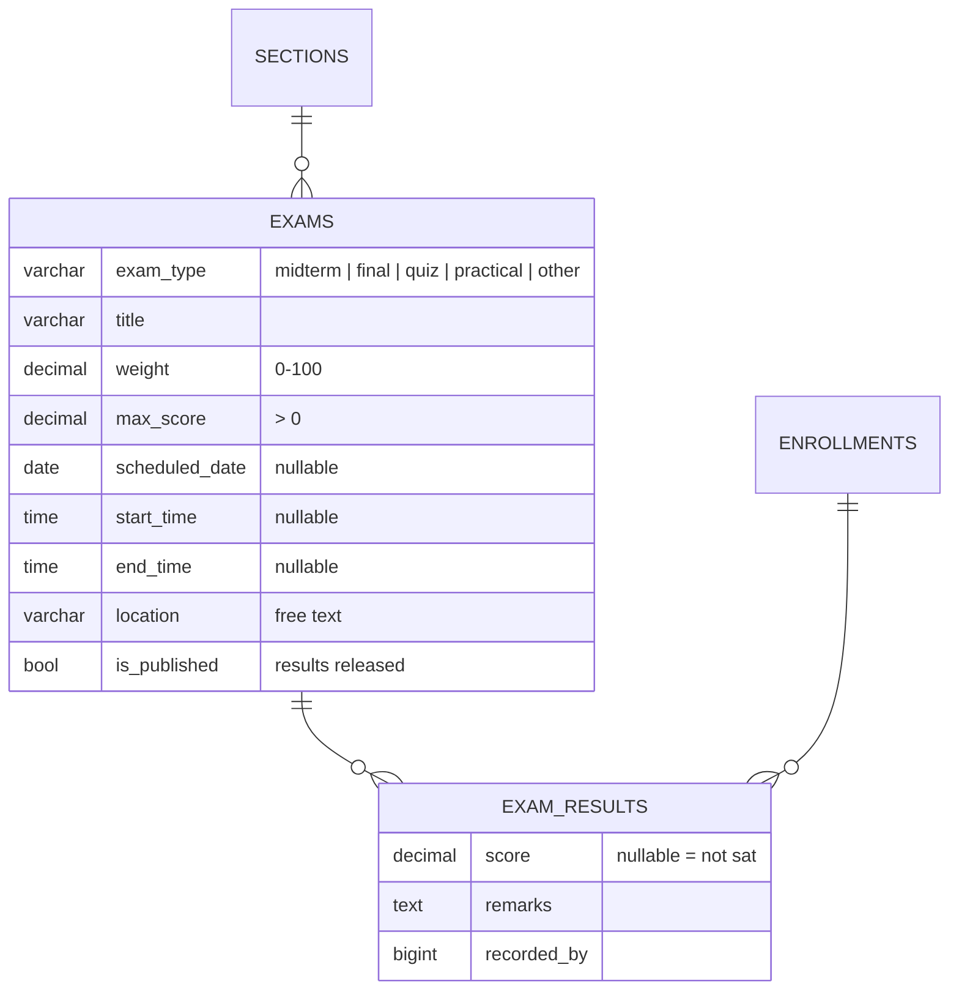
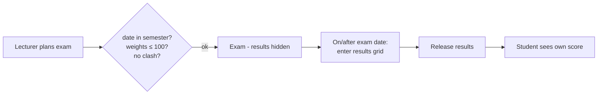

# 19 — Examinations Report (Module 9.13)

- **Date:** 2026-10-01
- **Module:** 9.13 Examinations (business-overview §9.13)
- **Status:** `[Implemented]`
- **Depends on:** 9.8 Class / Section, 9.9 Enrollment

## 1. Scope

Exams per section (midterm, final, quiz, practical, other) with weight, max
score and an optional date / time / location; schedule clash detection; bulk
results entry and single-result correction; releasing results to students;
lecturer / staff / student screens. Not built: turning exam scores into course
grades (9.14), an audit trail of corrections (9.24), room booking for exams,
spreadsheet import.

## 2. Data model

**No schema change.** Relies on `uq_exam_results (exam_id, enrollment_id)` and
the type / weight / max-score checks. New models `Exam`, `ExamResult`.

## 3. Rules and decisions

| Rule | Where | Failure |
|---|---|---|
| Type in the fixed set; weight 0–100; max score > 0; end after start; a date is required with times | `ExamRequest` | `422` |
| Date within the semester | `ExamService` | `422` |
| Exam weights of a section total ≤ 100 % | service | `422` |
| A timed exam may not overlap another exam of the same section, or of any section sharing an open-enrolled student (back-to-back allowed) | service | `409` |
| Completed semester: exams and results frozen | service | `409` |
| Delete refused once results exist | service | `409` |
| Results: one per exam + enrollment (upsert), only pending / confirmed / completed enrollments of the section, 0 ≤ score ≤ max | request + service | `422` |
| Results cannot be entered before the exam date | service | `422` |
| Rows with neither score nor remarks are ignored | service | — |
| Max score cannot drop below a recorded score | service | `422` |
| Students see the schedule always, their own score only after release (`is_published`) | `ExamService::forStudent` | — |

Decisions:

- **`is_published` means "results released".** The schedule is never hidden
  from enrolled students; scores are, until the lecturer releases them.
- **Weights are capped, not forced to 100 %** here. The full course weighting
  (exams + assignments + attendance = 100 %) is `course_grading_configs`,
  owned by 9.14 Grades & GPA, which will also compute grades from these scores.
- Location is free text; exams do not book rooms.

## 4. Authorization

`ExamPolicy` (shares `Policies/Concerns/ChecksSectionTeaching`).

| Ability | Manager | Faculty Admin | Lecturer of the section | Other lecturer | Enrolled student | Other student |
|---|:-:|:-:|:-:|:-:|:-:|:-:|
| List / view exams | ✓ | ✓ | ✓ | 403 | ✓ (schedule) | 403 |
| Full results roster | ✓ | ✓ | ✓ | 403 | 403 | 403 |
| Create / edit / delete / release / enter or correct results | ✓ | 403 | ✓ (while active) | 403 | 403 | 403 |
| Own released result | — | — | — | — | ✓ | — |
| A student's exams | ✓ | ✓ | — | — | own only | 403 |

## 5. Endpoints

API (tag `Examinations`): `GET|POST /api/sections/{section}/exams`,
`GET|PUT|PATCH|DELETE /api/exams/{exam}`, `POST /api/exams/{exam}/publish`,
`POST /api/exams/{exam}/results`, `PATCH /api/exam-results/{result}`,
`GET /api/students/{student}/exams`.
Web: `GET|POST /exams/sections/{section}` (`?exam=` selects the results grid),
`PUT|DELETE /exams/{exam}`, `POST /exams/{exam}/publish`,
`POST /exams/{exam}/results`, `GET /my-exams` (student).

## 6. UI

- `Exams/Section` — exam cards (type, date/time/location, weight, release
  state, result count), section weight total, create/edit modal, release /
  hide / delete with confirmation; a results grid for the selected exam (score
  + remarks per student, live count / average / high / low, locked before the
  exam date and in completed semesters). Enrolled students see the schedule
  and their released score. Reached from *Exams* on the lecturer's section
  cards (`Attendance/Classes`, now titled *Teaching*) and on staff section
  cards (`Offerings/Show`).
- `Exams/Mine` — a student's upcoming and past exams with released scores.
- Sidebar: *My exams* (student).

## 7. Tests

`backend/tests/Feature/Exams/ExamTest.php` — 7 tests (time frozen): CRUD +
release + delete-with-results refusal; validation (type, max score, times,
date required with times, semester bounds, 100 % weight cap, completed
semester); clashes (same section, back-to-back allowed, unrelated section,
shared-student section); results (bulk upsert, blank rows ignored, score > max,
foreign enrollment, max-score guard, correction, before exam date); student
visibility before/after release and no writes; role matrix incl. Faculty Admin,
other and inactive lecturer; web pages and web results entry. Full suite:
**316 passed**. `ExamSeeder` adds a midterm (released, with results when
already held) and an upcoming final per open section.
