# EduCore — Project & Design Report

| | |
|---|---|
| **Project** | EduCore — University Digital Administration Platform |
| **Target market** | Designed for Cambodian university environments |
| **Architecture** | Modular Monolith (MVC backend) |
| **Development team** | Rin Nairith & Lyhor |
| **Status** | In development — foundation [Implemented], modules [Planned] |
| **Report version** | 2.0 (rewritten; modernized formal baseline) |

> **Reading notes**
> - **Status labels** are used throughout: `[Implemented]`, `[Planned]`,
>   `[Future]`, `[Out of Scope]`. Planned functionality is never described as if
>   it already exists.
> - This report is the technical/product companion to the business proposal
>   `docs/3_business-overview.md`.

---

## 1. Executive Summary

EduCore is a centralized digital administration platform for universities, designed
initially for Cambodian university environments. It consolidates academic and
administrative workflows — student and lecturer management, academic structure,
course enrollment, the assessment cycle, documents, financial records,
communication, internships, and reporting — into one secure web platform.

Many institutions operate with spreadsheets, paper documents, disconnected systems,
and manual approval processes. EduCore proposes to reduce fragmentation by giving each
role a single, secure place to access the information and services they need.

The system is built around five roles and one central academic workflow:

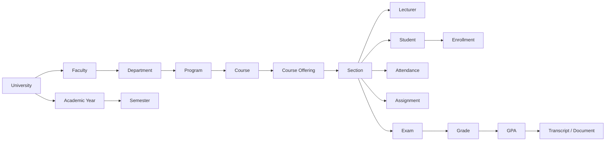

**Major capabilities (initial release):** authentication & RBAC, student/lecturer
management, academic structure, courses & sections, enrollment, timetable, attendance,
assignments, examinations, grades & GPA, documents with QR verification, invoice &
payment records, announcements, email & Telegram notifications, internship management,
analytics, and audit logs.

**Implementation status:** the **foundation is implemented** — Laravel 12 backend
scaffold with Sanctum authentication and health endpoint, Vue 3 + Inertia
(JavaScript) frontend scaffold with an API client, a complete Docker development
environment, and CI/CD workflows. **All business modules are planned** for the
initial release.

---

## 2. Project Vision

EduCore aims to provide a centralized digital environment where a university's academic
and administrative activities can be managed through one secure platform.

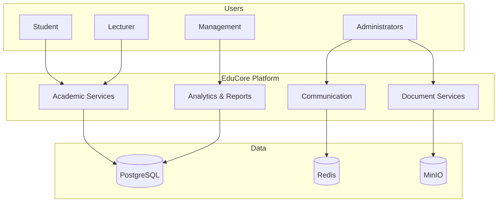

### Current pattern vs. proposed pattern

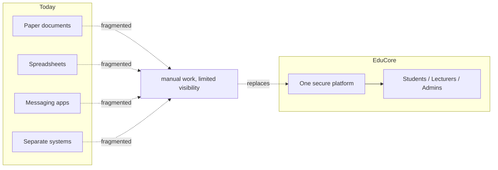

The vision is deliberately practical: it does not promise to replace every university
system; it consolidates the most important workflows first.

---

## 3. Problem Statement

Universities manage large amounts of academic and administrative information. Common
problems include:

| Problem area | Current challenge | Operational consequence |
|---|---|---|
| **Information fragmentation** | Student, course, attendance, grade, and document data live in different systems/files | Inconsistent records and repeated re-entry |
| **Manual processes** | Students visit offices for documents, registration, approvals | Slow turnaround, heavy staff workload |
| **Limited visibility** | Management lacks timely enrolment/attendance/performance views | Decisions rely on delayed information |
| **Communication** | Announcements spread across informal channels | Some students/staff miss important information |
| **Document management** | Documents prepared and verified manually | Slow, hard-to-verify documents |
| **Scheduling conflicts** | Manual timetable creation | Lecturer/room/section conflicts |
| **Fragmented student services** | Students use several channels for courses, schedules, grades, documents | Poor student experience |

EduCore addresses these through centralized data, structured workflows, role-based
access, and integrated communication.

---

## 4. Project Objectives

### 4.1 General Objective

Develop a centralized digital university administration platform that improves academic
management, administrative workflows, communication, and student services.

### 4.2 Specific Objectives

1. Centralize university academic information. [Planned]
2. Digitize student and lecturer management. [Planned]
3. Manage faculties, departments, programs, courses, and sections. [Planned]
4. Provide students with a centralized academic portal. [Planned]
5. Provide lecturers with tools for attendance, assignments, exams, and grades. [Planned]
6. Provide administrators with centralized management tools. [Planned]
7. Digitize document request workflows with QR verification. [Planned]
8. Provide invoice and payment-record management. [Planned]
9. Improve communication through email and Telegram notifications. [Planned]
10. Provide academic analytics and reporting. [Planned]
11. Support the internship workflow. [Planned]
12. Build a modular-monolith architecture that supports future expansion. [Implemented]

---

## 5. Target Users and Roles

EduCore uses **role-based access control** with five system roles.

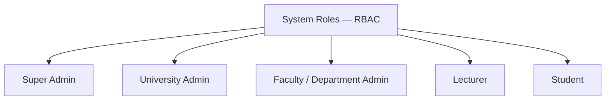

| Role | Responsibility | Typical capabilities |
|---|---|---|
| **Super Admin** | Platform owner | User/role/permission management, university configuration, audit logs, monitoring |
| **University Admin** | University-level administration | Faculties, departments, programs, students, lecturers, courses, semesters, announcements, documents, payment records, reports |
| **Faculty / Department Admin** | Unit-level academic operations | Their unit's students, lecturers, courses, sections, schedules; monitor attendance/performance; review requests |
| **Lecturer** | Teaching management | View assigned sections, take attendance, create assignments, manage exams, submit grades, publish course announcements, upload materials |
| **Student** | Own academic life | View profile/academic info, register courses, view timetable/attendance/assignments/exams/grades/GPA, request documents, view invoices/payments, receive announcements |

**Isolation rules:** students see only their own records; lecturers only their assigned
sections; unit admins only their unit. Authorization is enforced server-side.

> There is **no Finance Officer role** in the initial system. Invoices and payment
> records are managed by University Admins.

---

## 6. Academic Structure

The platform models the university hierarchy precisely, with canonical terms used
consistently across code, docs, and skills.

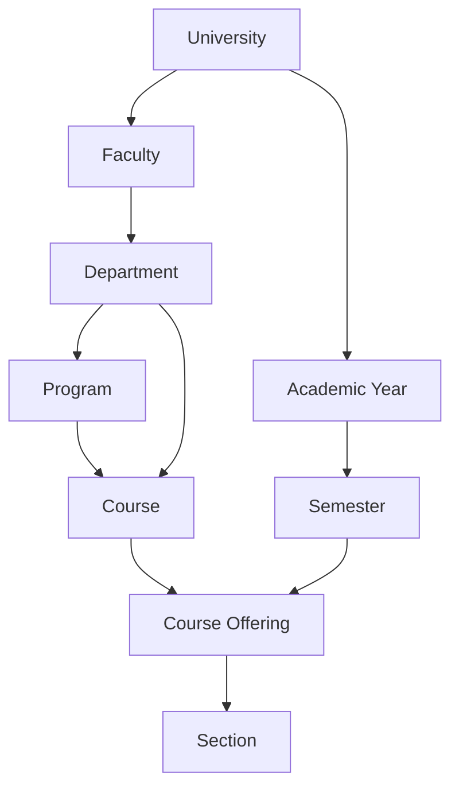

**Example instance:**

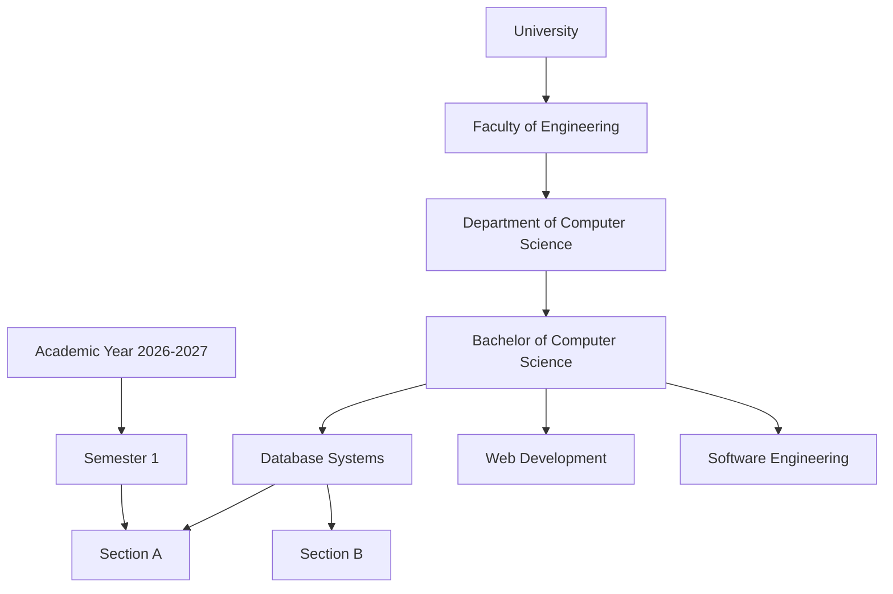

---

## 7. Core Database Entities

The database is organized around the academic model. A simplified ERD:

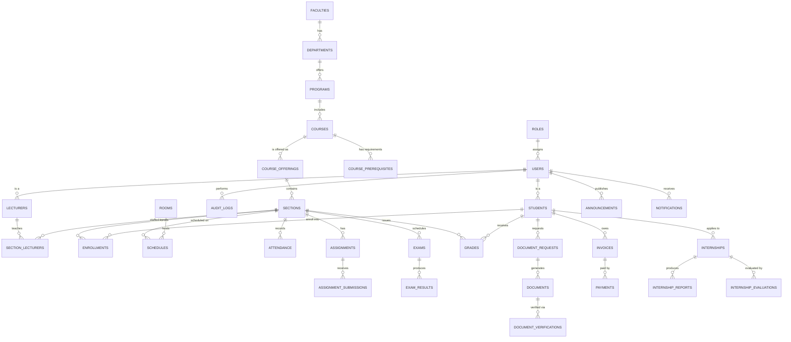

The canonical relationship rules (see `skills/database/SKILL.md`):

- A course offering = a course × a semester.
- A section = a concrete class instance of an offering (lecturer, room, capacity, schedule).
- A student can enroll in a section only if prerequisites are satisfied and capacity allows.
- No duplicate enrollment in the same offering/semester.

---

## 8. System Modules (Overview)

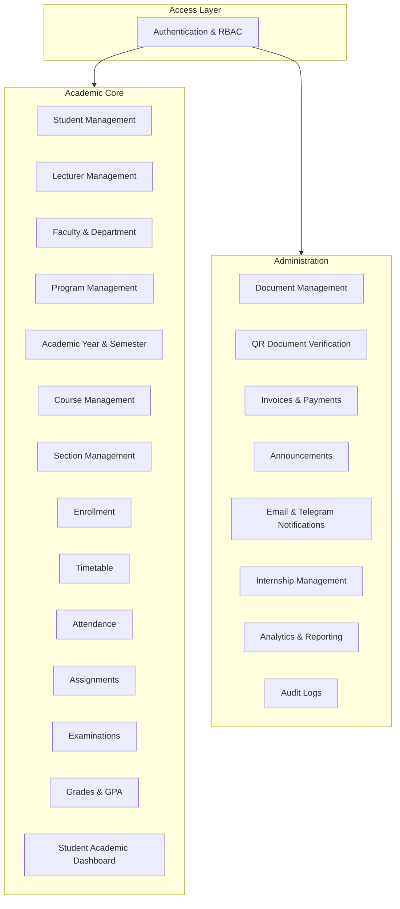

All modules are `[Planned]` unless marked otherwise; the foundation beneath them is
`[Implemented]`.

---

## 9. Module Details

### 9.1 Authentication & Authorization [Planned]

- **Login** with student ID / staff ID + password.
- **Logout, password change, password reset, session/account management.**
- **RBAC** with role and permission management.
- **Implementation:** Laravel Sanctum for API token authentication; permissions
  enforced server-side (`skills/authentication`, `skills/authorization`).

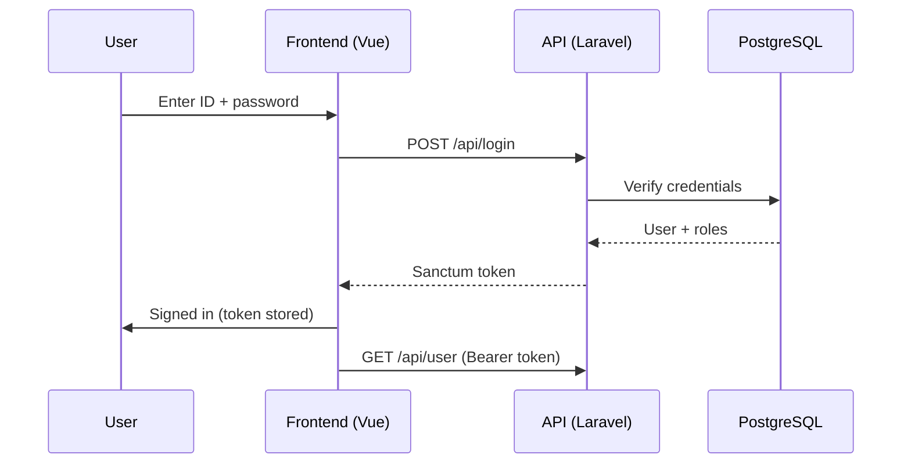

### 9.2 Student Management [Planned]

Manages: student ID, name, gender, DOB, contact, address, photo, program, department,
faculty, academic year, enrollment status.

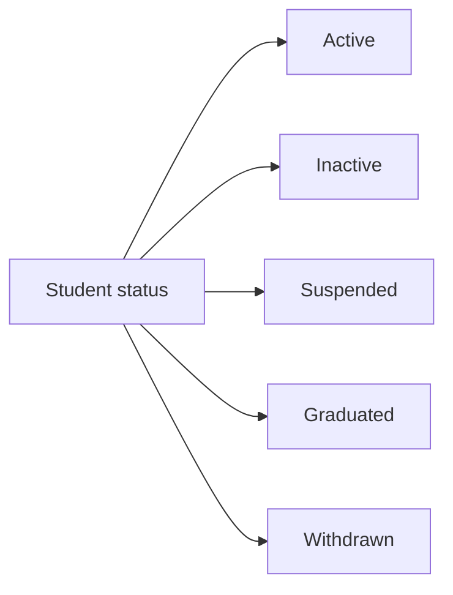

### 9.3 Lecturer Management [Planned]

Manages: profile, employee info, department, academic position, assigned courses,
teaching schedules, contact, status.

### 9.4 Faculty & Department Management [Planned]

Manages faculties, departments, programs, and program structures (see §6).

### 9.5 Course Management [Planned]

Per course: code, name, description, credits, department, program, semester,
prerequisites, sections, schedule.

Example: `CS301 Software Engineering — 3 credits — Prerequisites: CS201, CS202`.

### 9.6 Academic Year & Semester Management [Planned]

Supports academic years, semesters, and enrollment/registration/examination periods.

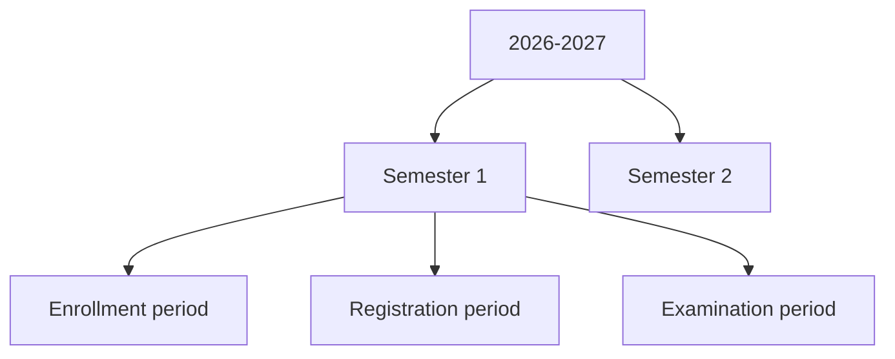

### 9.7 Section Management [Planned]

A course offering can have multiple sections (A, B, C…) each with lecturer, students,
room, schedule, capacity, and semester. Capacity is enforced at enrollment.

### 9.8 Course Registration / Enrollment [Planned]

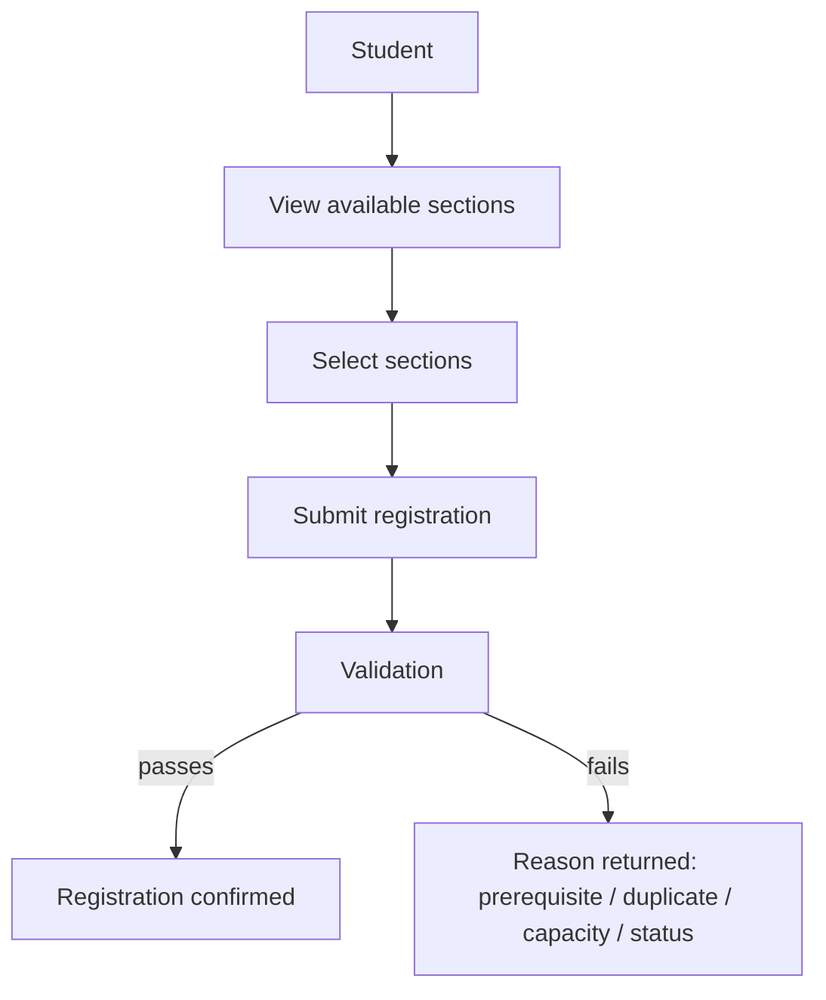

Validation checks: course availability, prerequisites, duplicate registration,
semester, maximum credits, student status.

### 9.9 Timetable Management [Planned]

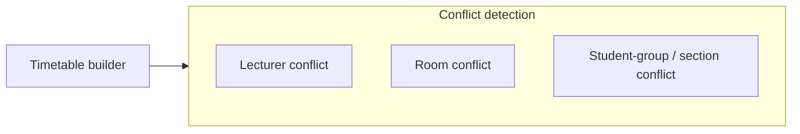

### 9.10 Attendance Management [Planned]

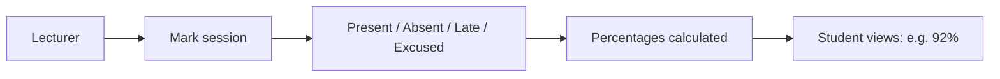

### 9.11 Assignment Management [Planned]

- Lecturer: create assignments, set deadlines, upload files, view and grade submissions.
- Student: view assignments, download materials, submit work, view results.

### 9.12 Examination Management [Planned]

Supports midterm, final, quizzes; exam schedules and results. Grading weights are
configurable by the university.

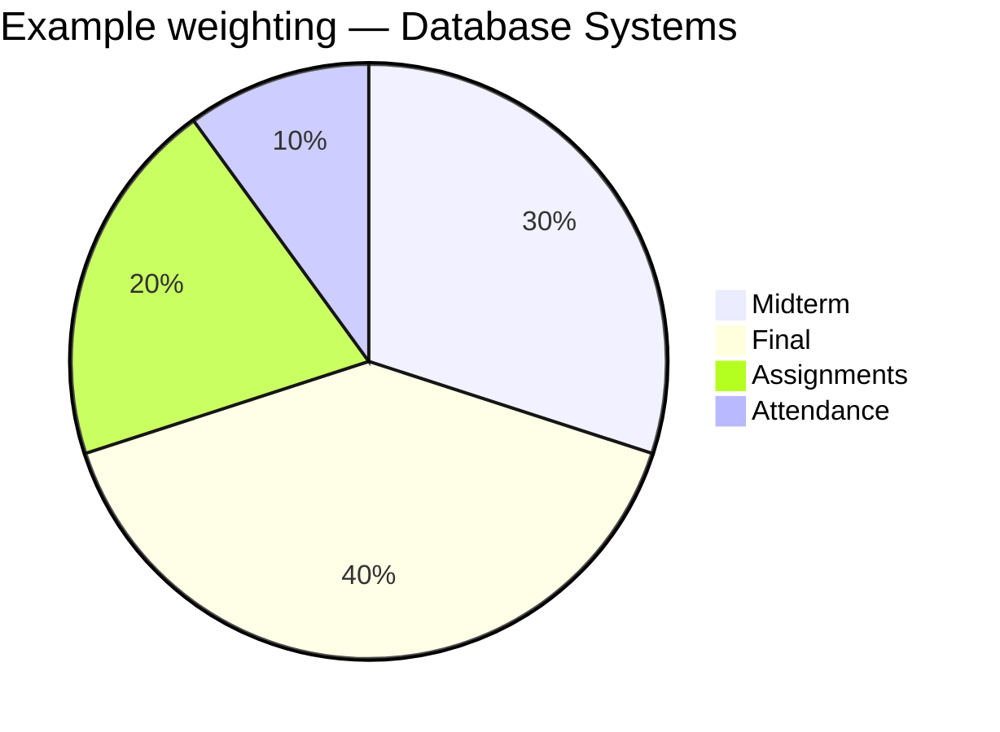

### 9.13 Grades & GPA [Planned]

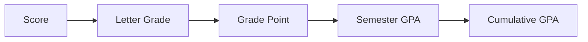

Example scale (configurable): `A=4.0, B+=3.5, B=3.0, C+=2.5, C=2.0, D=1.0, F=0.0`.

### 9.14 Student Academic Dashboard [Planned]

A single-page academic summary:

```mermaid
flowchart TB
    subgraph Dashboard[Student Dashboard]
        Cards[GPA · Attendance · Credits]
        Today[Today's classes]
        Up[R][Upcoming assignments]
        Ann[Announcements]
        Recent[Recent grades]
    end
```

### 9.15 Document Management [Planned]

Students request documents digitally (enrollment certificate, student certificate,
academic transcript, academic result, internship letter, others).

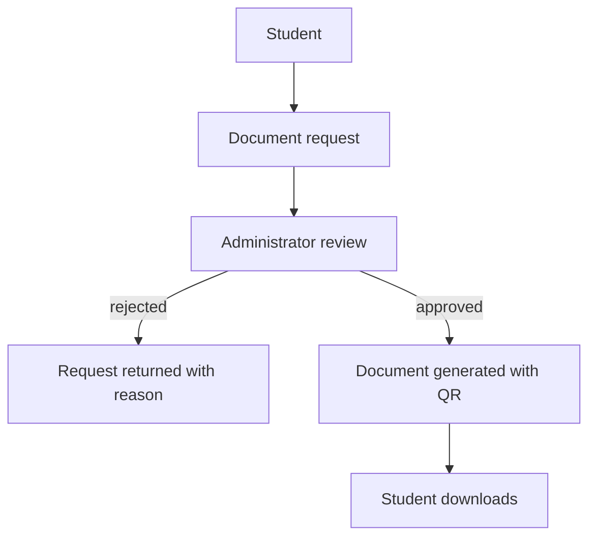

### 9.16 Digital Document Verification [Planned]

Generated documents carry a unique QR code linking to a verification page.

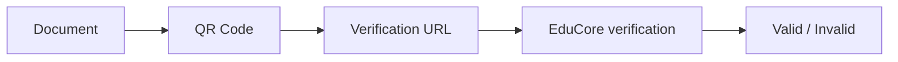

### 9.17 Invoice & Payment Records [Planned]

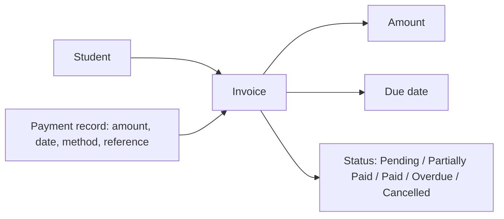

> **Boundary:** this records payments; it does **not** include an online payment
> gateway in the initial scope. (`skills/invoices-payments/SKILL.md`)

### 9.18 Announcement Management [Planned]

Targets: all students, faculty, department, program, class, course.

```mermaid
flowchart LR
    Auth[Authorized user] --> Pub[Publish announcement]
    Pub --> Target[Target audience]
    Target --> NTF[Email / Telegram]
```

### 9.19 Notification System [Planned]

- **Email:** announcements, document status, registration confirmation, password-related,
  administrative notifications.
- **Telegram:** announcements, class reminders, assignment reminders, important
  academic notifications.
- Designed so additional channels can be added later.

### 9.20 Internship Management [Planned]

```mermaid
flowchart TB
    Stu[Student] --> App[Internship application]
    App --> Cmp[Company information]
    App --> Rev[University review]
    Rev --> Appr[Approval]
    Appr --> Int[Internship]
    Int --> Rep[Reports]
    Rep --> Eval[Supervisor evaluation]
    Eval --> Fin[Final evaluation]
```

### 9.21 Analytics & Reporting [Planned]

- Student analytics: total/active/graduated/withdrawn.
- Academic analytics: GPA distribution, course pass rate, attendance, course performance.
- Enrollment analytics: per program/department/semester.
- Administrative analytics: pending requests, documents generated, outstanding invoices,
  announcements.

Derived from centralized data. No predictive analytics in the initial scope.

### 9.22 Audit Logs [Planned]

Append-only record of important actions (grade changes, document approvals, payment
records, authorization changes, login failures). Never logs secrets.
(`skills/audit-logging/SKILL.md`)

---

## 10. System Architecture

EduCore is a **modular monolith**: one application organized into clear modules,
deployed simply.

```mermaid
flowchart TB
    Client[Browser] --> Nginx[Nginx — single entry point]
    Nginx --> BE[Laravel backend — Inertia pages + REST API]
    BE -->|Inertia render| FE[Vue 3 + JavaScript frontend via Vite]
    BE --> PG[(PostgreSQL)]
    BE --> RD[(Redis — cache/queue/session)]
    BE --> MO[(MinIO — document/image storage)]
    BE --> NTF[Email / Telegram notifications]
    DevOps[GitHub · GitHub Actions · Docker · Laravel Cloud] -.-> Nginx
```

### 10.1 Backend layers

```mermaid
flowchart TB
    C[Controller] --> S[Service]
    S --> Repo[Repository]
    S --> Req[Form Request validation]
    Repo --> M[Model]
    M --> PG[(PostgreSQL)]
    Auth[Policies / RBAC] -. enforces .-> C
```

**Laravel MVC responsibilities:**

- **Model:** relationships, business entities, data representation.
- **Controller:** receive requests, call services, return responses — For
  page views, `Inertia::render()` (Vue components); for data, JSON Resources.
- **View:** Vue components rendered via Inertia (Laravel controls routing).

### 10.2 Frontend organization

```mermaid
flowchart TB
    SRC["frontend/src/"] --> FE2["components/ · layouts/ · pages/ · views/"]
    SRC --> ST["stores/ (Pinia)"]
    SRC --> SV["services/ (Axios api.js)"]
    SRC --> BOOT["app.js (Inertia createInertiaApp)"]
    SRC --> UX["composables/ · utils/"]
    SRC --> UI["styling (Tailwind CSS)"]
```

Organized by feature; never a single huge component collection.

---

## 11. Technology Stack

| Layer | Technology | Purpose |
|---|---|---|
| Backend | Laravel 12 (PHP 8.4) | API, services, validation, authorization |
| API auth | Laravel Sanctum | Token-based authentication |
| Frontend | Vue 3 + Inertia (JavaScript) + Vite | User interface |
| Styling | Tailwind CSS | Styling system |
| State | Pinia | Client state |
| Routing | Vue Router | Navigation |
| HTTP | Axios | API requests |
| Charts | Chart.js | Dashboards |
| Database | PostgreSQL | Primary data store |
| Cache/queue/session | Redis | Performance, background work |
| Object storage | MinIO (S3) | Files and documents |
| Web server | Nginx | Single entry point |
| Containers | Docker / Docker Compose | Consistent environment |
| CI/CD | GitHub Actions | Lint, tests, build, notifications |
| Deployment | Laravel Cloud | Production target |
| Notifications | Email provider + Telegram Bot API | Communication |

[Implemented] base: Laravel 12 scaffold, Sanctum, Vue scaffold, Docker stack (7
services healthy), CI/CD workflows.

---

## 12. Development Methodology

EduCore follows an **Agile** approach with short iterations.

```mermaid
flowchart LR
    Req[Requirement] --> US[User story]
    US --> DB[Database]
    DB --> API[API]
    API --> FE[Frontend]
    FE --> T[Tesing / review]
    T --> M[Merge]
```

---

## 13. Project Roadmap

The initial target is a **production-capable MVP in approximately 12 weeks**, continuing
into V1/V2 rather than delaying the first usable release. The overall program is planned
for approximately 4–6 months.

```mermaid
gantt
    title EduCore initial roadmap (MVP ~12 weeks)
    dateFormat  YYYY-MM-DD
    section Foundation
    Research, requirements, architecture   :a1, 2026-01-01, 7d
    Database, UI, project foundation       :a2, after a1, 7d
    section Structure
    Authentication + RBAC                 :b1, after a2, 7d
    University structure                   :b2, after b1, 7d
    Students + lecturers                   :b3, after b2, 7d
    section Academic core
    Courses + sections                     :c1, after b3, 7d
    Enrollment + timetable                  :c2, after c1, 7d
    Attendance + assignments                :c3, after c2, 7d
    Exams + grades + GPA                    :c4, after c3, 7d
    section Administration
    Documents + invoices + payments         :d1, after c4, 7d
    Notifications + dashboards             :d2, after d1, 7d
    Testing + deployment                    :d3, after d2, 7d
```

**Month-by-month view (4–6 month program):**

| Month | Focus |
|---|---|
| Month 1 | Foundation & architecture |
| Month 2 | University structure & people |
| Month 3 | Academic core (sections, enrollment, timetable, attendance) |
| Month 4 | Examinations, grades, documents, financial records |
| Month 5 | Communication, analytics, internship, audit |
| Month 6 | Testing, security, production hardening |

---

## 14. Git & GitHub Workflow

- Branches: `main`, `develop`, `feature/<module>-<name>`, `fix/*`, `refactor/*`, `docs/*`, `chore/*`.
- **Commit format: `[Tag]: description.`** — see `skills/git-commit-style/SKILL.md`
  (tags: `[Build]`, `[Doc]`, `[Feature]`, `[Fix]`, `[Refactor]`, `[Test]`, `[Style]`, `[Chore]`).
- Workflow:

```mermaid
flowchart LR
    FB[Feature branch] --> Dev[Development]
    Dev --> PR[Pull request]
    PR --> CR[Code review]
    CR --> Merge[Merge → develop]
    Merge --> Test[Testing]
    Test --> Rel[Release → main]
```

Two developers (Rin + Lyhor) review each other's work.

**CI/CD:**

```mermaid
flowchart LR
    Push[Push / PR] --> CI[GitHub Actions]
    CI --> Pipeline[Backend: pint + phpunit · Frontend: vite build]
    Pipeline --> Notify[Telegram notification]
```

---

## 15. Security Requirements

Security is a major requirement because EduCore handles academic records.

- Authentication (Sanctum), RBAC, permission-based authorization.
- Password hashing; secrets only in environment config (never committed).
- Input validation, file validation, rate limiting.
- Audit logs; secure document access.
- Database constraints and access policies.
- Isolation: students see only own data; lecturers only own sections.

```mermaid
flowchart TB
    Access[User request] --> Auth2[Authenticate]
    Auth2 --> Authz[Authorize by role]
    Authz --> Validate[Validate input]
    Validate --> Execute[Execute — audit logged]
    Audit[(audit_logs)]
    Execute -. important action .-> Audit
```

---

## 16. Scope Definitions

### 16.1 In scope (initial release)

Authentication, RBAC, student/lecturer management, academic structure, courses,
sections, enrollment, timetable, attendance, assignments, exams, grades, GPA,
student dashboard, documents + QR verification, invoices + payment records,
announcements, email + Telegram, internship, analytics, audit logs.

### 16.2 Planned but deferred

Advanced timetable optimization, course prerequisite engine, digital signatures,
advanced document workflows, scheduled announcements, advanced dashboards.

### 16.3 Out of scope

AI assistant, mobile application, online payment gateway, predictive analytics,
microservices, advanced chat system, OCR, large-scale external university
integrations, complex ERP integrations, biometric attendance, advanced financial
accounting, full LMS replacement.

The goal is a reliable core system first.

---

## 17. Deliverables

- Working web platform (Laravel API + Vue frontend).
- Database schema and ERD.
- Authentication and RBAC.
- Academic and administrative modules.
- Docker environment and CI/CD configuration.
- Deployment configuration (Laravel Cloud).
- Test suite (backend PHPUnit, Pint; frontend typecheck/build).
- User documentation and technical documentation.

---

## 18. Testing Strategy

| Level | Coverage |
|---|---|
| Backend | Model, service, API feature, authorization tests |
| Frontend | Component, form validation, navigation, permission-based UI |
| Integration | Full academic workflow end-to-end |

```mermaid
flowchart LR
    Login[Student login] --> Reg[Course registration]
    Reg --> Enr[Enrollment]
    Enr --> Att[Attendance]
    Att --> Grade[Grade]
    Grade --> GPA[GPA]
```

---

## 19. Deployment

```mermaid
flowchart LR
    Dev[Development] --> Docker[Docker stack: Laravel · Vue · PostgreSQL · Redis · MinIO · Nginx · pgAdmin]
    Prod[Production] --> GH[GitHub]
    GH --> CI[CI/CD]
    CI --> LC[Laravel Cloud]
    LC --> App[Production application]
```

Docker ensures consistent development environments between both developers.

---

## 20. Expected Outcomes

1. Centralized student and lecturer management.
2. University academic structure management.
3. Course and section management with enrollment.
4. Timetable and attendance management.
5. Assignment and examination management.
6. Grade and GPA management.
7. Digital document requests and QR verification.
8. Invoice and payment records.
9. Announcements, email, and Telegram notifications.
10. Academic dashboards.
11. Role-based access control.
12. Secure API architecture.
13. Production deployment.

---

## 21. Success Criteria

The MVP is successful when a complete academic workflow can be performed digitally:

```mermaid
flowchart TB
    Admin[Admin creates] --> RCA[Faculty → Department → Program]
    RCA --> AY2[Academic Year → Semester]
    AY2 --> CO2[Course → Section → Lecturer → Student]
    CO2 --> E2[Enrollment → Timetable → Attendance]
    E2 --> A2[Assignment → Exam → Grade → GPA]
    A2 --> Portal[Student accesses results via their portal]
```

- Core workflows function correctly.
- Users authenticate securely; RBAC works.
- Records managed consistently; enrollment validated.
- Documents requested, generated, and QR-verified.
- Notifications, reports, and audit logs function.
- System passes the defined test suite; Docker works reproducibly.

---

## 22. Future Expansion [Future]

```mermaid
flowchart LR
    MVP[MVP: modular monolith] --> V1[V1: advanced docs, deeper analytics]
    V1 --> V2[V2: mobile app, online payments, integrations]
    V2 --> ADV[Advanced: services split only if scale justifies]
```

Beyond MVP:

- **V1:** advanced timetable management, prerequisite engine, graduation eligibility,
  more document types, digital signatures, richer reports, Telegram automation,
  scheduled announcements.
- **V2:** mobile application/PWA, online payment integration, library & student ID
  integration, QR attendance, external verification API, advanced reporting.
- **Advanced architecture:** if scale justifies, modules could be extracted into
  services (identity, academic, student, document, notification, payment, analytics).
  The MVP remains a modular monolith.

---

## 23. Recommended First Milestone Artifacts

Before the first feature, produce:

1. **PRD** — exactly what EduCore must do.
2. **User stories** — e.g. "As a student, I want to view my timetable so I know when and
   where my classes occur."
3. **Use-case diagram** — Student, Lecturer, Administrator, Super Admin interactions.
4. **ERD** — the complete database structure.
5. **System architecture** — Vue → Laravel API → Services → Models → PostgreSQL.
6. **UI design system** — colors, typography, components, tables, forms, dashboards,
   navigation, responsive behavior.

Only after these are approved should implementation proceed.

---

## 24. Project Summary

| Item | Decision |
|---|---|
| Project | EduCore |
| Type | University Digital Administration Platform |
| Target | Designed for Cambodian universities |
| Team | Rin Nairith + Lyhor |
| Architecture | Modular Monolith (MVC backend) |
| Backend | Laravel 12 (PHP 8.4) |
| Frontend | Vue 3 + Inertia (JavaScript) |
| Styling | Tailwind CSS |
| State | Pinia |
| Database | PostgreSQL |
| Cache/queue | Redis |
| Storage | MinIO (S3) |
| API | REST (Sanctum auth) |
| Authorization | RBAC (5 roles) |
| Notifications | Email + Telegram |
| Payments | Invoice + payment records (no online gateway in MVP) |
| Deployment | Docker + Laravel Cloud |
| CI/CD | GitHub Actions |
| Development | Agile |
| MVP target | ~12 weeks (program 4–6 months) |
| Status | Foundation [Implemented]; modules [Planned] |

---

*End of report.*