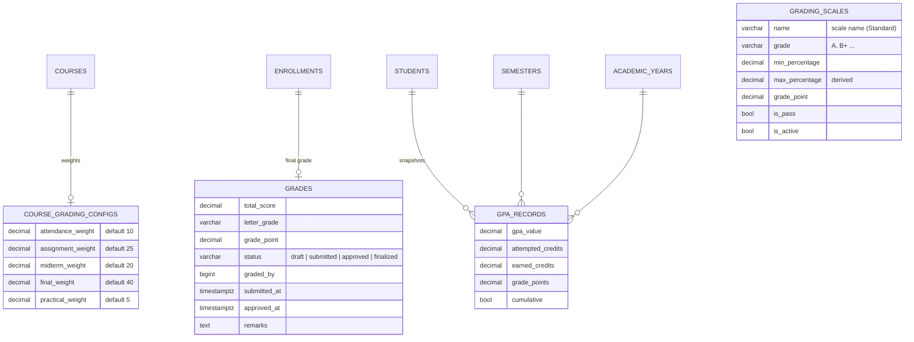
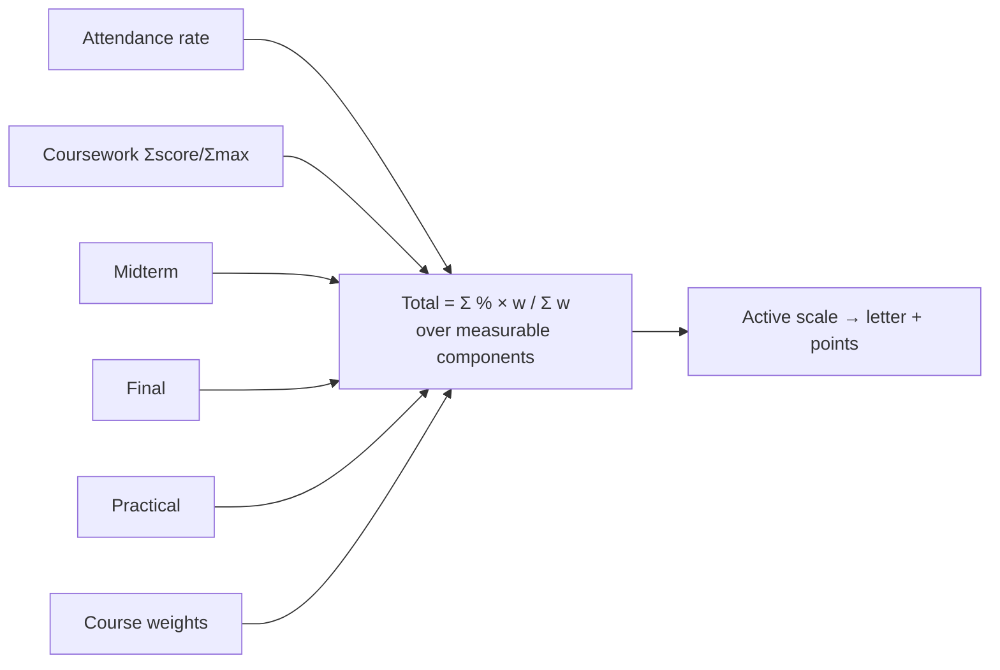
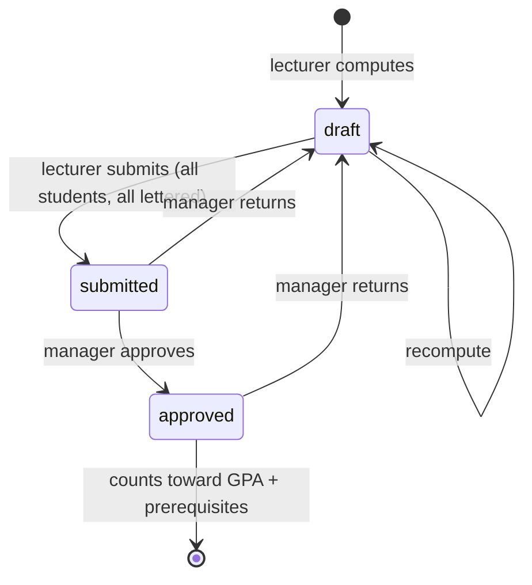
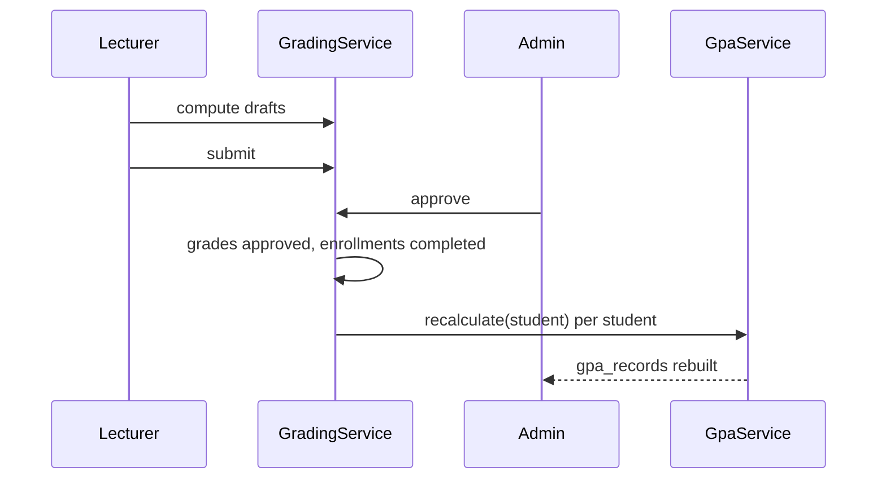

# 20 — Grades & GPA Report (Module 9.14)

- **Date:** 2026-10-02
- **Module:** 9.14 Grades & GPA (business-overview §9.14)
- **Status:** `[Implemented]`
- **Depends on:** 9.9 Enrollment, 9.11 Attendance, 9.12 Assignments, 9.13 Examinations

## 1. Scope

A configurable grading scale, per-course component weights, a live grade sheet
per section that turns attendance, coursework and exam results into a course
total and letter grade, a draft → submitted → approved workflow, credit-weighted
semester and cumulative GPA that is rebuilt on every change, grade-based
prerequisites, and lecturer / staff / student screens.

Not built: an official transcript document (9.16 Document Management), an audit
trail of grade changes (9.24), manual per-student grade overrides, several named
scales in use at once. The `finalized` lock step (finalize / Super Admin
reopen) was added later — see `docs/30_Grade-Finalization-and-Document-Templates-Report.md`.

## 2. Data model

**No schema change.** The four tables already existed; this module relies on
`uq_course_grading_configs`, the weights-sum-to-100 and non-negative checks,
`uq_grades_enrollment`, `ck_grades_status`, `ck_grading_scales_range` and
`uq_gpa_records` (`NULLS NOT DISTINCT` on student / year / semester). New models
`GradingScale`, `CourseGradingConfig`, `Grade`, `GpaRecord`; new relations
`Course::gradingConfig`, `Enrollment::grade`, `Student::gpaRecords`.

## 3. How a course grade is computed

`GradingService::sheet()` builds, per confirmed / completed enrollment of the
section, one percentage per component:

| Component | Source | Measured as |
|---|---|---|
| Attendance | held attendance sessions (`AttendanceService` rate) | (present + late) / (present + late + absent) |
| Coursework (`assignment`) | published assignments **and** quiz / other exams | Σ score / Σ max |
| Midterm | midterm exams | Σ score / Σ max |
| Final | final exams | Σ score / Σ max |
| Practical | practical exams | Σ score / Σ max |

Rules:

- An item (exam or assignment) counts once it has at least one recorded score;
  a student without a score on a counted item gets 0 for it.
- A component with nothing to measure in the section (no held session, no
  scored item) is left out and the remaining weights are scaled up to 100. A
  student whose attendance has nothing countable (e.g. only excused) has that
  component left out for them alone.
- An exam's own `weight` and an assignment's `weight_override` are not used for
  the course grade: within a component, items are combined by points. The
  course weighting lives only in `course_grading_configs` (9.13 caps exam
  weights per section at 100 %, but they stay informational).
- Totals are rounded to 2 decimals before the scale lookup (highest band whose
  minimum ≤ total).

Worked example (test fixture): weights 10 / 25 / 20 / 40 / 5, no attendance
session and no practical → 25 + 20 + 40 = 85 is scaled to 100. Coursework 90 %,
midterm 80, final 90 → (90·25 + 80·20 + 90·40) / 85 = **87.65 → A (4.0)**.

## 4. Workflow

| Rule | Where | Failure |
|---|---|---|
| Compute writes drafts only; submitted / approved rows are left alone | `GradingService::compute` | — |
| Submit needs a draft for every graded student and a letter on each | `submit` | `422` (`grades`) |
| Nothing to submit / approve / return | service | `409` |
| Approval completes confirmed enrollments and recomputes each student's GPA, in one transaction | `approve` | — |
| Return (submitted or approved → draft) recomputes GPA | `returnToDraft` | — |
| Weights 0–100 each and exactly 100 in total | `GradingConfigRequest` + `saveConfig` | `422` (`weights`) |
| Scale: ≥ 2 bands, distinct grades and minimums, lowest band starts at 0, grade points never fall as the percentage rises; `max_percentage` derived from the next band (no gaps) | `GradingScaleRequest` + `saveScale` | `422` |
| Editing the scale does not re-letter approved grades; drafts pick it up on the next compute | design | — |
| Prerequisite passed = completed enrollment with no grade row, or an approved / finalized grade that is not F / 0 points | `EnrollmentService::missingPrerequisites` | `422` on enroll |

Grading is not frozen when the semester completes — final grades are usually
produced after classes end. Only the source scores are frozen (9.11–9.13).

## 5. GPA

`GpaService::recalculate()` deletes and rebuilds a student's `gpa_records` from
approved / finalized grades, so a snapshot can never go stale. It runs on
approve, on return, and for every affected student when a course's `credits`
change (`CourseService::update`).

- **Semester GPA** = Σ(grade point × credits) / Σ credits over every final grade
  of the semester (one row, `cumulative = false`).
- **Cumulative GPA** "as of the end of each academic year" (one row per year,
  `semester_id = null`, `cumulative = true`): each course counts once, with its
  **latest** attempt — a retake replaces an earlier F; an F counts until then.
- **Earned credits** = credits of grades with points > 0.
- Zero attempted credits produce no row (no division by zero). Drafts and
  submitted grades never count.

Worked example (test fixture): Y1 — P 3 cr A (4.0), Q 2 cr F → 12 / 5 = **2.400**.
Y2 — Q retake 2 cr B (3.0), R 4 cr C+ (2.5) → 16 / 6 = **2.667**. Cumulative Y2:
P 12 + Q 6 + R 10 = 28 / 9 = **3.111**. Changing R to 2 credits recomputes to
2.750 and **3.286**.

## 6. Authorization

`GradePolicy` (shares `Policies/Concerns/ChecksSectionTeaching`).

| Ability | Super / University Admin | Faculty Admin | Lecturer of the section | Other lecturer | Student |
|---|:-:|:-:|:-:|:-:|:-:|
| Section grade sheet | ✓ | ✓ (read) | ✓ (while active) | 403 | 403 |
| Compute / submit | ✓ | 403 | ✓ | 403 | 403 |
| Approve / return | ✓ | 403 | 403 | 403 | 403 |
| Approvals queue (`/grades`) | ✓ | ✓ (read) | — | — | — |
| Grading scale (read) | ✓ | ✓ | ✓ | ✓ | ✓ |
| Grading scale / course weights (write) | ✓ | 403 | 403 | 403 | 403 |
| Course weights (read) | ✓ | ✓ | 403 | 403 | 403 |
| A student's grades / GPA | ✓ | ✓ | — | — | own only (approved only) |

## 7. Endpoints

API (tag `Grades`):

| Method | Path | Purpose |
|---|---|---|
| GET | `/api/sections/{section}/grades` | Grade sheet (weights, measurable components, counts, rows) |
| POST | `/api/sections/{section}/grades` | Compute drafts (optional per-student remarks) |
| POST | `/api/sections/{section}/grades/submit` | Submit drafts |
| POST | `/api/sections/{section}/grades/approve` | Approve submitted grades |
| POST | `/api/sections/{section}/grades/return` | Return submitted / approved grades to draft |
| GET | `/api/students/{student}/grades` | Approved grades + GPA summary |
| GET | `/api/students/{student}/gpa` | Semester + cumulative GPA |
| GET / PUT | `/api/grading-scale` | Read / replace the active scale |
| GET / PUT | `/api/courses/{course}/grading-config` | Read / save course weights (`is_default` when unsaved) |

Web: `GET /grades` (staff approvals queue, `?status=all`),
`GET|POST /grades/sections/{section}`, `POST …/submit|approve|return`,
`GET|PUT /grading-scale`, `PUT /courses/{course}/grading-config`,
`GET /my-grades` (student).

## 8. UI

- `Grades/Section` — weights line (components with nothing to measure are struck
  out), status counts, grade sheet with component %, total, letter / points,
  status and per-student remarks; *Compute drafts*, *Submit for approval*
  (lecturer), *Approve* / *Return to draft* (managers) with confirmation. Reached
  from *Grades* on the lecturer's section cards (`Attendance/Classes`) and staff
  section cards (`Offerings/Show`).
- `Grades/Index` — staff queue of sections awaiting approval, or all graded
  sections.
- `Grades/Scale` — read-only table for everyone, band editor for managers.
- `Grades/Mine` — student cumulative GPA, credits earned, graded courses, and a
  table per semester with semester GPA.
- `Courses/Edit` — new *Grading weights* card with a live 100 % total.
- Sidebar: Super Admin *Academics* gains *Grades* and *Grading scale*; University
  / Faculty Admin get a new *Assessment* group with the same two; Lecturer gains
  *Grading scale*; Student gains *Grades & GPA*.

## 9. Tests

`backend/tests/Feature/Grades/GradingTest.php` — 12 tests (time frozen):
component weighting with missing components rescaled (hand-computed 87.65 / 32.94);
attendance + custom weights; weights validation and access; full compute →
submit → approve → return cycle incl. enrollment completion and GPA rows;
submit refused for blank or missing grades; approved F blocks a prerequisite
and a returned grade no longer passes; credit-weighted semester / cumulative GPA
with a retake, drafts ignored, recomputed after a credit change; no-grade GPA;
scale read / replace / validation; role matrix (Faculty Admin, other and
inactive lecturer, student); students see approved grades only; web pages and
actions. Full suite: **330 passed**. `GradingScaleSeeder` seeds the default
*Standard* scale (A 85 / 4.0 · B+ 80 / 3.5 · B 70 / 3.0 · C+ 65 / 2.5 ·
C 50 / 2.0 · D 45 / 1.0 · F 0 / 0.0) when no scale exists.

## 10. Decisions

- **Weights live per course**, not per offering — the existing unique
  `course_id` on `course_grading_configs`. A course without a row uses the
  schema defaults; nothing is written until a manager saves.
- **Missing components rescale** instead of counting as zero, so a section
  without a practical (or before attendance starts) is not penalised.
- **Scale edits are not retroactive** for approved grades: letters are
  snapshots, the scale is configuration.
- **`finalized` counts like `approved`** for GPA and prerequisites. Managers
  finalize approved grades and only Super Admin reopens them (`docs/30_Grade-Finalization-and-Document-Templates-Report.md`).
- **GPA snapshots are rebuilt, not patched**, inside the same transaction as the
  grade change (`skills/grading-gpa` §12 — never stale).
- Grade changes are not yet audited; that waits for 9.24 Audit Logs.
