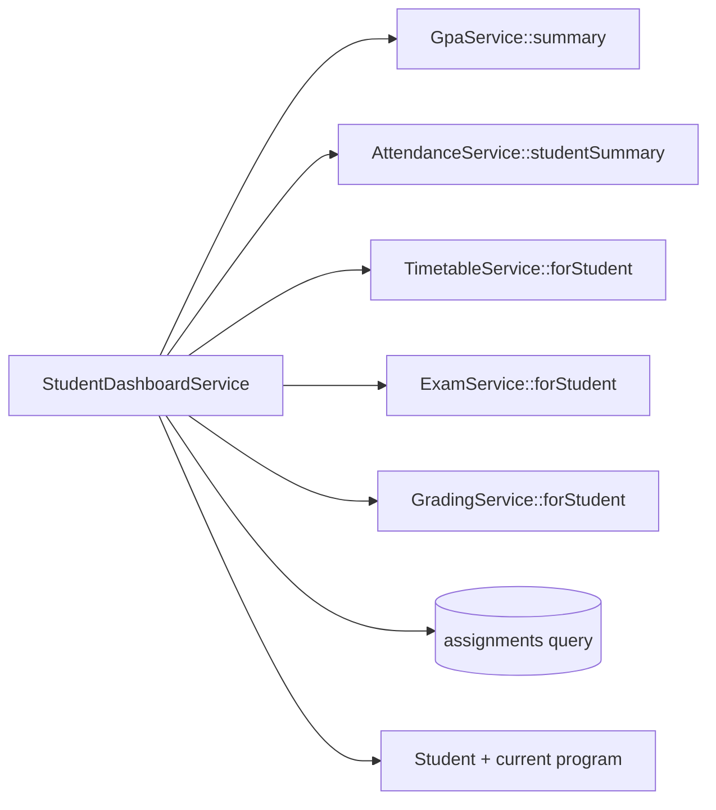

# 21 — Student Academic Dashboard Report (Module 9.15)

- **Date:** 2026-10-02
- **Module:** 9.15 Student Academic Dashboard (business-overview §9.15)
- **Status:** `[Implemented]` (announcements card `[Planned]` with 9.19)
- **Depends on:** 9.9 Enrollment, 9.10 Timetable, 9.11 Attendance, 9.12 Assignments, 9.13 Examinations, 9.14 Grades & GPA

## 1. Scope

Replaces the student's placeholder "role workspace preview" at `/dashboard`
with a real, read-only academic summary: cumulative and latest-semester GPA,
credits this semester and earned overall, current-semester attendance (overall
and per course), today's classes, assignments due, upcoming exams and recent
approved grades. Each card links to the module page that owns the data.

Not built: announcements (9.19 is not implemented, so no card is shown rather
than a placeholder), lecturer and admin role dashboards (unchanged), charts.

## 2. Data sources

**No schema change, no new tables** (`skills/analytics-reporting` §2, §12).
`StudentDashboardService` only composes the owning services:

| Card | Source | Rule |
|---|---|---|
| Current semester | open (pending / confirmed) enrollments | the semester among them with the latest start date; none without an open enrollment |
| Cumulative GPA | `gpa_records` via `GpaService` | latest cumulative snapshot; latest semester GPA as detail |
| Credits this semester | open enrollments of the current semester | Σ course credits, number of courses |
| Credits earned | cumulative GPA snapshot | earned of attempted |
| Attendance | per-course counts of the current semester | overall = Σ(present + late) / Σ(present + late + absent); excused not counted; under 75 % highlighted (as in 9.11) |
| Today's classes | the student's timetable | today's ISO weekday, only while today is inside the current semester |
| Assignments due | published assignments of open sections | due now or later, not yet submitted, soonest 5 |
| Upcoming exams | `ExamService::forStudent` | scheduled today or later, soonest 5 (scores stay hidden until released) |
| Recent grades | `GradingService::forStudent` | 5 most recent approved / finalized grades |

The overall attendance rate is the only number computed here, and it is an
aggregate of the module's own counts, not a second attendance formula.

## 3. Authorization

| Caller | `GET /api/students/{student}/dashboard` | `/dashboard` page |
|---|:-:|:-:|
| Super Admin / University Admin / Faculty Admin | ✓ any student (`StudentPolicy::view`) | own admin dashboard |
| The student | ✓ own | ✓ `Student/Dashboard` |
| Another student / a lecturer | 403 | — |

A student account with no linked profile keeps the generic `RoleDashboard`.

## 4. Endpoints

| Method | Path | Purpose |
|---|---|---|
| GET | `/api/students/{student}/dashboard` | The dashboard payload (schema `StudentDashboard`) |

Web: `GET /dashboard` renders `Student/Dashboard` for students with a profile.

## 5. UI

`frontend/src/pages/Student/Dashboard.vue` — header (name, student number,
program, semester), four `StatCard`s (GPA → *Grades & GPA*, credits →
*Course registration*, attendance → *My attendance*, credits earned), cards for
today's classes, assignments due, upcoming exams and recent grades (each with
an empty state and a link to its page), and an attendance-by-course grid. Built
from existing primitives and tokens only; responsive (1 → 2 → 4 columns).

## 6. Tests

`backend/tests/Feature/Students/StudentDashboardTest.php` — 5 tests (time frozen
on a Wednesday): full aggregation (semester, GPA 4.0 from an earlier approved
grade, 4 current credits, 3 earned, attendance 75 % with an excused absence
ignored, one class today out of two weekly meetings, only the open unsubmitted
assignment, only the future exam, the recent grade); empty dashboard for a
student without enrollments; no classes after the semester ends; access matrix
(other student and lecturer 403, Faculty Admin and Super Admin 200); the web
page and the fallback for a student account without a profile. Full suite:
**335 passed**.

## 7. Decisions

- **Compose, don't recompute.** The dashboard has no business rules of its own;
  a GPA or attendance change in its module shows up here immediately.
- **No placeholder for announcements.** The business overview lists them, but
  9.19 is not built; the card arrives with that module.
- **One endpoint, one payload.** The page and the API share
  `StudentDashboardService::build()`, so the REST contract and the Inertia
  props cannot drift.
