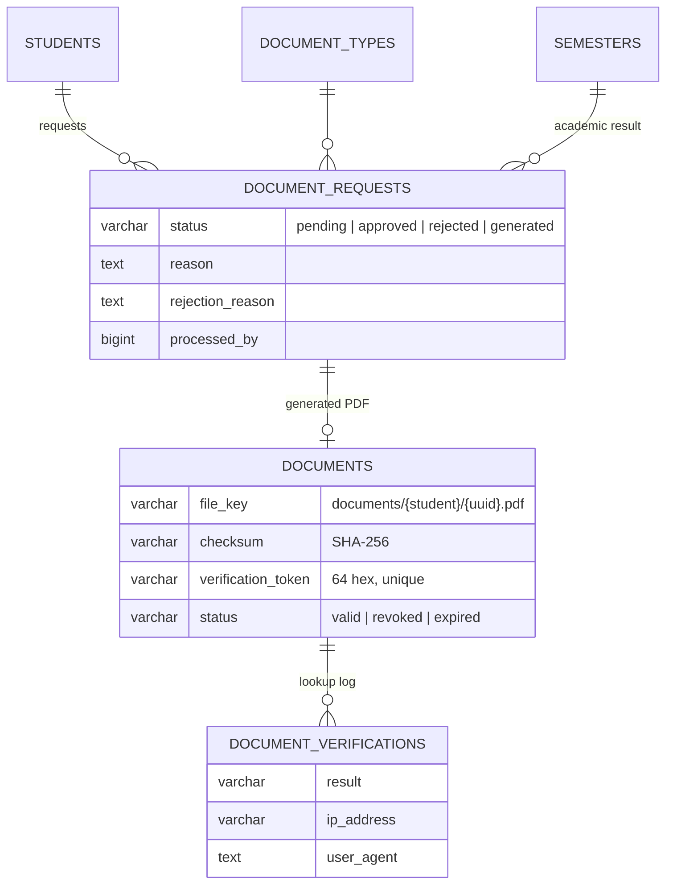
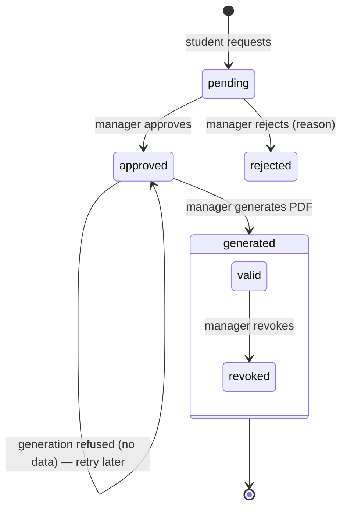
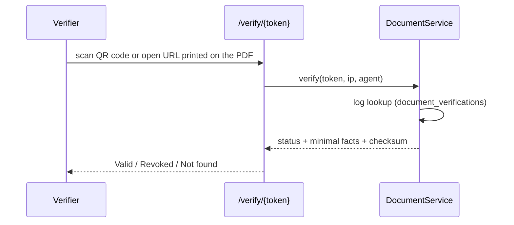

# 22 — Document Management & Verification Report (Modules 9.16 / 9.17)

- **Date:** 2026-10-02
- **Modules:** 9.16 Document Management, 9.17 Digital Document Verification
- **Status:** `[Implemented]`
- **Depends on:** 9.2 Students, 9.9 Enrollment, 9.14 Grades & GPA
- **New dependencies:** `barryvdh/laravel-dompdf` ^3.1 (pure-PHP PDF rendering;
  approved by the project owner on 2026-10-02 — no system packages needed),
  `bacon/bacon-qr-code` ^3.1 (pure-PHP SVG QR code generation; zero GD/Imagick
  dependencies, fully compatible with DomPDF SVG data URIs)

## 1. Scope

Students request official documents; University Admin / Super Admin approve or
reject them and generate a PDF built only from authoritative data; the student
downloads it through an authorized route; anyone can verify a document with its
code on a public page or by scanning the embedded QR code on the footer. Three
document types have templates: **enrollment certificate**, **academic
transcript**, **academic result** (one semester). The **student certificate**
and **internship letter** were added later — see
`docs/30_Grade-Finalization-and-Document-Templates-Report.md`.

Not built: document fees (`requires_fee` is stored but not billed — 9.18
invoices are not linked to requests), an audit trail of transitions (9.24 — added
since, see `docs/28_Audit-Logs-and-Security-Report.md`), document-type management
screens (types are seeded). Scannable QR code images are embedded directly into
all document PDF footers.

## 2. Data model

**No schema change.** Uses the existing tables and constraints
(`uq_documents_request`, `uq_documents_verification_token`, status checks).
`files` is not used: the document row already holds key, size, MIME and
checksum. New models `DocumentType`, `DocumentRequest`, `Document`,
`DocumentVerification`; seeded by `DocumentTypeSeeder`.

## 3. Workflow and rules

| Rule | Where | Failure |
|---|---|---|
| The student is always the signed-in user; staff cannot request on a student's behalf | `DocumentRequestPolicy::create`, service | `403` |
| Only active types with a template can be requested | service | `422` |
| An academic result needs a semester | service | `422` |
| One open (pending / approved) request per student, type and semester | service (row lock) | `409` |
| Transitions are forward-only (`pending → approved/rejected`, `approved → generated`) | service | `409` |
| Reject needs a reason (shown to the student) | `RejectDocumentRequestRequest` | `422` |
| Transcript needs approved grades; academic result needs approved grades in that semester; enrollment certificate needs an active student | `DocumentService::render` | `409`, request stays `approved` |
| A failed generation leaves no orphan file in storage | service | — |
| Revoke only a valid document; a fresh request is then allowed | service | `409` |

Content sources (never hand-entered — `skills/documents` §12): transcript and
academic result from `GradingService::forStudent` (approved / finalized grades)
and `GpaService::summary`; enrollment certificate from open enrollments, the
current program and the current university record.

**Snapshot decision:** a generated PDF is immutable. If grades change, staff
revoke the old document (verification then reports *revoked*) and the student
requests a new one. Requests and documents are never deleted.

## 4. Verification (9.17)

`/verify/{token}` (page) and `GET /api/verifications/{token}` (JSON) need no
sign-in, are rate limited (`throttle:verification`, 30 / minute / IP) and log
every successful lookup in `document_verifications` (result, IP, user agent).
They return minimal data — document type, semester, holder name and student
number, issue date, issuer, status and the PDF's SHA-256 so a verifier can
confirm the file in hand is unaltered — and nothing else (no grades, contact
details or file). Unknown codes return 404 (page: "Not found"). Each PDF prints
the verification URL and token code in its footer alongside an inline scannable
SVG QR code generated by `bacon/bacon-qr-code` (`SvgImageBackEnd`, embedded as a
`data:image/svg+xml;base64,...` URI). This avoids any dependency on PHP GD /
Imagick extensions and renders crisply across all PDF engines.

## 5. Storage

PDFs are rendered with dompdf (A4, DejaVu Sans, fonts subset → ~30 KB per
page) and stored on the private uploads disk (`academics.uploads_disk`,
MinIO) under `documents/{studentId}/{uuid}.pdf`. Only the key is stored, never
a URL; downloads stream through `GET /documents/{document}/download` (web) or
`/api/documents/{document}/download` after the policy check.

## 6. Authorization

`DocumentRequestPolicy`.

| Ability | Super / University Admin | Faculty Admin | Lecturer | Owning student | Other student | Public |
|---|:-:|:-:|:-:|:-:|:-:|:-:|
| Request a document | 403 | 403 | 403 | ✓ | ✓ (own) | — |
| List requests | all | all (read) | 403 | own | own | — |
| View / download | ✓ | ✓ | 403 | ✓ | 403 | — |
| Approve / reject / generate | ✓ | own faculty's students (report 33) | 403 | 403 | 403 | — |
| Revoke | ✓ | 403 | 403 | 403 | 403 | — |
| Verify by code | ✓ | ✓ | ✓ | ✓ | ✓ | ✓ |

## 7. Endpoints

| Method | Path | Purpose |
|---|---|---|
| GET | `/api/document-types` | Requestable types |
| GET / POST | `/api/document-requests` | List (staff all, `filters[status]`; student own) / create (student) |
| GET | `/api/document-requests/{documentRequest}` | One request |
| POST | `/api/document-requests/{documentRequest}/approve` · `/reject` · `/generate` | Process |
| POST | `/api/documents/{document}/revoke` | Revoke |
| GET | `/api/documents/{document}/download` | Private PDF stream |
| GET | `/api/verifications/{token}` | Public verification |

Web: `GET|POST /my-documents` (student), `GET /documents` (staff queue),
`POST /document-requests/{id}/approve|reject|generate`,
`POST /documents/{id}/revoke`, `GET /documents/{id}/download`,
`GET /verify/{token}` (public, guest layout).

## 8. UI

- `Documents/Mine` — request form (type, semester for an academic result,
  optional purpose) and the student's requests with status, rejection reason,
  *Download PDF* and the start of the verification code. Sidebar: *My documents*.
- `Documents/Index` — staff queue with a status filter; Approve / Reject (reason
  modal) / Generate / Revoke (confirmation) for managers, read-only for Faculty
  Admin. Sidebar: new *Operations* group with *Documents*.
- `Documents/Verify` — public result card (valid / revoked / not found) with the
  minimal facts and checksum.

## 9. Tests

`backend/tests/Feature/Documents/DocumentTest.php` — 7 tests (135 assertions):
full flow (request, duplicate refused, generate-before-approve refused, approve,
generate with inline base64 SVG QR code → real `%PDF` in fake storage with
matching SHA-256 and a 64-char token, QR code SVG markup validation and data URI
format assertions, owner / staff download, other student 403, public
verification with minimal data and logging, unknown code 404, revoke, double
revoke 409, revoked shown, new request allowed); reject with required reason
and resubmission; authoritative-data guards (semester required, no grades → 409
with no stored file, active-only certificates); student certificates for active
and graduated students only; internship letter validation; role matrix and
listing scope; web pages incl. the public page. Full test suite passing.
