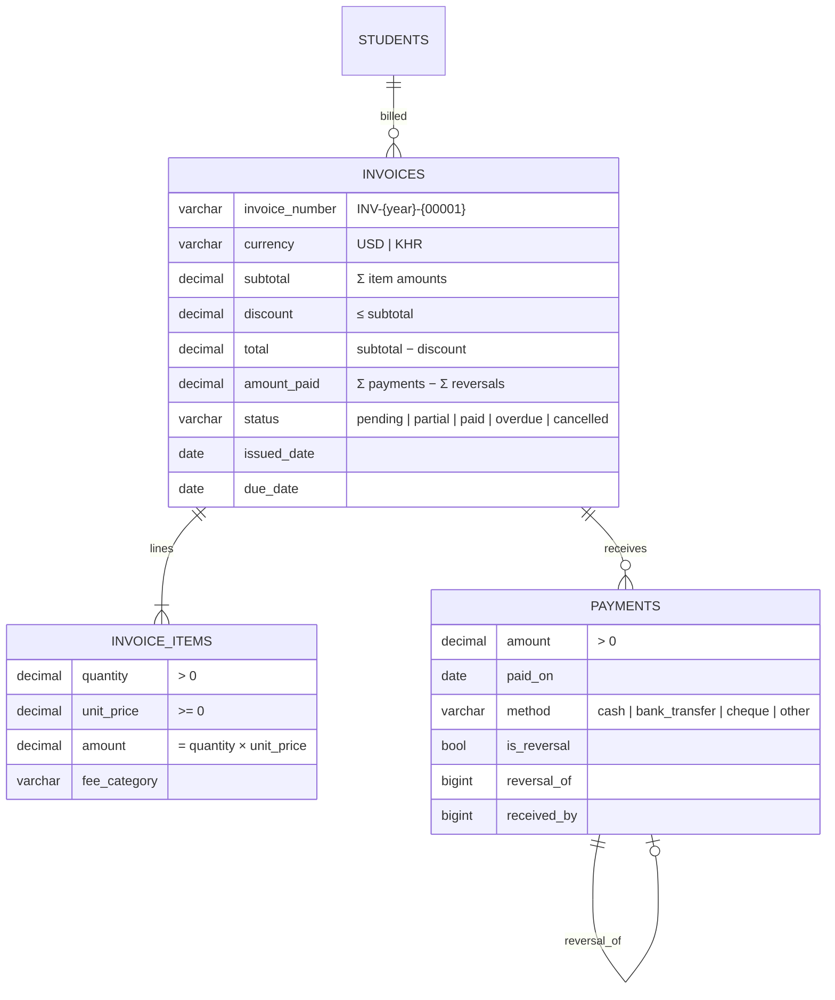
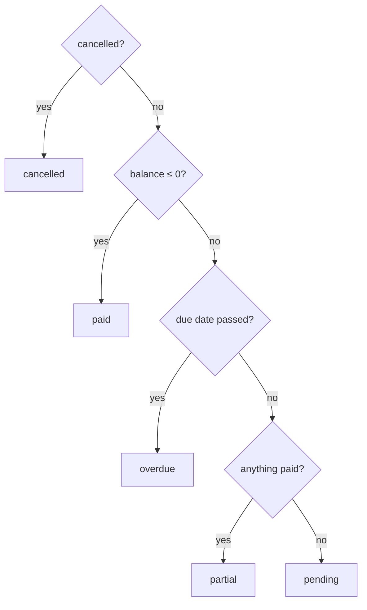

# 23 — Invoices & Payment Records Report (Module 9.18)

- **Date:** 2026-10-02
- **Module:** 9.18 Invoices & Payment Records (business-overview §9.18)
- **Status:** `[Implemented]`
- **Depends on:** 9.2 Student Management

## 1. Scope

University Admin / Super Admin issue itemised invoices to students, record
payments received (cash, bank transfer, cheque, other), reverse mistaken
payments and cancel invoices; statuses (pending, partially paid, paid,
overdue, cancelled) are derived and kept consistent; students see their own
invoices, payments and balances. **No online payment gateway** (business
overview §23) and **no Finance Officer role** — administrators record funds
received.

Invoice & receipt PDF generation is implemented (`GET /invoices/{invoice}/download`, `GET /api/invoices/{invoice}/download`), rendering official itemized billings and receipt history with university branding and status badge via DomPDF. Not built: fee schedules or automatic tuition
invoices from enrollments, billing of document fees (`document_types.requires_fee`),
refunds of overpayments (overpayment is refused), an audit trail (9.24 —
added since, see `docs/28_Audit-Logs-and-Security-Report.md`), currency conversion.

## 2. Data model

**No schema change.** Relies on `uq_invoices_number`, `ck_invoices_paid`
(0 ≤ amount_paid ≤ total), `ck_invoice_items_amount` (amount = quantity ×
unit price), `ck_payments_amount`, `ck_payments_method` and the status check.
New models `Invoice`, `InvoiceItem`, `Payment`.

## 3. Rules

| Rule | Where | Failure |
|---|---|---|
| Money in integer cents in the service; decimals in the DB; never floats for totals | `InvoiceService` | — |
| Totals from items; quantity × unit price must be a whole cent (DB check) | `prepareItems` | `422` (`items.N.quantity`) |
| Discount ≤ subtotal; due date ≥ issue date; currency USD or KHR; 1–50 items | request + service | `422` |
| Numbers `INV-{issue year}-{5-digit sequence}`, serialized by a transaction advisory lock | `nextNumber` | — |
| Edit (items replaced) only while nothing has been paid and not cancelled; the student never changes | service + request | `409` / `422` |
| Payment > 0, ≤ balance (overpayment refused), not in the future, not on a cancelled invoice; row-locked | `recordPayment` | `422` / `409` |
| Reversal: append a row with the same positive amount, `is_reversal`, `reversal_of`; reason required; once per payment; a reversal cannot be reversed | `reverse` | `422` / `409` |
| Cancel only with a net paid amount of zero (reverse first); invoices are never deleted | `cancel` | `409` |
| Students never record or change anything | `InvoicePolicy` | `403` |

**Status derivation** — one function, `InvoiceService::deriveStatus()`,
applied after every change:

Because "overdue" depends on the date, `refreshOverdue()` (one bulk UPDATE)
runs before every finance read, and `php artisan invoices:refresh-statuses` is
scheduled daily at 00:10 (`routes/console.php`). The Docker stack has no
scheduler container yet, so the read-time refresh is what keeps statuses
correct today.

**Currencies are never added together:** a student's summary has one row per
currency.

## 4. Authorization

`InvoicePolicy`.

| Ability | Super / University Admin | Faculty Admin | Lecturer | Invoiced student | Other student |
|---|:-:|:-:|:-:|:-:|:-:|
| List all invoices | ✓ | 403 | 403 | 403 | 403 |
| View an invoice | ✓ | 403 | 403 | ✓ | 403 |
| Create / edit / cancel / record / reverse | ✓ | 403 | 403 | 403 | 403 |
| A student's invoices + summary | ✓ | 403 | 403 | ✓ (own) | 403 |

## 5. Endpoints

| Method | Path | Purpose |
|---|---|---|
| GET / POST | `/api/invoices` | List (`search`, `filters[status]`, `filters[student_id]`) / create |
| GET | `/api/invoices/{invoice}` | Invoice with items, payments, balance |
| GET | `/api/invoices/{invoice}/download` | Download invoice and receipt as PDF |
| PUT, PATCH | `/api/invoices/{invoice}` | Edit (before any payment) |
| POST | `/api/invoices/{invoice}/cancel` | Cancel (optional reason) |
| POST | `/api/invoices/{invoice}/payments` | Record a payment |
| POST | `/api/payments/{payment}/reverse` | Reverse a payment (reason) |
| GET | `/api/students/{student}/invoices` | A student's invoices + per-currency summary |

Web: `GET /invoices`, `GET /invoices/create`, `POST /invoices`,
`GET /invoices/{id}` (managers and the invoiced student), `GET /invoices/{id}/download` (download PDF), `GET /invoices/{id}/edit`,
`PUT /invoices/{id}`, `POST /invoices/{id}/cancel`, `POST /invoices/{id}/payments`,
`POST /payments/{id}/reverse`, `GET /my-invoices` (student).

## 6. UI

- `Invoices/Index` — search + status filter, number, student, due date, total,
  balance, status badge.
- `Invoices/Form` — create / edit with an item editor (description, quantity,
  unit price, category) and a live preview; the server recomputes all totals.
- `Invoices/Show` — summary (status, dates, total / paid, balance), items with
  subtotal / discount / total, payment history (reversed payments struck
  through, reversal rows marked), *Record payment* form (prefilled with the
  balance), *Reverse* with a reason modal, *Edit* and *Cancel invoice* when
  allowed. Features a *Download PDF* button in the header actions. Students see the same page read-only.
- `Invoices/Mine` — balance due, paid and overdue cards per currency and the
  student's invoices.
- Sidebar: *Invoices* in *Operations* (Super Admin, University Admin); *My
  invoices* (student).

## 7. Tests

`backend/tests/Feature/Finance/InvoiceTest.php` — 9 tests (time frozen): totals
and sequential numbering; validation (no items, discount > subtotal, due before
issue, currency, fractional cent, zero quantity); payments → partial → paid,
overpayment / future date / bad method refused, paid invoice not editable or
cancellable; append-only reversal (reason required, history kept, double and
reversal-of-reversal refused, then cancel, no payments on cancelled); overdue
derivation on read, settling an overdue invoice, the scheduled command; editing
before payments and the student lock; access matrix; web pages; invoice PDF
download rendering valid `%PDF-` document. Full suite:
**349 passed**. `InvoiceSeeder` creates demo invoices through the service with
full, partial and no payments.

## 8. Decisions

- **Overpayment is refused** rather than stored as credit (skill §4 "prefer
  reject"); refunds are out of scope.
- **Corrections are reversals, not deletes or edits** — the payment history is
  append-only, so every figure can be explained.
- **No hard delete** — `DELETE /api/invoices` from the skill sketch is replaced
  by cancel, which keeps the record.
- **Read-time overdue refresh** until a scheduler service exists.
