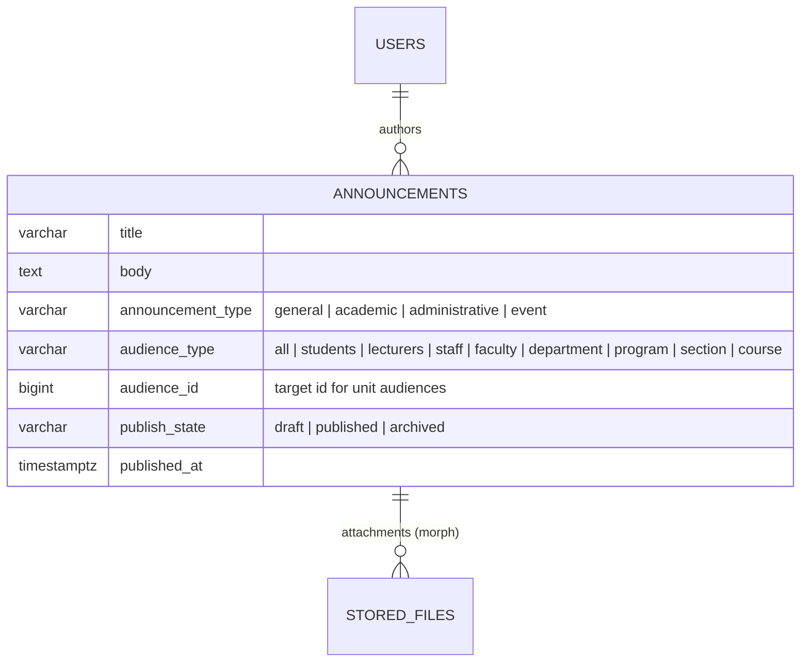
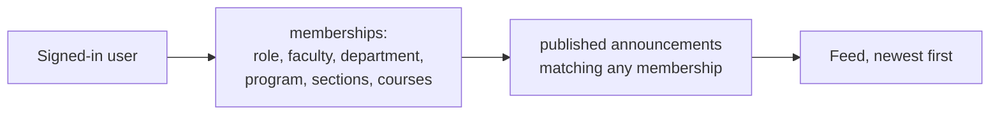

# 24 — Announcements Report (Module 9.19)

- **Date:** 2026-10-02
- **Module:** 9.19 Announcements (business-overview §9.19)
- **Status:** `[Implemented]` (email / Telegram delivery `[Planned]` with 9.20 / 9.21)
- **Depends on:** 9.2–9.4 people and structure, 9.7–9.9 courses, sections, enrollment

## 1. Scope

Administrators and lecturers write announcements targeted to everyone, a role
group, or one faculty / department / program / section / course; drafts are
published, then archived when no longer relevant. Every signed-in user has a
feed of the published announcements addressed to them, and the student
dashboard (9.15) now shows the latest three.

Not built: notification delivery on publish (9.20 email, 9.21 Telegram — the
skill's "queued notifications on publish" arrives with them),
read receipts, scheduled publishing, and Faculty Admin authoring (needs unit
scoping on the user record).

File attachments are implemented (`AnnouncementService::attachFile()`) using the private file storage (`skills/file-storage`) via polymorphic relation (`MorphMany StoredFile`).

## 2. Data model

**No schema change.** Relies on existing `stored_files` polymorphic table (`fileable_type = App\Models\Announcement`). `audience_id` is a polymorphic-style id whose table is
given by `audience_type` (the existing design; no FK). The service checks the
target exists. New model `Announcement`.

## 3. Audience resolution

Membership is resolved **when a feed is read**, from authoritative relations —
no recipient rows are stored:

| Audience | Students | Lecturers | Administrators |
|---|---|---|---|
| all | ✓ | ✓ | ✓ |
| students / lecturers / staff | students | lecturers | Super, University, Faculty Admin |
| faculty | current program → department → faculty | own department → faculty | — |
| department | current program's department | own department | — |
| program | current program | — | — |
| section | open (pending / confirmed) enrollment | assigned to the section | — |
| course | open enrollment in any section of it | teaches a section of it | — |

Because membership is live, someone who joins an audience later also sees its
earlier announcements; someone who leaves stops seeing them.

## 4. Rules

| Rule | Where | Failure |
|---|---|---|
| Title, body (≤ 10 000), known category and audience; unit audiences need an existing target | request + service | `422` |
| Super Admin / University Admin target any audience | service | — |
| An active lecturer targets only sections they teach, or courses they teach a section of; never role groups or units | service | `422` |
| Draft → published → archived; only drafts can be edited or deleted; published content is never rewritten (archive + publish a correction) | service | `409` |
| Publishing re-checks that the publisher may still reach the audience | service | `422` |
| Students never write; Faculty Admin reads only | `AnnouncementPolicy` | `403` |

## 5. Authorization

`AnnouncementPolicy`.

| Ability | Super / University Admin | Faculty Admin | Active lecturer | Student |
|---|:-:|:-:|:-:|:-:|
| Own feed | ✓ | ✓ | ✓ | ✓ |
| Manage list | all | 403 | own | 403 |
| Create / edit / publish / archive / delete | any | 403 | own, own sections / courses | 403 |
| View one | ✓ | if in audience | own or in audience | if in audience |

## 6. Endpoints

| Method | Path | Purpose |
|---|---|---|
| GET | `/api/announcements/feed` | The caller's feed (paginated) |
| GET / POST | `/api/announcements` | Managed list (`filters[publish_state]`) / create (`publish` to publish at once; multipart with `attachments[]`) |
| GET | `/api/announcements/{announcement}` | One announcement |
| PUT, PATCH | `/api/announcements/{announcement}` | Edit a draft (supports new `attachments[]` and `remove_attachment_ids[]`) |
| DELETE | `/api/announcements/{announcement}` | Delete a draft (deletes physical files) |
| POST | `/api/announcements/{announcement}/publish` · `/archive` | Lifecycle |
| GET | `/api/announcements/{announcement}/attachments/{file}/download` | Download attachment file |

Web: `GET /announcements` (feed, every role), `GET /announcements/manage`,
`POST /announcements`, `PUT|DELETE /announcements/{id}`,
`POST /announcements/{id}/publish|archive`, `GET /announcements/{id}/attachments/{file}/download`.

## 7. UI

- `Announcements/Feed` — category badge, audience, date, title, body, author,
  and attachment pills with paperclip icons, file sizes, and direct download links.
- `Announcements/Manage` — filter by state; drafts with Publish / Edit / Delete,
  published with Archive (confirmations); compose modal with category, audience,
  target (lecturers only see their sections and courses), multiple file attachment
  picker, and existing attachment removal controls.
- `Student/Dashboard` — new *Announcements* card (latest three).
- Sidebar: *Announcements* for every role (staff under *Operations*).

Audience labels for a page of announcements are loaded with one query per
audience type (`AnnouncementService::preloadTargets`), not one per row.

## 8. Tests

`backend/tests/Feature/Announcements/AnnouncementTest.php` — 7 tests: audience
resolution for all nine audience types against a student in the program /
section, an unrelated student, the section's lecturer and an administrator
(drafts never shown); lifecycle (edit draft, archive refused before publish,
publish, no edit / delete / re-publish, archived leaves the feed and becomes
invisible); validation; lecturer targeting limits and own-only management;
students, Faculty Admin and inactive lecturers cannot write; web pages and the
dashboard card; file attachments workflow (upload, list with URLs and sizes,
authorized streaming download, remove attachment, and deletion cleanup). Full
suite: **356 passed**. `AnnouncementSeeder` adds four published notices and a
draft.
