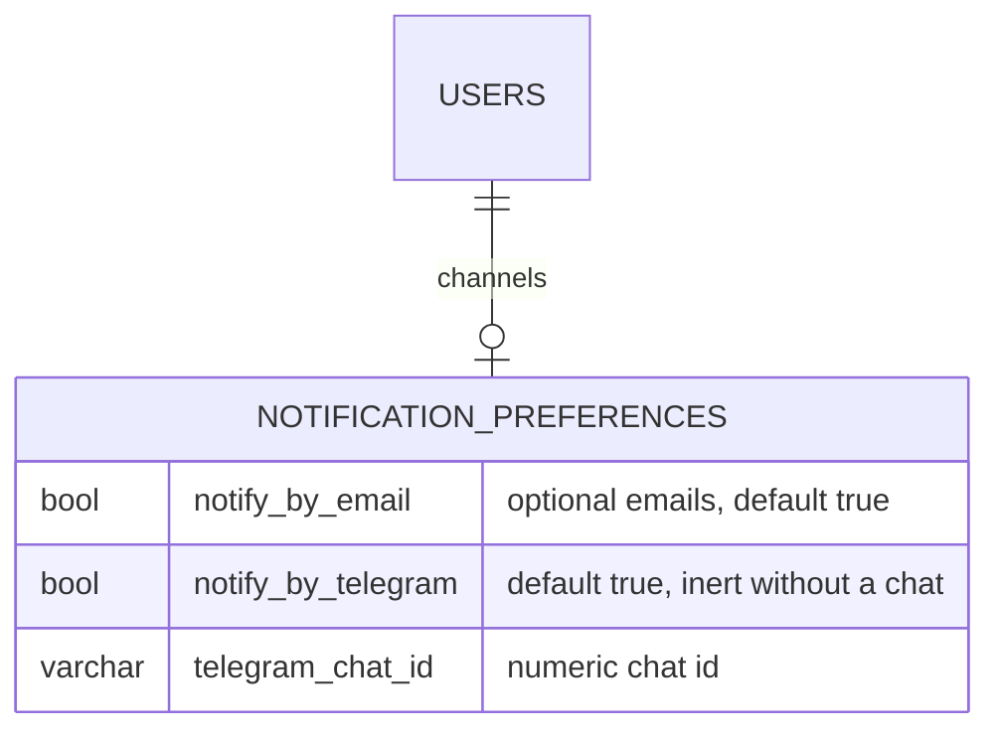
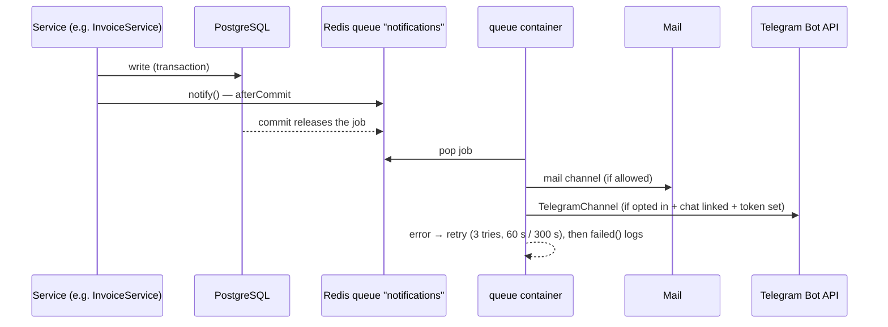

# 25 — Email & Telegram Notifications Report (Modules 9.20 / 9.21)

- **Date:** 2026-10-02
- **Modules:** 9.20 Email Notifications, 9.21 Telegram Notifications
- **Status:** `[Implemented]` (class reminders `[Future]`; password emails shipped in report 29; the in-app inbox in report 42)
- **Depends on:** 9.9, 9.14, 9.16, 9.18, 9.19 (the events), Redis queue
- **Infrastructure:** new `queue` and `scheduler` containers (same backend image)

## 1. Scope

EduCore now tells people when something happens to them: by email (all roles)
and, for users who link a chat, by Telegram. Every message goes through the
Redis queue, is sent only after the database change commits, is retried and,
if it still fails, logged. Users manage their own channels on a settings page.

| Event | Notification | Recipients | Email |
|---|---|---|---|
| Registration confirmed (9.9) | `EnrollmentConfirmed` | the student | optional |
| Grade approved (9.14) | `GradePublished` (course only, no grade in the message) | each student of the section | optional |
| Document request approved / rejected / ready (9.16) | `DocumentRequestUpdated` | the student | **always** |
| Invoice issued (9.18) | `InvoiceIssued` | the student | **always** |
| Payment recorded or reversed (9.18) | `PaymentRecorded` | the student | **always** |
| Announcement published (9.19) | `AnnouncementPublished` | every active member of the audience | optional |
| Assignment due within 24 h, not submitted (daily 07:00) | `AssignmentDueSoon` | each such student | optional |
| "Send me a test" | `TestNotification` | the caller | optional |
| Document request / internship application submitted (report 43) | `DocumentRequestSubmitted`, `InternshipSubmitted` | staff who can process it | optional |

Telegram carries the same messages as plain text, for users who opted in and
linked a chat. Not built: class-start reminders, password-reset emails (no
password-reset flow exists yet), an in-app notification inbox (the existing
`notifications` table has a bigint id, while Laravel's database channel needs a
UUID — left unused), automatic Telegram chat linking through a bot webhook.
*(Update: password-reset emails shipped in report 29; the in-app inbox — with
the table rekeyed to a UUID — in `docs/42_In-App-Notification-Inbox-Report.md`.)*

## 2. Data model

**No schema change.** One row per user (`uq_notification_preferences_user`),
created on first save; a user without a row gets the defaults. New model
`NotificationPreference`; `User::preferences()`,
`User::routeNotificationForTelegram()`.

## 3. Delivery

Rules (`EduCoreNotification`, the base class of every notification):

- Queue `notifications`, `afterCommit()` — a rolled-back change never notifies.
- `tries = 3`, back-off 60 s then 300 s; `failed()` writes a warning to the log.
- Inactive accounts receive nothing.
- Email: sent when the notification is **critical** (document status, invoices,
  payments) or the user kept optional email on.
- Telegram: only when the user turned it on **and** linked a chat id; skipped
  (logged at info level) when `TELEGRAM_BOT_TOKEN` is empty. API errors throw so
  the job retries.
- Announcements fan out in `SendAnnouncementNotifications`, itself a queued
  job: it resolves the audience with `AnnouncementService::recipients()` (the
  inverse of the feed query — section / course audiences include their
  lecturers; only active users) and sends in chunks of 500, so the publish
  request never loops over recipients. Later joiners see the announcement in
  their feed but are not notified retroactively.

`TelegramChannel` calls `POST {api_url}/bot{token}/sendMessage` with Laravel's
HTTP client — no new package. The bot token comes only from
`TELEGRAM_BOT_TOKEN` (`config('services.telegram.bot_token')`); it is distinct
from the GitHub secrets CI uses for team messages, and `phpunit.xml` forces it
empty so tests never reach Telegram.

## 4. Containers

| Service | Container | Command | Health |
|---|---|---|---|
| queue | `educore-queue` | `php artisan queue:work redis --queue=notifications,default --tries=3 --backoff=60 --max-time=3600` | worker process present |
| scheduler | `educore-scheduler` | `php artisan schedule:work` | scheduler process present |

Both reuse `educore/backend:dev`, the backend code and vendor volumes, and the
backend environment (a YAML anchor, so the three cannot drift); they start after
`backend` is healthy. The scheduler runs `notifications:assignment-reminders`
(07:00) and `invoices:refresh-statuses` (00:10) — closing the 9.18 open item.
Mail in development uses `MAIL_MAILER=log` (messages land in
`storage/logs/laravel.log`).

## 5. Endpoints and UI

| Method | Path | Purpose |
|---|---|---|
| GET | `/api/notification-preferences` | The caller's channels (+ whether Telegram is configured) |
| PUT | `/api/notification-preferences` | Update (chat id required to turn Telegram on; numeric) |
| POST | `/api/notification-preferences/test` | Queue a test message (3 / minute) |

Web: `GET|PUT /notifications`, `POST /notifications/test`. Page
`Notifications/Preferences` — optional-email toggle with a note that critical
emails cannot be turned off, Telegram chat id + toggle (disabled without a chat
id), *Send me a test*. Reached from *Notification settings* in the account menu
(top bar), for every role. There is no user id in any path: a user can only
ever change their own channels.

## 6. Tests

`backend/tests/Feature/Notifications/NotificationTest.php` — 8 tests: channel
rules (defaults, opt-out vs critical, Telegram readiness, inactive accounts,
queue name and tries); domain triggers (registration, invoice, payment and
reversal, document rejection); publishing queues the fan-out job (not for
drafts); fan-out reaches exactly the section's student and lecturer (not an
outsider, an inactive student or an admin); Telegram calls the Bot API with the
chat id and text only when a token is set; API errors throw for retry; assignment
reminders skip submitted students, drafts and later deadlines; preferences API
validation, save, test endpoint with rate limit, and the page. `GradingTest` now
asserts `GradePublished` on approval. Full suite: **363 passed**.

Live check in Docker: a `TestNotification` queued from tinker was processed by
`educore-queue` (`RUNNING … DONE`) and the email appeared in the mail log;
`schedule:list` in `educore-scheduler` shows both daily commands.
