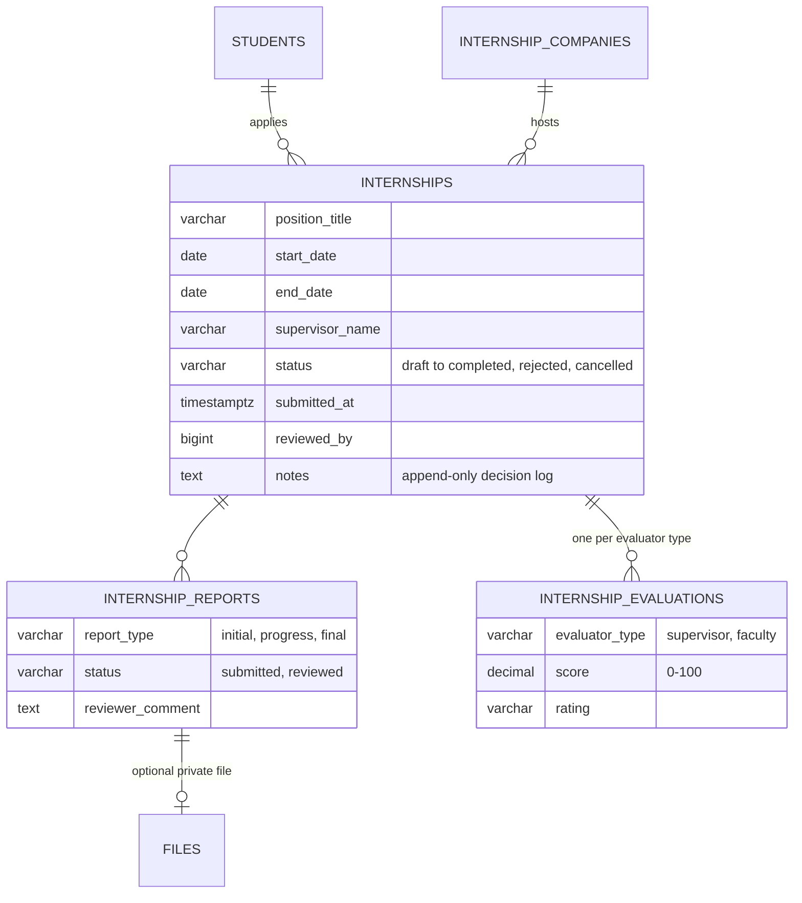
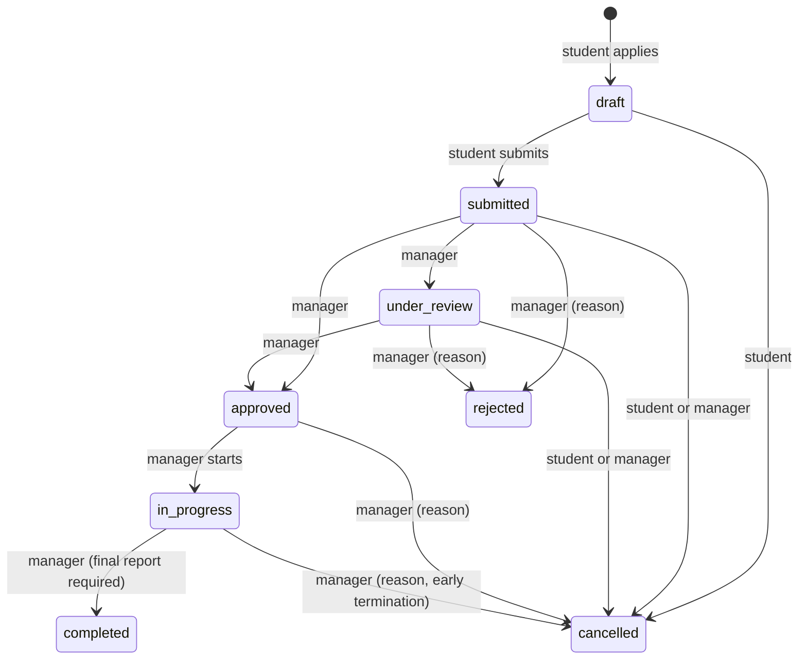

# 26 — Internship Management Report (Module 9.22)

- **Date:** 2026-10-02
- **Module:** 9.22 Internship Management (business-overview §9.22)
- **Status:** `[Implemented]` (internship letter document and opportunity postings `[Future]`)
- **Depends on:** 9.2 Students, 9.20 notifications, MinIO uploads

## 1. Scope

Students apply for an internship at a host company, the university office
reviews and approves or rejects it, the internship is started and completed,
the student submits initial / progress / final reports (optionally with a
private file), and staff record the company supervisor's and the faculty's
evaluations. Staff keep a lean list of host companies.

Not built: published internship *opportunities* that students browse (students
propose their own placement at a listed company), an internship letter
document (would be a 9.16 document type), supervisor logins (staff enter the
supervisor's evaluation), stipends, an audit trail beyond the notes log (9.24).

## 2. Data model

**No schema change.** Relies on `uq_internships_active` (one submitted /
under-review / approved / in-progress internship per student), the status,
date, report-type and score checks, and `uq_internship_companies_name`. Report
files use the existing polymorphic `files` table (`StoredFile`). New models
`InternshipCompany`, `Internship`, `InternshipReport`, `InternshipEvaluation`.

## 3. Workflow

| Rule | Where | Failure |
|---|---|---|
| One open application (draft or active) per student; DB also enforces one active | service (+ `uq_internships_active`) | `409` |
| A rejected student applies again with a new record | design | — |
| Company must be active; dates ordered; supervisor name required | request + service | `422` |
| Student edits only drafts; managers edit until final (e.g. a company change after approval) | service | `409` |
| Reject and manager cancel need a reason; approve / complete accept a note — all appended to `notes` with date and reviewer | service | `422` |
| Initial / progress reports from approval; the final report only once in progress; PDF / DOCX within the submission size cap, stored privately under `internships/{student}/{internship}/` | request + service | `409` / `422` |
| Completion requires a final report | service | `409` |
| Evaluations once started: one per evaluator type (saving again replaces), score 0–100, rating optional | service | `409` / `422` |
| The student is notified (critical email, Telegram if linked) on approve, reject, start, complete and staff cancellation | `InternshipStatusChanged` | — |

## 4. Authorization

`InternshipPolicy`.

| Ability | Super / University Admin | Faculty Admin | Owning student | Other student / lecturer |
|---|:-:|:-:|:-:|:-:|
| List | all | all (read) | own | own / 403 |
| View, download report files | ✓ | ✓ | ✓ | 403 |
| Apply, edit draft, submit, withdraw before approval, submit reports | — | — | ✓ | 403 |
| Review, approve, reject, start, complete, cancel, edit, review reports, evaluate | ✓ | 403 | 403 | 403 |
| Companies: list | all | all | active only | 403 (lecturer) |
| Companies: create / update | ✓ | 403 | 403 | 403 |

Faculty Admin reads only, as in the other modules: without unit scoping on the
user record, faculty-level approval would be university-wide.

## 5. Endpoints

| Method | Path | Purpose |
|---|---|---|
| GET / POST | `/api/internship-companies` | List / add a company |
| PUT, PATCH | `/api/internship-companies/{company}` | Update (incl. `is_active`) |
| GET / POST | `/api/internships` | List (`filters[status]`) / apply (draft) |
| GET | `/api/internships/{internship}` | Internship with reports and evaluations |
| PUT, PATCH | `/api/internships/{internship}` | Edit |
| POST | `/api/internships/{internship}/{action}` | `submit`, `review`, `approve`, `reject`, `start`, `complete`, `cancel` |
| POST | `/api/internships/{internship}/reports` | Submit a report (multipart) |
| POST | `/api/internships/{internship}/evaluations` | Record an evaluation |
| POST | `/api/internship-reports/{report}/review` | Mark a report reviewed |
| GET | `/api/internship-reports/{report}/file` | Download the report file |

Web: `GET|POST /my-internships` (student), `GET /internships` (staff queue),
`GET|PUT /internships/{id}`, `POST /internships/{id}/{action}`,
`POST /internships/{id}/reports|evaluations`, `POST /internship-reports/{id}/review`,
`GET /internship-reports/{id}/file`, `GET|POST /internship-companies`,
`PUT /internship-companies/{id}`.

## 6. UI

- `Internships/Mine` — the student's current application (status and next step)
  or the application form, plus history.
- `Internships/Show` — shared by student and staff: details, review notes,
  role-specific workflow buttons (with confirmation / reason modals), edit,
  reports (submit with file; staff review) and evaluations (staff form).
  Components `InternshipForm`, `ReportsCard`, `EvaluationsCard`.
- `Internships/Index` — staff queue, open applications first, status filter.
- `Internships/Companies` — company list with internship counts; add / edit.
- Sidebar: *Internships* in *Operations* (staff); *My internship* (student).

## 7. Tests

`backend/tests/Feature/Internships/InternshipTest.php` — 6 tests: the full
workflow (draft edit, submit, no student edits after, review, start refused
before approval, approve with note and notification, final report refused
before start, initial report with a PDF in fake storage, start, completion
refused without a final report, final report, evaluation default name and
replace-on-save, complete, nothing moves after); one open application and a new
application after rejection (reason required, notified); cancellation rules;
validation (dates, supervisor, inactive company hidden and refused, unique and
URL-checked companies, students cannot add companies, executable report file
refused); access matrix incl. Faculty Admin read-only and an unknown action
(404); web pages incl. a report without a file (404). Full suite:
**369 passed**. `InternshipSeeder` adds four companies and three internships
(submitted, approved, in progress) through the service.

## 8. Operational note — backend image rebuilt

While starting this module the test-database guard refused to run: the
`queue` / `scheduler` containers (9.20) had started from an
`educore/backend:dev` image built on 2026-09-26, whose entrypoint still cached
the Laravel config on every start (the production-only caching fix landed on
2026-10-01 but the image was never rebuilt). The image was rebuilt and the
three PHP containers recreated; config is no longer cached in development.
README §13 now says to rebuild after entrypoint changes. A flaky 9.14 test
(explicit academic-year codes inside the factory's random range) was fixed at
the same time.
