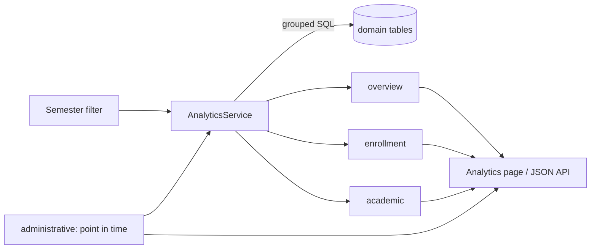

# 27 — Analytics & Reporting Report (Module 9.23)

- **Date:** 2026-10-02 (updated 2026-10-03)
- **Module:** 9.23 Analytics & Reporting (business-overview §9.23)
- **Status:** `[Implemented]` (CSV and PDF exports implemented; faculty-scoped views and trends over time `[Future]`)
- **Depends on:** every academic and administrative module (read-only)

## 1. Scope

A management analytics page and four JSON endpoints for Super Admin and
University Admin: headline numbers, enrollment by program and status,
academic performance (grade and semester-GPA distributions, attendance and
results per course) for a chosen semester, and the current administrative
workload (documents, internships, invoices, finance per currency).

Comprehensive executive PDF report export (`GET /analytics/export/pdf`, `GET /api/analytics/export/pdf`)
and modern interactive Chart.js Pie/Donut charts (`components/charts/PieChart.vue`) with view-mode toggling are implemented.

Not built: a Faculty Admin view scoped to their unit (needs
unit scoping on the user record — `skills/analytics-reporting` §12 forbids
returning institution-wide data to them), multi-semester trend charts,
predictive analytics (out of scope by the business overview).

## 2. How figures are computed

**No schema change and no fact tables.** `AnalyticsService` runs grouped SQL
over the domain tables (no PHP loops over rows) and reuses other modules'
definitions rather than re-deriving them:

| Figure | Definition | Source |
|---|---|---|
| Enrollments / students enrolled | pending + confirmed + completed enrollments of the semester (dropped / withdrawn excluded) | `enrollments` |
| Enrollment by program | grouped by the student's **current** program | `student_programs` (active) |
| Attendance rate | (present + late) / (present + late + absent) over held sessions; excused not counted (the 9.11 formula) | `attendance_records` |
| Approved grades, pass rate | approved / finalized grades only (`Grade::FINAL_STATUSES`); pass = grade point > 0 | `grades` |
| Grade distribution | counts per letter of the **active** scale, in scale order, zeros included | `grading_scales` |
| Average semester GPA, GPA bands | mean / 4 bands of the semester GPA snapshots | `gpa_records` (9.14) |
| Results per course | graded count, pass rate, average total and points | `grades` |
| Workload by status | every status listed, zeros included | `document_requests`, `internships`, `invoices` |
| Finance | invoiced, collected, outstanding, overdue, collection rate — **one row per currency**, cancelled excluded; overdue refreshed first | `invoices` |

Every ratio returns `null` (shown as "—") when there is nothing to measure, so
an empty system never divides by zero. Academic figures are bounded to one
semester (`semester_id`, default: the open semester with the latest start);
administrative figures are the current workload.

`facultyOverview()` (2026-10-03) returns active students, active lecturers,
running sections and students enrolled for one faculty, on the same helpers
and the ownership rules of `App\Support\FacultyScope`; the Faculty Admin
dashboard shows them (`docs/34_Faculty-Admin-Dashboard-Report.md`). The
analytics page itself stays with managers.

## 3. Visual design

Chosen with the `dataviz` skill and `docs/branding/UI-COMPONENTS.md` §10:

- Headline numbers are **KPI stat tiles**, not charts, laid out like the admin
  dashboard overview (2026-10-03): eight `StatCard`s in rows of four, no icons,
  each with one short detail line — students enrolled, active students,
  sections, active lecturers / attendance rate, approved grades, pass rate,
  average semester GPA. Counts with a list link to it (enrollments and
  offerings filtered to the semester, active students, active lecturers).
- Magnitude comparisons and distributions support **both single-series bar charts and modern donut/pie charts** (`components/charts/PieChart.vue`):
  - Thin cutout donut (68%) with centered headline count and metric label.
  - Interactive legend with color dots and share percentages.
  - Accessible table toggle for full tabular data review.
  - One-click instant view-mode toggling between Bar chart and Donut chart on Enrollment, Grade, and GPA cards.
- Status breakdowns are **labelled lists with status badges** (text + color),
  not multi-color charts.
- `components/charts/BarChart.vue`: thin bars, 4px rounded data end with a
  flat baseline, gap between bars, recessive grid, no legend (single series —
  the card title names it), hover tooltip over the whole band, an accessible
  name listing every value, and a **Show as table** toggle; follows dark mode
  by observing the `<html>` class; respects `prefers-reduced-motion`.
- `components/charts/PieChart.vue`: Chart.js doughnut/pie chart with 68% cutout,
  EduCore theme palettes (light & dark), accessible data table alternative, percentage
  tooltips, and responsive legend list.
- The series color was validated with the skill's palette validator:
  `#2563EB` passes on the light surface; in dark mode `#60A5FA`
  (`dark-primary`) fails the lightness band, so the chart uses `#3B82F6`
  (blue-500), which passes. Added as tokens `chart-primary` /
  `dark-chart-primary` (`style.css`, UI-COMPONENTS §10).

## 4. Authorization

Gate `view-analytics` (Super Admin, University Admin) plus route middleware.
Faculty Admin, lecturers and students get 403; the sidebar shows *Analytics*
under *Overview* to Super Admin and University Admin only.

## 5. Endpoints

| Method | Path | Purpose |
|---|---|---|
| GET | `/api/analytics/overview?semester_id=` | Headline numbers |
| GET | `/api/analytics/enrollment?semester_id=` | By program and by status |
| GET | `/api/analytics/academic?semester_id=` | Grade / GPA distributions, attendance and results per course |
| GET | `/api/analytics/administrative` | Workload by status, finance per currency |
| GET | `/api/analytics/export?table=&semester_id=` | CSV export per table (audited) |
| GET | `/api/analytics/export/pdf?semester_id=` | Executive institutional PDF report (audited) |

Semester-bound responses are `{ semester, data }` (both null when no semester
exists). Web: `GET /analytics` (`Analytics/Index`, all sections in one page),
`GET /analytics/export` (CSV), and `GET /analytics/export/pdf` (PDF).

## 6. Tests

`backend/tests/Feature/Analytics/AnalyticsTest.php` and `backend/tests/Feature/Exports/CsvExportTest.php`:
- Hand-counted aggregates fixture tests across all endpoints;
- Zero-data / empty system safety;
- Finance per currency separation;
- Manager-only RBAC enforcement;
- `test_analytics_pdf_export`: Validates 409 when no semester exists, valid `%PDF-` document output for managers on both API and web routes, audit logging (`export.analytics_pdf`), and 403 rejection of non-managers.

Not verified: the rendered charts were not inspected in a browser in this
session (no browser tool available); the build is clean and the data contract
is tested.
