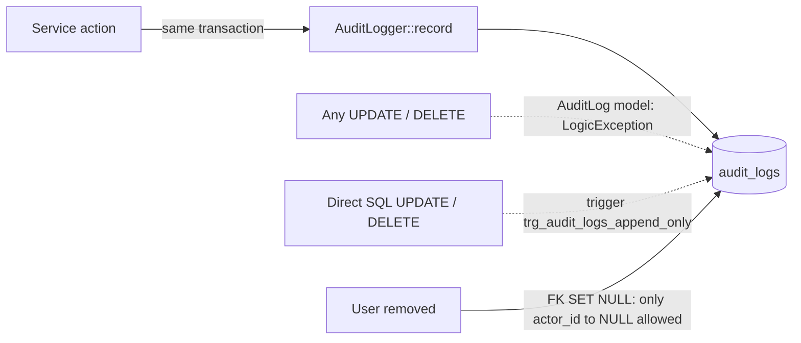

# 28 — Audit Logs & Security Report (Module 9.24)

- **Date:** 2026-10-02
- **Module:** 9.24 Audit Logs & Security (business-overview §9.24)
- **Status:** `[Implemented]` (CSV export in `docs/31_CSV-Exports-Report.md`; audit retention and failure alerting `[Future]`)
- **Depends on:** every module that changes sensitive data

## 1. Scope

An append-only audit trail of sign-in activity and sensitive changes — who did
what, to which record, when, from where, with before / after values — and a
read-only Super Admin viewer. Security hardening in the same module: an
account deactivated after signing in now loses its session and API tokens on
its next request, and the trail is protected against tampering in the database
itself.

Not built: retention / archiving of the trail (CSV export was added later —
`docs/31_CSV-Exports-Report.md`), alerting on
repeated notification failures, audit entries for low-risk CRUD (faculties,
courses, rooms…), two-factor sign-in.

## 2. What is audited

Explicit calls to `AuditLogger` inside the services' transactions (one
pattern, `skills/audit-logging` §6) plus Laravel's auth events:

| Area | Actions | Values kept |
|---|---|---|
| Sign-in | `auth.login`, `auth.logout`, `auth.failed` (email tried), `auth.lockout`, `auth.access_revoked` | description; never a password |
| Users | `user.created`, `user.updated` (role, activation, password as a *fact*), `user.deleted` | changed attributes only |
| Students / lecturers | `student.status_changed`, `student.program_changed`, `lecturer.deactivated` / `reactivated` | status / program before → after |
| Enrollment | `enrollment.created`, `.dropped` / `.withdrawn`, `.completed` | status before → after |
| Exams | `exam_result.corrected` | score and remarks before → after |
| Grades | `grades.submitted`, `grades.approved`, `grades.returned`, `grading_scale.updated`, `grading_config.updated` | per student: enrollment, letter, total, status; scale bands and weights before → after |
| Documents | `document_request.approved` / `.rejected` / `.generated`, `document.revoked`, `document.downloaded` | status, type, reason |
| Finance | `invoice.created`, `invoice.updated`, `invoice.cancelled`, `payment.recorded`, `payment.reversed` | amounts, method, reason |
| Announcements | `announcement.published`, `announcement.archived` | title, audience |
| Internships | `internship.<status>` for every transition | status before → after, note / reason |

Because each entry is written in the same transaction as the change, a
rolled-back action (e.g. a refused over-payment) leaves no entry, and a
committed one always has one.

**Never logged:** passwords, tokens, verification tokens, storage keys, or any
attribute a model hides (`$hidden`). A changed secret is recorded as
"Changed: password." with no value.

## 3. Append-only, in two layers

- The `AuditLog` model throws on `updating` / `deleting`.
- Migration `2026_10_02_090000_make_audit_logs_append_only` adds a PostgreSQL
  trigger that refuses every UPDATE and DELETE — except the single change the
  schema itself performs: `fk_audit_logs_actor` is `ON DELETE SET NULL`, so
  removing a user may null `actor_id` while all other columns stay identical.
  The trigger *protects* the table; writing entries stays in the application
  (decision #14 in `docs/database/decisions.md`, amended).
- No create / update / delete endpoints exist (`405`).

## 4. Deactivated accounts lose access

`EnsureAccountIsActive` (web and api middleware groups) resolves the user from
the session or the Sanctum token. If the account is inactive (deactivated in
Users, a lecturer deactivated, a student suspended / withdrawn / graduated):

- web — the session is logged out and invalidated, redirect to sign-in with
  "Your account has been deactivated";
- API — the presented token is deleted, `401 Unauthenticated.`;
- both — `auth.access_revoked` is audited.

This closes the open item from the sign-in fix (`d22e91d`): sessions and tokens
issued before a deactivation no longer stay valid until logout or expiry.

## 5. Viewer and endpoints

| Method | Path | Purpose |
|---|---|---|
| GET | `/api/audit-logs` | Search: `search` (description, actor, action), `filters[area]` (part before the dot), `filters[action]`, `filters[actor_id]`, `from` / `to` |
| GET | `/api/audit-logs/{auditLog}` | One entry with before / after values |

Web: `GET /audit-logs` (`AuditLogs/Index` — filters, who / what / record /
when) and `GET /audit-logs/{id}` (`AuditLogs/Show` — before / after table,
changed values emphasised, IP and browser). Super Admin only
(`AuditLogPolicy`); sidebar *System → Audit logs*. A removed actor shows as
"System / removed user".

## 6. Tests

`backend/tests/Feature/Audit/AuditTest.php` — 7 tests: append-only (model
update / delete refused, direct SQL UPDATE / DELETE refused by the trigger,
the actor-removal exception allowed); user role and password change recorded
without the password; enrollment, exam-correction before / after, grade
approval snapshot, grading-scale change, invoice / payment / reversal with
reason, a refused payment leaving no entry, student status change; sign-in
success, failure (email but no password), logout, lockout; deactivated web
session redirected and logged out; deactivated API token deleted and 401;
viewer filters, search, detail, validation of the area filter, Super Admin
only, no write endpoints (405). Full suite: **380 passed**.
