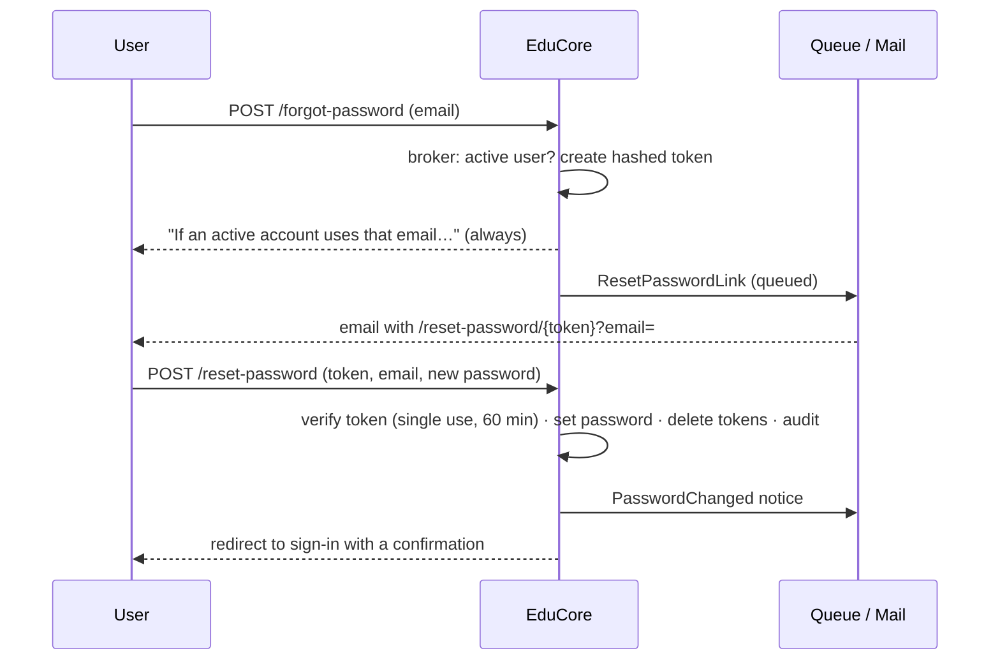

# 29 — Password Change & Reset Report

- **Date:** 2026-10-02
- **Module:** part of 9.1 Authentication & Authorization (business-overview §9.1 "password management")
- **Status:** `[Implemented]`
- **Depends on:** 9.20 notifications (queued email), 9.24 audit trail

## 1. Scope

Every signed-in user can change their own password; anyone can request a
reset link by email when they forget it. Both are available on the web and the
REST API, are audited, notify the account owner, and end the account's other
sessions and API tokens.

Not built: forced password change on first sign-in, password expiry / history,
two-factor sign-in.

## 2. Rules

| Rule | Where |
|---|---|
| New password: at least 8 characters with letters and numbers (`Password::defaults()`), confirmed, different from the current one | `ChangePasswordRequest`, `ResetPasswordRequest`, `AppServiceProvider` |
| Change requires the current password (works for session and token users) | `PasswordService::change` |
| Change: every **other** API token deleted (the one making the request is kept); every other web session signed out — the current one stays | service + `AuthenticateWebSession` |
| Reset link: Laravel's password broker — token stored hashed, single use, expires after `auth.passwords.users.expire` (60) minutes, throttled per user | broker |
| Links go only to **active** accounts (`is_active` is part of the lookup) | service |
| The forgot-password answer is identical for known, unknown and inactive emails (no account enumeration) | controllers |
| Forgot / reset endpoints rate limited: 5 per minute per email + IP | `throttle:password-reset` |
| Reset deletes **all** API tokens; an invalid / used / expired token → 422 with "request a new one" | service |
| Audited: `user.password_changed`, `auth.password_reset_requested`, `auth.password_reset` — never the password or token | `AuditLogger` |
| Owner notified: `PasswordChanged` (critical email, Telegram if linked); the reset link itself is email-only (`ResetPasswordLink`) | notifications |

## 3. Other sessions end

`AuthenticateWebSession` (web group) is Laravel's `AuthenticateSession`,
applied only when the active guard is the session guard (the stock middleware
fails if the default guard is Sanctum's — found by the test suite). Each
session stores the account's password hash; after a change the current
session stores the new hash at the end of the request, so it stays signed in,
while every other session no longer matches and is signed out on its next
request.

## 4. Endpoints and UI

| Method | Path | Auth | Purpose |
|---|---|---|---|
| PUT | `/api/password` | Sanctum | Change my password |
| POST | `/api/forgot-password` | public, throttled | Request a reset link (202, generic) |
| POST | `/api/reset-password` | public, throttled | Reset with an emailed token |

Web: `GET|PUT /account/password` (`Account/Password`, linked as *Change
password* in the account menu), `GET|POST /forgot-password`
(`Auth/ForgotPassword`), `GET /reset-password/{token}` and
`POST /reset-password` (`Auth/ResetPassword`). The sign-in page now shows
*Forgot password?* and confirmation messages; the guest pages share
`components/auth/AuthShell.vue` with the sign-in look.

## 5. Tests

`backend/tests/Feature/Auth/PasswordTest.php` — 4 tests: API change (wrong
current password, too short, letters only, same as current all refused;
success keeps only the current token, owner notified, audited without the
password); web change keeps the current session and signs out a session with
a stale password hash; reset (same answer for known / unknown / inactive
emails, link only to the active account, email-only link to the right URL,
bogus token refused, success sets the password and deletes all tokens,
audited and notified, the token cannot be reused); web pages and the rate
limit (429). Full suite: **384 passed**.
