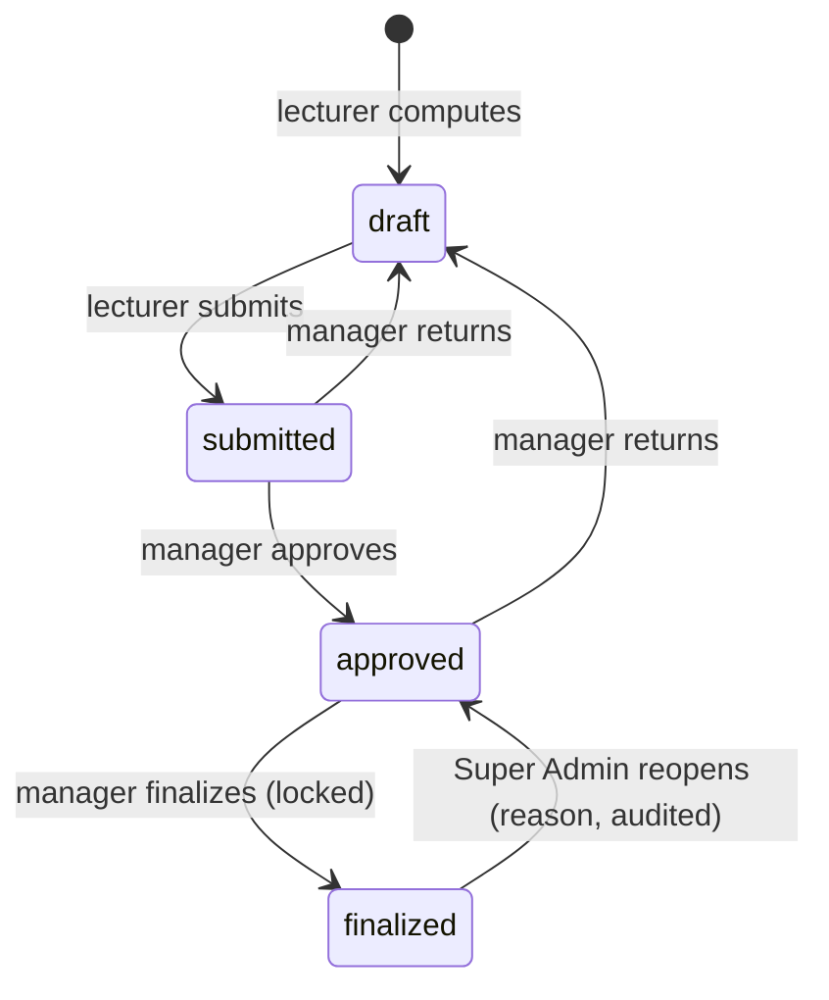
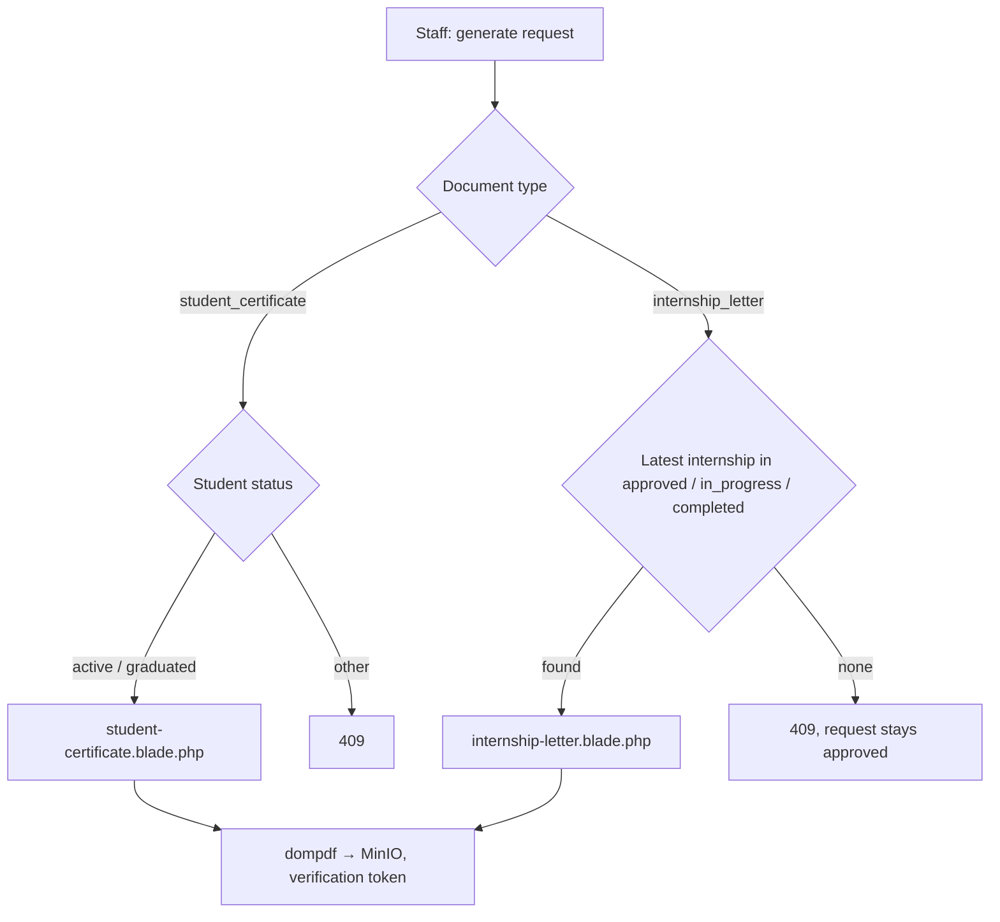

# 30 — Grade Finalization & Document Templates Report

- **Date:** 2026-10-02
- **Modules extended:** 9.14 Grades & GPA, 9.16 Document Management, 9.22 Internship Management
- **Status:** `[Implemented]`
- **Depends on:** `docs/20_Grades-and-GPA-Report.md`, `docs/22_Documents-and-Verification-Report.md`,
  `docs/26_Internship-Management-Report.md`, `docs/28_Audit-Logs-and-Security-Report.md`

## 1. Scope

Three open items from the module reports are closed:

1. **Grade finalization lock.** Managers move approved grades to `finalized`;
   finalized grades can no longer be returned to draft or recomputed. Only a
   Super Admin can reopen them (back to `approved`), with a required reason
   that is kept in the audit log (`skills/grading-gpa`: a grade change after
   finalization requires permission and an audit trail).
2. **Student certificate** document type: confirms student status, program
   and admission dates, for active and graduated students.
3. **Internship letter** document type: confirms the student's latest
   approved, ongoing or completed internship placement.

No schema change: `grades.status` already allowed `finalized`, and the new
document types are rows in `document_types` (seeded).

Not built: per-student finalization (it is per section), a scheduled
auto-finalize at semester close, choosing *which* internship a letter covers
when a student has several (the latest qualifying one is used).

## 2. Grade workflow



| Rule | Where | Refusal |
|---|---|---|
| Finalize needs at least one approved grade in the section | `GradingService::finalize` | `409` |
| Reopen needs at least one finalized grade | `GradingService::reopen` | `409` |
| Reopen requires `reason` (≤ 500 chars) | controllers | `422` |
| Return to draft only touches submitted / approved (finalized untouched) | `GradingService::returnToDraft` | `409` when nothing qualifies |
| Compute only rewrites drafts (finalized untouched) | `GradingService::compute` | — |

GPA is unchanged by either step: `Grade::FINAL_STATUSES` (approved, finalized)
both count toward GPA, prerequisites, transcripts and the student's grade
view. Both steps lock the rows (`lockForUpdate`) inside a transaction and
write an audit entry: `grades.finalized` (grade snapshot) and
`grades.reopened` (before status, grade snapshot, reason as description).

### Authorization

| Action | Super Admin | University Admin | Faculty Admin | Lecturer | Student |
|---|---|---|---|---|---|
| Finalize | ✓ | ✓ | 403 | 403 | 403 |
| Reopen | ✓ | 403 | 403 | 403 | 403 |

`GradePolicy::approve` gates finalize; the new `GradePolicy::reopen` is Super
Admin only.

### Endpoints

| Method | Path | Purpose |
|---|---|---|
| POST | `/api/sections/{section}/grades/finalize` | Approved → finalized; returns the grade sheet with `saved` |
| POST | `/api/sections/{section}/grades/reopen` | Finalized → approved; body `{reason}` |
| POST | `/grades/sections/{section}/finalize` (web) | Same, flash message |
| POST | `/grades/sections/{section}/reopen` (web) | Same, flash message |

`counts` on the grade sheet (`GradeSheetResponse`) and on the approvals queue
now include `finalized`; `GradeSheetRow.grade.status` may be `finalized`.

### UI

`Grades/Section.vue`: a **Finalize** button (managers, when grades are
approved), a **Reopen** button (Super Admin, when grades are finalized) that
opens a reason dialog, and a "finalized" count badge. `Grades/Index.vue`
shows the finalized count per section. `StatusBadge` gains a `finalized`
status (primary variant).

## 3. Document templates



| Code | Name | Data used | Refusal |
|---|---|---|---|
| `student_certificate` | Student certificate | student facts, current (or, for graduates, latest) program, date of birth, admission date, program start / completion | `409` unless active or graduated |
| `internship_letter` | Internship letter | latest approved / in-progress / completed internship (by start date, then id), its company and supervisor | `409` when none qualifies |

Both reuse `documents/layout.blade.php` and `_student.blade.php`, so header,
footer, verification code and signature block match the other documents.
`DocumentType::GENERATABLE` lists them, so they are requestable and shown on
`/my-documents`. A refused generation leaves the request `approved` and stores
nothing (same as the existing types).

Existing databases get the new types by re-running the idempotent seeder:

```bash
docker compose --project-directory . -f docker/docker-compose.yml exec -T backend php artisan db:seed --class=DocumentTypeSeeder --force
```

## 4. Tests

- `GradingTest::test_finalize_locks_grades_and_only_super_admin_reopens` —
  409 with nothing approved; lecturer 403; University Admin finalizes; audit
  row; return-to-draft 409 and compute saves 0 while finalized; GPA and the
  student's grade view unchanged; University Admin cannot reopen; reason
  required (422); Super Admin reopens with the reason audited; second reopen
  409; web finalize / reopen and `canReopen` / finalized counts on both pages.
- `DocumentTest::test_student_certificate_for_active_and_graduated_students_only`
  — 201 active, 201 graduated, 409 suspended.
- `DocumentTest::test_internship_letter_needs_an_approved_ongoing_or_completed_internship`
  — 409 for a submitted internship, 201 once approved.
- `DocumentTest::test_web_pages` now expects five requestable types.

Full suite: 389 passed. Swagger regenerated; route list and Swagger match
(211 operations).

## 5. Decisions

- **Finalize is per section and manager-level**, mirroring approve; the
  *undo* is the privileged step, because it re-opens grades students and
  transcripts already rely on.
- **Reopen goes back to `approved`, not `draft`**, so a correction still
  passes the normal return → recompute → submit → approve path and GPA never
  drops out in between.
- **Graduates can get a student certificate** (proof of former status);
  suspended, inactive and withdrawn students cannot.
- **The internship letter picks the latest qualifying internship** instead of
  adding an internship field to document requests (no schema change).
