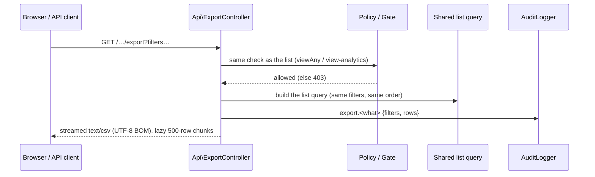

# 31 — CSV Exports Report

- **Date:** 2026-10-02
- **Modules extended:** 9.9 Enrollment, 9.18 Invoices & Payments, 9.23 Analytics & Reporting, 9.24 Audit Logs & Security
- **Status:** `[Implemented]` (PDF exports `[Future]`)
- **Depends on:** `docs/15_Enrollment-Report.md`, `docs/23_Invoices-and-Payments-Report.md`,
  `docs/27_Analytics-and-Reporting-Report.md`, `docs/28_Audit-Logs-and-Security-Report.md`

## 1. Scope

Staff can download what they see as a CSV file:

| Export | Rows | Who |
|---|---|---|
| Invoices | every invoice matching the list's search / status / student filters | Super Admin, University Admin |
| Enrollments | every enrollment matching the list's search / semester / section / status / student filters | Super Admin, University Admin, Faculty Admin |
| Audit trail | every entry matching the viewer's search / area / action / actor / date filters, with before / after values as JSON | Super Admin |
| Analytics tables | one table per file: enrollment by program, attendance by course, grade distribution, semester-GPA distribution, results by course (per semester); finance per currency and workload by status (point in time) | Super Admin, University Admin |

Not built: PDF exports, scheduled / emailed reports, exports for other lists
(students, courses…), a Faculty Admin analytics export (analytics is not
unit-scoped yet). Enrollment exports by a Faculty Admin are limited to their
faculty (`docs/32_Faculty-Admin-Scoping-Report.md`).

## 2. Design

- **One query per list.** `InvoiceService::query()`,
  `EnrollmentService::query()` and `AuditLogController::searchQuery()` now
  build the filtered, ordered list; `paginate()` / `search()` paginate it and
  the export streams it, so the file always matches the screen.
  `EnrollmentController::filters()` (API) is the single reader of enrollment
  filters.
- **Same controller for web and API.** `Api\ExportController` serves both the
  session routes (`/invoices/export`…) and the Sanctum routes
  (`/api/invoices/export`…): the response is the same file. The web routes sit
  in the same role groups as their lists.
- **Streaming.** `App\Support\CsvExport::download()` streams rows from
  `lazy(500)`, so a large table never loads into memory at once.
- **Audited.** Every export writes `export.invoices`, `export.enrollments`,
  `export.audit_logs` or `export.analytics` with the non-empty filters and the
  row count (bulk personal data leaving the system is a sensitive action).
  An audit-trail export is counted before its own entry is written.

### File format

- UTF-8 with a byte-order mark (Khmer names open correctly in spreadsheet
  apps), comma separated, RFC 4180 quoting, first row = headers.
- File names: `invoices-YYYY-MM-DD.csv`, `enrollments-…`, `audit-log-…`,
  `analytics-<table>[-<semester>]-….csv`.
- **CSV injection guard:** a text cell starting with `=`, `+`, `-`, `@`, tab
  or carriage return is prefixed with `'`, so it can never run as a formula.
  Numbers (including negative amounts) are written as numbers.

## 3. Endpoints

| Method | API path | Web path | Notes |
|---|---|---|---|
| GET | `/api/invoices/export` | `/invoices/export` | `search`, `filters[status]`, `filters[student_id]`; 422 on an invalid status |
| GET | `/api/enrollments/export` | `/enrollments/export` | `search`, `filters[student_id|section_id|semester_id|status]` |
| GET | `/api/audit-logs/export` | `/audit-logs/export` | `search`, `filters[area|action|actor_id]`, `from`, `to` |
| GET | `/api/analytics/export` | `/analytics/export` | `table` (required), `semester_id`; 409 when a semester table has no semester; 422 on an unknown table |

### Authorization

| Export | Super Admin | University Admin | Faculty Admin | Lecturer | Student |
|---|---|---|---|---|---|
| Invoices | ✓ | ✓ | 403 | 403 | 403 |
| Enrollments | ✓ | ✓ | ✓ | 403 | 403 |
| Audit trail | ✓ | 403 | 403 | 403 | 403 |
| Analytics | ✓ | ✓ | 403 | 403 | 403 |

## 4. UI

- `components/ExportLink.vue` — a plain `<a>` (not an Inertia link, so the
  browser downloads the file) styled like a small secondary button with a
  download icon.
- `utils/exports.js` — `exportUrl(path, params)` builds the query string;
  nested `filters` become `filters[key]`.
- Invoices, Enrollments and Audit logs: **Export CSV** in the page header,
  using the *applied* filters (what the list shows, not unsubmitted input).
- Analytics: a **CSV** link on each chart / table card for the selected
  semester, plus **Finance CSV** and **Workload CSV** beside "Current
  workload".

## 5. Tests

`tests/Feature/Exports/CsvExportTest.php`:

- cell neutralization and typing (formulas, numbers, null, booleans, Khmer);
- invoices: headers, BOM, content type and file name, filter by status,
  formula title neutralized, audit entry with filters and row count, Faculty
  Admin / student 403, invalid filter 422, web route;
- enrollments: Faculty Admin allowed, status + search filters, audit entry,
  student 403, web route;
- audit trail: Super Admin only (API and web), area filter, JSON values, the
  export audits itself;
- analytics: 409 without a semester, every table downloads, unknown table
  422, Faculty Admin 403, one audit entry per export.

Full suite: 394 passed. Swagger regenerated; route list and Swagger match
(215 operations).

## 6. Decisions

- **CSV only.** Opens in every spreadsheet app and needs no new dependency;
  PDF reports stay `[Future]`.
- **No row cap.** Streaming keeps memory flat; the lists are bounded by the
  institution's size. Revisit if an export ever takes longer than the request
  timeout.
- **Filters are validated exactly as the lists validate them**, so an export
  cannot reach rows the list could not show.
