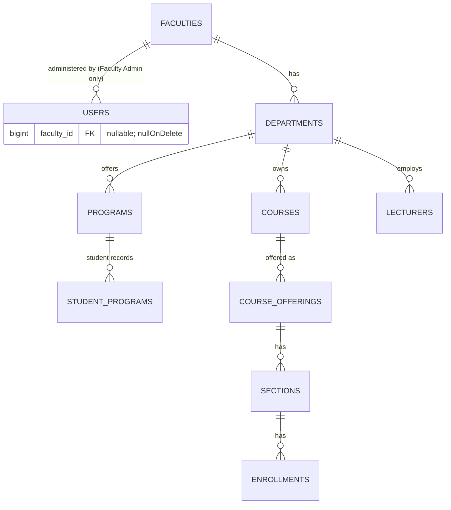
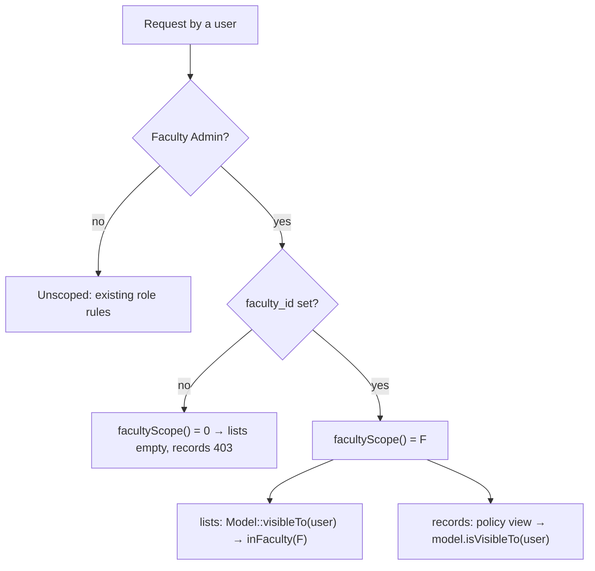

# 32 — Faculty Admin Unit Scoping Report

- **Date:** 2026-10-02
- **Scope:** cross-cutting authorization (`skills/authorization`: Faculty / Department Admin works "within their assigned faculty or department only")
- **Status:** `[Implemented]` (read-only scoping; unit-level write access `[Future]`)
- **Schema change:** `users.faculty_id` (migration `2026_10_02_120000_add_faculty_id_to_users`)

## 1. Scope

Until now a Faculty Admin could read every faculty's data, because the user
record had no unit (`docs/7_Faculty-and-Department-Report.md` §9 decision 1).
Now:

- A Super Admin / University Admin assigns **one faculty** to a Faculty Admin
  account (Users screen or `faculty_id` on the users API).
- A Faculty Admin **reads only their faculty's data**: lists contain only
  their records and opening another faculty's record returns `403`.
- A Faculty Admin **without a faculty sees no unit data** (fail closed).
- Faculty Admins **stay read-only** in this step, as agreed with the project
  owner. Handling their students' requests followed in
  `docs/33_Faculty-Admin-Request-Handling-Report.md`; sections and schedules for their unit are `[Future]`.
- Every other role is unaffected.

Not scoped (shared reference data, readable as before): university, rooms,
academic years / semesters, grading scale, internship companies, document
types, announcements (audience-based already).

Not built: department-level admins (scope is one faculty), several faculties
per admin, Faculty Admin analytics (still managers only), unit-level writes.

## 2. Data model

`users.faculty_id` — nullable FK → `faculties.id`, `ON DELETE SET NULL`,
index `idx_users_faculty`. Only a Faculty Admin may hold a value
(`prohibited` otherwise); a full user update without it (or a role change)
clears it. Deleting a faculty unassigns its admins, who then see nothing.

## 3. Ownership rules

`App\Support\FacultyScope` holds the id subqueries; each unit-owned model
uses `App\Models\Concerns\BelongsToFaculty` and defines `scopeInFaculty`.

| Record | Belongs to faculty F when… |
|---|---|
| faculty | it is F |
| department | `faculty_id = F` |
| program, course, lecturer | its department is in F |
| course offering, section | its course is in F |
| student | any of their program records (`student_programs`) is a program of F |
| enrollment | its section's course is in F **or** its student is in F |
| document request, internship | its student is in F |
| assignment, attendance, exam, grade sheet (section level) | the section is in F |
| a student's grades / GPA / attendance / exams / timetable / dashboard | the student is in F |

A student who changed program stays visible to every faculty they studied in
(their history is part of each unit's record).

## 4. Enforcement points

- **`User::facultyScope()`** — `null` (no limit) for every role but Faculty
  Admin; their faculty id, or `0` when none is assigned.
- **Lists** — `visibleTo($request->user())` in: faculties, faculties tree,
  departments, programs, courses, lecturers, students, course offerings,
  enrollments (list + CSV export), document requests, internships, the grade
  approvals queue (`/grades`), and the web filter / form option lists
  (faculties, departments, programs, courses). Services take an optional
  `?User $viewer` (`paginate($filters, $viewer)`); callers pass the request user.
- **Records** — policies combine the role check with `isVisibleTo`:
  `FacultyPolicy`, `DepartmentPolicy`, `ProgramPolicy`, `CoursePolicy`,
  `LecturerPolicy`, `StudentPolicy`, `CourseOfferingPolicy` (also guards
  sections and schedules), `EnrollmentPolicy`, `DocumentRequestPolicy`,
  `InternshipPolicy`; section- and student-level checks in `AssignmentPolicy`,
  `AttendancePolicy`, `ExamPolicy` and `GradePolicy` use the new
  `ChecksSectionTeaching::staffOver()` / `staffOverStudent()`.
  `GradePolicy::viewConfig` now takes the course.
- Endpoints that authorize through these policies inherit the scope, e.g.
  student timetable / dashboard / grades / GPA, lecturer timetable and
  sections, submission and internship-report downloads, document downloads.
- **Form options (fixed 2026-10-03)** — pages a Faculty Admin may open also
  carry option lists for forms only managers use. Those lists are
  university-wide, so they are now sent only when the policy allows the
  action, and are empty for a Faculty Admin:

  | Page | Prop | Sent when |
  |---|---|---|
  | `/enrollments` | `students`, `openSections` (enroll form) | `can('create', Enrollment::class)` |
  | `/offerings/{offering}` | `lecturers` (assign to section) | `can('update', $offering)` |
  | `/lecturers` | `unlinkedAccounts` (link existing account) | `can('create', Lecturer::class)` |
  | `/students` | `unlinkedAccounts` (link existing account) | `can('create', Student::class)` |

  The audit after the first release found the first two; reviewing the fix
  found the other two. Rule for new pages: any prop that lists records for a
  form must be gated by the same ability as the form's action.

## 5. API and UI

No new endpoints. Changed contracts:

| Endpoint | Change |
|---|---|
| `POST /api/users`, `PUT|PATCH /api/users/{user}` | optional `faculty_id` (Faculty Admin role only; 422 otherwise) |
| `GET /api/users`, `GET /api/users/{user}` and write responses | `faculty_id`, `faculty` (name) |
| every list / record endpoint above | results limited for a Faculty Admin (403 on other faculties' records) |

UI: the Users create / edit forms show a **Faculty** select when the role is
Faculty Admin (empty = "No faculty (sees no unit data)"); the users list
shows the faculty under the role. The Faculty Admin dashboard names their
faculty, or says none is assigned.

## 6. Authorization matrix (Faculty Admin)

| Data | Own faculty | Other faculty | No faculty assigned |
|---|---|---|---|
| Structure (faculty, departments, programs) | read | 403 / not listed | nothing |
| Courses, offerings, sections, lecturers | read | 403 / not listed | nothing |
| Students and their academic records | read | 403 / not listed | nothing |
| Enrollments (list, record, CSV) | read | 403 / not listed | nothing |
| Document requests, internships | read | 403 / not listed | nothing |
| Process document requests (not revoke) and internships (not companies) | ✓ (report 33) | 403 | 403 |
| Any other create / update / approve | 403 | 403 | 403 |
| University, rooms, semesters, grading scale, companies | read | read | read |

## 7. Tests

- `tests/Feature/FacultyDepartment/FacultyAdminScopingTest.php` — faculty
  assignment rules (API + web, audit, prohibited for other roles, cleared on
  role change), structure / people lists and records scoped, academic
  activity scoped by course faculty (offerings, sections, schedules, grade
  sheets, enrollments, approvals queue), unassigned admin sees nothing while
  shared reference data stays readable, dashboard text, faculty deletion
  unassigns, and (`test_manager_only_form_options_are_not_sent_to_faculty_admins`)
  the four form-option props above are empty for a Faculty Admin but still
  sent to managers.
- Existing role tests (assignments, attendance, courses, documents,
  enrollments, exams, CSV export, grades, internships, lecturers, offerings,
  programs, student dashboard, students) now assign the fixture's faculty
  and also assert `403` / empty lists for another faculty's admin.
- `Tests\TestCase` helpers: `facultyAdminFor()`, `facultyOfSection()`,
  `placeInFaculty()`.

Full suite: 399 passed at release; 400 with the form-options fix. Swagger
regenerated; route list and Swagger match (215 operations).

## 8. Decisions

- **Faculty, not department.** One `faculty_id` covers the "Faculty /
  Department Admin" role; a department-level admin is `[Future]`.
- **Fail closed.** An unassigned Faculty Admin gets empty lists and `403`s
  rather than the old university-wide read.
- **Explicit viewer, not a global scope.** Lists pass the request user to the
  service; a global Eloquent scope would also hide rows from queued jobs,
  seeders and admin-side lookups.
- **Enrollment ownership is either side.** A unit sees registrations in its
  courses and its students' registrations elsewhere.
- **Read-only stays.** Write access in scope was deferred by the project owner.
