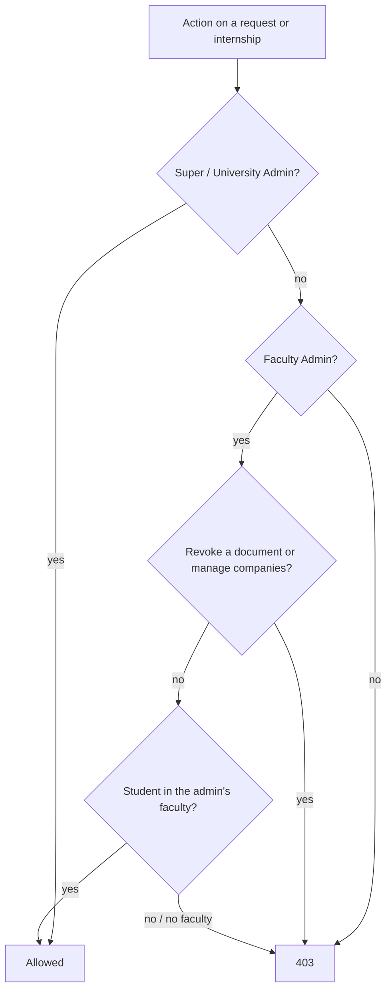

# 33 — Faculty Admin Request Handling Report

- **Date:** 2026-10-03
- **Scope:** Faculty / Department Admin unit-level writes, first step: handling their students' requests
- **Status:** `[Implemented]` (sections / schedules for their unit `[Future]`)
- **Depends on:** `docs/32_Faculty-Admin-Scoping-Report.md` (faculty assignment and scoping),
  `docs/22_Documents-and-Verification-Report.md`, `docs/26_Internship-Management-Report.md`
- **Schema change:** none

## 1. Scope

Report 32 limited a Faculty Admin's *reads* to their faculty and kept them
read-only. This step gives them the unit-level request handling the business
overview (§8.3 "handle unit-level requests") and the module skills describe
(`skills/documents` §8: "Faculty-Dept Admin: process requests for their
scope"; `skills/internship` §8: "Staff (Univ/Faculty Dept Admin):
review/approve and evaluate"):

| Area | A Faculty Admin may now… | Still managers only |
|---|---|---|
| Document requests | approve, reject (with reason), generate the PDF — for their faculty's students | revoke an issued document |
| Internships | review, approve, reject, start, complete, cancel (early termination), edit the placement, review reports, record evaluations — for their faculty's students | create / edit host companies |

"Their faculty's students" uses the ownership rule of report 32: a student
belongs to every faculty they have a program record in. An unassigned
Faculty Admin still processes nothing. Every other role is unchanged.

Not built: Faculty Admin creating sections and schedules for their unit,
notifying Faculty Admins of new requests from their students (they see them in
the queue), department-level admins.

## 2. Authorization

| Ability | Super / University Admin | Faculty Admin, own faculty's student | Faculty Admin, other student or no faculty | Lecturer | Student |
|---|---|---|---|---|---|
| Document: approve / reject / generate | ✓ | ✓ | 403 | 403 | 403 |
| Document: revoke | ✓ | 403 | 403 | 403 | 403 |
| Internship: review / approve / reject / start / complete / cancel / edit | ✓ | ✓ | 403 | 403 | own: submit, withdraw, edit draft |
| Internship: evaluate, review reports | ✓ | ✓ | 403 | 403 | 403 |
| Internship companies: create / update | ✓ | 403 | 403 | 403 | 403 |

### Policy changes

- `DocumentRequestPolicy::process(User, DocumentRequest)` — managers, or a
  Faculty Admin when `$request->isVisibleTo($user)`. The request is now a
  **required** argument: a class-level check would be university-wide, so any
  call site left on `DocumentRequest::class` fails loudly instead of granting
  access. New `processAny(User)` (queue shows processing actions: managers, or
  a Faculty Admin with a faculty) and `revoke(User)` (managers only).
- `InternshipPolicy::process(User, Internship)` — same rule, instance
  required. New `manageCompanies(User)` (managers only) replaces `process`
  on the company endpoints.
- Controllers authorize the record: `authorize('process', $documentRequest)`,
  `authorize('process', $internship)`, `authorize('process',
  $report->internship)`; the API transition endpoint's `$manager` flag is
  per internship.
- Web routes: approve / reject / generate, internship evaluations and report
  review moved into a `super-admin,university-admin,faculty-admin` group;
  revoke and company routes stay in the managers' group. The API groups
  already admitted the role; the policies decide.

Services are unchanged: `processed_by`, the audit trail
(`document_request.*`, `internship.*`, actor = the signed-in user) and the
student notifications work the same for a Faculty Admin.

## 3. Endpoints

No new endpoints. Changed authorization (OpenAPI 403 descriptions updated):

| Method | Path | Before | Now |
|---|---|---|---|
| POST | `/api/document-requests/{documentRequest}/approve` · `/reject` · `/generate` | managers | managers, or the student's Faculty Admin |
| POST | `/api/documents/{document}/revoke` | managers | managers (unchanged; now its own `revoke` ability) |
| PUT, PATCH | `/api/internships/{internship}` | student (draft) or managers | student (draft), managers, or the student's Faculty Admin |
| POST | `/api/internships/{internship}/{action}` (manager actions) | managers | managers, or the student's Faculty Admin |
| POST | `/api/internships/{internship}/evaluations` | managers | managers, or the student's Faculty Admin |
| POST | `/api/internship-reports/{report}/review` | managers | managers, or the student's Faculty Admin |
| POST, PUT, PATCH | `/api/internship-companies…` | managers | managers (unchanged; `manageCompanies`) |

Web equivalents: `/document-requests/{id}/approve|reject|generate`,
`/internships/{id}/{action}`, `/internships/{id}/evaluations`,
`/internship-reports/{id}/review` (Faculty Admin added);
`/documents/{id}/revoke` and `/internship-companies…` (managers only).

## 4. UI

- **Document requests** (`/documents`): `canProcess` comes from
  `processAny`; a new `canRevoke` hides the revoke icon from Faculty Admins.
  The description tells a Faculty Admin they process their faculty's students'
  requests and that revoking is done by a University Admin.
- **Internship** (`/internships/{id}`): `canProcess` is now evaluated for that
  internship, so the review / approve / reject / start / complete / cancel /
  edit icons, report review and the evaluations card appear for the student's
  Faculty Admin. **Companies** (`/internship-companies`): `canManage` comes
  from `manageCompanies` (false for Faculty Admins).
- **Faculty Admin dashboard**: names the faculty and says they process its
  students' document requests and internships.

## 5. Tests

`tests/Feature/FacultyDepartment/FacultyAdminRequestHandlingTest.php`:

- documents — the queue shows only their faculty's requests with
  `canProcess` and without `canRevoke`; approve (processed by and audited as
  the Faculty Admin, student notified) and generate; revoke refused (API and
  web) while a manager may; another faculty's student refused on approve /
  reject (API and web) and left pending; web reject for their own student; an
  unassigned Faculty Admin sees nothing and is refused;
- internships — review → approve → start (audited as the Faculty Admin,
  student notified), faculty evaluation, report review, placement edit, show
  page `canProcess`; another faculty's student refused on review / evaluate /
  edit / web approve and left submitted; company create refused (API and web)
  and `canManage` false; web reject with a reason; unassigned admin refused.

Updated: `DocumentTest::test_role_matrix_and_listing_scope` (own-faculty
admin approves, another faculty's admin gets 403) and
`InternshipTest::test_access` (another faculty's admin 403; own-faculty admin
passes authorization, a draft cannot be reviewed: 409).

Full suite: 402 passed. Swagger regenerated; route list and Swagger match
(215 operations).

## 6. Decisions

- **Instance-required abilities.** `process` takes the record so that scope
  cannot be skipped; missed call sites fail with an error in tests rather than
  silently allowing every request in the university.
- **Revoke stays with managers.** Issuing a document is unit-level work;
  invalidating an official document that third parties may have verified is
  an institution-level correction.
- **Companies stay shared.** Host companies are reference data used by every
  faculty, so only managers create or edit them.
- **No new notifications.** Faculty Admins find their students' new requests
  in the scoped queues; notifying them is a possible follow-up.
