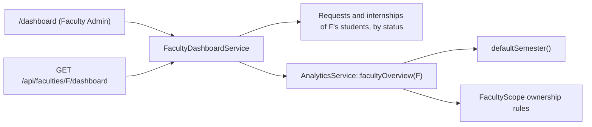
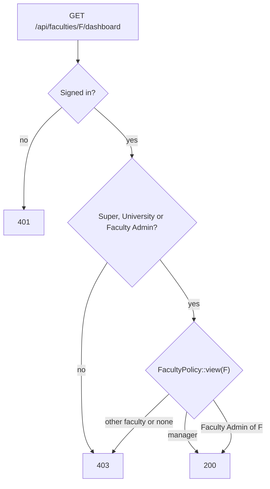
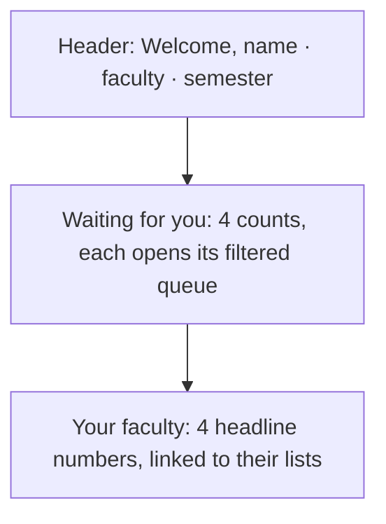

# 34 — Faculty Admin Dashboard Report

- **Date:** 2026-10-03
- **Scope:** a working dashboard for Faculty / Department Admins: the requests waiting for them and their faculty's headline numbers
- **Status:** `[Implemented]` (Lecturer and University Admin dashboards are still previews)
- **Depends on:** `docs/32_Faculty-Admin-Scoping-Report.md` (ownership rules),
  `docs/33_Faculty-Admin-Request-Handling-Report.md` (the work they process),
  `docs/27_Analytics-and-Reporting-Report.md` (number definitions)
- **Schema change:** none

## 1. Scope

A Faculty Admin's `/dashboard` used to be the shared role preview: a title,
one sentence and five area names, with no data. Nothing told them that a
student of their faculty had requested a document or submitted an internship,
although report 33 made them the people who process those.

The dashboard now shows, for their assigned faculty:

| Row | Card | Counts | Opens |
|---|---|---|---|
| Waiting for you | Requests to approve | document requests `pending` | `/documents?filters[status]=pending` |
| | PDFs to generate | document requests `approved` (PDF not generated yet) | `/documents?filters[status]=approved` |
| | Applications to review | internships `submitted` | `/internships?filters[status]=submitted` |
| | Decisions to make | internships `under_review` | `/internships?filters[status]=under_review` |
| Your faculty | Active students | its students with status `active` | `/students?filters[status]=active` |
| | Active lecturers | active lecturers of its departments | `/lecturers?filters[is_active]=1` |
| | Sections | running sections of its courses this semester | `/offerings?semester_id=…` |
| | Students enrolled | its students with an open or completed enrollment this semester | `/enrollments?semester_id=…` |

The same data is served by `GET /api/faculties/{faculty}/dashboard`, which
managers may call for any faculty.

Not built: dashboards for Lecturers and University Admins (still the
preview), email / Telegram notices of new requests, the analytics page for
Faculty Admins.

## 2. How the numbers are computed

- **Ownership** follows `App\Support\FacultyScope` (report 32): a student
  belongs to the faculty through any program record in it, a lecturer through
  their department, a section through its course. The waiting counts cover
  the same records the Faculty Admin's queues list.
- **Semester** is the analytics default: the open semester with the latest
  start, else the latest one. Without any semester the semester figures are
  `null` (shown as "—") and the cards do not link.
- **Shared definitions.** `AnalyticsService::facultyOverview()` reuses the
  helpers of `overview()`: running sections are those not draft or archived;
  counted enrollments are pending, confirmed or completed. The faculty
  numbers therefore match the university-wide analytics.
- **Students enrolled** counts the faculty's own students wherever they study
  (distinct students). The enrollments list it opens also shows other
  faculties' students in its sections (report 32 visibility), so the list can
  hold more rows than the number.
- Waiting counts are point in time; everything is computed live, no cache.

## 3. Authorization

| Who | `/dashboard` | `GET /api/faculties/{faculty}/dashboard` |
|---|---|---|
| Super Admin | uses `/admin/dashboard` (unchanged) | any faculty |
| University Admin | role preview (unchanged) | any faculty |
| Faculty Admin with a faculty | faculty dashboard | own faculty; 403 for others |
| Faculty Admin without a faculty | faculty dashboard saying none is assigned | 403 |
| Lecturer, Student | unchanged | 403 |

`DashboardController::roleDashboard` renders `FacultyAdmin/Dashboard` for a
Faculty Admin with `dashboard` = their faculty's data, or `null` without one.
The API reuses `FacultyPolicy::view`, which already limits a Faculty Admin to
their own faculty; no new ability was needed.

## 4. Endpoints

| Method | Path | Change | Access |
|---|---|---|---|
| GET | `/api/faculties/{faculty}/dashboard` | new (`FacultyDashboard` schema) | Sanctum + Super / University Admin, or the faculty's Faculty Admin |
| GET | `/dashboard` (web) | Faculty Admin now gets `FacultyAdmin/Dashboard` | unchanged route |

## 5. UI

`frontend/src/pages/FacultyAdmin/Dashboard.vue`:

- Two titled rows of four `StatCard`s in the overview KPI pattern
  (`docs/branding/UI-COMPONENTS.md` §9): no icons, one detail line, linked,
  staggered entrance, one column on phones. Zero counts stay visible so the
  admin can see that nothing is waiting.
- Without a faculty: an `EmptyState` asking them to have a Super Admin assign
  one.
- No new component. `RoleDashboard.vue` stays for Lecturers and University
  Admins.

## 6. Tests

`tests/Feature/FacultyDepartment/FacultyAdminDashboardTest.php`:

- counts only their faculty — active, suspended and other-faculty students;
  a student enrolled twice counted once and another faculty's student in
  their section not counted; active, inactive and other-faculty lecturers; a
  draft section not counted; pending, approved, generated and other-faculty
  requests; submitted, under-review, draft and other-faculty internships. The
  web props and the API agree; another faculty's dashboard is 403; a Super
  Admin reads the other faculty with its own numbers;
- access — 401 signed out; without a semester the semester figures are null;
  an unassigned Faculty Admin gets no data and 403 from the API; Lecturers
  and Students get 403; a University Admin reads the API and keeps the
  preview page.

Updated: `FacultyAdminScopingTest::test_unassigned_faculty_admin_sees_nothing`
checks the dashboard props instead of the preview text.

Full suite: 404 passed. Swagger regenerated; route list and Swagger match
(216 operations).

## 7. Decisions

- **Counts, not notifications.** Without an in-app inbox, an email or
  Telegram message per request would be noise for approvers; live counts on
  the page they land on cost nothing. Notices stay `[Open]`.
- **One definition per number.** The faculty figures come from
  `AnalyticsService` helpers shared with the analytics page and from the
  ownership rules of `FacultyScope`, so the two cannot drift.
- **Students enrolled follows the students.** It answers "how many of our
  students study this semester"; teaching figures (sections) follow the
  faculty's courses.
- **API on the faculty resource.** `/api/faculties/{faculty}/dashboard`
  mirrors `/api/students/{student}/dashboard` and lets managers read any
  faculty with the existing `view` ability.
- **University Admin left as is.** Their dashboard is still the preview; the
  same workload view, university-wide, is the natural next step.
