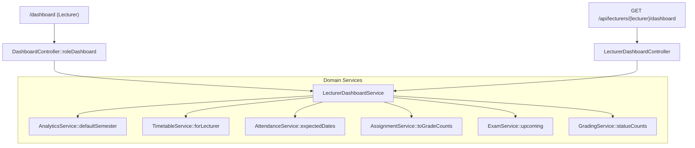
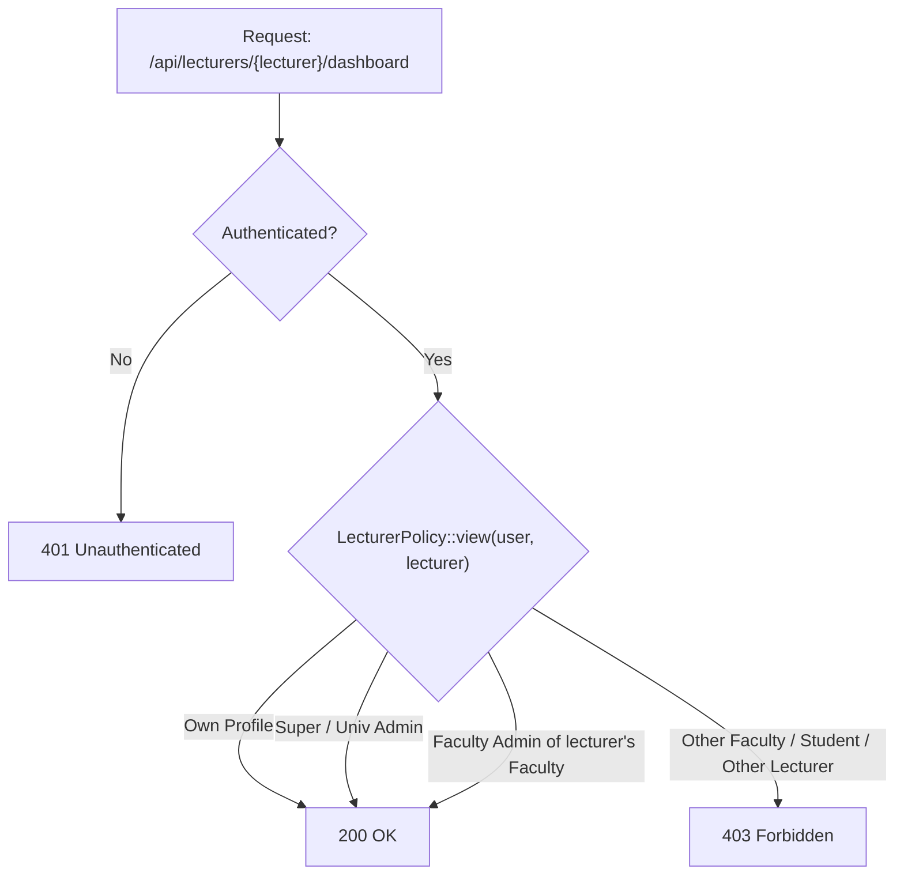

# 35 — Lecturer Dashboard Report

- **Date:** 2026-10-03
- **Scope:** a working teaching dashboard for Lecturers: today's classes, registers waiting to be taken, submissions to grade, upcoming exams, and grade-sheet progress for their sections in the current semester
- **Status:** `[Implemented]`
- **Depends on:** `docs/12_Lecturer-Management-Report.md` (lecturer profiles and assigned sections),
  `docs/16_Timetable-Report.md` (timetable slots and day-of-week schedule),
  `docs/17_Attendance-Report.md` (attendance sessions and expected class dates),
  `docs/18_Assignments-Report.md` (assignment submissions and grading queues),
  `docs/19_Examinations-Report.md` (scheduled exams),
  `docs/20_Grades-and-GPA-Report.md` (section grade-sheet statuses),
  `docs/27_Analytics-and-Reporting-Report.md` (current semester selection)
- **Schema change:** none

---

## 1. Scope

A Lecturer's `/dashboard` previously showed a static role preview: a title, one sentence, and five bullet points with no live data. They had to visit separate pages (`/attendance`, `/coursework`, `/exams`, `/grades`) to check which classes met today, which registers were missed, which assignments needed grading, and the state of their grade sheets.

The dashboard now provides a complete operational view of the lecturer's teaching workload for the current semester:

| Section / Card | Metric / Content | Source | Primary Action |
|---|---|---|---|
| **Teaching at a glance** | Classes today | `TimetableService::forLecturer` filtered to current day of week | `/timetable` |
| | Registers to take | `AttendanceService::expectedDates` unrecorded count | `/attendance` |
| | Submissions to grade | `AssignmentService::toGradeCounts` (`submitted` + `late`) | `/attendance` |
| | Upcoming exams | `ExamService::upcoming` from today onwards | `/attendance` |
| **Today's classes** | List of today's scheduled meetings (time, course, section, room) | `TimetableService` | "Take attendance" (`/attendance/sections/{id}`) |
| **Upcoming exams** | Up to 5 exams scheduled from today onwards with publication status | `ExamService` | "Open exams" (`/exams/sections/{id}`) |
| **Your sections** | Full table of sections taught this semester with student count, registers to take, to-grade submissions, and grade-sheet progress badge | `LecturerDashboardService` | Direct icon buttons for Attendance, Assignments, Exams, and Grade sheet |

The same dataset is exposed via `GET /api/lecturers/{lecturer}/dashboard`, consumable by mobile apps or staff reviewing lecturer activity.

---

## 2. Architecture & Data Flow

### Business Rules & Service Re-use
1. **Semester Scope:** Relies on `AnalyticsService::defaultSemester()` to identify the current semester (the open semester with the latest start, or the latest semester). If no semester exists, empty collections are returned safely.
2. **Date Boundaries:** Uses `Semester::covers(Carbon $day)` to ensure "Classes today" only displays timetable slots when the current date falls within the semester's calendar window.
3. **Missing Registers:** Leverages `AttendanceService::expectedDates($section)` comparing past scheduled meeting dates against held sessions to determine untaken registers.
4. **Grading Backlog:** Leverages `AssignmentService::toGradeCounts(array $sectionIds)` aggregating submissions with status `submitted` or `late` across the lecturer's sections in a single query.
5. **Exam Timeline:** Leverages `ExamService::upcoming(array $sectionIds)` retrieving exams scheduled on or after today (`scheduled_date >= Carbon::today()`).
6. **Grade Sheet States:** Maps `GradingService::statusCounts()` into standardized status labels: `no_students`, `not_started`, `draft`, `submitted`, `approved`, and `finalized`.

---

## 3. Authorization Matrix

| Role | Web `/dashboard` | API `/api/lecturers/{lecturer}/dashboard` |
|---|---|---|
| **Lecturer (with profile)** | Renders `Lecturer/Dashboard` with live teaching data | 200 for own profile; 403 for others |
| **Lecturer (unlinked account)** | Renders empty state card prompting admin linking | 404 (no lecturer record) |
| **Faculty Admin** | Renders own `FacultyAdmin/Dashboard` | 200 for lecturers in own faculty; 403 for other faculties |
| **Super Admin / Univ Admin** | Renders `Admin/Dashboard` / `RoleDashboard` | 200 for any lecturer |
| **Student** | Renders `Student/Dashboard` | 403 Forbidden |

---

## 4. Endpoints

| Method | Path | Description | Access |
|---|---|---|---|
| `GET` | `/dashboard` | Web Inertia route rendering `Lecturer/Dashboard` for authenticated lecturers | Signed-in Lecturer |
| `GET` | `/api/lecturers/{lecturer}/dashboard` | Returns JSON payload conforming to `LecturerDashboard` schema | Sanctum + Lecturer (self) or authorized staff |

---

## 5. UI Implementation

- **Location:** `frontend/src/pages/Lecturer/Dashboard.vue`
- **Branding & Tokens:** Built using design tokens, semantic borders, and dark mode variants (`dark:text-dark-ink`, `dark:border-dark-border`).
- **Icons & Actions:** Adheres to `UI-COMPONENTS.md` §2 icon button standards with accessible tooltip labels:
  - `UserCheck` (primary): Take attendance
  - `ClipboardList`: View section coursework
  - `FileCheck`: View section exams
  - `Award`: View section grade sheet
- **Empty States:** Gracefully handles accounts without a linked lecturer profile, semesters without assigned sections, and days without scheduled classes.

---

## 6. Testing & Verification

Comprehensive automated tests in `backend/tests/Feature/Lecturers/LecturerDashboardTest.php`:
- `test_dashboard_counts_the_lecturers_own_teaching_work`: Asserts correct counting of today's classes, unrecorded attendance sessions, pending assignments, upcoming exams, and section grade sheet states. Confirms other lecturers' sections are excluded.
- `test_access_and_empty_states`: Asserts 401 unauthenticated, 403 forbidden across roles (students, other lecturers, unrelated faculty admins), handling of unlinked profiles, and semesters without scheduled classes.
- Verified test suite: 406 passing tests (3,767 assertions).
- Verified styling: Laravel Pint clean across 577 files.
- Verified build: Frontend `npm run build` succeeds cleanly.
