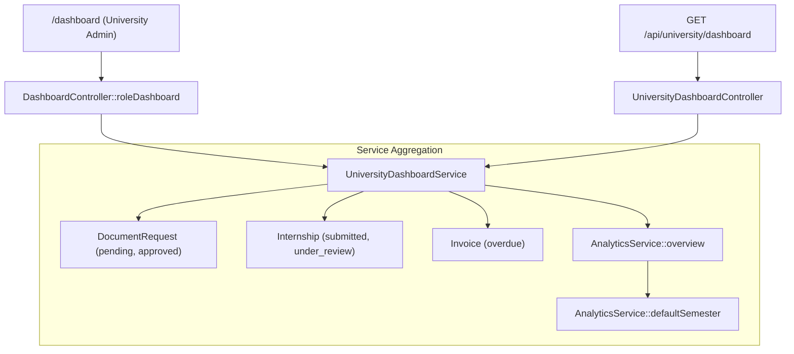
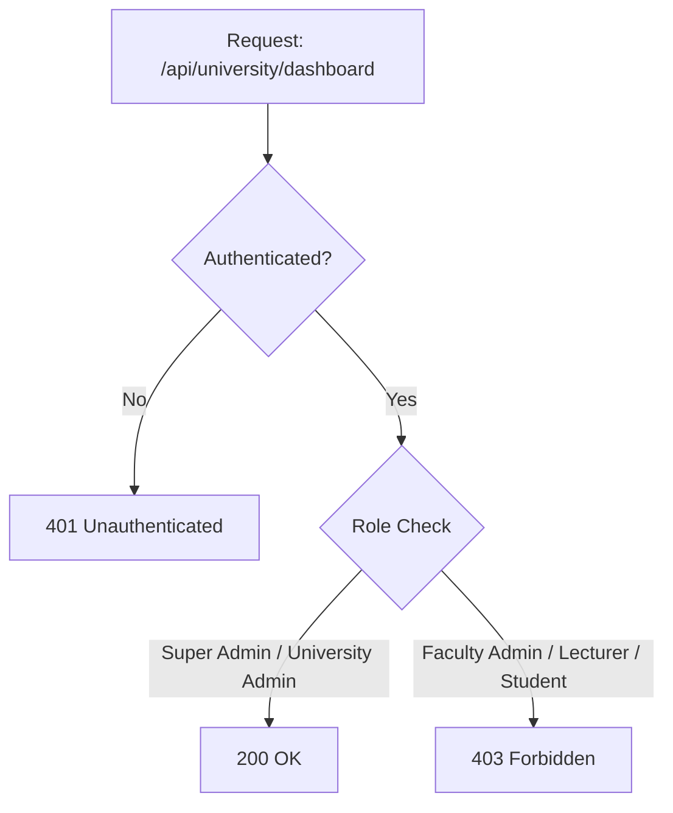

# 36 — University Admin Dashboard Report

- **Date:** 2026-10-03
- **Scope:** a working institutional dashboard for University Administrators: institution-wide action queues (pending document requests, PDFs to generate, internship applications to review/decide, overdue invoices) and university academic headline metrics for the active semester
- **Status:** `[Implemented]`
- **Depends on:** `docs/22_Documents-and-Verification-Report.md` (document request states),
  `docs/23_Invoices-and-Payments-Report.md` (overdue invoice counts),
  `docs/26_Internship-Management-Report.md` (internship review states),
  `docs/27_Analytics-and-Reporting-Report.md` (institution-wide analytics definitions),
  `docs/34_Faculty-Admin-Dashboard-Report.md` (unit-level dashboard companion)
- **Schema change:** none

---

## 1. Scope

A University Admin's `/dashboard` previously rendered a static role preview: a title, one sentence description, and five domain area tags without live counts or operational queue links.

The dashboard now provides complete institutional operational visibility across all faculties and departments:

| Section / Card | Metric / Content | Source | Target Queue |
|---|---|---|---|
| **Waiting for action** | Requests to approve | `DocumentRequest` status `pending` | `/documents?filters[status]=pending` |
| | PDFs to generate | `DocumentRequest` status `approved` | `/documents?filters[status]=approved` |
| | Applications to review | `Internship` status `submitted` | `/internships?filters[status]=submitted` |
| | Decisions to make | `Internship` status `under_review` | `/internships?filters[status]=under_review` |
| | Overdue invoices | `Invoice` status `overdue` | `/invoices?filters[status]=overdue` |
| **Academic overview** | Active students | `Student` status `active` across all programs | `/students?filters[status]=active` |
| | Active lecturers | `Lecturer` `is_active = true` across all departments | `/lecturers?filters[is_active]=1` |
| | Sections running | Running sections in the current semester | `/offerings?semester_id={id}` |
| | Students enrolled | Distinct students enrolled in the current semester | `/enrollments?semester_id={id}` |
| | Attendance rate | Institution-wide attended vs counted class rate | `/analytics` |
| | Pass rate | Percentage of graded courses passing with grade point > 0 | `/analytics` |

The same dataset is served by `GET /api/university/dashboard`, protected by Sanctum and restricted to `super-admin` and `university-admin`.

---

## 2. Architecture & Service Composition

### Business Rules & Calculations
- **Institution-wide Scoping:** Unlike `FacultyDashboardService` which scopes by `FacultyScope`, `UniversityDashboardService` measures institution-wide backlogs across all faculties.
- **Analytics Re-use:** Leverages `AnalyticsService::defaultSemester()` and `AnalyticsService::overview()` directly, ensuring figures exactly match the institutional analytics report.
- **Graceful Empty States:** When no active academic semester exists, semester-dependent metrics safely default to `null` (displayed as `—` on the UI), while static counts (active students, active lecturers, waiting queues) remain available.

---

## 3. Authorization Matrix

| Role | Web `/dashboard` | API `/api/university/dashboard` |
|---|---|---|
| **Super Admin** | Dedicated `/admin/dashboard` | 200 OK |
| **University Admin** | Renders `UniversityAdmin/Dashboard` with live queues | 200 OK |
| **Faculty Admin** | Renders `FacultyAdmin/Dashboard` (unit-scoped) | 403 Forbidden |
| **Lecturer** | Renders `Lecturer/Dashboard` (teaching workload) | 403 Forbidden |
| **Student** | Renders `Student/Dashboard` (academic profile) | 403 Forbidden |

---

## 4. Endpoints

| Method | Path | Description | Access |
|---|---|---|---|
| `GET` | `/dashboard` | Web Inertia route rendering `UniversityAdmin/Dashboard` for authenticated university administrators | Signed-in University Admin |
| `GET` | `/api/university/dashboard` | Returns JSON payload conforming to `UniversityDashboard` schema | Sanctum + Super Admin or University Admin |

---

## 5. UI Implementation

- **Location:** `frontend/src/pages/UniversityAdmin/Dashboard.vue`
- **Branding & Layout:** Built using standard design tokens, animated `StatCard` grids, and semantic headers matching the application design language.
- **Action Links:** Every stat card links directly to its target filtered operational list.

---

## 6. Testing & Verification

Comprehensive automated test coverage in `backend/tests/Feature/UniversityAdmin/UniversityAdminDashboardTest.php`:
- `test_dashboard_counts_institution_wide_waiting_items_and_academic_overview`: Asserts correct counting of pending document requests, approved requests, submitted internships, under-review internships, overdue invoices, and academic totals.
- `test_access_and_empty_states`: Asserts 401 unauthenticated, 403 forbidden for unauthorized roles (student, lecturer, faculty admin), and verifies safe null handling when no semester is active.
- Verification status:
  - All dashboard feature tests passing (University Admin, Faculty Admin, Lecturer, Student, and Login).
  - Laravel Pint clean across 581 files.
  - Frontend production build clean.
