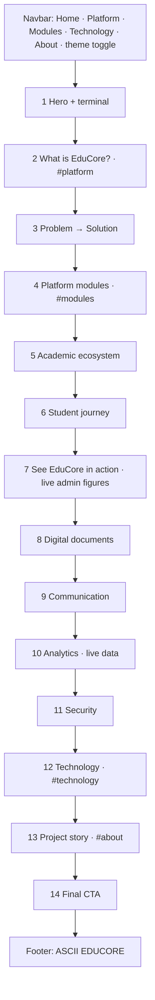
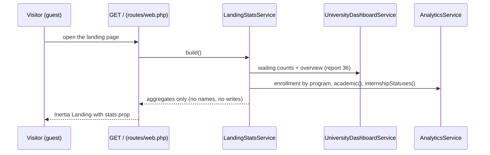
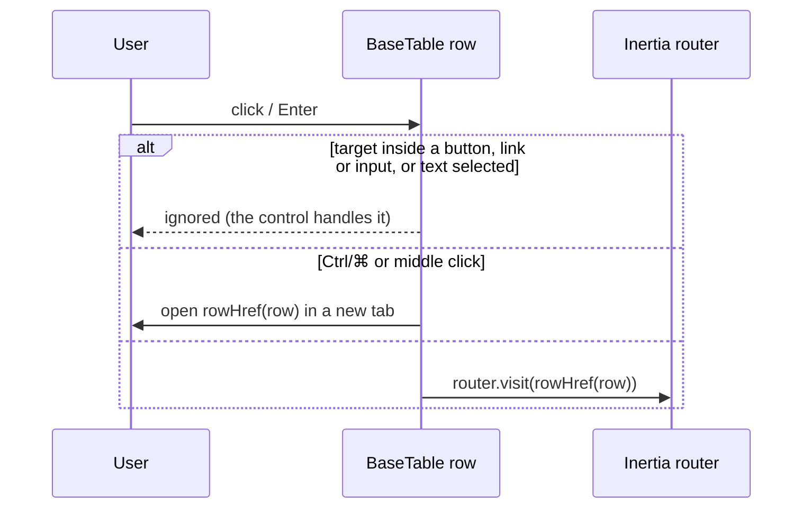

# 37 — Landing Page Redesign, Live Figures & Clickable Table Rows Report

- **Date:** 2026-10-05
- **Scope:** public landing page (`/`) rebuilt section by section, in light and dark themes, with live
  aggregate figures; table rows that open their record instead of a View/`Eye` action; accounts-only
  seeding for a fresh installation
- **Status:** `[Implemented]`
- **Schema:** no change (no migration). **API:** no REST endpoint added or changed; the web route `/`
  passes a new `stats` Inertia prop (`docs/api/api-audit.md`)
- **Design system:** `docs/branding/UI-COMPONENTS.md` §1, §2, §4, §15 and `BRAND-GUIDELINES.md` §10
  updated first

## 1. Goal

A visitor should understand EduCore in about five seconds and see the real product. Every number on
the page comes from the database: an empty installation shows empty states, and inserted records
appear. The previous page had 16 sections with large card grids, stale `[Planned]` labels, fixed
"sample" statistics and a trend chart for a `[Future]` feature.

## 2. Page structure

The navbar's active link is the last linked section above 30% of the viewport, so sections between
two links keep the previous link lit (Home → Platform → Modules → Technology → About).

| # | Section | Component | What it shows |
|---|---|---|---|
| — | Navbar | `LandingNavbar` | Spec links, "Explore Platform" + "Sign In" (`BaseButton`), Sun/Moon theme toggle; transparent over the hero, solid `surface` once scrolled; live-text wordmark; mobile menu (Esc, focus return, scroll lock) |
| 1 | Hero | `HeroSection`, `HeroTerminal` | Headline, one-sentence description, two staggered CTAs, facts line (25 modules · 5 roles · Cambodian focus); a terminal typing the repository's real Makefile commands; slow ambient drift |
| 2 | What is EduCore? | `WhatIsEduCore` | One statement plus six numbered pillars in an editorial list (replaces a 16-card grid) |
| 3 | Problem → Solution | `ProblemSolution` | Five problem chips morph into their five solutions; Before / With EduCore toggle |
| 4 | Platform modules | `ModuleExplorer`, `LandingTabs` | Tabs Academic · Student · Administration · Communication with the brief's modules and the roles that use them |
| 5 | Academic ecosystem | `AcademicEcosystem` | University → … → Student; scroll-linked line, each level lights when reached |
| 6 | Student journey | `StudentJourney` | 11 stages; horizontal from `lg`, vertical below |
| 7 | See EduCore in action | `ProductShowcase`, `DashboardPreview`, `showcaseData.js` | Admin tab: the live University Admin figures. Lecturer / Student tabs: the real layouts with placeholders (personal dashboards) |
| 8 | Digital documents | `DocumentVerification`, `QrMark` | Sample transcript (Student: Rin Nairith), QR scan line, Checking… → Verified; the real four-step flow |
| 9 | Communication | `CommunicationSection` | University → Faculty → Department → Lecturer → Student with a travelling signal; In-app / Email / Telegram; example notifications |
| 10 | Analytics | `AnalyticsSection` (lazy) | Live KPIs, enrollment by program and grade distribution (donuts, ≤ 4 slices), results per course, internships by status; `EmptyState` when there is nothing to show |
| 11 | Security | `SecuritySection` | One row: RBAC, authentication, protected APIs, audit logs, document verification |
| 12 | Technology | `TechnologyStack`, `techLogos.js` | Real logos in a three-row marquee with Pause / Play |
| 13 | Project story | `ProjectStory` | What EduCore is, why it was built, Cambodian focus; team photos (`public/assets/images/people/`) of Rin Nairith and Yong Lyhor |
| 14 | Final CTA | `FinalCTA` | "Ready to explore EduCore?" on navy with one blue glow |
| — | Footer | `LandingFooter` | The ASCII "EDUCORE" wordmark only |

Removed: `TrustSection`, `WhyEduCore`, `AdministrationSection`, `AboutSection`, `PlatformOverview`
and the old footer content. New helpers: `useInView.js`, `LandingTabs.vue`.

## 3. Live figures

| Rule | Implementation |
|---|---|
| Same numbers as the dashboards | Reuses `UniversityDashboardService::build()` and `AnalyticsService` (module 9.23); nothing is re-derived. `AnalyticsService::internshipStatuses()` was extracted so `administrative()` and the landing share it |
| No personal data | Only counts, rates and distributions; `LandingStatsTest` asserts no email, name or student number appears |
| Small groups | Per-course results only from `LandingStatsService::MIN_COURSE_GROUP` (5) approved grades |
| Read-only | `administrative()` refreshes overdue invoices (a write), so the landing does not call it |
| Empty database | Zeros, `null` (shown as "—") and empty lists → `EmptyState`s; the semester label reads "no semester yet" |
| Personal previews | Lecturer / Student tabs show placeholders and "Each lecturer / student sees their own data here after signing in" |

## 4. Theme (light and dark)

The navbar toggle uses `useTheme` — the dashboard's preference (`educore_theme`, falling back to the
system). Every landing token got its documented dark pair (`surface` → `dark-surface`, `ink` →
`dark-ink`, `border-default` → `dark-border`, solid `primary` → `dark-primary` with `dark-bg` text, ...).
Navy sections gain a `dark-border` edge in dark mode; the QR mark stays dark-on-light. Like the
dashboard, the theme is applied when Vue mounts (no pre-render script).

## 5. Truthfulness decisions

| Topic | Decision |
|---|---|
| Figures | Live from the database (section 3); no invented statistics anywhere on the page |
| In-app channel | Described as announcements on the feed and dashboards — the notification inbox is `[Future]` (report 25) |
| Trends | No month-by-month chart: trends over time are `[Future]` (report 27) |
| Stack | JavaScript, not TypeScript |
| Terminal | Real Makefile targets and container names; the test count is a snapshot (411 passing on 2026-10-05), captioned "as of October 2026" |
| Illustrative content | The sample transcript and example notifications are captioned; the QR mark encodes nothing |

## 6. Shared component changes

| Component | Change | Backward compatible |
|---|---|---|
| `BaseTable` | `row-href`: rows open their record via Inertia; Ctrl/⌘ or middle click opens a new tab; Enter on the focused row; clicks on inner controls and text selection are ignored | Yes |
| `charts/PieChart` | Optional `colors` prop (the landing passes the brand chart series) | Yes |
| `useTheme` | Now also used by the landing navbar (doc comment updated) | Yes |

## 7. Clickable table rows

Opening a record is no longer an action: the whole row is the link (`UI-COMPONENTS.md` §4).

| Page | Before | After |
|---|---|---|
| `Invoices/Index`, `Invoices/Mine` | Actions / Details column with `Eye` | row → `/invoices/{id}` |
| `AuditLogs/Index` | Details column with `Eye` | row → `/audit-logs/{id}` |
| `Internships/Index` | Actions column with `Eye` | row → `/internships/{id}` |
| `Grades/Index` | Actions column with `Eye` | row → `/grades/sections/{id}` |
| `Courses/Edit` "Used in programs" | `Eye` per item | each item is a `Link` → `/programs/{id}/edit` |
| `Lecturers/Edit` "Teaching assignments" | `Eye` per item | each item is a `Link` → `/offerings/{id}` |

`Eye` / `EyeOff` remain for publish / release actions. Authorization is unchanged: the destinations
keep their middleware and policies.

## 8. Fresh-installation seeding

`db:seed` now creates the roles, **five accounts — one per role** (`admin@`, `university@`,
`faculty@`, `lecturer@`, `student@educore.kh`, password `<name>@123`, development only), the grading
scale and the document types. No demo records. The demo seeders for announcements, assignments,
attendance, exams, internships and invoices were deleted; the seeders that feature tests load as
fixtures stay but are not run by `db:seed` (`docs/database/seed-strategy.md`). The accounts have no
profile or faculty assignment, so each dashboard opens on its empty state.

## 9. Verification

| Check | Result |
|---|---|
| `php artisan test` | 417 passed after this change (411 before; +4 `LandingStatsTest`, +2 `DatabaseSeederTest`) |
| `vendor/bin/pint --test` | Pass |
| `npm run build` | Pass (the existing > 500 kB chunk warning is unchanged) |
| Headless Chrome, 1440×900 and 390×844, light and dark, every section | No console errors; page width equals the viewport; theme toggle flips and restores the `dark` class |
| Live data against the dev database | Semester, 10 active students, 6 lecturers, 4 programs and 3 internship statuses shown as stored |
| Marquee | Rows 1 and 3 move left, row 2 right; one copy (1416 px) is wider than its row (1032 px) |
| Clickable rows (signed in) | Invoices, Audit logs, Internships: click and Enter open the record; Lecturer / Course edit lists open the offering / program |

## 10. Not done / follow-ups

- The theme is applied after Vue mounts (as on the dashboard), so a dark-mode visitor can see a brief
  light frame on first load.
- Existing demo records in a developer's database stay until `make migrate-fresh && make seed`.
- `lyhor.png` is 500 kB; a resized avatar would load faster (the image is lazy-loaded).
