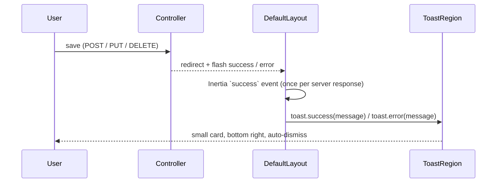

# 38 — Toast Notifications, Accounts-by-Role Pie & Academic Year Fix Report

- **Date:** 2026-10-05
- **Scope:** bottom-right toasts for every save / update; the Super Admin "Accounts by role" chart as a
  pie; a crash on the academic year page after creating a year (and the same latent bug on the
  faculty list)
- **Status:** `[Implemented]`
- **Schema / API:** no change
- **Design system:** `docs/branding/UI-COMPONENTS.md` §1 and §12 ("Feedback toasts") updated first

## 1. Toasts

Controllers already report every mutation with a flash message (`->with('success' | 'error', ...)`,
114 actions). The layout showed it as a full-width banner at the top of the content; it is now a
small toast at the bottom right.

| Piece | Role |
|---|---|
| `composables/useToast.js` | One app-wide queue: `toast.success / error / info`, max 3 visible, success 4s / error 6s, pause on hover or focus, an identical message within 1s shown once |
| `components/ToastRegion.vue` | The stack: `fixed` bottom-right, `w-80`, icon + text + dismiss, `aria-live="polite"`, errors `role="alert"` |
| `layouts/DefaultLayout.vue` | Reads the first page's flash on mount and every later response's flash on Inertia `success`; the banner markup was removed. Browser Back/Forward restores pages without a response, so old messages never replay |
| `pages/AcademicYears/Edit.vue` | Removed an inline `flash.error` block that read an undeclared prop |

Validation errors stay inline under their fields.

## 2. Accounts by role

`pages/Admin/Dashboard.vue` drew its own Chart.js bar chart with off-palette colours. It now uses
the shared `charts/PieChart` (donut, total in the centre, legend with counts and shares, "Show as
table") with five palette tokens, one per role. Links under the chart still open the users list
filtered by role (the old bars were clickable).

## 3. Academic year page crash

Creating an academic year redirects to its edit page, which threw
`Cannot read properties of undefined (reading 'toLowerCase')`.

| Cause | Fix |
|---|---|
| `AcademicYearController::edit` passed `SemesterResource::collection(...)` without `->resolve()`, so Inertia nested it as `{ data: [...] }`; the page iterated the object and rendered a `StatusBadge` with no status | `->resolve()` (the convention the same method already documents for the year itself) |
| Same mistake in `FacultyController::index` for `departments`; the page calls `departments.filter(...)`, which would throw as soon as a faculty exists | `->resolve()` |
| `StatusBadge` crashed the whole page on a missing status | Renders a muted "—" instead |

A scan of every page prop declared `Array` against its controller found no other instance.
`AcademicYearManagementTest` and `FacultyDepartmentManagementTest` now assert a real list item
(`semesters.0.status`, `departments.0.faculty_id`); the old assertions (`semesters.data`,
`departments` count) passed with the broken shape.

## 4. Verification

| Check | Result |
|---|---|
| `php artisan test --filter='AcademicYearManagementTest\|FacultyDepartmentManagementTest'` | 90 passed |
| `vendor/bin/pint --test`, `npm run build` | Pass |
| Browser (signed in as Super Admin) | Saving a user shows "User updated." 24px from the bottom right (320×46), gone after ~5s, no banner; the dashboard renders the role pie; the academic year edit page receives `semesters` as a list and renders without errors |
