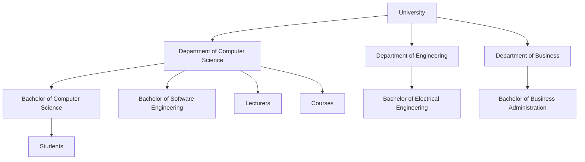
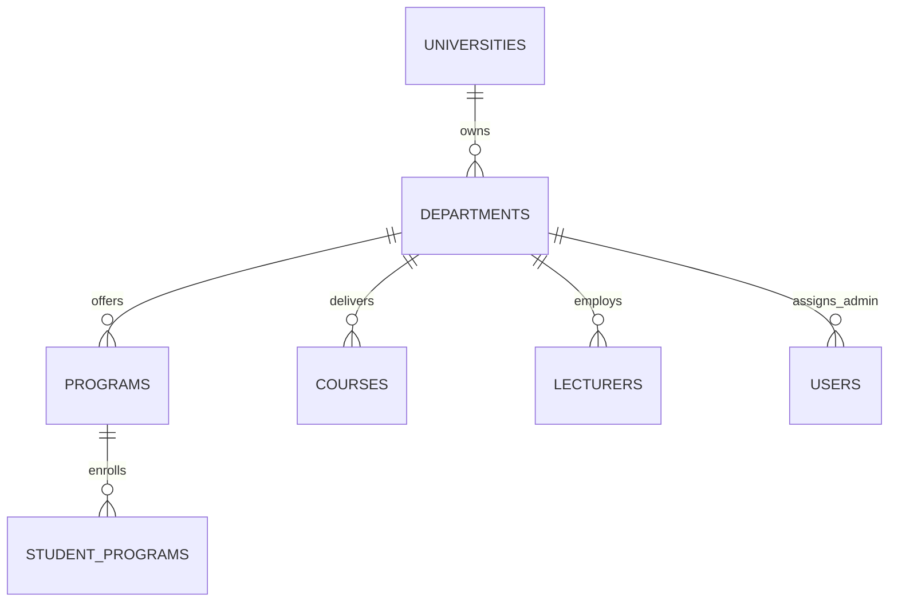

# 39 — Department-Only Academic Structure Report

- **Date:** 2026-10-05
- **Scope:** removal of the faculty level in the academic hierarchy, flattening structure to University → Department → Program; migration of `faculty-admin` to `department-admin`; direct assignment of unit admins to departments via `users.department_id`
- **Status:** `[Implemented]`
- **Depends on:** `docs/7_Faculty-and-Department-Report.md`, `docs/32_Faculty-Admin-Scoping-Report.md`, `docs/33_Faculty-Admin-Request-Handling-Report.md`, `docs/34_Faculty-Admin-Dashboard-Report.md`
- **Schema change:** `2026_10_05_120000_remove_faculty_level.php` (table `faculties` dropped, `departments.university_id` added, `users.faculty_id` replaced by `users.department_id`, internship evaluator constraint updated)

---

## 1. Goal & Architecture Rationale

In the original academic hierarchy (University → Faculty → Department → Program), faculties introduced an extra layer of organizational hierarchy between the university and departments. For most modern institutions and department-first administrative structures, departments operate as the direct academic and operational units under the university.

Removing the faculty tier simplifies the model:
1. **Direct Hierarchy:** `University` → `Department` → `Program` → `Course` / `Student`.
2. **Simplified Administration:** Unit administrators manage a specific department (`department-admin` role, assigned via `users.department_id`).
3. **Streamlined Navigation & UI:** Departments sit directly under Academic Structure in the navigation and top-level admin forms.

---

## 2. Database Migration

Migration `2026_10_05_120000_remove_faculty_level.php` performs the complete transformation:

1. **Departments to University:**
   - Adds `departments.university_id` foreign key referencing `universities(id)`.
   - Backfills `departments.university_id` from parent `faculties.university_id`.
   - Resolves any name collisions across former faculties by appending department code.
   - Drops `departments.faculty_id` foreign key and constraint.
   - Adds unique constraint `uq_departments_university_id_name` on `(university_id, name)`.

2. **Users & Role Mapping:**
   - Replaces `users.faculty_id` with `users.department_id` referencing `departments(id)`.
   - Updates role `roles.slug = 'faculty-admin'` to `'department-admin'` ("Department Admin").

3. **Announcements & Evaluations:**
   - Announcements targeting `audience_type = 'faculty'` are redirected to `'staff'`.
   - Table `internship_evaluations` constraint updated: `evaluator_type IN ('supervisor', 'academic')` (migrating `'faculty'` to `'academic'`).

4. **Dropping Faculties:**
   - Drops the `faculties` table entirely.

---

## 3. Scoping & Authorization

Unit scoping rules previously implemented in `FacultyScope` are now consolidated in `App\Support\DepartmentScope`:

- **Department Admin Scope:** A `department-admin` user is scoped to their assigned `users.department_id`.
  - Unassigned `department-admin` (`department_id === null`) sees zero unit records.
  - Assigned `department-admin` can view their department, its programs, courses, lecturers, student records enrolled in its programs, and operational queues.
- **Request Processing:** Department Admins approve, reject, and generate document requests, and review and evaluate internships for students in their department's programs.
- **Role Policies:**
  - `DepartmentPolicy`: Super Admin and University Admin manage departments; Department Admin can view their own department.
  - `CoursePolicy`, `ProgramPolicy`, `LecturerPolicy`, `StudentPolicy`: Department Admin has scoped view permissions.

---

## 4. Operational Dashboard

The Department Admin dashboard (`frontend/src/pages/DepartmentAdmin/Dashboard.vue`) serves the real-time operational queues and academic overview for the assigned department:

| Section | Metric | Meaning | Filtered Queue Link |
|---|---|---|---|
| **Waiting for you** | Requests to approve | Document requests in `pending` status | `/documents?filters[status]=pending` |
| | PDFs to generate | Document requests in `approved` status | `/documents?filters[status]=approved` |
| | Applications to review | Internships in `submitted` status | `/internships?filters[status]=submitted` |
| | Decisions to make | Internships in `under_review` status | `/internships?filters[status]=under_review` |
| **Your department** | Active students | Students with status `active` in department programs | `/students?filters[status]=active` |
| | Active lecturers | Active lecturers affiliated with the department | `/lecturers?filters[is_active]=1` |
| | Sections | Running sections for courses in the department | `/offerings?semester_id=...` |
| | Students enrolled | Students in department programs enrolled this semester | `/enrollments?semester_id=...` |

---

## 5. Endpoints

| Method | Path | Description | Access |
|---|---|---|---|
| GET | `/departments` | Paginated list of departments (web) | Super Admin, University Admin, Department Admin |
| POST | `/departments` | Create department | Super Admin, University Admin |
| GET | `/departments/{department}/edit` | Department edit form | Super Admin, University Admin |
| PUT | `/departments/{department}` | Update department | Super Admin, University Admin |
| POST | `/departments/{department}/archive` | Archive department | Super Admin, University Admin |
| POST | `/departments/{department}/reactivate` | Reactivate department | Super Admin, University Admin |
| DELETE | `/departments/{department}` | Soft-delete department (guarded against children) | Super Admin, University Admin |
| GET | `/dashboard` | Department Admin dashboard | Authenticated `department-admin` |
| GET | `/api/departments` | List departments API | Sanctum (managers + Department Admin) |
| GET | `/api/departments/{department}` | Show department API | Sanctum (managers + Department Admin) |
| POST | `/api/departments` | Store department API | Sanctum (Super Admin, University Admin) |
| PUT/PATCH | `/api/departments/{department}` | Update department API | Sanctum (Super Admin, University Admin) |
| DELETE | `/api/departments/{department}` | Delete department API | Sanctum (Super Admin, University Admin) |
| GET | `/api/departments/{department}/dashboard` | Department metrics API | Sanctum (managers + assigned Department Admin) |

---

## 6. Verification & Test Suite

All tests pass without failures:
- `Tests\Feature\Departments\DepartmentManagementTest`: 12 passed (lifecycle, unique constraints, delete guards, soft delete).
- `Tests\Feature\Departments\DepartmentAdminScopingTest`: 6 passed (unit assignment, scoping across people and academic activity, unassigned isolation).
- `Tests\Feature\Departments\DepartmentAdminRequestHandlingTest`: 2 passed (document request and internship handling).
- `Tests\Feature\Departments\DepartmentAdminDashboardTest`: 2 passed (live aggregate counts, semester handling, authorization).
- Complete backend suite: **409 tests passed (3,916 assertions)**.
- Code style: `vendor/bin/pint --test` clean.
- Frontend build: `npm run build` clean.
