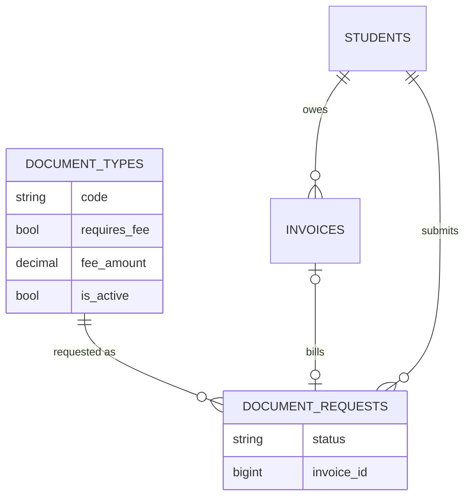
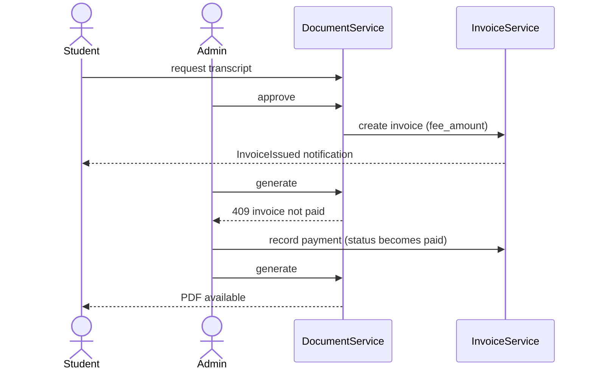

# 40 — Document Fee Billing & Document Type Management

Status: `[Implemented]` (2026-10-05)

## 1. Scope

Closes two open items of modules 9.16 (Documents) and 9.18 (Invoices):

- **Document-fee billing.** `document_types.requires_fee` existed but was never
  acted on. Document types now carry a `fee_amount`; approving a request for a
  fee-bearing type issues an unpaid invoice to the student, and the PDF cannot
  be generated until that invoice is `paid`.
- **Document-type management screen.** Super Admin and University Admin can
  list, create, edit, deactivate and delete document types and their fees at
  `/document-types` (and through `/api/document-types`).

Out of scope: online payment (no gateway, business overview §23), refunds when
a generated document is revoked, and new PDF templates (a new type `code` still
needs a Blade template before it can be generated).

## 2. Schema

Migration `2026_10_05_130000_add_fee_to_document_types_and_requests.php`:

| Table | Column | Type | Notes |
|---|---|---|---|
| `document_types` | `fee_amount` | `decimal(10,2)` default `0` | Billed only when `requires_fee = true` and `fee_amount > 0` |
| `document_requests` | `invoice_id` | `bigint` nullable, FK → `invoices.id` `ON DELETE SET NULL` | Index `idx_document_requests_invoice`, FK `fk_document_requests_invoice` |

Seeded defaults (`DocumentTypeSeeder`, idempotent by `code`):

| Type | `requires_fee` | `fee_amount` |
|---|---|---|
| Enrollment certificate | no | 0.00 |
| Student certificate | no | 0.00 |
| Academic transcript | yes | 10.00 |
| Academic result | yes | 5.00 |
| Internship letter | no | 0.00 |

Existing databases: run `php artisan migrate` and re-run `DocumentTypeSeeder`
to set the fees.

## 3. Models & services

- `DocumentType`: `fee_amount` fillable, cast `decimal:2`.
- `DocumentRequest`: `invoice_id` fillable, `invoice()` BelongsTo.
- `Invoice`: `documentRequest()` HasOne.
- `DocumentService::approve()` — inside the approval transaction, when the type
  requires a fee and none is linked yet, calls `InvoiceService::create()` (one
  item "Fee for {type}", category `document`, USD, due in 14 days) and stores
  `invoice_id`. The usual invoice notification and `invoice.created` audit row
  are produced by `InvoiceService`.
- `DocumentService::generate()` — throws `BusinessRuleException` (HTTP 409 /
  flash error) when the request has an invoice whose status is not `paid`.
- `DocumentTypeService` — paginate / list / create / update / delete with audit
  logging; delete is refused when any request references the type.

## 4. Endpoints

| Method | Path | Who | Notes |
|---|---|---|---|
| GET | `/document-types` (web) | Super Admin, University Admin | Inertia `DocumentTypes/Index` |
| POST / PUT / DELETE | `/document-types[/{documentType}]` (web) | Super Admin, University Admin | Flash success / error |
| GET | `/api/document-types` | Any authenticated | Active types with `requires_fee`, `fee_amount` |
| POST | `/api/document-types` | Super Admin, University Admin | 201 |
| GET | `/api/document-types/{documentType}` | Any authenticated | With `requests_count` |
| PUT/PATCH | `/api/document-types/{documentType}` | Super Admin, University Admin | |
| DELETE | `/api/document-types/{documentType}` | Super Admin, University Admin | 204; 409 if requests exist |

`DocumentRequestResource` now includes `type.requires_fee`, `type.fee_amount`
and an `invoice` summary (`id`, `invoice_number`, `total`, `amount_paid`,
`status`, `due_date`).

## 5. Authorization matrix

| Action | Super Admin | University Admin | Department Admin | Lecturer | Student |
|---|---|---|---|---|---|
| List / view types (API) | ✓ | ✓ | ✓ | ✓ | ✓ |
| Manage types (web screen + API writes) | ✓ | ✓ | ✗ | ✗ | ✗ |
| Approve fee request (issues invoice) | ✓ | ✓ | own department | ✗ | ✗ |
| Record payment on the invoice | ✓ | ✓ | ✗ | ✗ | ✗ |
| See own invoice on request | — | — | — | — | ✓ |

## 6. UI

- `DocumentTypes/Index.vue` — table with fee badge, active state and search;
  create / edit modal; icon-first actions (`IconButton`). Linked under
  Operations → "Document types" for managers.
- `Documents/Index.vue` (staff queue) — fee badge (or "Free") per request,
  linked invoice number with status, and the Generate button disabled with the
  tooltip "Cannot generate: Invoice pending payment" while unpaid.
- `Documents/Mine.vue` (student) — fee notice in the request form and invoice
  number / status on each request.

## 7. Tests

- New `tests/Feature/Documents/DocumentFeeAndTypeTest.php` (7 tests): web
  access matrix, API CRUD and authorization, delete guard (409), invoice issued
  on approval with correct total and item, generation blocked until paid, free
  types issue no invoice, fee metadata on type options and request listings,
  web create / update / delete.
- `tests/Feature/Documents/DocumentTest.php` updated: transcript and academic
  result are now fee-bearing, so the flows assert the 409 and mark the invoice
  paid before generating.

## 8. Decisions

- **Bill on approval, not on submission** — rejected requests never create
  debt, and the reviewer confirms eligibility first.
- **Hard lock on generation** — the PDF is the deliverable, so it waits for full
  payment (`paid`), not `partial`.
- **Cancelled invoices keep the lock.** If an admin cancels the fee invoice the
  request cannot be generated; reject it and let the student re-request. A
  waiver flow is `[Future]`.
- **Fee changes are not retroactive** — an issued invoice keeps the amount it
  was created with.
- **Delete vs deactivate** — a type with history cannot be deleted; set
  `is_active = false` to hide it from new requests.
- API write endpoints carry no OpenAPI annotations yet (`docs/api/api-audit.md`).
