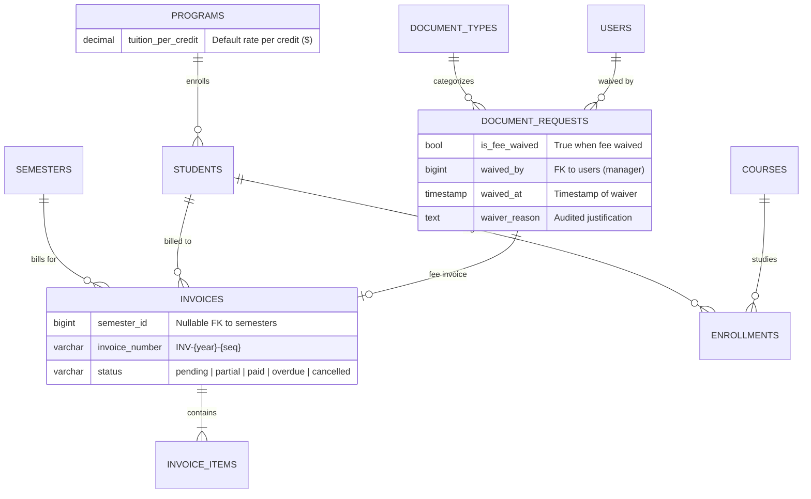
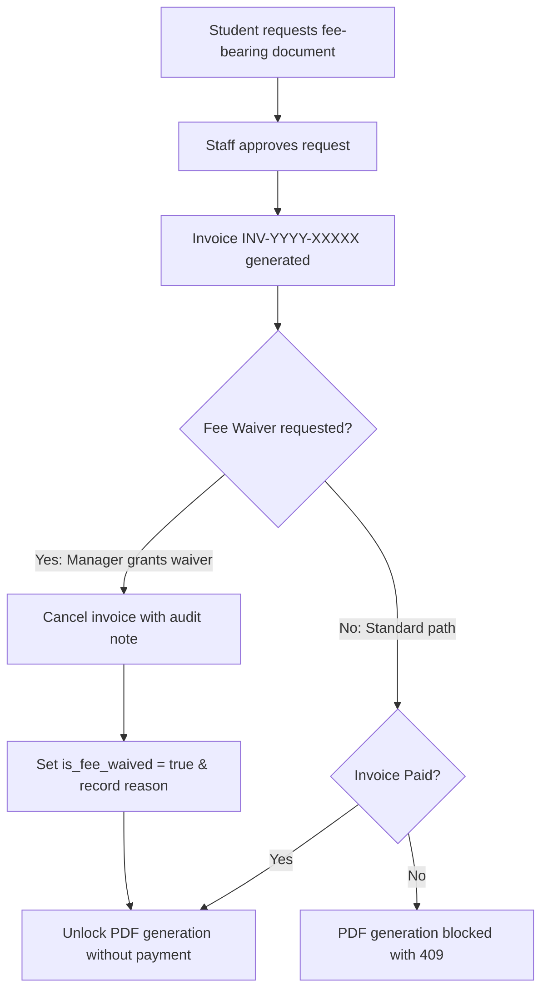
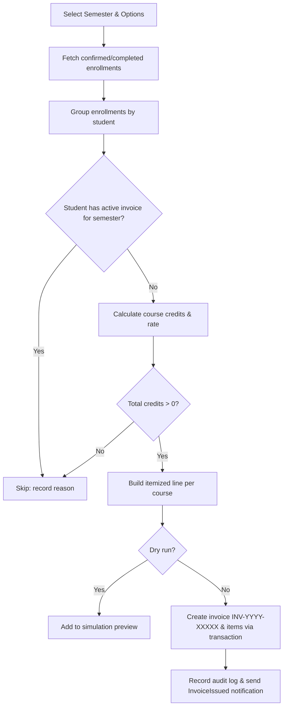

# 41 — Document Fee Waiver & Automatic Tuition Invoicing Report

- **Date:** 2026-10-05
- **Modules:** 9.16/9.17 Documents & Verification, 9.18 Invoices & Payment Records (`skills/documents`, `skills/invoices-payments`)
- **Status:** `[Implemented]`
- **Depends on:** Report 40 (Document Fee Billing & Type Management), Report 23 (Invoices & Payments)

---

## 1. Scope & Objectives

This implementation delivers two crucial institutional financial and operational capabilities:

1. **Document Request Fee Waiver & OpenAPI Completeness**:
   - Authorized administrators (Super Admin and University Admin) can grant fee waivers on approved fee-bearing document requests with an audited reason.
   - Waiving a fee immediately cancels any pending fee invoice and lifts the payment lock, allowing immediate PDF generation and download.
   - Completed full OpenAPI 3.0 annotations and schema classes for `/api/document-types` endpoints (`GET /api/document-types`, `POST /api/document-types`, `GET /api/document-types/{id}`, `PUT /api/document-types/{id}`, `DELETE /api/document-types/{id}`).

2. **Automatic Semester Tuition Invoicing from Enrollments**:
   - Automatically assesses and generates itemized tuition invoices for students with confirmed or completed course enrollments in a given semester.
   - Configurable per-credit rate at program level (`programs.tuition_per_credit`), with discretionary rate override at generation time and fallback to institutional default ($50.00/credit).
   - Itemized course-by-course line items displaying course code, title, enrolled credit hours, unit price, and subtotal.
   - Semester linkage on invoices (`invoices.semester_id`) with automatic deduplication preventing duplicate billing for the same semester.
   - Multi-interface access: CLI command (`php artisan tuition:generate`), REST API endpoint (`POST /api/invoices/generate-tuition`), and web UI modal on the Invoices Index page.
   - Dry-run preview capability to audit projected billings prior to database commitment.

---

## 2. Architecture & Data Model

### Database Migrations

1. `2026_10_05_140000_add_fee_waiver_to_document_requests.php`:
   - Adds `is_fee_waived` (boolean, default false).
   - Adds `waived_by` (foreignId to `users`, nullable, nullOnDelete).
   - Adds `waived_at` (timestamp, nullable).
   - Adds `waiver_reason` (text, nullable).

2. `2026_10_05_150000_add_tuition_and_semester_to_invoices_and_programs.php`:
   - Adds `tuition_per_credit` (decimal: 8,2, nullable, default 50.00) to `programs`.
   - Adds `semester_id` (foreignId to `semesters`, nullable, nullOnDelete) to `invoices`.
   - Creates composite index `invoices(student_id, semester_id)`.

---

## 3. Business Rules & Workflows

### Document Fee Waiver Workflow

1. **Waiver Authorization**: Super Admin and University Admin only. Department Admins and Students receive HTTP 403 Forbidden.
2. **Paid Invoice Invariant**: If the student has already paid the invoice (`status === 'paid'`), waiver is rejected with HTTP 409 Conflict.
3. **Audit Trail**: Every waiver is recorded with `document_request.fee_waived`, timestamp, administrative user ID, and optional justification.

### Automatic Tuition Invoicing Workflow

1. **Credit Rate Hierarchy**: Explicit rate override in generation request takes precedence over `program.tuition_per_credit`, which falls back to default institutional rate ($50.00/credit).
2. **Itemization Transparency**: Each enrolled course appears as an individual line item:
   - `description`: `Tuition: {Course Code} - {Course Name} ({Credits} credits)`
   - `quantity`: Number of course credits (e.g. 3.0)
   - `unit_price`: Rate per credit (e.g. $60.00)
   - `amount`: `quantity * unit_price`
   - `fee_category`: `'tuition'`
3. **Idempotency & Deduplication**: Students with existing non-cancelled invoices for the same semester are skipped to prevent double-billing.

---

## 4. Endpoints & CLI Commands

| Method / Command | Path / Signature | Auth / Role | Description |
|---|---|---|---|
| `POST` | `/api/document-requests/{id}/waive-fee` | SuperAdmin, UnivAdmin | Waive document fee, cancel pending invoice, unlock generation |
| `POST` | `/document-requests/{id}/waive-fee` | SuperAdmin, UnivAdmin | Web form submission for document fee waiver |
| `POST` | `/api/invoices/generate-tuition` | SuperAdmin, UnivAdmin | REST API endpoint for semester tuition invoice generation |
| `POST` | `/invoices/generate-tuition` | SuperAdmin, UnivAdmin | Web submission for tuition generation from Invoices Index modal |
| `artisan` | `php artisan tuition:generate {semester}` | CLI / Scheduler | Console command with `--rate=`, `--due-date=`, `--department=`, `--dry-run` |

---

## 5. Frontend Implementation

1. **Document Requests Staff Queue (`frontend/src/pages/Documents/Index.vue`)**:
   - Displays emerald `"Fee waived"` pill badge when `row.is_fee_waived` is true.
   - Shows waiver justification note beneath document metadata.
   - Added `BadgePercent` action button in the actions cell for approved fee-bearing requests with unpaid invoices.
   - Added `BaseModal` prompting for waiver reason.
   - Updated `isInvoiceUnpaid(row)` to recognize `row.is_fee_waived` as exempt from invoice payment lock.

2. **Student Document Requests View (`frontend/src/pages/Documents/Mine.vue`)**:
   - Added `"Fee waived"` badge with reason explanation so students understand their charge was lifted.

3. **Invoices Operations Screen (`frontend/src/pages/Invoices/Index.vue`)**:
   - Added `"Generate tuition invoices"` `IconButton` with `Calculator` icon for administrators.
   - Added `BaseModal` containing:
     - Semester selection dropdown (defaults to active/open semester).
     - Optional due date picker.
     - Optional rate per credit input.
     - Dry run / simulation checkbox.
   - Dispatches Inertia POST to `/invoices/generate-tuition` with flash toast confirmation.

---

## 6. Verification & Test Suite

| Test Suite | Tests | Assertions | Status |
|---|---|---|---|
| `Tests\Feature\Documents\DocumentFeeAndTypeTest` | 10 | 114 | **PASS** |
| `Tests\Feature\Finance\TuitionInvoiceTest` | 7 | 46 | **PASS** |
| `Tests\Feature\Finance\InvoiceTest` | 9 | 144 | **PASS** |
| **Full Application Test Suite** | **426** | **4,077** | **PASS (100%)** |

- **Laravel Pint**: 582 files passed cleanly with zero style issues (`vendor/bin/pint --test`).
- **Frontend Vite Build**: Built cleanly in 3.96s (`npm run build`).
- **OpenAPI Validation**: Generated cleanly with `php artisan l5-swagger:generate`.
