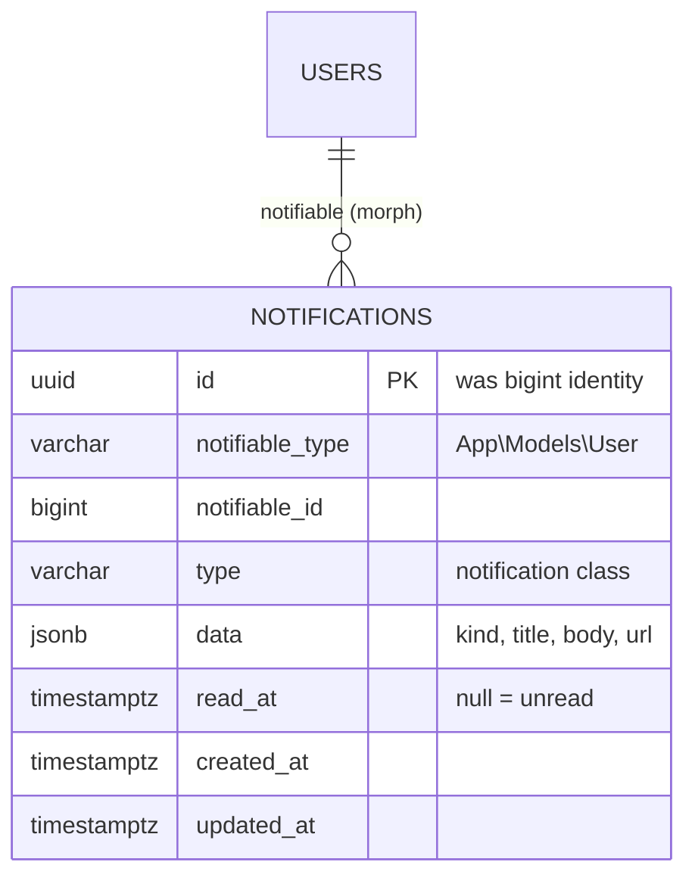
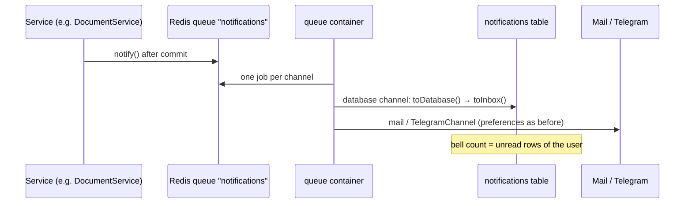

# 42 — In-App Notification Inbox Report

- **Date:** 2026-10-05
- **Modules:** extends 9.20 Email Notifications / 9.21 Telegram Notifications
  (closes the "in-app inbox" open item of `docs/25_Notifications-Report.md`)
- **Status:** `[Implemented]`
- **Depends on:** report 25 (notification base class, queue), report 29
  (password notices)
- **Schema change:** `2026_10_05_160000_make_notifications_table_uuid.php`
  (`notifications.id` bigint → UUID; nothing else changes)

## 1. Scope

Every message EduCore already sends by email or Telegram is now also stored
for the recipient and shown in an **inbox** inside the app: a bell with an
unread count in the top bar of every page, and a `/inbox` page listing the
messages newest first, with *All* / *Unread* views, *open* (marks read and
follows the message's link), *mark as read* and *mark all as read*.

| Notification (report 25 / 29) | Inbox `kind` | Opens |
|---|---|---|
| `EnrollmentConfirmed` | `enrollment` | `/timetable` |
| `GradePublished` (course only, no grade) | `grade` | `/my-grades` |
| `DocumentRequestUpdated` (+ rejection reason) | `document` | `/my-documents` |
| `InvoiceIssued` | `finance` | `/invoices/{id}` |
| `PaymentRecorded` (payment or reversal, remaining balance) | `finance` | `/invoices/{id}` |
| `AnnouncementPublished` (body cut to 280 characters) | `announcement` | `/announcements` |
| `AssignmentDueSoon` | `assignment` | `/my-assignments` |
| `InternshipStatusChanged` | `internship` | `/my-internships` |
| `PasswordChanged` (change or reset) | `security` | — (stays on the inbox) |
| `TestNotification` | `general` | `/notifications` |
| `ResetPasswordLink` | **never stored** — the link carries a reset token | — |

Not built: live push (the count refreshes on every page visit, not in the
background), deleting single messages, per-kind inbox preferences, and inbox
entries for staff events that have no notification yet (e.g. a new document
request waiting for a Department Admin).

## 2. Data model

The `notifications` table existed since the original schema but was never
written: Laravel's database channel generates a UUID key and the table had a
bigint identity (report 25 §1). The migration recreates it with a UUID key and
keeps every other column, type and index from
`docs/database/schema-tables.sql` (`data` is now `NOT NULL` because the channel
always writes it). `down()` restores the bigint table. No rows existed to keep.

The text is **rendered once, at send time**: later changes to an invoice or an
announcement do not rewrite the message, exactly like an email already sent.
`url` is an in-app path, never an absolute URL.

## 3. Delivery

`EduCoreNotification::via()` adds the `database` channel for every active
user when the class has a `toInbox()` message (the same convention as
`toTelegram()`); `toDatabase()` stores `kind`, `title`, `body` and `url`. The
inbox cannot be turned off — it sends nothing outside the platform — and
inactive accounts still receive nothing. `ResetPasswordLink` keeps its
mail-only `via()`, so a reset token is never stored. A guard test fails if a
new notification class has no `toInbox()` message.

**Retention:** `notifications:prune` (scheduler, daily 01:00) deletes stored
notifications older than **180 days** (`InboxService::RETENTION_DAYS`;
`--days=N` to override).

## 4. Endpoints

| Method | Path | Purpose | Access |
|---|---|---|---|
| GET | `/api/notifications` | My notifications, newest first; `filters[status]=unread\|read`, `per_page` ≤ 100; `meta.unread_count` | Sanctum, any role (own only) |
| POST | `/api/notifications/{notification}/read` | Mark one read | Sanctum, any role (own only) |
| POST | `/api/notifications/read-all` | Mark all read; answers `marked` | Sanctum, any role (own only) |
| GET | `/inbox` | Inbox page (`Notifications/Inbox`) | Every signed-in user |
| POST | `/inbox/{notification}/open` | Mark read, redirect to the message's link | Own only |
| POST | `/inbox/{notification}/read` | Mark read, back | Own only |
| POST | `/inbox/read-all` | Mark all read, back with a toast | Own only |

Shared Inertia prop `auth.unread_notifications` carries the bell count on
every page. The response never includes the notification class name.

## 5. Authorization

There is no user id in any path. `InboxService` resolves every id through the
caller's own `notifications()` relation, so another user's notification — or
a value that is not a UUID (`whereUuid`) — answers **404**, never 403, and
reveals nothing. Opening a message follows only same-site paths: a stored URL
that is absolute, protocol-relative (`//host`) or `/\host` falls back to
`/inbox`, so the redirect can never leave EduCore.

| Action | Student | Lecturer | Department Admin | University Admin | Super Admin |
|---|---|---|---|---|---|
| Read / mark own inbox | ✓ | ✓ | ✓ | ✓ | ✓ |
| See another user's inbox | ✗ (404) | ✗ (404) | ✗ (404) | ✗ (404) | ✗ (404) |

## 6. UI

- **Bell** (`components/layout/AppTopbar.vue`): 44 px target beside the theme
  toggle, tooltip below, accessible name "Notifications, *n* unread"; the
  count is a `primary` pill (`9+` above nine) — documented in
  `docs/branding/UI-COMPONENTS.md` §8.
- **Page** `Notifications/Inbox` (`/inbox`, breadcrumb "Notifications"):
  *All* / *Unread* underline tabs (links with `aria-current`), *Mark all as
  read* and *Notification settings* icon actions, one row per message
  (`components/notifications/InboxItem.vue`): kind icon, title (bold while
  unread), two-line body, "New" marker + relative time, *Mark as read*.
  Unread rows carry a light `primary` tint; colour is always paired with the
  "New" text. Empty states for "no notifications yet" and "all caught up".
- `BaseCard` gained `padding="none"` for flush, divided lists (it does not
  clip, so row tooltips still escape the card).

## 7. Tests

`backend/tests/Feature/Notifications/InboxTest.php` — 9 tests: real sends
through the sync queue store UUID rows with the rendered message; reset links
and inactive accounts never reach the inbox; every notification class has a
`toInbox()`; API list (own only, newest first, filters, `unread_count`,
validation 422, 401); mark one / all read with 404 for someone else's id or a
non-UUID; the page, the filter and the shared bell count; *open* marks read and
refuses off-site redirects; web mark read / mark all with the toast; pruning
by age. `NotificationTest` now expects the `database` channel first.
Full suite: see `docs/6_Module-Status-and-Roadmap.md` §6 (2026-10-05).

## 8. Decisions

- **Reuse Laravel's database channel** instead of a custom table: the schema
  already reserved `notifications`; only the key type was wrong.
- **Store rendered text, not references** — the inbox shows what was sent,
  survives deleted source records and needs no per-kind rendering code in the
  frontend.
- **Always on** — unlike email and Telegram it leaves no copy outside EduCore
  and costs nothing to deliver; an opt-out would hide critical notices.
- **POST to open** rather than a GET that changes state.
- **180-day retention** — the inbox is a notice board, not a record; the audit
  trail (report 28) keeps the business history.
