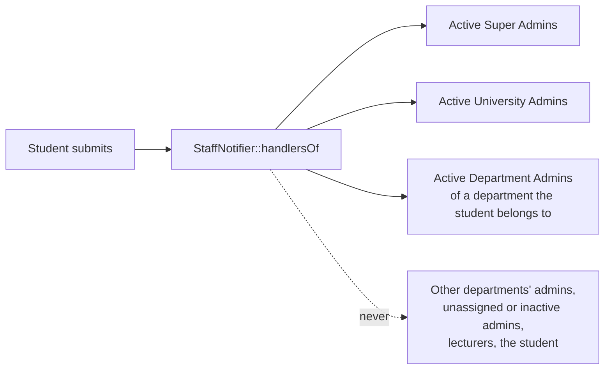

# 43 — Staff Request Notices Report

- **Date:** 2026-10-05
- **Modules:** extends 9.16 Document Management, 9.22 Internship Management and
  9.20 / 9.21 Notifications (closes the "email / Telegram notices of new
  requests" open item of report 33)
- **Status:** `[Implemented]`
- **Depends on:** report 25 (notification base class), report 39 (department
  scoping), report 42 (in-app inbox)
- **Schema change:** none

## 1. Scope

Until now a new request only showed up as a number on the staff dashboards.
Now the staff who must act on it are told when it arrives — in the in-app
inbox, by email (optional) and by Telegram (if linked):

| Event | Notification | Inbox | Opens |
|---|---|---|---|
| A student submits a document request (`DocumentService::request`) | `DocumentRequestSubmitted` | `document` — "New document request: *type*" | `/documents?filters[status]=pending` |
| A student submits an internship application (`InternshipService::submit`, draft → submitted) | `InternshipSubmitted` | `internship` — "New internship application: *student*" | `/internships/{id}` |

The message names the student (name and student ID), the document type and
semester, or the position, company and dates. Saving an internship **draft**
notifies nobody: only the submit step puts it in front of staff.

Not built: notices for later steps (a request that waits too long, a report
uploaded during an internship), digests, and a per-event opt-out for staff.

## 2. Recipients

The recipients are exactly the people allowed to process the request
(`DocumentRequestPolicy`, `InternshipPolicy`, report 33 / 39). A student
belongs to a department when any of their program records — current or past
— is a program of it; that rule lives in `App\Support\DepartmentScope`, which
gained the inverse query `departmentIdsOf($studentId)`. A transferred student
therefore reaches the admins of both departments, as both can see the request.

## 3. Delivery

`StaffNotifier` (`app/Services/StaffNotifier.php`) is called from the two
services inside their transactions; `EduCoreNotification` dispatches
`afterCommit`, so a refused or rolled-back request notifies nobody. Both
notifications are **non-critical**: email follows each recipient's
optional-email setting, Telegram their opt-in, and the inbox is always written
(report 42). Queue, retries and failure logging are the shared ones of report
25.

## 4. Endpoints and UI

No new endpoint or page. The messages appear in the existing inbox and bell
(report 42); their links open the existing queues.

## 5. Tests

`backend/tests/Feature/Notifications/StaffRequestNoticeTest.php` — 3 tests:
a document request (via the API) reaches the Super Admin, the University Admin
and the student's Department Admin, and not another department's admin, an
unassigned or inactive admin, an inactive University Admin, a lecturer or the
student; a refused duplicate request sends nothing more; the inbox message
names the student and opens the pending queue, on the inbox and email
channels. An internship draft notifies nobody; submitting it reaches the same
staff with the position and dates. A student with a past program in another
department reaches both departments' admins. The inbox guard test (report 42)
covers the two new classes.

## 6. Decisions

- **Notify the people who can act, nobody more.** Recipients reuse the
  authorization scope instead of a new setting, so they can never be told
  about a request they cannot open.
- **Optional email** — staff receive many of these; they can turn optional
  mail off and still see everything in the inbox.
- **Submit, not draft** — matching what staff queues and dashboards count.
