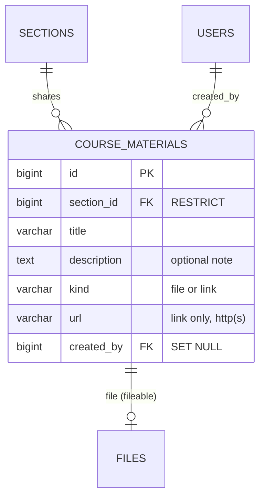
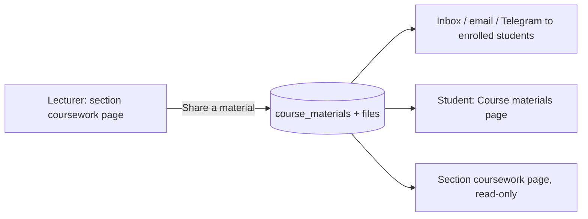

# 44 — Course Materials Report

- **Date:** 2026-10-06
- **Modules:** completes 9.12 Assignments ("upload materials", left `[Planned]`
  in report 18)
- **Status:** `[Implemented]`
- **Depends on:** report 18 (coursework page, private uploads), report 14
  (sections and their lecturers), report 42 (inbox), report 39 (department
  scoping)
- **Schema change:** `2026_10_05_180000_create_course_materials_table.php` (new
  table `course_materials`; files reuse the polymorphic `files` table)

## 1. Scope

A section's lecturers share **course materials** — slides, handouts, readings
(a file) or a page, video or folder (a link) — with the section. Students of
the section find them on the section's coursework page and, across all their
current courses, on **Course materials** (`/my-materials`); they are told when
one is added. Lecturers edit a material's title, note or link and remove it.

Not built: drafts / scheduled release, folders or weeks, view counts, replacing
a file in place (remove and share again), materials attached to a course across
all its sections.

## 2. Data model

`ck_course_materials_kind` (`file` / `link`) and `ck_course_materials_url` (a
link has a URL). A file's object is stored privately under
`materials/{course}/{section}/{uuid}.{ext}` on the uploads disk, with its name,
type, size and SHA-256 in `files`. `sections` → `course_materials` is
`RESTRICT`, and `CourseOfferingService::deleteSection` lists course materials
with the other history that blocks deleting a section. Model `CourseMaterial`,
`Section::materials()` (newest first).

## 3. Rules

| Rule | Where |
|---|---|
| Files: pdf, docx, pptx, xlsx, txt, zip, png, jpg — at most 20 MB (`MATERIAL_MAX_KB`) | `StoreCourseMaterialRequest`, `config/academics.php` |
| Links: `http` / `https` only (no `javascript:` or `data:`), up to 2048 characters | `StoreCourseMaterialRequest` |
| A file material needs a file and no URL; a link needs a URL and no file | `StoreCourseMaterialRequest` |
| Upload first, write the rows in one transaction; on failure the object is removed | `CourseMaterialService::create` |
| Removing a material deletes its row, its `files` row, and the object after commit | `CourseMaterialService::delete` |
| Created / updated / deleted are audited (`course_material.*`, changed fields only) | `AuditLogger` |
| Students with an open enrollment (pending / confirmed) in the section are notified | `CourseMaterialAdded` (inbox `material`, optional email, Telegram) |

## 4. Authorization

`CourseMaterialPolicy`, built on the coursework checks (`ChecksSectionTeaching`):

| Action | Super / University Admin | Department Admin | Lecturer of the section | Other lecturer | Student enrolled (incl. completed) | Other student |
|---|---|---|---|---|---|---|
| List / download | ✓ | ✓ when the section's course is in their department | ✓ | ✗ 403 | ✓ | ✗ 403 |
| Share / edit / remove | ✓ | ✗ | ✓ | ✗ | ✗ | ✗ |

## 5. Endpoints

| Method | Path | Purpose |
|---|---|---|
| GET | `/api/sections/{section}/materials` | The section's materials |
| POST | `/api/sections/{section}/materials` | Share (multipart: `title`, `description`, `kind`, `file` or `url`) |
| PUT / PATCH | `/api/materials/{material}` | Edit title / note (and a link's URL) |
| DELETE | `/api/materials/{material}` | Remove (204) |
| GET | `/api/materials/{material}/file` | Download the private file (404 for a link) |
| GET | `/my-materials` | Student page `Materials/Mine` |
| POST | `/coursework/sections/{section}/materials`, PUT / DELETE `/materials/{material}`, GET `/materials/{material}/file` | Web equivalents (redirect back with a toast) |

The coursework page (`/coursework/sections/{section}`) also receives
`materials`, `canShare`, `materialTypes` and `materialMaxKb`.

## 6. UI

- **Course materials card** at the top of the section's coursework page
  (`components/coursework/MaterialsCard.vue`): newest first, an icon by type
  (slides, sheet, archive, image, document, link), title, note, file name and
  size or the link's host, who shared it and when; *Download* or *Open in a
  new tab*; for editors *Edit* and *Remove* (confirmed), and *Share a material*
  — a modal with a File / Link choice, title, optional note, the file picker
  (accepted types and size shown) or the URL.
- **Course materials** page for students (`pages/Materials/Mine.vue`): one card
  per course and section, a course filter when there are several, the same list
  (`components/coursework/MaterialList.vue`), an empty state.
- The **student sidebar** is now three folding groups of at most seven items —
  Overview (Dashboard, Announcements), Learning (Course registration, My
  timetable, Course materials, My assignments, My exams, My attendance),
  Records (Grades & GPA, My documents, My invoices, My internship) — instead of
  one group of eleven.
- `IconButton` gained `new-tab` for native links (`target="_blank"`,
  `rel="noopener noreferrer"`).

## 7. Tests

`backend/tests/Feature/Assignments/CourseMaterialTest.php` — 6 tests: a lecturer
shares a file (private key under the section, audit entry, no storage key in the
response), the enrolled student is notified with a `material` inbox message and
lists and downloads it; link materials and editing (a link has no file: 404);
validation (missing fields, `javascript:` URL, executable and over-size files, a
file with a link, a URL on a file material); readers and outsiders across seven
roles, writes limited to the section's lecturers and managers, guests 401; a
section with materials cannot be deleted, removing a material deletes its file
and object; the coursework page props, the student page (own sections only;
lecturers 403) and the web share route. The inbox guard (report 42) covers
`CourseMaterialAdded`. Full suite: see the roadmap entry (2026-10-06).

## 8. Decisions

- **A table of its own**, not just `files`: a material needs a title, a note and
  possibly a link, which a stored file cannot carry.
- **Per section**, like assignments: the lecturers who teach the section own
  what its students see; a course-wide library is a later option.
- **No drafts**: sharing is publishing, so students are told at once; edits and
  removal remain possible.
- **Replace = remove + share** keeps one immutable object per material and a
  clean audit trail.
