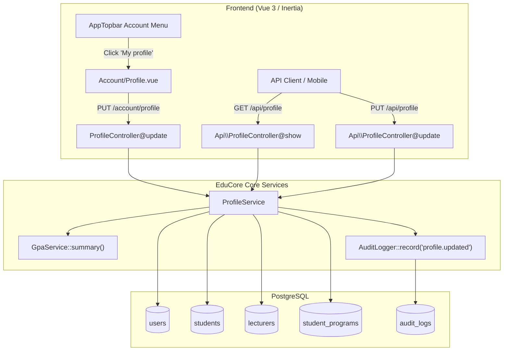

# 45 — User Profile Portal & Student Feed Report

- **Date:** 2026-10-06
- **Modules:** User Profile Portal (`/account/profile`, `/api/profile`), Student Announcements Feed Fix, CI Environment Alignment
- **Status:** `[Implemented]`
- **Depends on:** report 12 (lecturer profiles), report 13 (student profiles), report 20 (GPA & grading summary), report 24 (announcements), report 28 (audit logs)
- **Schema change:** None required (reuses existing `users`, `students`, `lecturers`, `student_programs`, `audit_logs`).

---

## 1. Scope

### 1.1 User Profile Portal
Every signed-in user (Super Admin, University Admin, Department Admin, Lecturer, Student) has access to a dedicated **Profile Portal** (`/account/profile` and `GET/PUT /api/profile`) to:
1. Inspect verified institutional identity (name, email, role badge, department affiliation, account status, last login timestamp).
2. For students: review official academic credentials (Student ID, current program, home department, enrollment date, gender, national ID) alongside an academic performance summary (cumulative GPA, earned/attempted credits, current course count).
3. For lecturers: review faculty appointment details (Staff ID, academic title, position, department, employment type, active teaching section load) and research specialization.
4. Update self-service contact information:
   - All users: `name`, `phone`.
   - Students: `address`, `emergency_contact_name`, `emergency_contact_phone`.
   - Lecturers: `specialization`.
5. Access quick account security and notification actions (Change password link, Security & Alerts link).

### 1.2 Student Announcements Feed Fix
- Resolved an audience scoping defect in `AnnouncementService::memberships()` where `$m['student'] = true` and `$m['lecturer'] = true` were conditionally bound to existing linked profile records. Unlinked student accounts now receive all announcements targeted to students and all general announcements.
- Enhanced the announcements feed UI (`frontend/src/pages/Announcements/Feed.vue`) with category filter pills (*All news*, *Academic*, *Administrative*, *Events*, *General*), student-oriented eyebrow (*Overview*), and actionable empty state linking to `/dashboard`.
- Seeded comprehensive demo records and linked the development student account (`student@educore.kh`) to active program enrollments so the student portal renders real-world data at `http://localhost/announcements`.

### 1.3 CI Test Suite Alignment
- Normalized `backend/phpunit.xml` environment overrides for runner hosts (`127.0.0.1` / `postgres`).
- Added `$this->withoutVite()` to `Tests\TestCase::setUp()` to bypass missing client manifest exceptions during backend-only CI runs.
- Configured Inertia page view finder paths (`config/inertia.php` and `TestCase.php`) to locate Vue page components within `frontend/src/pages` in non-Docker runner environments.

---

## 2. Architecture & Data Flow

---

## 3. Rules & Validation

| Field | Type | Roles Allowed | Validation Rules | Target Storage |
|---|---|---|---|---|
| `name` | string | All roles | `required`, `string`, `max:255` | `users.name` |
| `phone` | string | All roles | `nullable`, `string`, `max:30` | `users.phone` |
| `address` | string | Student | `nullable`, `string`, `max:255` | `students.address` |
| `emergency_contact_name` | string | Student | `nullable`, `string`, `max:255` | `students.emergency_contact_name` |
| `emergency_contact_phone` | string | Student | `nullable`, `string`, `max:30` | `students.emergency_contact_phone` |
| `specialization` | string | Lecturer | `nullable`, `string`, `max:255` | `lecturers.specialization` |

- **Read-Only Invariants:** `email`, `role_id`, `student_number`, `staff_number`, `department_id`, `status`, and `enrollment_date` cannot be modified via self-service; they require registrar or administrator actions.
- **Audit Logging:** Every profile update writes an audit log entry (`profile.updated`) capturing actor ID, timestamp, IP address, and changed fields (`before` / `after`).

---

## 4. Authorization Matrix

| Action | Super Admin | University Admin | Department Admin | Lecturer | Student | Guest |
|---|:---:|:---:|:---:|:---:|:---:|:---:|
| `GET /account/profile` | ✓ (Own) | ✓ (Own) | ✓ (Own) | ✓ (Own) | ✓ (Own) | ✗ 302 to `/login` |
| `PUT /account/profile` | ✓ (Own) | ✓ (Own) | ✓ (Own) | ✓ (Own) | ✓ (Own) | ✗ 302 to `/login` |
| `GET /api/profile` | ✓ (Own) | ✓ (Own) | ✓ (Own) | ✓ (Own) | ✓ (Own) | ✗ 401 Unauthorized |
| `PUT /api/profile` | ✓ (Own) | ✓ (Own) | ✓ (Own) | ✓ (Own) | ✓ (Own) | ✗ 401 Unauthorized |
| `/profile` redirect | ✓ | ✓ | ✓ | ✓ | ✓ | ✗ 302 to `/login` |

---

## 5. Endpoints

| Method | Path | Controller | Purpose |
|---|---|---|---|
| `GET` | `/account/profile` | `ProfileController@show` | Renders Inertia page `Account/Profile` with full profile data |
| `PUT` | `/account/profile` | `ProfileController@update` | Updates user details, flashes success message, redirects back |
| `GET` | `/profile` | N/A (Redirect) | Permanent redirect to `/account/profile` |
| `GET` | `/api/profile` | `Api\ProfileController@show` | Returns JSON envelope `{"data": { ... }}` |
| `PUT` | `/api/profile` | `Api\ProfileController@update` | Updates profile via API and returns updated payload |

---

## 6. UI & Design System Compliance

- **Topbar Menu Integration:** Added *My profile* with `UserRound` icon to `frontend/src/components/layout/AppTopbar.vue` dropdown above *Notification settings*.
- **Breadcrumb Navigation:** Configured `useNavigation.js` to map `account` -> `Account` and `profile` -> `Profile`.
- **Card & Token Usage:** Built with `BaseCard`, `BaseBadge`, `BaseInput`, `BaseButton`, `StatCard`, and semantic colour tokens conforming to `docs/branding/`.
- **Dark Mode Support:** Fully verified in both light and dark modes with proper background surfaces (`dark:bg-dark-surface`, `dark:text-dark-ink`).

---

## 7. Testing & Verification

1. **Feature Test Suite (`Tests\Feature\Account\ProfileTest`):**
   - `test_guest_cannot_access_profile_page_or_api`: Unauthenticated requests rejected.
   - `test_profile_redirects_permanently_to_account_profile`: 301/302 redirect verified.
   - `test_user_can_view_profile_screen`: Inertia page component assertion.
   - `test_student_sees_academic_summary_in_profile`: Verified GPA, credits, program name.
   - `test_lecturer_sees_teaching_summary_in_profile`: Verified staff number, department, specialization.
   - `test_user_can_update_profile_over_web`: Web update flow and audit log creation.
   - `test_student_can_update_contact_details`: Student contact fields saved to `students` table.
   - `test_lecturer_can_update_specialization`: Specialization saved to `lecturers` table.
   - `test_profile_update_validates_inputs`: 422 Unprocessable Content on invalid data.
2. **Pint Code Style:** 613 files checked, 0 style issues found (`vendor/bin/pint --test` passes).
3. **Database Seeder Invariance:** Verified `DatabaseSeederTest` passes with 0 demo records for fresh production installs.

---

## 8. Decisions & Deviations

1. **Direct Profile URL (`/account/profile` vs `/profile`):**
   EduCore groups user self-service actions under `/account/*` (`/account/password`, etc.). `/profile` is registered as a permanent redirect to `/account/profile` for developer ergonomics and user intuition.
2. **First/Last Name Decomposition:**
   The user record stores a single `name` string while `Student` and `Lecturer` store `first_name` and `last_name`. The self-service portal updates `users.name` directly for all roles, while student/lecturer formal legal names remain governed by registrar updates to prevent grade or transcript name tampering.
3. **Audience Fallback for Unlinked Students:**
   `AnnouncementService` was decoupled from requiring `$user->student !== null` before setting `$m['student'] = true`. Any user authenticated with the `student` role now receives student-wide communications regardless of database linkage state.
