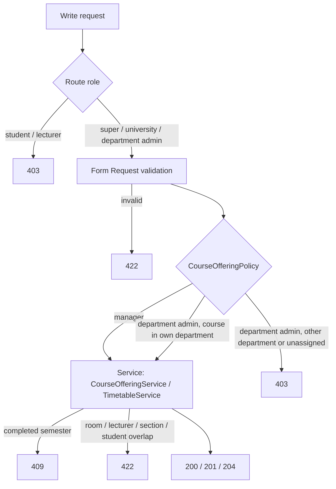

# 46 — Department Admin Sections & Schedules Report

- **Date:** 2026-10-06
- **Modules:** completes the Department Admin role (business overview §8.3,
  "manage their unit's … sections, schedules", left `[Future]` since report 33)
  on top of 9.8 Class / Section Management and 9.10 Timetable
- **Status:** `[Implemented]`
- **Depends on:** report 14 (offerings, sections, lecturer assignment), report
  16 (rooms, weekly schedules, conflict checks), report 39 (department scoping)
- **Schema change:** none

## 1. Scope

Until now a Department Admin could only **read** their department's offerings
and sections; every change went through a University Admin. They now run them
for the courses of their own department:

- create an offering of one of their department's courses in a semester,
  change its status / enrollment cap / notes, delete it while it has no
  sections;
- add, edit and delete its sections (code, name, capacity, status);
- assign and remove section lecturers — **lecturers of their department only**;
- add, move and remove weekly class times in any active room.

Nothing else changes: the timetable rules (no room, section, lecturer or
student overlap, room seats the enrollment, nothing in a completed semester)
apply exactly as for managers, rooms are still created and edited only by Super
Admin and University Admin, and another department's offerings stay read-
and write-protected.

## 2. Authorization

`CourseOfferingPolicy` already guarded offerings, sections, lecturer
assignments and schedules (managing a section is managing its offering). Its
write abilities now take the record and admit the Department Admin over it:

| Ability | Super Admin / University Admin | Department Admin | Others |
|---|---|---|---|
| `viewAny`, `view` | ✓ | own department's offerings | ✗ |
| `create` *(with the course)* | ✓ any course | a course of their department | ✗ |
| `createAny` *(UI only: show "New offering")* | ✓ | assigned to a department | ✗ |
| `update`, `delete` *(offering, its sections, lecturers, class times)* | ✓ | own department's offerings | ✗ |

"Own department" is the existing rule from `App\Support\DepartmentScope`: an
offering or section belongs to department D when its course does
(`isVisibleTo`). An unassigned Department Admin (`department_id` null, scope 0)
passes none of the write abilities.

**Lecturer assignment.** `AssignSectionLecturerRequest` narrows `lecturer_id`
to `lecturers.department_id = their department` for a Department Admin; another
department's lecturer answers **422** "Choose a lecturer from your
department." Managers may still assign any lecturer (service courses taught
across departments are arranged by the University Admin). Removing a lecturer
already on the section is allowed, whatever their department.

**Rooms.** Rooms are a university resource: a Department Admin books any active
room for a class time (the room-overlap check prevents double booking) but
cannot create, edit or delete rooms.

## 3. Endpoints

No endpoint was added or removed. The route groups of these write operations
now include `department-admin` (web and API); the policy decides per record.

| Method | API | Web |
|---|---|---|
| POST | `/api/offerings` | `/offerings` |
| PUT, PATCH / DELETE | `/api/offerings/{offering}` | `PUT|DELETE /offerings/{offering}` |
| POST | `/api/offerings/{offering}/sections` | `/offerings/{offering}/sections` |
| PUT, PATCH / DELETE | `/api/sections/{section}` | `PUT|DELETE /sections/{section}` |
| POST / DELETE | `/api/sections/{section}/lecturers[/{lecturer}]` | same paths |
| POST | `/api/sections/{section}/schedule` | `/sections/{section}/schedule` |
| PUT, PATCH / DELETE | `/api/schedule-entries/{entry}` | `DELETE /schedule-entries/{entry}` |

`POST /offerings` (web and API) now authorizes `create` with the course named
by `course_id`. The OpenAPI 403 descriptions of the 14 API operations say who
is allowed; `docs/api/api-audit.md` has the updated rows.

## 4. UI

The offering screens were already built around a `canManage` switch; it was
computed in the browser from a fixed role list (`super-admin`,
`university-admin`). It now comes from the server:

- `Offerings/Index` — `canManage` = `createAny`: shows **New offering** and the
  **Manage offering** row action. The course picker already listed only the
  Department Admin's courses.
- `Offerings/Show` — `canManage` = `update` on this offering: the offering card,
  **Add a section**, each section's edit / delete, lecturer assignment and the
  weekly schedule form. The lecturer picker lists their department's active
  lecturers only (managers still get every lecturer); rooms list every active
  room.
- The list page description no longer says schedules "arrive with the
  timetable" (they shipped in report 16).

Checked in headless Chrome at 1366 × 900 as the seeded Department Admin with a
temporary department, course, offering and two lecturers (removed afterwards):
the list shows *New offering* and *Manage offering*, the offering page offers
only the own-department lecturer, and adding section B through the form shows
it with the *Section added.* toast.

## 5. Tests

`tests/Feature/Offerings/DepartmentAdminSectionManagementTest.php` (8 tests):

| Test | Asserts |
|---|---|
| `offers_their_departments_course_but_not_anothers` | API 201 / web redirect for own course; 403 (API and web) for another department's course |
| `updates_and_deletes_only_their_departments_offerings` | update and delete own; 403 for another's |
| `manages_sections_of_their_departments_offerings_only` | add (API + web), edit, delete own sections; 403 on another department's |
| `assigns_only_lecturers_of_their_department` | 422 for another department's lecturer, 201 / 204 for own; 403 on another department's section; a Super Admin still assigns across departments |
| `schedules_class_times_of_their_departments_sections_only` | add (API + web), move, remove; a room overlap still 422; 403 on another department's entry (API + web) |
| `rooms_stay_with_managers` | room create / delete 403 |
| `unassigned_department_admin_manages_nothing` | 403 on create / update; `canManage` false |
| `screens_offer_the_controls_and_only_their_departments_lecturers` | `canManage` on both pages; one lecturer offered to the Department Admin, all to a Super Admin |

Updated: `CourseOfferingManagementTest::test_roles_are_enforced` (the
Department Admin's refused writes are now another department's offering) and
the comment of `DepartmentAdminScopingTest`'s form-options test. Full suite
green.

## 6. Decisions

1. **Record-level, not class-level.** `create` takes the course, as the
   authorization skill requires for unit-scoped abilities; `createAny` exists
   only to decide whether to show the button.
2. **Own-department lecturers only.** The role is defined as acting "within
   their assigned department only"; a Department Admin cannot even read
   another department's lecturers. Cross-department teaching stays a
   University Admin decision.
3. **Rooms shared, not owned.** Rooms have no department; restricting bookings
   would need a room-ownership model that does not exist. Overlap checks
   already prevent one department from taking another's booked slot.
4. **No new audit events.** Offering / section / schedule changes were not
   audited for managers either (open roadmap item "auditing low-risk structure
   CRUD"); widening who may write makes that item more valuable, but it is
   left for a change that covers every role at once.
5. **Validation before authorization.** As everywhere in the project, Form
   Requests validate before the controller checks the policy, so a malformed
   request about another department's record answers 422 rather than 403. No
   record data is revealed either way.
