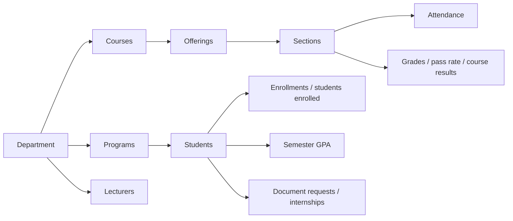

# 47 — Department Analytics & Trends Report

- **Date:** 2026-10-06
- **Modules:** completes 9.23 Analytics & Reporting ("faculty/department
  statistics"; the analytics page for Department Admins and trends across
  semesters were `[Open]` since reports 27 and 34)
- **Status:** `[Implemented]`
- **Depends on:** report 27 (analytics), report 31 (CSV exports), report 39
  (department scoping, `DepartmentScope`), report 46 (Department Admin runs
  their sections)
- **Schema change:** none

## 1. Scope

1. **Department view.** Every analytics figure — headline numbers, enrollment,
   academic performance, workload — every CSV table and the PDF report can be
   limited to one department.
2. **Who sees what.** A Department Admin opens `/analytics` (now in their
   sidebar) and always sees **their own department**. Super Admin and
   University Admin keep the university view and gain a **Department** filter.
3. **Trends.** A new card and `GET /api/analytics/trends` trace enrollments,
   students enrolled, attendance rate, pass rate and average semester GPA over
   the **latest six semesters**, on exactly the definitions of the headline
   numbers.

## 2. What "the department" counts

One rule per figure, taken from `App\Support\DepartmentScope` (the same
ownership the Department Admin's lists and dashboard already use). People are
counted through the department's **students**, teaching through its
**courses** — a Law student in an Engineering course counts in Engineering's
course results but in Law's enrollments.

| Figure | Counted through | Rule |
|---|---|---|
| Active students, students enrolled, enrollments, by status | its students | a program record in the department |
| Enrollment by program | its programs | the student's active program belongs to it |
| Average semester GPA, GPA bands | its students | semester GPA snapshots (9.14) |
| Active lecturers | its lecturers | `lecturers.department_id` |
| Sections, attendance rate / by course | its courses | the section's course belongs to it |
| Approved grades, pass rate, grade distribution, results by course | its courses | approved / finalized grades in its sections |
| Document requests, internships | its students | as in report 39 |
| Invoices, finance | — | **university-wide only** (`null` for a department) |

Finance stays out of the department view because a Department Admin has no
access to invoices (`InvoicePolicy`), and splitting a university's receivables
by department is not a rule the project has defined.

## 3. Authorization

`view-analytics` now admits the Department Admin. The department is resolved
once, in `AnalyticsController::departmentScope()`, and used by the page, the
API and both exports:

| Caller | No `department_id` | `department_id` given |
|---|---|---|
| Super Admin / University Admin | whole university | that department (unknown → 422) |
| Department Admin | their department | their own → 200; another → **403** |
| Department Admin with no department | **403** (page: "No department assigned" notice) | 403 |
| Lecturer, Student | 403 | 403 |

The `finance` CSV answers 403 to a Department Admin and 422 to a manager who
passes `department_id`. Export audit entries (`export.analytics`,
`export.analytics_pdf`) record the `department_id`.

## 4. Implementation

- `AnalyticsService`: `overview`, `enrollment`, `academic`, `administrative`
  and `internshipStatuses` take an optional `?int $departmentId` (null = the
  university, unchanged behaviour). The private helpers (`enrollments`,
  `finalGrades`, `attendanceCounts`, new `semesterGpas`) take a **list of
  semester ids** and the department, so the per-semester figures and the
  trends share one definition of "counted enrollment", "held attendance" and
  "final grade". `departmentOverview()` (department dashboard) now uses the
  same helpers.
- `trends(?int $departmentId, int $limit = 6)`: the latest six semesters by
  start date, oldest first, in **four grouped queries** (enrollments,
  attendance, grades, GPA grouped by semester) — no per-semester loop of
  queries. A semester with nothing to measure has `null` rates.
- Exports: CSV table `trends`; a department PDF is headed "Department
  analytics report" with the department's name and code on the reporting-period
  line, its file name carries the department code, and the finance table is
  replaced by the workload of the department's students.

## 5. Endpoints

| Method | URI | Change |
|---|---|---|
| GET | `/api/analytics/overview`, `/enrollment`, `/academic` | `department_id`; response gains `department` |
| GET | `/api/analytics/administrative` | `department_id`; `invoices` / `finance` null for a department |
| GET | `/api/analytics/trends` | **new** — `AnalyticsTrendsResponse` |
| GET | `/api/analytics/export` | `department_id`; table `trends` |
| GET | `/api/analytics/export/pdf` | `department_id` |

Web: `/analytics`, `/analytics/export`, `/analytics/export/pdf` admit
`department-admin`. API audit: 212 route definitions / 233 operations, all
documented (`docs/api/api-audit.md`).

## 6. UI

- **Filters:** Semester, plus Department ("All departments") for managers. A
  Department Admin sees their department's name as the page eyebrow and in the
  description instead of a filter.
- **Headline numbers:** the detail line says what a department figure counts
  ("48 enrollments by its students", "Present + late, in its courses"). A
  manager's department choice carries over to the Students and Lecturers links
  (`filters[department_id]`).
- **Trends across semesters:** a new `components/charts/LineChart.vue` — one
  series in `chart-primary`, 2px line, 8px markers, one value axis inset at
  both ends, a gap (never 0) where a semester has nothing to measure, hover
  tooltip, *Show as table*. A pill tab group switches the measure
  (Enrollments, Attendance, Pass rate, Average GPA); rates run 0–100 %, GPA
  0–4; a CSV button downloads all five columns. Rules recorded in
  `docs/branding/UI-COMPONENTS.md` §10.
- **Workload:** for a department, the finance cards, the finance CSV button
  and the Invoices breakdown are hidden; document requests and internships sit
  two-across.

Checked in headless Chrome at 1366 × 900, light and dark, with a temporary
two-department, four-semester sample (22 students, 206 enrollments; removed
afterwards by id watermark): the Department Admin sees their department, no
filter and no finance, the trends switch between measures and the open
semester's pass rate shows as a gap; the Super Admin's Law view names the
department, keeps the filter value and drops the invoices card. Two layout
fixes came out of it: the line's end points are inset so the last semester's
label is not clipped, and the department detail lines were shortened to fit
the tiles.

## 7. Tests

`tests/Feature/Analytics/DepartmentAnalyticsTest.php` (6 tests) on a
hand-counted fixture where students and courses cross departments:

| Test | Asserts |
|---|---|
| `department_figures_count_its_students_and_its_courses` | every overview figure, by-program and by-status enrollment, course / attendance / grade / GPA distributions, workload with null finance |
| `managers_see_the_university_or_pick_a_department` | university totals, Law's figures with `department_id`, 422 for an unknown department |
| `a_department_admin_cannot_look_at_another_department` | 403 for another department on all five API operations, the page, CSV and PDF |
| `trends_cover_the_latest_semesters_oldest_first` | semester order, enrollments, null rates where nothing was measured; university trends |
| `exports_follow_the_department_and_finance_stays_university_wide` | CSV rows and file name, `trends` table, finance 403 / 422 / 200, department PDF, audit filters |
| `the_page_shows_the_department_and_offers_managers_the_filter` | `scope`, `departments`, figures and trends on the Inertia page for both roles |

Updated: `AnalyticsTest::test_access_by_role` (formerly `test_managers_only`:
the Department Admin now gets their department, an unassigned one 403) and a
comment in `CsvExportTest`. The existing hand-count test is unchanged and
still passes, so the university figures did not move. Full suite green.

## 8. Decisions

1. **Students for people, courses for teaching.** Neither alone answers a
   Department Admin's questions: "how are our students doing" (enrollment,
   GPA) and "how are our courses going" (attendance, pass rate). Each figure's
   detail line names its basis so the two are not confused.
2. **No silent override.** A Department Admin who asks for another department
   gets 403 rather than quietly receiving their own figures; with no
   department they get 403 / a notice rather than empty numbers labelled as
   the university's.
3. **Line, one measure at a time.** Change over time reads as a line; counts
   and rates never share an axis, so the measure is a tab, not a second series.
4. **Six semesters, live.** Bounded in time as the analytics skill requires,
   computed from the domain tables like every other figure (no snapshot
   table); four grouped queries keep it cheap.
