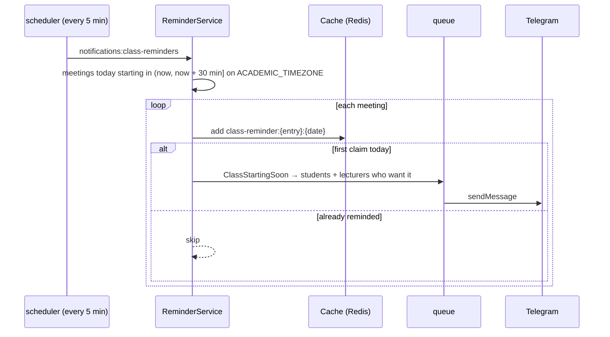
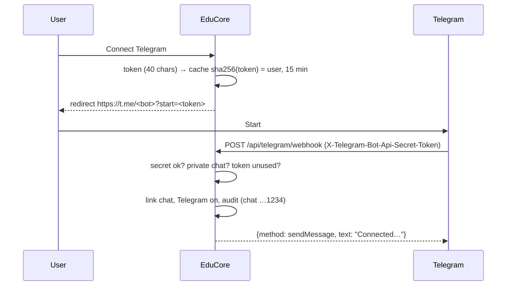

# 48 — Class Reminders & Telegram Linking Report

- **Date:** 2026-10-06
- **Modules:** completes 9.21 Telegram Notifications ("class reminders"; class
  reminders and automatic chat linking were `[Future]` since report 25) and
  closes 9.20's "class-start reminders"
- **Status:** `[Implemented]`
- **Depends on:** report 16 (weekly schedules), report 25 (notifications,
  `TelegramChannel`), report 42 (inbox), report 28 (audit log)
- **Schema change:** `2026_10_06_100000_add_class_reminders_to_notification_preferences.php`
  — `notification_preferences.class_reminders boolean not null default true`

## 1. Scope

1. **Class reminders.** About 30 minutes before each weekly class meeting, its
   enrolled students and its lecturers get a Telegram message naming the
   course, section, time and room. Each meeting is reminded once a day.
2. **One-tap Telegram linking.** Instead of looking up a numeric chat id, a
   user presses *Connect Telegram*, lands in the EduCore bot and presses
   Start: the bot links that chat to their account. `/stop` in the chat — or
   *Disconnect* in the settings — unlinks it. Typing a chat id remains the
   fallback where the bot webhook is not set up.
3. **The university's clock.** Class times are wall-clock times at the
   university, while the application (and every stored timestamp) runs on
   UTC. A new setting, `ACADEMIC_TIMEZONE`, reads them — for the reminders and
   for the student and lecturer dashboards' "today's classes", which used the
   UTC day before (in Phnom Penh, 00:00–07:00 showed the previous day's
   classes).

## 2. Class reminders

| Rule | Implementation |
|---|---|
| Which meetings | `schedule_entries` for today's weekday whose start is after now and within `CLASS_REMINDER_MINUTES` (30), on `AcademicClock::now()` |
| Which sections | status `open`, `active` or `closed`; offering's semester not `completed` and its dates include today |
| Who | active users: students with an open enrollment in the section, its active lecturers |
| Who wants it | Telegram linked and on, and `class_reminders` on (`NotificationPreference::wantsClassReminders()`) — others are not even queued |
| Once | `Cache::add("class-reminder:{entry}:{date}")` is atomic: a doubled run sends nothing twice; a late run still reminds a class that has not started |
| Channel | Telegram only (`ClassStartingSoon::via()`); no email, no inbox |

Message: "Class at 08:00: CS210 Data Structures, section A", then
"08:00–09:30 in B-204 (Lecture Hall 204)." and a link to `/timetable`.

## 3. Telegram linking

- **Tokens:** `Str::random(40)`, cached under their SHA-256 for 15 minutes and
  pulled on first use (single use). The raw token is never stored.
- **Webhook:** public route, but the `X-Telegram-Bot-Api-Secret-Token` header
  must equal `TELEGRAM_WEBHOOK_SECRET` (constant-time compare; 403
  otherwise); with no secret configured the route answers 404. Rate limited
  (120/min per sender). Replies are returned as a Bot API method in the
  response body, so the webhook makes no outgoing call.
- **Commands:** `/start <token>` links the chat (private chats only — groups
  are refused); `/stop` unlinks every account using that chat; anything else
  gets instructions.
- **Audit:** `notifications.telegram_linked` / `notifications.telegram_unlinked`,
  actor = the user, chat id masked to its last four digits.
- **Setup:** `TELEGRAM_BOT_TOKEN`, `TELEGRAM_BOT_USERNAME`,
  `TELEGRAM_WEBHOOK_SECRET`, then `php artisan telegram:webhook` (sets the
  webhook to `APP_URL/api/telegram/webhook` with the secret, `message`
  updates only; `--delete` removes it). Needs a public https `APP_URL`, so
  local development keeps the typed chat id.

## 4. Endpoints

| Method | URI | Auth | Purpose |
|---|---|---|---|
| POST | `/api/notification-preferences/telegram-link` | Sanctum (own); 5/min | `201 {data: {url, expires_at}}`; 409 when not configured |
| DELETE | `/api/notification-preferences/telegram` | Sanctum (own) | Disconnect (audited) |
| POST | `/api/telegram/webhook` | Telegram secret header | `/start`, `/stop` |
| GET / PUT | `/api/notification-preferences` | Sanctum (own) | gain `telegram_linkable`, `class_reminders`, `class_reminder_minutes`; PUT accepts `class_reminders` (optional — omitted keeps the saved value) |

Web: `POST /notifications/telegram/link` (Inertia redirect to t.me),
`DELETE /notifications/telegram`. API audit: 215 route definitions / 236
operations, all documented.

## 5. UI — Notification settings

- When linking is available: a status row — *Not connected* with **Connect
  Telegram**, or *Connected* with the masked chat and **Disconnect** (confirm
  dialog). "Enter a chat id instead" reveals the old field.
- Without it (no bot username / secret): the chat id field as before.
- New toggle **Class reminders** — "A message about 30 minutes before each of
  your classes, with the room. Telegram only." — enabled once Telegram is on
  with a chat.

Checked in headless Chrome (light and dark, as the seeded student) in the
fallback state the development server has (bot token but no username): the
chat id field, both toggles disabled until a chat id is entered. The
connected / not-connected states are covered by the page-prop tests; they need
a public webhook to exercise end to end.

## 6. Tests

| File | Tests |
|---|---|
| `tests/Feature/Notifications/ClassRemindersTest.php` (7) | reminded once on the university clock (students + lecturers, second run sends nothing); only meetings within the lead time today, and the UTC reading would miss it; draft sections and completed semesters skipped; only linked + opted-in, open-enrolled, active people; Telegram-only `via()` and message text; the scheduled command; the lecturer dashboard's "today" follows `ACADEMIC_TIMEZONE` |
| `tests/Feature/Notifications/TelegramLinkingTest.php` (7) | Start with a fresh link connects the chat (audit, masked id); single use, private chats only, unknown tokens, plain `/start`, non-message updates; `/stop` and Disconnect unlink (audited); secret header 403 / unconfigured 404; settings page props, Inertia redirect, 409 when not configured; class reminders toggle (and omitted keeps it), link rate limit; `telegram:webhook` registers URL + secret, `--delete`, fails without config |

`InboxTest::test_every_notification_has_an_inbox_message` lists
`ClassStartingSoon` as the second deliberate exception (after the mail-only
reset link). Full suite green.

## 7. Decisions

1. **Telegram only for class reminders.** Twenty classes a week would mean
   twenty emails and twenty inbox rows; Telegram is the channel 9.21 names for
   class reminders, and people who want none turn the toggle off.
2. **Dedupe in the cache, not a table.** The claim only has to outlive the
   day; `Cache::add` is atomic on Redis. If the cache were flushed mid-morning
   a class could be reminded twice — acceptable for a reminder, and cheaper
   than a sent-reminders table.
3. **A separate institution clock.** Switching the application timezone would
   shift how every timestamp is written to PostgreSQL. `ACADEMIC_TIMEZONE`
   only interprets wall-clock class times; it defaults to UTC (no change
   until set) and the example environment sets `Asia/Phnom_Penh`. Tests force
   UTC unless they set it.
4. **Webhook replies in the response.** Answering with a `sendMessage` method
   keeps the webhook free of outgoing HTTP and of the queue, so a link is
   confirmed in the same round trip.
5. **Audit with a masked chat id.** Where messages go is security-relevant;
   the full chat id is not needed in the trail.
