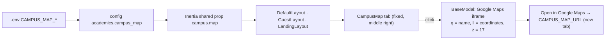

# 49 — Campus Map Report

- **Date:** 2026-10-07
- **Modules:** cross-cutting UI (every layout); no business module in
  `docs/3_business-overview.md` §9 changes
- **Status:** `[Implemented]`
- **Depends on:** report 9 (dashboard shell), report 37 (landing page),
  report 38 (shared UI feedback patterns)
- **Schema change:** none

## 1. Scope

Every page — the landing page, sign-in and password pages, document
verification, and every signed-in page — has a small **campus map** tab fixed
to the middle of the right edge. Pressing it opens a dialog with an embedded
Google map pinned on the campus, the place's name and address, and a link that
opens the place in Google Maps in a new tab.

The place defaults to **ITC Conference Hall**
(HVCX+6F6, Russian Federation Blvd (110), Phnom Penh, Cambodia —
11.5705439, 104.8986445) and is set in `.env`, not in code.

## 2. Configuration

`config/academics.php` → `campus_map`, read from the root `.env`
(`docker/.env.docker.example`, `backend/.env.example`):

| Variable | Use | Default |
|---|---|---|
| `CAMPUS_MAP_NAME` | Searched at the coordinates; shown as the caption title | `ITC Conference Hall` |
| `CAMPUS_MAP_ADDRESS` | Caption under the name | `HVCX+6F6, Russian Federation Blvd (110), Phnom Penh, Cambodia` |
| `CAMPUS_MAP_COORDINATES` | `lat,lng` that pins and centres the map | `11.5705439,104.8986445` |
| `CAMPUS_MAP_URL` | The place's Google Maps link (*Open in Google Maps*) | the ITC Conference Hall place link, tracking parameters removed |

`HandleInertiaRequests` shares the four values as `campus.map` on every
Inertia response, guests included. If both name and coordinates are empty the
tab is not shown.

## 3. How the map is built

- Embed: `https://www.google.com/maps?q=<name>&ll=<lat,lng>&z=17&output=embed`.
  Searching the *name* at the *coordinates* pins that exact place and shows
  Google's place card (name, address, rating). Searching the full address text
  instead pinned the street ("Russian Federation Blvd (110)"), not the
  building — checked in the browser before choosing this form.
- No Google Maps API key is needed (keyless embed). A place link such as
  `CAMPUS_MAP_URL` cannot itself be framed (Google refuses it), so it is only
  the external link.
- The iframe exists only while the dialog is open (`BaseModal` renders its
  content with `v-if`), so pages make no request to Google until someone opens
  the map.

## 4. UI

`frontend/src/components/CampusMap.vue`, mounted once in each layout:

- **Tab:** `fixed right-0 top-1/2 -translate-y-1/2`, 40 × 48 px, `primary`
  fill (dark: `dark-primary`), left corners rounded, `MapPin` icon,
  `aria-label` + tooltip "Campus map" (placement left), `aria-haspopup="dialog"`.
  `z-30`: under the mobile navigation overlay, dialogs and toasts.
- **Dialog:** `BaseModal` `size="xl"`, title "Campus map"; the map is
  `h-80` (`sm:h-96`) with the card border and radius; under it the name,
  address and an `ExternalLink` `IconButton` (*Open in Google Maps*, new tab,
  `rel="noopener noreferrer"`). Escape closes it and focus returns to the tab.
- Verified in headless Chrome: the tab sits flush right at the vertical middle
  on the landing page, sign-in and `/students` (desktop and 390 px phone), no
  horizontal scroll on phones, light and dark themes, the map loads (HTTP 200)
  with the ITC Conference Hall card, no console errors.

The pattern is recorded in `docs/branding/UI-COMPONENTS.md` §16.

## 5. Tests

`backend/tests/Feature/CampusMapTest.php` — guest pages (`/`, `/login`) share
the default place; a signed-in page shares values from config.
Full backend suite: **493 passed** (4913 assertions).

## 6. Decisions

- **Configuration, not code.** The place is institution data; `.env` lets a
  deployment point at another campus without a code change. It is not tied to
  the University record, whose free-text `address` cannot pin a building.
- **One component, three layouts.** Every Inertia page uses one of
  `DefaultLayout`, `GuestLayout` or `LandingLayout`, so mounting the tab there
  covers all pages without touching any page.
- **Edge tab, not a floating round button.** Flush to the edge it overlaps at
  most 8 px of the page's 32 px desktop gutter, so it stays clear of table
  actions there; on phones (16 px gutter) it covers the right edge of the
  content at mid-height. Bottom-right stays free for toasts.
