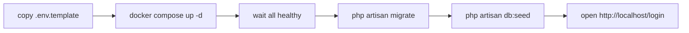
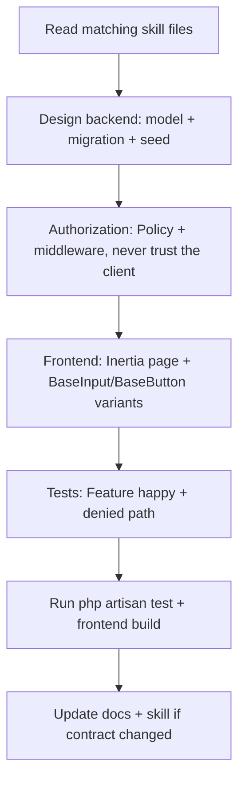

# EduCore — Build-Steps Report

- **Date:** 2026-09-28
- **Base commit:** `d3eb7b0` — `[Feature]: add users management module with session/Sanctum auth and RBAC`
- **Status:** `[Implemented]` Users & Access module; database schema `[Implemented]`; Academic Year & Semester (9.6) `[Implemented]` in the working tree

---

## 1. Executive summary

This report answers two questions:

1. **Is the Users / Access module built?** — **Yes.** Authentication (web session +
   Sanctum API), authorization (RBAC roles, policies, middleware), and the Users
   CRUD are implemented, tested, committed, and pushed to `origin/main`.
   Academic Year & Semester management (9.6) is additionally implemented and
   tested in the working tree, and is not yet committed.
2. **How do we build from now?** — The standardized workflow below: one command to
   boot the stack, one to test, plus the per-module development checklist.

---

## 2. Confirmed current status

| Area | Status | Evidence |
| --- | --- | --- |
| Docker stack (7 services) | `[Implemented]` | All containers on `educore-network` report `healthy` |
| Database schema (49 domain tables) | `[Implemented]` | `docs/4_Database-Migration-Report.md`; migrations applied |
| Roles & RBAC (5 fixed roles, pivot permissions) | `[Implemented]` | `roles`, `permissions`, `permission_role`, `users.role_id` |
| Web login/logout (Inertia + session, CSRF, throttled) | `[Implemented]` | `Auth/AuthenticatedSessionController`, `LoginRequest` |
| API auth (Sanctum tokens) | `[Implemented]` | `Api/AuthController`, `auth:sanctum` routes |
| Users management (index/create/update/soft-delete) | `[Implemented]` | `UserController`, `UserPolicy`, `UserResource`, `Users/{Index,Create,Edit}` |
| Academic Year & Semester management (9.6) | `[Implemented]` | `AcademicYearService`, `SemesterService`, `AcademicYearPolicy`, `SemesterPolicy`, `AcademicYears/{Index,Create,Edit}`, `/api/academic-years`, `AcademicYearSeeder` |
| Access gates (`role:super-admin`, policy checks, `403`) | `[Implemented]` | `EnsureUserHasRole`, `UserPolicy`, middleware wiring |
| Brand/design system for agents | `[Implemented]` | `docs/branding/`, routed by `skills/branding/SKILL.md` |
| Tests | `[Implemented]` | 65 tests / 245 assertions green against isolated `educore_test` DB |
| Login page UI (branding tokens + ITC background/logo) | `[In Progress]` | Local change, not yet committed |

> The business overview (`docs/3_business-overview.md` §9.1) has been updated from
> `[Planned]` to `[Implemented]` to match reality.

### 2.1 Docker invocation (important)

Always run Compose **from the repository root** so relative bind mounts resolve
against the repository, not against `docker/`:

```bash
docker compose --project-directory . -f docker/docker-compose.yml up -d
```

Running it from inside `docker/` resolves `./backend` to `docker/backend` and
Docker silently creates that stray directory, leaving the container without
`artisan`. Build contexts are `./docker/php` and `./docker/frontend`.

---

## 3. Build / run from scratch (single source of truth)

Everything runs in Docker; no local PHP/Node toolchain required. Compose must
always be invoked **from the repo root** so `${VAR}` interpolation reads the root
`.env` — omitting `--project-directory .` silently falls back to `docker/.env`
and can produce wrong credentials (see §7).

```sh
# 1) env (one time): copy template and adjust credentials to your liking
copy docker\.env.docker.example .env          # Windows

# 2) start the full stack (builds images, deps, bucket on first run)
docker compose --project-directory . -f docker/docker-compose.yml up -d

# 3) verify all healthy
docker compose --project-directory . -f docker/docker-compose.yml ps

# 4) schema + data
docker compose --project-directory . -f docker/docker-compose.yml exec backend php artisan migrate
docker compose --project-directory . -f docker/docker-compose.yml exec backend php artisan db:seed
```

`make up` / `make migrate` / `make seed` wrap these exact commands.

### 3.1 URLs after `up`

| URL | Purpose |
| --- | --- |
| `http://localhost` | Web app (nginx → Laravel/Inertia → Vue) |
| `http://localhost/login` | Sign-in page |
| `http://localhost:5173` | Vite dev server (HMR) |
| `http://localhost/api/health` | Laravel health endpoint |
| `http://localhost:5051` | pgAdmin (`PGADMIN_DEFAULT_EMAIL`) |

Login with the seeded Super Admin account — **email/password live in
`backend/database/seeders/UserSeeder.php`** (never printed here; change them in the
seeder + re-run `db:seed --class=UserSeeder` if you rotate them).



---

## 4. Standard development workflow (new module or change)

Follow this sequence for every feature so the codebase, skills, and docs stay in
sync. Read the relevant `skills/*/SKILL.md` **first** (mandatory, see `AGENTS.md`):



1. **Read skills** — `skills/<domain>/SKILL.md` for the module, plus
   `database`, `api`, `authorization`, `branding`, `frontend-ui`, `vue`,
   `testing`, `git-workflow`.
2. **Backend** — migration (number after the last `2026_09_24_1300xx`), model,
   seeder, controller, Form Requests, Policy. Enforce authorization server-side
   (401/403), scope list queries to the caller.
3. **Frontend** — Inertia page under `frontend/src/pages/<Module>/`, reuse the
   existing components (`BaseButton` with `size="lg"` for CTAs, `BaseInput` with
   `variant="glass"` on auth screens), branding tokens only (Academic Blue
   `blue-600`, etc. — see `docs/branding/*`).
4. **Tests** — `backend/tests/Feature/...` covering allow + deny for each action.
   The suite runs against the isolated `educore_test` DB (see §6).
5. **Verify** — backend tests + Pint + `npm run build` in the frontend container.
6. **Commit** — see §5.

---

## 5. Commit & push

- Message format: `[Tag]: description.` — tag from `[Build] [Doc] [Feature]
  [Fix] [Refactor] [Test] [Style] [Chore]` (`skills/git-commit-style`).
- Never commit `.env`, tokens, or secrets; `git status` before staging.
- Feature branches: `feature/<module>-<short>`, PR into integration branch, CI
  green, then merge.

---

## 6. Verification checklist (before you call a build done)

1. `docker compose --project-directory . -f docker/docker-compose.yml ps` → all `healthy`.
2. `docker compose --project-directory . -f docker/docker-compose.yml exec backend php artisan test` → green (19 tests currently).
3. `docker compose --project-directory . -f docker/docker-compose.yml exec backend vendor/bin/pint --test` → clean.
4. `docker exec educore-frontend sh -lc 'cd /app && npm run build'` → clean.
5. UI smoke: `/login` renders, incorrect creds → generic error + rate-limit message, users CRUD works for Super Admin, `403` for others.
6. Real `educore` DB untouched by tests (tests run on `educore_test`, enforced by `phpunit.xml` `<server force="true">` env overrides).

---

## 7. Known pitfalls (build-time)

- **`--project-directory .` is mandatory.** Without it compose interpolates from
  `docker/.env` instead of root `.env`; the backend `environment.DATABASE_PASSWORD`
  falls back to a default and overrides `env_file`, producing
  `password authentication failed`.
- **Existing `pgdata` keeps its original password.** Postgres only honours
  `POSTGRES_PASSWORD` on first init. If `.env` changes the password, sync the
  live role: `ALTER ROLE educore WITH PASSWORD '<new>';` inside postgres.
- **`docker compose down -v` wipes data** — never run it on this stack.

---

## 8. Module status board (current)

| Module | Status |
| --- | --- |
| Authentication & Authorization | `[Implemented]` |
| Database schema (49 tables) | `[Implemented]` |
| Users management | `[Implemented]` |
| Login page (branding + ITC assets) | `[In Progress]` (uncommitted) |
| University / Faculty / Dept / Program | `[Planned]` |
| Students / Lecturers / Courses / Timetable | `[Planned]` |
| Enrollment / Attendance / Assignments | `[Planned]` |
| Exams / Grading / GPA / Dashboard | `[Planned]` |
| Documents / Invoices / Announcements / Internship / Analytics | `[Planned]` |

Next build priority per `docs/3_business-overview.md` roadmap (Month 2 — university
structure & people): **University, Faculty & Department, Program, Student, Lecturer**
management modules, seeded demo data, and CRUD pages following §4.