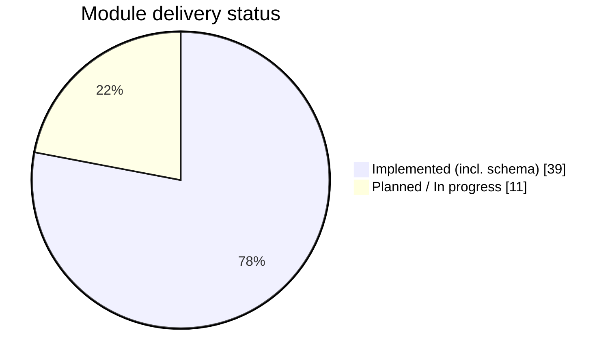
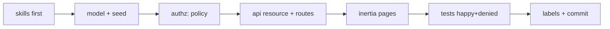

# EduCore — Module Status & Build Roadmap Report

- **Date:** 2026-09-26 (updated 2026-10-02)
- **Source of truth:** `docs/3_business-overview.md` §9 (module list), `docs/5_Build-Steps-Report.md` (build workflow)
- **Status labels:** `[Implemented]` = shipped and tested · `[Planned]` = next, follows this playbook · `[Future]` = later
- **Database:** the full 49-table schema already exists as migrations — **every** module below builds on top of already-migrated tables (see `docs/4_Database-Migration-Report.md`).

---

## 1. Status at a glance — which modules are implemented vs planned

| # | Module (business-overview §9) | Status |
| --- | --- | --- |
| 9.1 | Authentication & Authorization | `[Implemented]` |
| — | Users management (extra, part of 9.1 scope) | `[Implemented]` |
| — | Database schema (49 domain tables) | `[Implemented]` |
| — | Branding / design system + admin dashboard | `[Implemented]` |
| — | API contract & OpenAPI audit | `[Implemented]` |
| — | System Error Logs (9.25, extra operational diagnostics) | `[Implemented]` |
| 9.2 | Student Management | `[Implemented]` |
| 9.3 | Lecturer Management | `[Implemented]` (section assignment `[Planned]` with 9.8) |
| 9.4 | Faculty & Department Management | `[Implemented]` |
| 9.5 | Program Management | `[Implemented]` (curriculum editor delivered with 9.7) |
| 9.6 | Academic Year & Semester Management | `[Implemented]` |
| 9.7 | Course Management | `[Implemented]` (offerings/sections `[Planned]` with 9.8) |
| 9.8 | Class / Section Management | `[Implemented]` |
| 9.9 | Course Registration / Enrollment | `[Implemented]` |
| 9.10 | Timetable Management | `[Implemented]` |
| 9.11 | Attendance | `[Implemented]` |
| 9.12 | Assignments | `[Implemented]` |
| 9.13 | Examinations | `[Implemented]` |
| 9.14 | Grades & GPA | `[Implemented]` (transcript document `[Planned]` with 9.16) |
| 9.15 | Student Academic Dashboard | `[Planned]` |
| 9.16 | Document Management | `[Planned]` |
| 9.17 | Digital Document Verification | `[Planned]` |
| 9.18 | Invoices & Payment Records | `[Planned]` |
| 9.19 | Announcements | `[Planned]` |
| 9.20 | Email Notifications | `[Planned]` |
| 9.21 | Telegram Notifications | `[Planned]` |
| 9.22 | Internship Management | `[Planned]` |
| 9.23 | Analytics & Reporting | `[Future]` |
| 9.24 | Audit Logs & Security | `[Future]` |

> No module is documented as implemented unless it is genuinely tested and running
> (the documentation skill forbids overclaiming).

---

## 2. The shared step-by-step recipe (use for EVERY module)

Read the matching `skills/<module>/SKILL.md` FIRST (mandatory — see `AGENTS.md`),
plus `database`, `api`, `authorization`, `frontend-ui`, `testing`. Then:

1. **Confirm schema** — the table(s) already exist as migrations. Do NOT re-create
   them; add a new migration only for a genuinely new column/table (verify against
   `docs/database/schema-tables.sql`).
2. **Model** — `app/Models/<Entity>.php`: fillable, casts, relationships, scopes
   (`belongsTo` parents, `hasMany` children, soft delete only where history
   matters). Follow the exact relationships in `skills/academic-domain`.
3. **Seeding** — add realistic data to the relevant seeder or a new
   `<Module>Seeder::class`; register it in `DatabaseSeeder`.
4. **Service** (only when logic is non-trivial) — plain PHP class in
   `app/Services/<Module>/`; wrap multi-step writes in `DB::transaction`.
5. **Controller + Form Request + Policy** — thin controllers; validation in
   Requests; authorization in `app/Policies/<Entity>Policy` (never trust the
   client; return `403`).
6. **API Resource + routes** — JSON via `api.users`-namespaced resources under
   `/api/<resource>` (REST conventions in `skills/api`); reuse the existing
   `UserResource` pattern. Name collision rule: give every module's API resource
   `['names' => 'api.<module>']`.
7. **Inertia pages** — `frontend/src/pages/<Module>/` (`Index`, `Create`, `Edit`)
   using `BaseInput`/`BaseButton`/`Pagination`; reuse the Users module screens as
   the template. Authorization-aware UI (hide what the role can't use).
8. **Tests** — `backend/tests/Feature/<Module>/`: happy path + `403` denied per
   role + `422` validation + any domain rules (see the module-specific list in
   §4). Run them.
9. **Verify & ship** — `php artisan test` green, Pint clean, `npm run build`
   clean; update `docs/3_business-overview.md` label `[Planned] → [Implemented]`
   and this report; commit `[Feature]: <module>` per `skills/git-commit-style`.

---

## 3. Verification checklist (same for every module)

1. `docker compose --project-directory . -f docker/docker-compose.yml exec backend php artisan test` → green.
2. `... exec backend vendor/bin/pint --test` → clean.
3. `docker exec educore-frontend sh -lc 'cd /app && npm run build'` → clean.
4. Role checks: Super Admin allowed, Student → `403` on both web and `/api`.
5. Lists are paginated with standard `meta`; errors use the standard JSON shape.
6. Real `educore` DB untouched (tests isolate to `educore_test`).

---

## 4. Step-by-step per-module playbook (build order)

Executed in the order of `docs/3_business-overview.md` §28 roadmap. Each line
lists the tables (already migrated), the model(s), the key steps and tests.

### Phase A — University structure & people

**9.6 Academic Year & Semester** `[Implemented]` — tables `academic_years`,
`semesters`. Delivered: models with column-default parity, enums with
forward-only transitions (`planned → active → completed` and
`planned → open → closed → completed`), `AcademicYearService` /
`SemesterService` owning the business rules (one current year, current must be
active, completing the current year clears the flag, semester dates inside the
parent year, delete guards), `BusinessRuleException` mapped to `409`,
super-admin and university-admin policies, web pages `AcademicYears/Index`,
`AcademicYears/Create`, `AcademicYears/Edit`, resource-transformed `/api/academic-years`
(nested `/semesters`) with OpenAPI annotations, `AcademicYearSeeder`, and 39
feature tests.

**9.5 Program Management** — table `programs`. Delivered: `ProgramService` owning
the rules (unique code, name unique per department via the new
`uq_programs_department_id_name`, archive via `is_active`, delete refused while
`student_programs` or `course_programs` reference the program — never the
schema's silent cascade), `ProgramPolicy` (Faculty Admin read-only), web pages
`Programs/Index|Edit`, `/api/programs` with OpenAPI annotations,
`ProgramSeeder`, 24 feature tests. Curriculum (program ↔ course) is deferred to
9.7. Report: `docs/10_Program-Management-Report.md`.

**9.4 Faculty & Department** — tables `universities`, `faculties`, `departments`.
Delivered: `UniversityService` / `FacultyService` / `DepartmentService` owning the
rules (single `is_current` university, unique faculty names, department names
unique per faculty, archive-vs-delete, delete guards that count soft-deleted
children), `BusinessRuleException` mapped to `409`, read access for super-admin,
university-admin and faculty-admin with writes restricted to super-admin and
university-admin, pages `Universities/Index`, `Universities/Edit`,
`Faculties/Index` (with inline department management), `Faculties/Edit`,
resource-transformed `/api/universities`, `/api/faculties`, `/api/departments`
plus a `/api/faculties-tree` read endpoint, OpenAPI annotations, an idempotent
`UniversityStructureSeeder` (1 university / 3 faculties / 6 departments) and 49
feature tests.

**9.5 Program** — table `programs`.
Steps: CRUD scoped to a department, unique `(department_id, code)`, page
`Programs/`, tests.

**9.2 Student Management** — tables `students`, `student_programs`, `users`.
Steps: create student (creates linked `users` row with a Student ID + temporary
password, hashed), enroll student into programs, list with filters
(`filters[program_id]`, `filters[status]`), soft delete; pages `Students/`;
tests: create duplicates rejected, student sees only own profile, others `403`.

**9.3 Lecturer Management** — tables `lecturers`, `users`. Delivered:
`LecturerService` (account created via `UserRepository` or an existing
Lecturer-role account linked, in one transaction; profile/account `is_active`
mirrored; delete keeps the account inactive and is refused while
`section_lecturers` rows exist), `LecturerPolicy` (lecturer reads own profile,
Faculty Admin read-only), `Lecturers/Index|Edit`, `/api/lecturers` with OpenAPI
annotations, `LecturerSeeder`, 23 feature tests. Department-scoped visibility
waits for unit scoping on the user record. Report:
`docs/12_Lecturer-Management-Report.md`.

### Phase B — Academic core

**9.7 Course Management** — tables `courses`, `course_programs`,
`course_prerequisites` (`course_offerings` is guarded but not managed yet).
Delivered: `CourseService` (lifecycle, unique code, acyclic prerequisites via an
iterative graph walk, delete guards for curricula / dependents / offerings),
`ProgramService` curriculum methods (membership stays with the program),
`CoursePolicy` (Faculty Admin read-only), `Courses/Index|Edit`, the curriculum
editor on `Programs/Edit`, `/api/courses` and `/api/programs/{program}/courses`
with OpenAPI annotations, `CourseSeeder`, 32 feature tests. Offerings and
sections are deferred to 9.8 (they need lecturers, rooms, timetable). Report:
`docs/11_Course-Management-Report.md`.

**9.8 Class / Section Management** — tables `sections`, `rooms`,
`section_lecturers`, `course_offerings`.
Steps: sections under an offering, room assignment, multiple lecturers (pivot);
pages `Sections/`; tests: allocation rule (lecturer-FK restrict).

**9.9 Course Registration / Enrollment** — tables `enrollments`,
`student_programs`.
Steps: **transactional** service `RegistrationService` (enrollment + seat checks
+ duplicate rejection via the unique constraint), capacity/seat decrement
according to `skills/enrollment`; pages `Enrollments/`; tests: prerequisites,
capacity, duplicates, atomicity.

**9.10 Timetable** — table `schedule_entries`.
Steps: slot CRUD validating the unique clock/room constraint
`(scheduleable_type, scheduleable_id, day_of_week, start_time, room_id)`;
pages `Timetables/`; tests: conflict rejection `409`.

**9.11 Attendance** — tables `attendance_sessions`, `attendance_records`.
Steps: lecturer creates a session for a section, marks records, percentage
calc in `AttendanceService`; pages `Attendance/`; tests: recording + percentage
calculation.

### Phase C — Assessment & student visibility

**9.12 Assignments** — tables `assignments`, `assignment_submissions`.
Steps: assignment CRUD + submission upload (MinIO via `skills/file-storage`),
late/deadline validation; tests: submission authorization.

**9.13 Examinations** — tables `exams`, `exam_results`.
Steps: exam plan + results entry, ordering of results; tests: results only by
lecturer/student owner.

**9.14 Grades & GPA** `[Implemented]` — tables `grading_scales`,
`course_grading_configs`, `grades`, `gpa_records` (no schema change).
Delivered: `GradingService` (active scale with derived gap-free bands, course
weights that must total 100, a grade sheet computed from attendance rate,
coursework and exam results with unmeasurable components rescaled, draft →
submitted → approved / returned workflow; approval completes enrollments),
`GpaService` (credit-weighted semester and per-year cumulative snapshots rebuilt
on approve / return / course credit change, latest attempt per course counts
cumulatively), grade-based prerequisites, `GradePolicy`, pages
`Grades/Section|Index|Scale|Mine` plus the course *Grading weights* card,
`/api/sections/{section}/grades…`, `/api/students/{student}/grades|gpa`,
`/api/grading-scale`, `/api/courses/{course}/grading-config` with OpenAPI
annotations, `GradingScaleSeeder`, 12 feature tests. Report:
`docs/20_Grades-and-GPA-Report.md`.

**9.15 Student Academic Dashboard** — read-only pages aggregating enrollments,
attendance %, GPA, timetable (`withCount`/`withSum`, eager load, no N+1).

### Phase D — Administration & communication

**9.16 / 9.17 Document Management & Verification** — tables `document_types`,
`document_requests`, `documents`, `document_verifications`, `files`.
Steps: request → approval → generation → QR verification flow
(`skills/documents`); tests: download authorization, verification lookup.

**9.18 Invoices & Payments** — tables `invoices`, `invoice_items`, `payments`.
Steps: append-only invoice/reversal model; totals from line items; tests:
status transitions + totals.

**9.19 Announcements** — table `announcements`.
Steps: CRUD visible by audience scope; pages `Announcements/`.

**9.20 / 9.21 Email & Telegram Notifications** — tables `notifications`,
`notification_preferences`.
Steps: Laravel Notifications, queue on Redis, preference checks before send;
tests: queued notification dispatched with correct payload.

### Phase E — Internship & hardening (`[Future]`)

**9.22 Internship** — tables `internship_companies`, `internships`,
`internship_reports`, `internship_evaluations`.
**9.23 Analytics & Reporting** — aggregation/read models (never iterate in PHP).
**9.24 Audit Logs & Security** — table `audit_logs`; log sensitive access;
hardening pass (locking, Superset-free reporting, deployment).

---

## 5. Every-module output (definition of done)

Code:

- Model + relationships per `skills/academic-domain`; schema not duplicated.
- Thin controller + Form Request + Policy (server-side `403`).
- `/api/<resource>` CRUD with `auth:sanctum` + namespaced route names.
- Inertia `Index/Create/Edit` pages reusing the Users vertical.
- Feature tests asserted happy + denied + invalid; suite stays green.

Documentation (same commit as the code — see `AGENTS.md` and
`skills/documentation/SKILL.md`):

- New numbered report `docs/N_<Module>-Report.md`: scope, schema, models,
  endpoints, authorization matrix, UI, tests, decisions, Mermaid diagrams.
- This report: the §1 status label, the §4 playbook entry, and §6 open items
  the module closed.
- `docs/3_business-overview.md` §9 label flipped to `[Implemented]`.
- `docs/api/api-audit.md` rows for every new or changed endpoint.
- `README.md` when ports, env vars, commands, or routes change;
  `docs/database/` when the schema changes.

A module is not done until its report exists and its tests pass — never label
`[Implemented]` on intent alone. Ship one `[Feature]: ...` commit per module.

---

## 6. Open items

- `[Done]` Login page UI (branding, ITC background/logo) — shipped in `7a32f08`.
- `[Done]` Pre-existing Pint failures on the 49 migration files — fixed with a
  single trailing-newline pass; `vendor/bin/pint` is now clean (148 files).
- `[Done]` Docker build contexts resolved from the wrong directory
  (`./php`, `./frontend` → `./docker/php`, `./docker/frontend`). The stack must
  always be started from the repository root, e.g.
  `docker compose --project-directory . -f docker/docker-compose.yml up -d`;
  running it from inside `docker/` silently bind-mounts a stray `docker/backend`.
- `[Done]` Brand/design system in `docs/branding/` is now reachable by agents
  through `skills/branding/SKILL.md`, which is wired into `AGENTS.md`.
- `[Done]` `DESIGN-TOKENS.md` §15 `@theme` block implemented in
  `frontend/src/style.css` — semantic tokens, dark-mode variants and animations
  are live (commit `d359090`).
- `[Done]` OpenAPI schema classes for Academic Year/Semester/Users are defined
  under `backend/app/OpenApi/Schemas/` (commit `9737dc5`).
- `[Done]` Generated Swagger assets are gitignored:
  `backend/public/build` and `backend/storage/api-docs` (commit `e3405dc`).
- `[Done]` Branded admin dashboard, reusable component library and role-aware
  redirects shipped in `d359090`; API contract audit in `9737dc5`.
- `[Done]` 9.4 Faculty & Department Management (`universities`, `faculties`,
  `departments`) — unlocks 9.5 Programs and makes the dashboard faculty and
  program metrics real. Report: `docs/7_Faculty-and-Department-Report.md`.
- `[Done]` 9.25 System Error Logs (`error_logs`) — Super Admin-only, read-only
  capture of HTTP 404/5xx responses via `$exceptions->respond()`, distinct from
  9.24's planned audit trail. Report: `docs/8_System-Error-Logs-Report.md`.
- `[Done]` 9.5 Program Management (`programs`). Report:
  `docs/10_Program-Management-Report.md`.
- `[Done]` 9.7 Course Management (`courses`, `course_prerequisites`,
  `course_programs`). Report: `docs/11_Course-Management-Report.md`.
- `[Done]` 9.3 Lecturer Management (`lecturers`). Report:
  `docs/12_Lecturer-Management-Report.md`.
- `[Done]` Sign-in refuses inactive accounts (`users.is_active`) with the
  generic error, web and API. `[Open]` sessions/tokens issued before a
  deactivation stay valid until logout or expiry.
- `[Done]` 9.2 Student Management (`students`, `student_programs`). Report:
  `docs/13_Student-Management-Report.md`.
- `[Done]` 9.8 Class / Section (`course_offerings`, `sections`,
  `section_lecturers`). Report: `docs/14_Class-and-Section-Report.md`.
- `[Done]` 9.9 Enrollment (`enrollments`). Report: `docs/15_Enrollment-Report.md`.
- `[Done]` 9.10 Timetable (`rooms`, `schedule_entries`; dropped the global
  `uq_schedule_room_slot`). Report: `docs/16_Timetable-Report.md`.
- `[Done]` 9.11 Attendance (`attendance_sessions`, `attendance_records`).
  Report: `docs/17_Attendance-Report.md`.
- `[Done]` 9.12 Assignments (`assignments`, `assignment_submissions`, `files`;
  private MinIO uploads). Report: `docs/18_Assignments-Report.md`.
- `[Done]` Test-database guard (`tests/TestCase`) and production-only config
  caching in the container entrypoint, after a cached config let the suite
  reset the development database.
- `[Done]` Assignment and exam scores are weighted into course grades (9.14).
  `[Open]` Lecturer-attached materials are not built.
- `[Done]` 9.13 Examinations (`exams`, `exam_results`). Report:
  `docs/19_Examinations-Report.md`.
- `[Open]` Exam result corrections are not audited yet (9.24 Audit Logs).
- `[Done]` 9.14 Grades & GPA (`grading_scales`, `course_grading_configs`,
  `grades`, `gpa_records`); prerequisites now require an approved passing grade
  when a grade exists. Report: `docs/20_Grades-and-GPA-Report.md`.
- `[Done]` API re-audit 2026-10-02: six PATCH aliases documented; R-01 marked
  resolved (`docs/api/api-audit.md`).
- `[Open]` Grade changes are not audited yet (9.24); the official transcript
  document waits for 9.16; the `finalized` grade lock step is not built.
- `[Next]` 9.15 Student Academic Dashboard (GPA, attendance, credits and recent
  grades now all have a source).