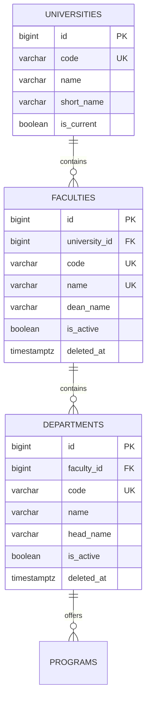
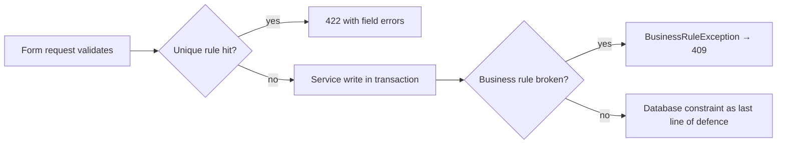
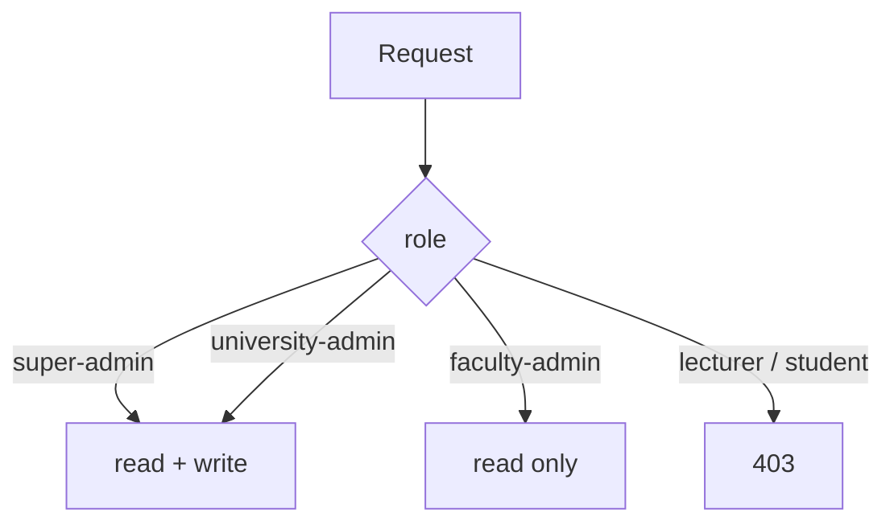

# 7 — Faculty & Department Report (Module 9.4)

- **Date:** 2026-09-28
- **Module:** 9.4 Faculty & Department Management (business-overview §9.4)
- **Status:** `[Implemented]`
- **Base commit:** `9737dc5`

---

## 1. Scope

Module 9.4 models the institutional hierarchy that every later academic module
hangs from: `university → faculty → department → program`. It owns three tables
(`universities`, `faculties`, `departments`), the business rules that keep that
hierarchy valid, an admin UI, and a read/write REST API.

`programs` itself is **not** in scope — it is Module 9.5 and consumes the
departments created here.

Out of scope for this module:

- Program curriculum (9.5).
- Lecturer/department assignments (9.3 / 9.15).
- Logo upload to MinIO — `universities.logo_key` is reserved but unused.

---

## 2. Data model



`universities` is single-tenant reference data with an `is_current` flag and
deliberately **no** `deleted_at`. `faculties` and `departments` are archivable.

### 2.1 Schema change

One additive migration —
`backend/database/migrations/2026_09_28_160000_add_uniqueness_and_archive_to_academic_structure.php`:

| Change | Reason |
|---|---|
| `faculties.name` → `uq_faculties_name` | A dean name must be unambiguous across the institution |
| `departments.deleted_at` | Departments are referenced by programs, courses and lecturers, so removal must be reversible |
| `(faculty_id, name)` → `uq_departments_faculty_id_name` | Department names are unique *within* a faculty, not globally — two faculties may both run a "Department of Mathematics" |

No column was dropped, renamed or retyped, so `down()` is a clean inverse and
existing rows cannot violate the new constraints.



Validation is layered deliberately: form requests give friendly field-level
messages, the database guarantees integrity even if a rule is bypassed. Tests
assert both layers.

---

## 3. Models, DTOs and services

| Class | Responsibility |
|---|---|
| `Models/University` | `faculties()` hasMany, `current()` static scope |
| `Models/Faculty` | `university()` belongsTo, `departments()` hasMany, `SoftDeletes` |
| `Models/Department` | `faculty()` belongsTo, `SoftDeletes` |
| `Dto/UniversityStructure/UniversityListFilters` | `search`, `per_page`, sort whitelist |
| `Dto/UniversityStructure/FacultyListFilters` | `search`, `filters[university_id]`, `filters[is_active]`, `sort_by`, `sort_dir`, `per_page` |
| `Dto/UniversityStructure/DepartmentListFilters` | `search`, `filters[faculty_id]`, `filters[is_active]` |
| `Services/UniversityService` | `paginate`, `create`, `update`, `makeCurrent`, `delete` |
| `Services/FacultyService` | `paginate`, `create`, `update`, `archive`, `reactivate`, `delete` |
| `Services/DepartmentService` | `paginate`, `listForFaculties`, `create`, `update`, `archive`, `reactivate`, `delete` |

`sort_by` is validated against an explicit `SORTABLE` whitelist in each DTO —
client input never reaches `orderBy()` unfiltered.

### 3.1 Business rules

| Rule | Enforced by | Failure |
|---|---|---|
| Exactly one university holds `is_current` | `UniversityService::makeCurrent()` clears the previous row in the same transaction | — |
| The current university cannot be deleted | `UniversityService::delete()` | `409` |
| A university with faculties cannot be deleted | `UniversityService::delete()` uses `withTrashed()` so an **archived** faculty still blocks deletion | `409` |
| A faculty with departments cannot be deleted | `FacultyService::delete()` | `409` |
| A department referenced by `programs`, `courses` or `lecturers` cannot be deleted | `DepartmentService::delete()` counts `CHILD_TABLES` | `409` |
| Faculty names unique | `StoreFacultyRequest` / `UpdateFacultyRequest` + `uq_faculties_name` | `422` / DB error |
| Department names unique per faculty | `StoreDepartmentRequest` / `UpdateDepartmentRequest` + `uq_departments_faculty_id_name` | `422` / DB error |

`UpdateDepartmentRequest` ignores the incoming `faculty_id` when validating
uniqueness and falls back to the department's **current** faculty, so moving a
department to another faculty cannot be blocked by a name that is only a
duplicate of its own row.

`BusinessRuleException` is mapped to `409 Conflict` by the shared exception
handler; on web routes it surfaces as a flash error instead.

---

## 4. Authorization

Faculty Admin has no `faculty_id`/`department_id` on its user row, so it cannot
be scoped to one unit. The module therefore grants **global read** and no write.



| Ability | Super Admin | University Admin | Faculty Admin | Lecturer | Student |
| --- | :---: | :---: | :---: | :---: | :---: |
| View universities | yes | yes | yes | no | no |
| Create / update / delete university | yes | yes | **no** | no | no |
| Make current | yes | yes | **no** | no | no |
| View faculties / departments / tree | yes | yes | yes | no | no |
| Create / update faculty | yes | yes | **no** | no | no |
| Archive / reactivate / delete faculty | yes | yes | **no** | no | no |
| Create / update department | yes | yes | **no** | no | no |
| Archive / reactivate / delete department | yes | yes | **no** | no | no |

Enforcement is doubled:

1. **Routes** — `EnsureUserHasRole:super-admin,university-admin,faculty-admin` on
   reads, `EnsureUserHasRole:super-admin,university-admin` on writes.
2. **Policies** — `UniversityPolicy`, `FacultyPolicy`, `DepartmentPolicy` back the
   route middleware, so a policy change is not bypassed by route wiring alone.

Read-only users additionally get a UI that hides the controls rather than
letting them fail with a `403`. `Faculties/Index.vue` and
`Universities/Index.vue` compute `canManage` from `auth.user.role.slug` and
render "Read only" in the actions column.

---

## 5. API

Read endpoints accept `super-admin`, `university-admin`, `faculty-admin`;
write endpoints accept `super-admin`, `university-admin` only. All require
`auth:sanctum`.

| Method | Path | Purpose |
|---|---|---|
| GET | `/api/universities` | List, `?search=`, `?per_page=` |
| POST | `/api/universities` | Create |
| GET | `/api/universities/{university}` | Show |
| PUT, PATCH | `/api/universities/{university}` | Update |
| DELETE | `/api/universities/{university}` | Delete (guarded) |
| POST | `/api/universities/{university}/current` | Promote to current |
| GET | `/api/faculties` | List, `?search=`, `filters[university_id]`, `filters[is_active]` |
| POST | `/api/faculties` | Create |
| GET | `/api/faculties/{faculty}` | Show |
| PUT, PATCH | `/api/faculties/{faculty}` | Update |
| DELETE | `/api/faculties/{faculty}` | Delete (guarded) |
| POST | `/api/faculties/{faculty}/archive` | Archive |
| POST | `/api/faculties/{faculty}/reactivate` | Reactivate |
| GET | `/api/departments` | List, `?search=`, `filters[faculty_id]`, `filters[is_active]` |
| POST | `/api/departments` | Create |
| GET | `/api/departments/{department}` | Show |
| PUT, PATCH | `/api/departments/{department}` | Update |
| DELETE | `/api/departments/{department}` | Delete (guarded) |
| POST | `/api/departments/{department}/archive` | Archive |
| POST | `/api/departments/{department}/reactivate` | Reactivate |
| GET | `/api/faculties-tree` | Nested faculty → department tree for pickers |

`/api/faculties-tree` returns the whole hierarchy in one round trip so
downstream modules (9.5 programs, 9.8 sections) can populate a cascading
selector without N+1 calls.

Responses are transformed by `UniversityResource`, `FacultyResource` and
`DepartmentResource`. Counts (`faculties_count`, `departments_count`) are
computed with `withCount()` so the list screen needs no extra queries.

The generated document has **24 paths / 45 operations / 42 schemas**, all
undocumented-operation-free. Regenerate with:

```sh
docker compose --project-directory . -f docker/docker-compose.yml \
  exec -T backend php artisan l5-swagger:generate
```

---

## 6. Web UI

| Route | Page | Props |
|---|---|---|
| `GET /universities` | `Universities/Index` | `universities` (paginated), `filters.search` |
| `GET /universities/{university}/edit` | `Universities/Edit` | `university` |
| `GET /faculties` | `Faculties/Index` | `faculties` (paginated), `departments` (for visible faculties), `universities`, `filters` |
| `GET /faculties/{faculty}/edit` | `Faculties/Edit` | `faculty`, `universities` |

`Faculties/Index` manages departments inline: the department count cell toggles
an expandable panel listing that faculty's departments with archive/reactivate/
delete controls, so a whole faculty can be curated from one screen.

### 6.1 Notes for maintainers

- **Single-resource props use `->resolve()`.** Handing a model straight to
  `Inertia::render()` nests it as `{ data: {...} }`, which the pages do not
  expect. `FacultyController`, `UniversityController`, `UserController` and
  `AcademicYearController` all call `->resolve()`. Regression tests exist for the
  user and academic-year pages.
- **Forms use Inertia `useForm`,** not a plain object. A plain
  `const form = {...}` is not reactive, so `form.errors = errors` in an
  `onError` callback never re-renders and validation messages silently vanish.
- **Department props are scoped to the visible page.** `FacultyController@index`
  calls `DepartmentService::listForFaculties()` with the ids on the current page;
  loading every department in the institution would not scale past a few pages.
- **`StatusBadge` renders `archived`** from `is_active = false`.
- **The sidebar accent bar was removed** from `DefaultLayout.vue` at the user's
  request; active items are indicated by background and text weight only.

---

## 7. Seed data

`UniversityStructureSeeder` runs after `RoleSeeder`/`UserSeeder` and before
`AcademicYearSeeder`. It is idempotent — rows are matched on natural keys, so
`db:seed` twice converges instead of duplicating.

| University | Faculty | Departments |
|---|---|---|
| `ITC` — Institute of Technology Cambodia | `ENG` | `CSE`, `EEE` |
| | `SCI` | `PHY`, `MTH` |
| | `HSS` | `ENG-L`, `ECO` |

The university is promoted through `UniversityService::makeCurrent()` so seeding
and the UI share one code path for the single-current invariant. Verified
against the running stack: 1 university, exactly 1 current, 3 faculties,
6 departments.

---

## 8. Tests

`backend/tests/Feature/FacultyDepartment/FacultyDepartmentManagementTest.php`
— **49 tests / 187 assertions**. Full suite: **121 tests / 487 assertions**.

| Area | Covered |
|---|---|
| Authorization | Faculty Admin read-only across web + API incl. edit screens; lecturer/student `403`; university admin may write |
| University rules | create, update, promote current, delete current refused, delete with faculties refused, delete blocked by an archived faculty, empty delete succeeds |
| Faculty rules | create, update, archive, reactivate, delete guarded, global name uniqueness |
| Department rules | nested create/update/archive/reactivate/delete, per-faculty name uniqueness, child-reference guard, scope fallback on move |
| Screens | Inertia component names and prop shape for every page, flat edit props |
| Database | `uq_faculties_name`, `uq_departments_faculty_id_name` |
| Web forms | create faculty, add nested department, duplicate rejection, business rule → flash error |
| Seeder | idempotency |

### Verification run

| Check | Result |
|---|---|
| `php artisan test` | 121 passed (487 assertions) |
| `php artisan test --filter=FacultyDepartment` | 49 passed (187 assertions) |
| `vendor/bin/pint --test` | PASS, 210 files |
| `npm run build` | built in 13.59s |
| `php artisan migrate:status` | nothing pending |
| `php artisan route:list` | structure routes registered with expected middleware |
| `l5-swagger:generate` | 0 errors |
| Live smoke | `/admin/dashboard`, `/universities`, `/faculties` all render with the expected Inertia props |

---

## 9. Decisions

1. **Faculty Admin gets global read, never scoped access.** Its user row carries
   no `faculty_id`, so per-unit scoping would be a fiction. Read-everything is
   honest; write is refused everywhere.
2. **Archive is not delete.** Archiving flips `is_active`; hard delete is only
   for rows nothing references. `departments` gained `deleted_at` for exactly
   this reason.
3. **Departments are unique per faculty, faculties globally.** Matches how
   faculties are actually named and keeps `uq_faculties_name` meaningful.
4. **Delete guards count soft-deleted children.** Without `withTrashed()` an
   archived faculty would let its university be deleted out from under it.
5. **The university is single-tenant reference data.** It has `is_current`, not
   `deleted_at` — there is no archived history to keep.
6. **Write controls are hidden for read-only roles** instead of rendered and
   left to 403. The route still rejects the request; hiding is a courtesy, not
   the control.
7. **Creation lives on index pages only.** `Universities/Edit` originally
   duplicated the create modal; it was removed so each record has one
   obvious place to be created.
8. **Forms use `useForm`.** Matching the existing convention removed the
   `errors: undefined` hack and made `form.errors` reactive.

---

## 10. Follow-ups

- Module 9.5 programs will attach to `departments` and must respect
  `DepartmentService::delete()`'s child guard.
- The dashboard's faculty and program metrics can now be made real.
- `universities.logo_key` is reserved; wiring MinIO upload is deferred.