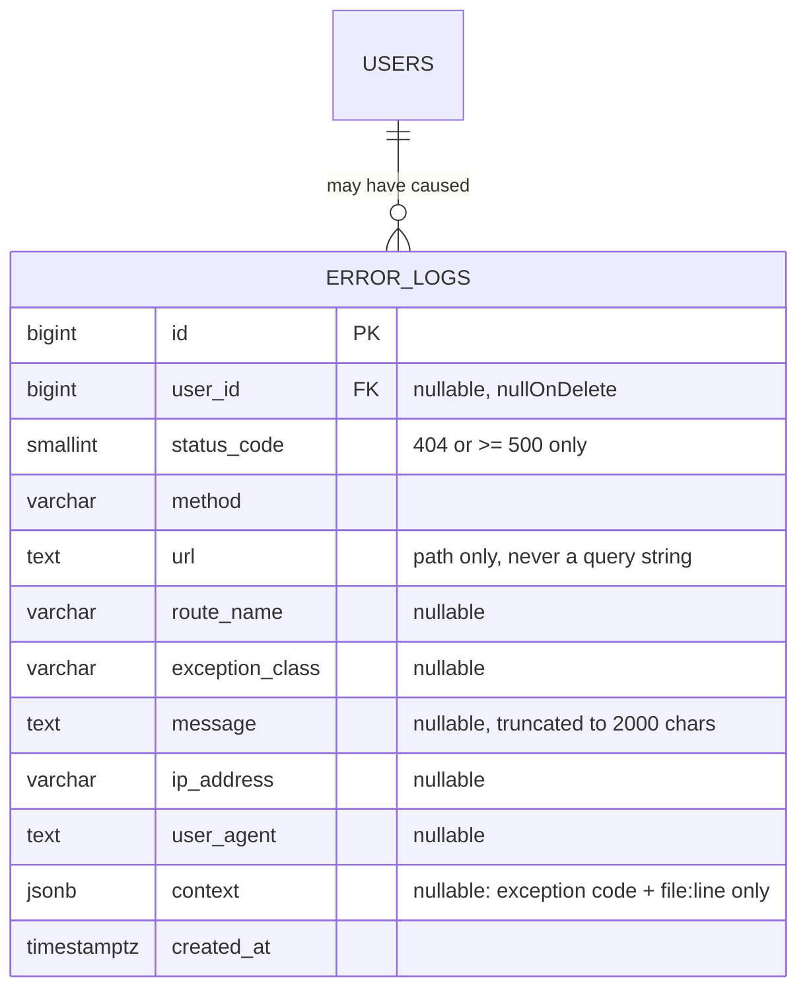
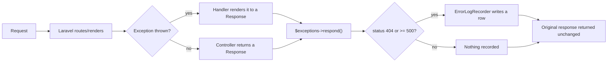
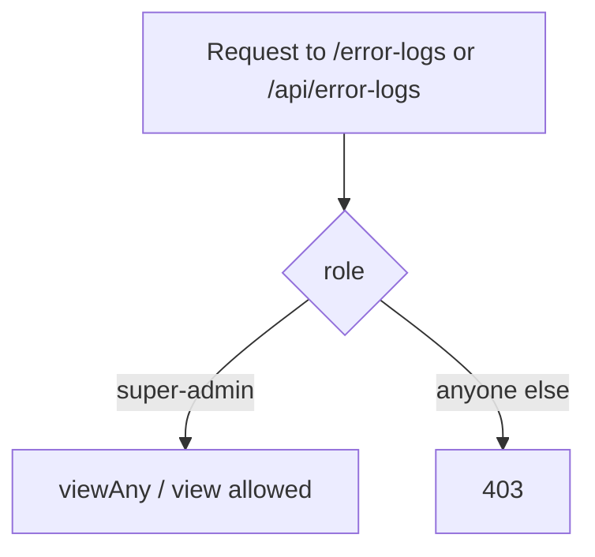

# 8 — System Error Logs Report (Module 9.25)

- **Date:** 2026-10-01
- **Module:** 9.25 System Error Logs (business-overview §9.25, extra operational module)
- **Status:** `[Implemented]`
- **Base commit:** `97e1805`

---

## 1. Scope

A Super Admin diagnostic screen that records every HTTP **404** and **5xx**
response the application produces, so failures are visible without reading
server log files. It owns one table (`error_logs`), a response-level capture
hook, a read-only web/API surface, and seeded realistic examples.

Deliberately distinct from **9.24 Audit Logs & Security** (still `[Planned]`):
`audit_logs` will record *business changes* (who created/updated/deleted what);
`error_logs` records *failed requests*. The two tables, and the reasoning
behind keeping them separate, are documented in `skills/audit-logging/SKILL.md`.

Out of scope:

- Any write/update/delete endpoint — the table is append-only.
- A sidebar navigation entry — this is a diagnostic tool reached by typing
  `/error-logs`, not a page anyone navigates to while working.
- Statuses that are normal control flow: `401`, `403`, `409`, `422`.
- Request bodies, headers, or query strings — only the path, method, a few
  response/exception facts, and non-sensitive context are stored.

---

## 2. Data model



`error_logs` has **no `updated_at`** (`ErrorLog::UPDATED_AT = null`) and no
`deleted_at` — rows are immutable observational data, never edited or voided,
mirroring the append-only stance `audit_logs` takes.

Migration:
`backend/database/migrations/2026_09_29_090000_create_error_logs_table.php`.
Indexes on `created_at` (list ordering) and `status_code` (the status-group
filter). `user_id` uses `nullOnDelete`: most 404s happen before
authentication, and deleting a user must not erase the evidence of what they
hit.

---

## 3. Capture mechanism



The hook is registered in `backend/bootstrap/app.php` via
`$exceptions->respond(fn ($response, $exception, $request) => ...)`, which
Laravel calls after **every** exception is rendered to its final response —
this is deliberately *not* `$exceptions->report()`:

> Laravel keeps `HttpException` (and therefore `NotFoundHttpException`) in its
> internal `$dontReport` list, so a plain 404 never reaches `report()`. The
> rendered response is the only place both 404s and 5xxes are observable with
> their final status code.

`App\Services\ErrorLogRecorder`:

- `isRecordable(int $status)` — `true` for `404` or `>= 500` only.
- `record()` wraps the write in a `try/catch`: if the database is unreachable,
  the original response is still returned and the failure goes to the normal
  Laravel log instead — **recording a failure must never cause a worse one.**
- Stores `'/'.ltrim($request->path(), '/')` — the path only. Query strings
  routinely carry tokens (`?token=...`), so they are dropped entirely rather
  than redacted.
- Truncates `message`/`user_agent` to 2000 characters so one pathological
  stack trace cannot bloat a row.
- `context` is limited to the exception's `code` and `file:line` — never the
  request body, headers, or session.

### 3.1 What is excluded on purpose

| Status | Meaning | Recorded? |
|---|---|---|
| `401` | Unauthenticated | No — normal login flow |
| `403` | Authorization denied | No — normal permission check |
| `404` | Not found | **Yes** |
| `409` | Business-rule conflict | No — handled flow (`BusinessRuleException`) |
| `422` | Validation failed | No — handled flow |
| `>= 500` | Unhandled failure | **Yes** |

Logging `401`/`403`/`409`/`422` would bury genuine failures in noise and train
admins to ignore the table.

---

## 4. Authorization



`ErrorLogPolicy::viewAny()` / `view()` both require `Role::SuperAdmin`. A row
exposes an exception class, a message and the originating path — enough to
fingerprint internals — so even University Admin and Faculty Admin, who
administer parts of the platform elsewhere, are refused here. Enforced by
route middleware (`role:super-admin`) *and* the policy, matching the
doubled-enforcement pattern used in 9.4.

| Ability | Super Admin | Everyone else |
|---|:---:|:---:|
| View list / detail (web) | yes | 403 |
| View list / detail (API) | yes | 403 |
| Create / update / delete | **no one — no such endpoint** | — |

---

## 5. API

All routes require `auth:sanctum` + `role:super-admin`. There is no
create/update/delete route — the table is append-only by omission, not by a
guarded action.

| Method | Path | Purpose |
|---|---|---|
| GET | `/api/error-logs` | List, `?search=`, `filters[status_code]`, `filters[status_group]`, `filters[method]`, `sort_by`, `sort_dir`, `per_page` |
| GET | `/api/error-logs/{errorLog}` | Show |

`search` matches (case-insensitive) against `url`, `message` and
`exception_class`. `status_group` is `server` (status `>= 500`) or
`not_found` (status `404`) — the two ways an admin actually thinks about this
table. `sort_by` is checked against an explicit whitelist
(`ErrorLogListFilters::SORTABLE`) before reaching `orderBy()`.

Responses are transformed by `ErrorLogResource`, which adds the derived
`is_server_error` / `is_not_found` booleans and nests the attributed user
(`whenLoaded`).

The generated document grew from **24 → 26 paths**, **45 → 47 operations**,
**42 → 45 schemas**. Regenerate with:

```sh
docker compose --project-directory . -f docker/docker-compose.yml \
  exec -T backend php artisan l5-swagger:generate
```

---

## 6. Web UI

| Route | Page | Props |
|---|---|---|
| `GET /error-logs` | `ErrorLogs/Index` | `errorLogs` (paginated), `filters`, `summary` (`total`, `server_errors`, `not_found`) |
| `GET /error-logs/{errorLog}` | `ErrorLogs/Show` | `errorLog` (flat, via `->resolve()`) |

### 6.1 Notes for maintainers

- **No sidebar entry, by design.** `DefaultLayout.vue` was not touched. This
  is a diagnostic screen reached by typing the URL directly, not a page
  anyone navigates to in normal use.
- **Read-only screens.** `Index.vue` has search/filter controls and a table;
  `Show.vue` has no edit form — there is nothing to edit.
- **Single-resource prop uses `->resolve()`** on the show page, following the
  same rule documented in `docs/7_Faculty-and-Department-Report.md` §6.1:
  handing a bare `JsonResource` to `Inertia::render()` nests it under `data`,
  which the page does not expect.
- Status codes are colour-coded (`warning` for 404, `error` for `>= 500`) via
  the existing `BaseBadge` variants.

---

## 7. Seed data

`ErrorLogSeeder` runs last in `DatabaseSeeder`, after the structure and
academic calendar, so attributed rows can reference real Super Admin /
University Admin accounts. It is idempotent — rows are matched on
`(status_code, url)` via `updateOrCreate`, so re-running `db:seed` refreshes
timestamps instead of duplicating rows.

Seeded mix: 6 anonymous/attributed `404`s (stale links, wrong IDs, a 404 on
`/error-logs` itself, a `curl` scanner hit) and 5 `5xx`s carrying a real
exception class and message (`QueryException` ×2, `ValidationException`,
`RuntimeException`, `TransportException`) — the shape an admin actually reads.

---

## 8. Tests

`backend/tests/Feature/ErrorLogs/ErrorLogManagementTest.php` — **29 tests / 90
assertions**. Full suite: **150 tests / 577 assertions**.

| Area | Covered |
|---|---|
| Capture — included | `404`, `500`, `503` are recorded |
| Capture — excluded | `401`, `403`, `409`, `422`, `2xx` are **not** recorded |
| Privacy | query string is dropped; only the path is stored |
| Authorization | Super Admin only, web + API, unauthenticated redirected/401 |
| Search | matches `url` / `message` / `exception_class` |
| Filters | `status_code`, `status_group` (`server`/`not_found`), `method` |
| Sort | `created_at` desc (default), `status_code` asc |
| Pagination | `per_page` cap respected |
| Append-only | no create/update/delete route (`405` on those verbs) |
| Detail | web `ErrorLogs/Show` + API `show` return the expected row |
| Seeder | idempotency |

### Verification run

| Check | Result |
|---|---|
| `php artisan test` | 150 passed (577 assertions) |
| `php artisan test --filter=ErrorLog` | 29 passed (90 assertions) |
| `vendor/bin/pint --test` | PASS after one `pint` fix pass, 225 files |
| `npm run build` | built in 4.01s |
| `php artisan migrate` | `2026_09_29_090000_create_error_logs_table` ran |
| `php artisan route:list --path=error-logs` | 4 routes registered with expected middleware |
| `l5-swagger:generate` | 0 errors; 26 paths / 47 operations / 45 schemas |

---

## 9. Decisions

1. **Response hook, not `report()`.** `NotFoundHttpException` is in Laravel's
   `$dontReport` list, so only `$exceptions->respond()` sees every 404.
2. **Only `404` and `>= 500`.** `401/403/409/422` are handled control flow;
   recording them would make the table noise instead of a diagnostic tool.
3. **Path only, never a query string.** Tokens and other secrets travel in
   query strings; dropping the whole query string is simpler and safer than
   trying to redact known-sensitive keys.
4. **Fail-open recording.** `ErrorLogRecorder::record()` catches its own
   failures — bookkeeping must never turn a handled failure into a worse one.
5. **Super Admin only.** A row can contain an exception message and a SQL
   fragment; University Admin and Faculty Admin, despite managing other parts
   of the platform, do not get access here.
6. **No sidebar entry.** Reached by direct URL only, matching the user's
   request that this stay a diagnostic tool, not a navigation destination.
7. **Separate from `audit_logs`.** Same append-only shape, different subject:
   failed requests versus business changes. Keeping them as two tables avoids
   a single schema trying to serve two different audiences.

---

## 10. Follow-ups

- 9.24 Audit Logs & Security remains `[Planned]`; when built, its skill
  (`skills/audit-logging/SKILL.md`) already documents how the two tables stay
  distinct.
- No automatic retention/pruning policy exists yet — the table will grow
  unbounded in a long-running deployment.