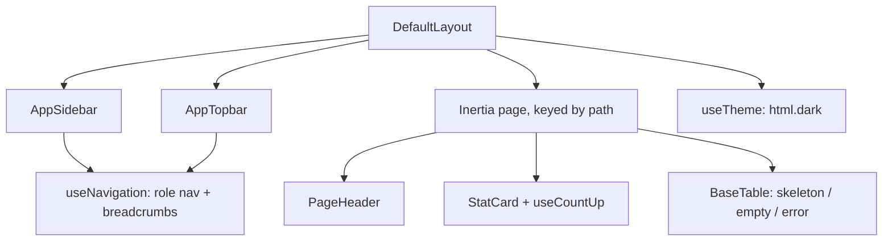

# 9. Dashboard UI/UX Refinement Report

Frontend-only refinement of the authenticated dashboard shell. No backend
logic, schema, migrations, authentication, RBAC, or API contract was changed.

## Scope

- Dashboard shell: sidebar, topbar (breadcrumbs, theme toggle, account menu),
  mobile drawer, route transition, skip link.
- Shared components: `PageHeader`, `StatCard`, `ErrorState`, skeletons;
  `BaseTable` loading/error states; `BaseCard` attribute fall-through.
- Pages: admin dashboard, Academic Years index (migrated from off-palette
  `slate`/`blue` classes to tokens + `BaseTable`), page headers on list pages.

## Architecture

## Decisions

- Project skills override the generic brief: the stack is **JavaScript +
  Inertia** (no TypeScript, vue-router, ESLint); no dependency was added.
- Dark mode is scoped to the dashboard layout; the landing page has no `dark:`
  styles.
- No dashboard charts were added: the backend exposes no time-series data and
  fake analytics are out of bounds. "Accounts by role" uses real counts as
  CSS bars. Notifications UI was not added (module not implemented).
- "Needs attention" shows only derivable signals (no current academic year,
  inactive accounts).
- Navigation: super-admin gains links to University and Error logs; university
  admin gains Academic years. All match existing route middleware; RBAC is
  untouched and the server still enforces.
- Topbar no longer renders an `h1`; each page renders one via `PageHeader`.
- Duplicate per-page flash banners removed (the layout renders flash).

## Testing

`npm run build` passes; every changed module compiles in the Vite dev server.
Not verified: in-browser visual review at the target breakpoints (no browser
tooling was available) — see remaining items below.

## Remaining

- Visual QA at 1920→375px and in dark mode.
- Create/Edit forms and ErrorLogs/Show still use older header markup (h2→h1 only).
- `RoleDashboard` remains a labelled placeholder until role modules exist.
- `window.confirm` is still used for destructive actions.

## Landing page polish & accessibility pass

Scope: every landing section (`frontend/src/components/landing/*`, `pages/Landing.vue`).

- **Navigation:** in-page links are real anchors (smooth-scroll preserved), scroll
  moves focus to the target section, URL hash updates, active section is
  highlighted (`aria-current="location"`), 44px touch targets. Mobile menu has
  `aria-controls`/`aria-expanded`, enter/leave transition, Esc to close, focus
  return, and page scroll lock. Skip-to-content link added.
- **Tabs (Module explorer):** full WAI-ARIA tabs — `tabpanel`, roving tabindex,
  arrow/Home/End keys; panel `h4` → `h3`; invalid `dl` replaced by a list.
- **Honesty:** "Live data" → "Sample data"; hero, admin workspace, charts and
  document previews carry explicit "illustrative / sample" captions; Security
  roles corrected to the real five (Super Admin, University Admin, Faculty
  Admin, Lecturer, Student); Project status updated to reflect implemented
  modules; hero "Data domains" relabelled "Domain tables".
- **Hero:** secondary CTA is now **Sign In** (real route) instead of a second
  scroll button.
- **Motion:** `Reveal` shows content immediately under reduced motion; decorative
  float/scan animations now run a few cycles then rest (WCAG 2.2.2); charts skip
  animation under reduced motion; `overflow-x: clip` prevents mobile horizontal
  scroll from reveal offsets.
- **Accessibility:** decorative mockups/QR `aria-hidden`; chart canvases have
  `role="img"` + descriptive labels; low-contrast meaningful text raised from
  `slate-400` to `slate-500/600`; decorative arrows/numbers hidden from AT;
  step list is a real `<ol>`; logo images sized (no layout shift) with empty alt
  when adjacent to visible text.
- **Not done:** visual redesign, lazy-loading of below-the-fold sections,
  SEO/structured data (not requested); no browser visual QA was possible.

## Confirm dialog (replaces `window.confirm`)

- `composables/useConfirm.js` — promise-based `confirm({ title, message, confirmLabel, destructive })`
  with one shared state; `components/ConfirmDialog.vue` (on `BaseModal`: focus
  trap, Esc, overlay close) is mounted once in `DefaultLayout`.
- Focus lands on **Cancel**; destructive confirmations use the `danger` button
  and an error-tinted icon. Closing by any route resolves `false`.
- All 9 call sites migrated (users, academic years/semesters, university,
  faculties, departments). Behaviour and requests are unchanged; only the
  confirmation UI differs.

## Login page

Presentation only — the form still posts to `POST /login` with the same fields;
authentication, throttling and redirects are untouched.

- Moved off ad-hoc `slate`/`red`/`blue` classes onto tokens (`primary-dark`,
  `dark-primary`, `error`); `shadow-2xl` → documented `shadow-lg`.
- Inline SVGs replaced with Lucide icons (Mail, Lock, Eye/EyeOff, CircleAlert, ShieldCheck).
- Fixed a nested `<main>` landmark (the guest layout already provides it).
- Inputs gained `name` and `required` (password-manager support, asterisk);
  password toggle and "Remember me" now have 36–44px touch targets and visible
  focus outlines; error banner and card animate in (motion-safe).
- Submit hover no longer collapses into the dark overlay.
- Open question: the page is branded "ITC Win Win" (ITC logo and copy) rather
  than EduCore. Left as-is pending a product decision.

## Glass surfaces (app-wide)

Documented in `docs/branding/UI-COMPONENTS.md` §14. Implemented as
`glass-surface` / `glass-card` / `glass-panel` / `glass-frosted` utilities plus an
`.app-ambient` backdrop in `style.css`.

- Applied to: sidebar, topbar, `BaseCard`/`StatCard`, `BaseTable`, `BaseModal`
  (incl. confirm dialog), `BaseDropdown`, text inputs/selects/textareas, the
  login card (with colour orbs), landing hero mock + chips, landing navbar and
  the dark landing cards.
- Not applied to flat white landing sections (no backdrop to blur).
- Accessibility/performance: solid fallbacks for unsupported browsers,
  `prefers-reduced-transparency` and `prefers-contrast: more`; blur radii kept
  at 12–24px.
