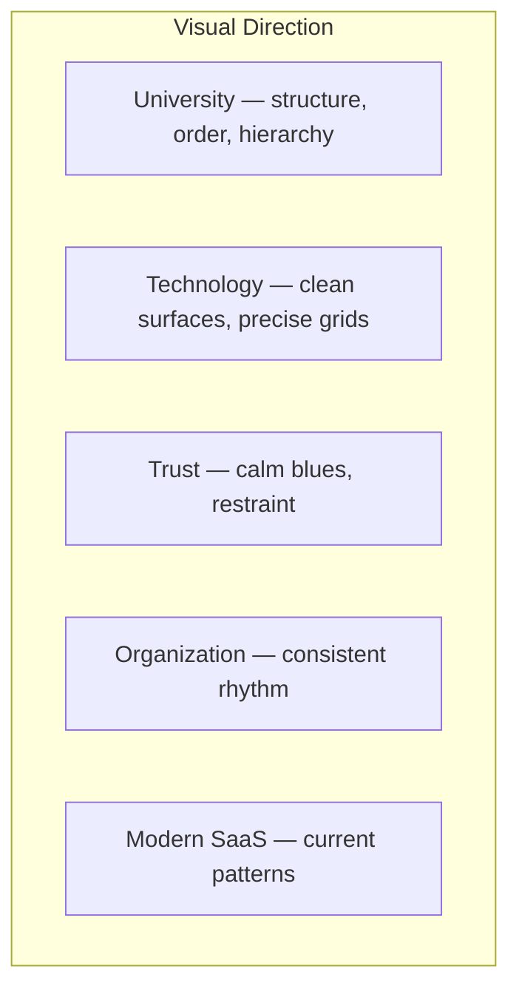
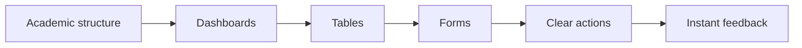

# EduCore Brand Guidelines

**Product:** EduCore — University Digital Administration Platform
**Design concept:** Modern Academic Infrastructure
**Tagline:** **"One Platform. Smarter Education."**

```
University  +  Technology  +  Trust  +  Organization  +  Modern SaaS
```

> This document is part of the EduCore **single source of truth** for visual
> identity. See [`README.md`](./README.md) for navigation and the exact token
> tables in [`DESIGN-TOKENS.md`](./DESIGN-TOKENS.md).

---

## 1. Brand Name

**EduCore** (always written as one word, "Edu" + "Core").

- Do not hyphenate (`Edu-Core` is wrong).
- Do not split into two words.
- Never rename informally (e.g. "EduCore University", "EduCore System").

### Product description

> A centralized digital administration platform designed for universities to
> manage academic operations, student services, administrative workflows,
> communication, documents, and institutional information through one secure
> platform.

### Brand purpose

To give universities a reliable, organized, and trustworthy digital core for
their academic and administrative work — replacing fragmented spreadsheets,
paper documents, and disconnected tools with one consistent platform.

### Brand vision

A future where a university's core academic and administrative workflows run on
one secure, well-organized digital platform that students, lecturers, and
administrators can all trust.

---

## 2. Brand Personality

| Trait | Meaning in design |
|---|---|
| **Professional** | Formal tone, real words, no jargon, enterprise-grade structure |
| **Modern** | Current SaaS patterns, clean layout, up-to-date, never retro |
| **Trustworthy** | Calm blues, restrained decoration, precise alignment, reliable behaviors |
| **Academic** | Structured hierarchy, clear information order, formality, order |
| **Clean** | White space, no visual noise, minimal decoration |
| **Accessible** | WCAG-minded contrast, keyboard support, visible states |
| **Organized** | Predictable navigation, consistent grids, coherent components |
| **Technology-driven** | Precise, measurable, data-ready, confident surfaces |

---

## 3. Brand Principles

1. **Clarity over decoration.** If it does not help understanding, remove it.
2. **Consistency over cleverness.** Reuse tokens and components; never restyle per page.
3. **Trust through restraint.** Calm, low-chroma surfaces with deliberate accent use.
4. **Hierarchy over equality.** Every screen has one primary action and clear information order.
5. **Accessibility by default.** Contrast, keyboard, and semantics are requirements, not options.
6. **Information density where needed.** Administration screens may be dense, but must never be cluttered.

---

## 4. Visual Direction

**Modern Academic Infrastructure.**



Key characteristics:

- **Light, airy shell:** a neutral background (`#F8FAFC`) dominates the interface.
- **Blue-led brand:** Academic Blue is the single dominant brand accent.
- Low-chroma neutrals; color is used to *mean* something (status, action), not to decorate.
- Flat-ish surfaces with subtle borders and very light shadows.
- 4px-based rhythm for perfect internal consistency.

---

## 5. Logo Usage

### Current status

The repository has published assets only at
`frontend/public/assets/logo/edu-core.jpg` (a logo image). A branded inline
favicon does **not** yet exist — the current `frontend/public/favicon.svg`
is a generic scaffold asset and should be replaced when a final mark is approved.

### Usage rules (once a final mark exists)

- **Clear space:** keep at least one full "E" letter height of clear space on all sides.
- **Minimum size:** do not render the logo below 24px in the header/nav context.
- **Backgrounds:** the logo must sit on background (`#F8FAFC`) or white surfaces,
  or on Dark Navy when a dark variation is used. Never place it on mid-tone colors.
- **Do not:** stretch, rotate, recolor arbitrarily, add drop shadows, place on
  busy imagery, or mix with other logos inside the platform UI.
- Keep the logotype legible at small sizes; prefer the wordmark without the icon
  in compact contexts (favicon, notifications).

---

## 6. Color System

Full token tables (Hex + RGB + HSL, usage, where *not* to use): see
[`DESIGN-TOKENS.md`](./DESIGN-TOKENS.md#1-color-system).

### Color hierarchy

```
Primary        → Academic Blue  #2563EB
Primary Dark   → Deep Navy      #0F172A
Secondary      → Sky Blue       #38BDF8
Accent         → Teal           #14B8A6
---
Neutral scale  → Background / White / Text / Muted
Semantic scale → Success / Warning / Error / Info
```

### Color usage summary

| Color | Use for | Avoid for |
|---|---|---|
| Academic Blue `#2563EB` | Primary buttons, links, active nav, selected states, primary actions | Large decorative backgrounds |
| Deep Navy `#0F172A` | Headings, dark surfaces, top navigation, important text | Body copy on light bg |
| Sky Blue `#38BDF8` | Secondary accents, information, charts, highlights | Buttons (insufficient contrast on white) |
| Teal `#14B8A6` | Supporting accent, selected data visualization, secondary positive states | Primary actions |
| Background `#F8FAFC` | App background | Text color |
| White `#FFFFFF` | Cards, surfaces on the background | — |
| Text `#1E293B` | Primary body text | Decoration |
| Muted `#64748B` | Secondary text, captions, placeholders | Body copy on small sizes |
| Success `#16A34A` | Successful operations, active/success status | Non-status decoration |
| Warning `#F59E0B` | Pending, attention required | Error messages |
| Error `#DC2626` | Validation errors, destructive states | Success messages |
| Info `#2563EB` | Informational notes, info alerts | (same as primary) |

**Golden rule:** do not use all brand colors simultaneously in one component.
One dominant color, one accent at most, neutrals everywhere else.

---

## 7. Color Proportion

A calm enterprise interface follows roughly:

```
60%  Neutrals & background
30%  Surfaces & content
10%  Brand / accent
```

- The page shell is overwhelmingly neutral (`#F8FAFC`, white surfaces).
- Brand color appears as **actions, links, active states** — not as wallpaper.
- Avoid highly saturated pages. When in doubt, use less color.

---

## 8. Dark Mode

Dark mode is **intentionally designed**, not an inverted light mode.

Core dark tokens:

| Role | Token |
|---|---|
| Background | `#0B1120` |
| Surface | `#111827` |
| Secondary surface | `#1E293B` |
| Text (primary) | `#F8FAFC` |
| Muted text | `#94A3B8` |
| Primary (brightened) | `#60A5FA` |

Key behavioral rules:

- Semantic colors keep their hue but are **shifted lighter** on dark surfaces
  so they read correctly (success stays green, but brighter).
- Borders become `#334155`; hover states use a subtly lighter surface.
- Text never drops to near-black; surfaces never look "raised" by pure white.
- Apply via a `dark` variant; never bolt dark styles onto light components ad hoc.

Full dark-mode token table: [`DESIGN-TOKENS.md`](./DESIGN-TOKENS.md#4-dark-mode).

---

## 9. Typography

| Role | Font |
|---|---|
| Primary (UI + body) | **Inter** |
| Display (optional headings) | **Plus Jakarta Sans** |

- Use Inter for all interface text by default.
- Plus Jakarta Sans may be used for large display/hero headings only; it must
  **never** be mixed into body or component typography.
- Exact scale (sizes, line heights, weights, letter-spacing): see
  [`DESIGN-TOKENS.md`](./DESIGN-TOKENS.md#5-typography).
- Fallbacks: system sans-serif stack (`ui-sans-serif, system-ui, sans-serif`).

---

## 10. Iconography

- **Single icon family:** **Lucide Icons** (the project's approved icon set).
- Icon sizes: `16`, `18`, `20`, `24` px. Default `20px` for inline, `24px` for
  large actions/empty states.
- **Stroke width:** `1.5` (default), `2` for emphasis at small sizes; keep it
  uniform within a component.
- Alignment: align to the text baseline; use inline-flex with fixed-size icons.
- Color: inherit `currentColor` — never hardcode an icon fill color.
- Do **not** mix unrelated icon libraries or styles.

---

## 11. Imagery

- Minimal use; imagery serves data or formality, never decoration.
- Brand photography (if introduced) should be **university environments, campus
  architecture, and focused students/lecturers** — natural, not staged-looking.
- Keep imagery on neutral backgrounds; add subtle overlays only when text sits
  on top.
- No childish illustrations, gradients-for-the-sake-of-it, or gaming-style art.

---

## 12. UI Philosophy

- One primary action per screen; everything else is secondary.
- Dashboards: summary cards on top, detail tables below.
- Space communicates grouping: use consistent 4px-rhythm gaps, not arbitrary margins.
- Interactivity must always declare its state (hover, focus, active, disabled, loading).
- Tables are first-class citizens (this is an administration platform).



---

## 13. Accessibility Principles

EduCore must be usable by people with different accessibility needs.

- **Contrast:** all body text meets WCAG AA (4.5:1) on its surface; large text
  meets 3:1. Verify with tokens, not by eye.
- **Keyboard:** every interactive element is reachable and operable with the keyboard.
- **Visible focus:** focus rings (`2px` Academic Blue offset from the element)
  are always visible.
- **Semantic HTML:** use native `button`, `a`, `input`, `table`, etc., with
  correct attributes.
- **Labels:** every form control has a visible label.
- **Buttons:** never rely on `click` handlers on divs; use real buttons/links.
- **Error messages:** text + icon, never color alone.
- **Do not rely on color alone:** status always includes text/icon alongside color.
- **ARIA:** add roles/attributes only where needed; prefer native semantics first.
- **Motion:** respect `prefers-reduced-motion` (see
  [`UI-COMPONENTS.md`](./UI-COMPONENTS.md#11-animation)).
- **Touch targets:** minimum 40px height for interactive controls.

---

## 14. Non-Goals (Visual)

EduCore must **not** look like:

- A colorful consumer/entertainment app (gaming aesthetic).
- A sci-fi / "futuristic" dashboard with glowing elements.
- A toy or children's product.
- A cluttered, rainbow-colored admin screen.

If a design decision pushes toward any of these, step back to the 60/30/10 rule
and the color hierarchy.

---

## Validation Checklist

1. Tagline "One Platform. Smarter Education." spelled exactly.
2. Color usage follows the hierarchy table.
3. No non-palette colors introduced.
4. Dark mode treated as designed (not inverted light).
5. Typography uses Inter (display: Plus Jakarta Sans) only.
6. Icons all from Lucide, `currentColor`, consistent stroke/size.
7. 60/30/10 proportion respected.
8. Accessibility rules applied (contrast, focus, labels, semantics).
9. Related docs: `DESIGN-TOKENS.md`, `UI-COMPONENTS.md`, `README.md`.

---

## Agent behavior (mandatory everywhere)

1. Inspect the existing implementation before modifying it.
2. Follow existing project conventions already established.
3. Do not rewrite working code unnecessarily.
4. Do not introduce technologies outside the EduCore stack.
5. Do not create unnecessary abstractions.
6. Do not create duplicate business logic.
7. Do not invent database relationships.
8. Do not bypass authorization.
9. Do not hardcode secrets.
10. Do not modify unrelated modules.
11. Run appropriate tests after changes.
12. Explain important architectural decisions.