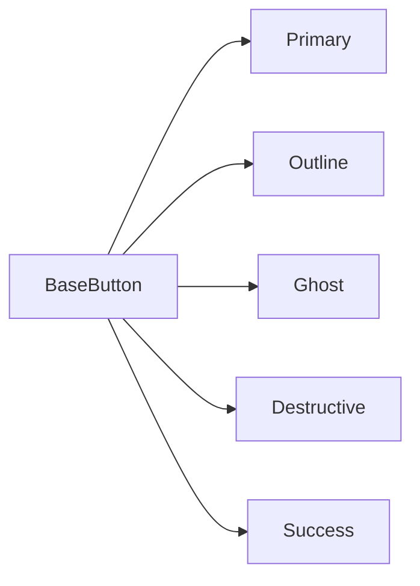
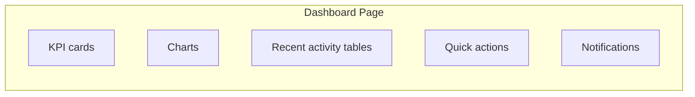

# EduCore UI Components

Component-level design rules for EduCore — buttons, forms, tables, cards,
modals, statuses, navigation, dashboards, charts, states, and animation.

All values referenced here come from [`DESIGN-TOKENS.md`](./DESIGN-TOKENS.md)
(tokens) and [`BRAND-GUIDELINES.md`](./BRAND-GUIDELINES.md) (identity). Follow
this document for every component you build or modify.

> **Mandatory rule (see `README.md`):** before creating or modifying UI, the
> coding agent MUST consult this branding/design system, reuse existing tokens
> and components, and never introduce new visual patterns without justification
> AND a matching design-system update.

---

## 1. Component Library Orientation

Reusable primitives live under `frontend/src/components` (see
`skills/frontend-ui/SKILL.md`):

| Component | Purpose |
|---|---|
| `BaseButton` | All button variants |
| `BaseInput` / `BaseSelect` / `BaseTextarea` | Form primitives with label + error slot |
| `BaseTable` | Data tables: slots, sorting, pagination footer |
| `BaseModal` | Modal scaffold (`v-model` open state) |
| `BaseCard` | Content card container |
| `BaseDropdown` / `BaseTooltip` / `BaseBadge` | Small interaction primitives |
| `EmptyState` / `LoadingSpinner` / `ErrorAlert` | Status visuals |
| `StatusBadge` | Status → color mapping |
| `Pagination` | Page navigation |

Do not rewrite these; extend/use them.

---

## 2. Buttons

Variants (see token values in `DESIGN-TOKENS.md`):

| Variant | Background | Text | Border | Hover | Active | Focus |
|---|---|---|---|---|---|---|
| Primary | `primary` | white | none | `primary` darkened 8–12% | darker + slight inset | focus ring `primary` 2px |
| Secondary | `secondary`/10 | `primary` | none | `secondary`/20 | darker | ring `primary` |
| Outline | transparent | `text` | `border-default` | `background` tint | darker | ring `primary` |
| Ghost | transparent | `text` | none | `background` | `background`+ | ring `primary` |
| Destructive | `error` | white | none | darker `error` | darkest | ring `error` |
| Success | `success` | white | none | darker `success` | darkest | ring `success` |

**Sizes:** Small `8px 12px` / Medium `10px 16px` / Large `12px 20px`
(heights ≈ 32 / 40 / 48px).

**States:** disabled → opacity `.5`, no pointer; loading → spinner replaces/joins
label, button disabled.



---

## 3. Forms

Layout is vertical and consistent:

```
Label (14px/500)
Input  (…)
Helper text OR Error message (12–14px)
```

- **Labels** always visible (never placeholder-only).
- **Required:** asterisk + red `*` + `aria-required`.
- **Helper text:** `muted` color, under the input.
- **Errors:** `error` color, icon + text, under the field; never color alone.
- **Disabled:** opacity `.5`, no focus.
- **Loading/submitting:** disable the submit button while pending.
- Map server `422` errors back to fields (see `skills/api/SKILL.md`).

### Inputs / Selects / Textareas

| Property | Value |
|---|---|
| Radius | `radius-md` (8px) |
| Border | `border-default`, dark: `border-dark` |
| Height (input/select) | 40px (mobile ≥ 44px touch friendly) |
| Padding | 8px 12px |
| Focus | 2px `border-focus` ring |
| Background | `surface` |

### Checkbox / Radio / Switch

- Use native controls styled consistently; label is clickable.
- Checked states use `primary` (or `success` where semantically positive).
- Switch: track ≈ 36×20px pill, thumb 16px, `primary` when on.
- Dark mode: track `dark-surface-2`, thumb `dark-ink`.

---

## 4. Tables (high priority)

Tables are the backbone of this administration platform.

| Property | Value |
|---|---|
| Cell padding | `12px 16px` (dense mode: `8px 12px`) |
| Header | `small` copy (14px), weight 600, `muted` text, transparent bg |
| Row height | 48–56px standard, 40px dense |
| Borders | horizontal `border-default` row separators only |
| Hover | `background` row tint |
| Selected row | `primary`/5 tint + left indicator |
| Empty state | `EmptyState` component with message + CTA |
| Loading | skeleton rows or spinner overlay |

- **Actions column:** rightmost, icon buttons, `gap-2`.
- **Sorting:** header toggles `sort_by`/`sort_dir` (see `skills/api/SKILL.md`).
- **Filtering/search:** toolbar above the table; consistent across all tables.
- **Pagination:** `Pagination` footer; shared `useDataTable` composable.
- **Responsive:** allow horizontal scroll on mobile; never hide columns without a
  plan (mobile card view is acceptable for key screens).
- **Status badges:** right-aligned in their column, consistent mapping (§7).

---

## 5. Cards

| Type | Padding | Radius | Border | Shadow |
|---|---|---|---|---|
| Standard | 20px | `radius-lg` | `border-default` | `shadow-sm` |
| KPI card | 20px | `radius-lg` | `border-default` | `shadow-sm` |
| Information | 20px | `radius-lg` | `border-default` | none |
| Action card | 20px | `radius-lg` | `border-default` | `shadow-sm`, hover lift |
| Warning card | 20px | `radius-lg` | warning tint border | — |
| Empty card | 24px | `radius-lg` | dashed `border-muted` | none |

**KPI card structure:** label (`small`/`muted`) → value (`h4`-large, 24px/700) →
optional delta chip (positive `success`, negative `error`).

Do not overload cards with actions — one primary action per card.

---

## 6. Modals / Dialogs

| Property | Value |
|---|---|
| Widths | `sm` 400 · `md` 520 · `lg` 720 · `xl` 960 px |
| Padding | 24px |
| Radius | `radius-xl` (16px) |
| Border | `border-default` |
| Shadow | `shadow-lg` |
| Overlay | `rgb(15 23 42 / 0.5)` backdrop, click-to-close (with care) |
| Close | X button top-right (Lucide `X`) + Escape |
| Header | `h4` title (20px/600), 0 bottom border |
| Body | 24px content, `gap` 16px |
| Footer | right-aligned actions, `gap` 12px, top border |
| Mobile | smaller max-width + `height` up to 100dvh, scrollable body |
| Accessibility | focus trap, Escape closes, dialog label linked to title (`aria-labelledby`) |

Confirmed destructive modals: title + explanation + destructive confirm button.

---

## 7. Status System

Statuses map to **semantic colors** — never invent a per-status color.

| Status | Color |
|---|---|
| Active | `success` |
| Inactive | `muted` |
| Pending | `warning` |
| Approved | `success` |
| Rejected | `error` |
| Draft | `muted` |
| Published | `success` |
| Completed | `success` |
| Cancelled | `muted` |
| Failed | `error` |

**StatusBadge:** pill (`radius-pill`), tinted background (10%), colored text,
11–12px, optional icon. **Always pair color with text/icon** — never color alone.

Semantic states for actions: `info` = informational, `warning` = attention,
`success` = completion, `error` = failure/destructive.

---

## 8. Navigation

### Sidebar

- Clear hierarchy: primary sections with Lucide icons + readable labels.
- Active route: `primary` tint + `primary` left indicator + weight 600 text.
- Hover: surface tint; collapsed: icons only with tooltips.
- Collapse/expand consistently; remember preference.
- Dark mode: `dark-surface` background, `dark-surface-2` active tint.

### Top navigation / header

- Breadcrumbs left (context), user menu + notifications right.
- Height ≈ 56–64px; `border-default` bottom.

### Tabs

- Underline style: active tab = `primary` underline + weight 600; inactive = `muted`.
- Keyboard navigable (arrow keys), `role="tablist"` where appropriate.

### Mobile

- Collapsed sidebar → hamburger + drawer; or bottom nav per section count.
- Active state must remain obvious.

---

## 9. Dashboard System



**Grid:** 4 columns desktop → 2 tablet → 1 mobile. Cards have equal height
per row where possible.

Rules:

- 3–4 KPI cards max per row.
- Charts sized small & legible with labeled axes.
- One "recent activity" table per dashboard, not many.
- Quick actions: obvious primary action first.
- Do not overload — 6–8 widgets max; whitespace matters.

---

## 10. Data Visualization (Chart.js)

Colors come from the EduCore palette; **no rainbow charts.**

| Element | Value |
|---|---|
| Primary series | `#2563EB` |
| Secondary series | `#38BDF8` |
| Accent series | `#14B8A6` |
| Semantics | reuse `success`/`warning`/`error` for status series |
| Grid lines | `#E2E8F0` (dark: `#334155`), dashed where helpful |
| Labels | `muted`, `small` (12–14px) |
| Tooltip | `surface` bg, text color, border-default; dark-aware |
| Legend | top or bottom, `small` |
| Fonts | Inter |

Guidelines:

- Max 3–4 series per chart; color code by category once and reuse across screens.
- Provide text labels or a table alternative for accessibility.
- Respect dark mode via tokenized chart colors.
- Use patterns (dashes) in addition to color when comparing series.

---

## 11. Animation

Restrained, purposeful.

| Duration | Use |
|---|---|
| 150ms | Hover states, micro-interactions |
| 200ms | Dropdowns, toggles, color transitions |
| 300ms | Modals, navigation transitions, expand/collapse |

- Motion only for: hover, dropdown, modal, navigation, loading, state transitions.
- Loading involves animation (e.g. simple spinner).
- Respect `prefers-reduced-motion`: disable non-essential motion; use CSS
  `@media (prefers-reduced-motion: reduce)`.
- No bounce, elastic, or "fun" easing — deceleration easing only (`ease-out`).

---

## 12. UX States (all components)

Every major component defines these states:

| State | Meaning |
|---|---|
| Default | base style |
| Hover | feedback before interaction |
| Focus | keyboard/visible focus (2px ring) |
| Active | pressed state |
| Disabled | unavailable (opacity `.5`) |
| Loading | async work in progress (spinner) |
| Success | completed |
| Error | failed/validation |
| Empty | no data (EmptyState) |

**Especially critical for:** buttons, forms, tables, cards, navigation, and all
async operations. Never silently show a blank page or raw objects.

---

## 13. Anti-Patterns (DO NOT)

DO NOT:

- introduce random colors outside the palette
- use random spacing values (only the 4px scale)
- mix icon libraries (Lucide only)
- create inconsistent button sizes
- use arbitrary border radius
- use excessive shadows or gradients
- use rainbow / multi-colored charts
- style every page differently
- hardcode hex colors throughout Vue components (`bg-[#...]`)
- duplicate design tokens
- build giant 800-line components (split at ~200–300 lines)
- ignore responsive behavior
- ignore dark mode
- ignore accessibility (focus, contrast, labels, semantics)

If a new pattern is unavoidable, **update the design system** and get it
approved — do not silently create an inconsistent pattern.

---

## Validation Checklist

1. Reuses existing primitives (`BaseButton`, `BaseModal`, …) — no new library.
2. Tokens used; no arbitrary hex/spacing/radius.
3. Statuses use semantic mapping (§7).
4. Every data view has loading / empty / error / success.
5. Tables, forms, modals follow the layouts above.
6. Charts use palette colors, ≤ 3–4 series.
7. Dark mode + accessibility respected.
8. Related skills respected: `frontend-ui`, `vue`, `api`, `authorization`.

---

## Agent behavior (mandatory everywhere)

1. Inspect the existing implementation before modifying it.
2. Follow existing project conventions already established.
3. Do not rewrite working code unnecessarily.
4. Do not introduce technologies outside the EduCore stack.
5. Do not create unnecessary abstractions.
6. Do not create duplicate business logic.
7. Do not invent database relationships.
8. Do not bypass authorization.
9. Do not hardcode secrets.
10. Do not modify unrelated modules.
11. Run appropriate tests after changes.
12. Explain important architectural decisions.