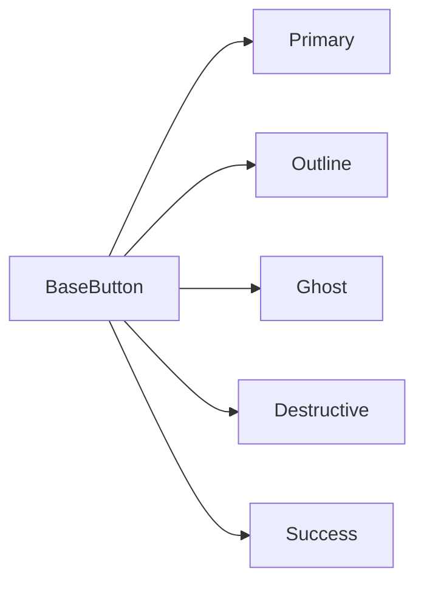
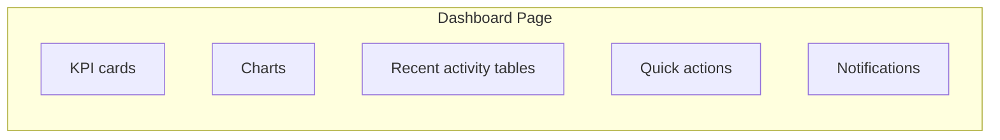

# EduCore UI Components

Component-level design rules for EduCore — buttons, forms, tables, cards,
modals, statuses, navigation, dashboards, charts, states, and animation.

All values referenced here come from [`DESIGN-TOKENS.md`](./DESIGN-TOKENS.md)
(tokens) and [`BRAND-GUIDELINES.md`](./BRAND-GUIDELINES.md) (identity). Follow
this document for every component you build or modify.

> **Mandatory rule (see `README.md`):** before creating or modifying UI, the
> coding agent MUST consult this branding/design system, reuse existing tokens
> and components, and never introduce new visual patterns without justification
> AND a matching design-system update.

---

## 1. Component Library Orientation

Reusable primitives live under `frontend/src/components` (see
`skills/frontend-ui/SKILL.md`):

| Component | Purpose |
|---|---|
| `BaseButton` | Text buttons: form submits, dialog footers (see §2) |
| `IconButton` | Icon-only actions — the default for every action (see §2 "Icon-first actions") |
| `BaseInput` / `BaseSelect` / `BaseTextarea` | Form primitives with label + error slot |
| `BaseTable` | Data tables: slots, sorting, pagination footer, clickable rows (`row-href`, see §4) |
| `BaseModal` | Modal scaffold (`v-model` open state) |
| `BaseCard` | Content card container |
| `BaseDropdown` / `BaseTooltip` / `BaseBadge` | Small interaction primitives |
| `EmptyState` / `LoadingSpinner` / `ErrorAlert` | Status visuals |
| `StatusBadge` | Status → color mapping |
| `PageHeader` | Page title block (eyebrow, `h1`, description, actions slot) — one `h1` per page |
| `StatCard` | KPI card: label, value (count-up), detail, icon, optional link or "unavailable" badge |
| `ErrorState` | Friendly load-failure block with retry; never show raw backend errors |
| `SkeletonBlock` / `StatCardSkeleton` / `TableSkeleton` | Loading placeholders that match final dimensions |
| `layout/AppSidebar` / `layout/AppTopbar` | Dashboard shell (see §8, §11) |
| `Pagination` | Page navigation |
| `ToastRegion` + `useToast` | Save / update feedback: small toasts at the bottom right (§12) |

Do not rewrite these; extend/use them.

---

## 2. Buttons

Variants (see token values in `DESIGN-TOKENS.md`):

| Variant | Background | Text | Border | Hover | Active | Focus |
|---|---|---|---|---|---|---|
| Primary | `primary` | white | none | `primary` darkened 8–12% | darker + slight inset | focus ring `primary` 2px |
| Secondary | `secondary`/10 | `primary` | none | `secondary`/20 | darker | ring `primary` |
| Outline | transparent | `text` | `border-default` | `background` tint | darker | ring `primary` |
| Ghost | transparent | `text` | none | `background` | `background`+ | ring `primary` |
| Destructive | `error` | white | none | darker `error` | darkest | ring `error` |
| Success | `success` | white | none | darker `success` | darkest | ring `success` |

**Sizes:** Small `8px 12px` / Medium `10px 16px` / Large `12px 20px`
(heights ≈ 32 / 40 / 48px).

**States:** disabled → opacity `.5`, no pointer; loading → spinner replaces/joins
label, button disabled.

### Icon-first actions (2026-10-03)

EduCore shows **actions as icons wherever an icon reads clearly**
(`components/IconButton.vue`). The `label` is required: it is the accessible
name and the tooltip, and names the object (`Archive CS101`, `Approve
grades`), so the action never depends on recognising the icon.

| Variant | Use | Look |
|---|---|---|
| `default` | most actions (edit, view, archive, filter, export…) | muted icon, `primary` on hover |
| `primary` | the page's main create action (`Plus`) and add-to-list submits | filled `primary`, white icon |
| `success` | positive steps: approve, publish, complete, reactivate / restore | muted, `success` on hover |
| `danger` | destructive: delete, remove, reject, revoke, drop, reverse, cancel | muted, `error` on hover |

Sizes: `sm` 32px in rows, cards and forms · `md` 40px in page headers and
filter bars (matches input height). Props: `href` (Inertia link), `native`
(plain `<a>` for file downloads and CSV exports), `type="submit"`, `loading`
(spinner, disabled), `disabled`, `pressed` (view toggles).

Icon vocabulary — reuse, do not invent per page:

| Action | Icon | Action | Icon |
|---|---|---|---|
| New / add (primary) | `Plus` | Edit | `Pencil` |
| Delete / remove | `Trash2` | Open a record | no icon: the row is clickable (§4) |
| Manage (open a management page) | `Settings2` | Back | `ArrowLeft` |
| Go to (card "view all") | `ArrowRight` | Archive / restore | `Archive` / `ArchiveRestore` |
| Activate / start · complete | `CirclePlay` / `Play` · `CircleCheckBig` | Close (semester) | `CircleStop` |
| Approve · reject | `Check` · `X` | Submit / send · publish | `Send` |
| Publish / release (visibility) · hide | `Eye` · `EyeOff` | Return to draft · withdraw · reverse | `Undo2` |
| Finalize · reopen | `Lock` · `LockOpen` | Revoke · cancel record | `Ban` |
| ~~Apply filters / search~~ — removed 2026-10-05: filter bars apply live (§4) | — | Clear filters | `FunnelX` |
| Download / export CSV | `Download` | Make current | `Star` |
| Enroll / assign person · drop | `UserPlus` · `UserMinus` | Deactivate · reactivate person | `UserX` · `UserCheck` |
| Module links | the sidebar icon of that module (Attendance `UserCheck`, Assignments `ClipboardList`, Exams `FileCheck`, Grades `Award`, Grading scale `Scale`, Faculties `School`, Internships `Briefcase`, Announcements `Megaphone`) | | |

**Words stay** only where the words are the content: the submit button that
commits a form or dialog (Save, Create, Record payment, Change status…),
dialog Cancel / confirm buttons, the shared `EmptyState` / `ErrorState`
calls to action, choice controls (attendance marks, segmented filters, filter
chips), navigation (sidebar, breadcrumbs, menus, pagination), links whose
text is data (file names, codes, URLs), and the public landing and sign-in
pages.


```mermaid
flowchart LR
    B[BaseButton] --> P[Primary]
    B --> O[Outline]
    B --> G[Ghost]
    B --> D[Destructive]
    B --> S[Success]
```

---

## 3. Forms

Layout is vertical and consistent:

```
Label (14px/500)
Input  (…)
Helper text OR Error message (12–14px)
```

- **Labels** always visible (never placeholder-only).
- **Required:** asterisk + red `*` + `aria-required`.
- **Helper text:** `muted` color, under the input.
- **Errors:** `error` color, icon + text, under the field; never color alone.
- **Disabled:** opacity `.5`, no focus.
- **Loading/submitting:** disable the submit button while pending.
- Map server `422` errors back to fields (see `skills/api/SKILL.md`).

### Inputs / Selects / Textareas

| Property | Value |
|---|---|
| Radius | `radius-md` (8px) |
| Border | `border-default`, dark: `border-dark` |
| Height (input/select) | 40px (mobile ≥ 44px touch friendly) |
| Padding | 8px 12px |
| Focus | 2px `border-focus` ring |
| Background | `surface` |

### Checkbox / Radio / Switch

- Use native controls styled consistently; label is clickable.
- Checked states use `primary` (or `success` where semantically positive).
- Switch: track ≈ 36×20px pill, thumb 16px, `primary` when on.
- Dark mode: track `dark-surface-2`, thumb `dark-ink`.

---

## 4. Tables (high priority)

Tables are the backbone of this administration platform.

| Property | Value |
|---|---|
| Cell padding | `12px 16px` (dense mode: `8px 12px`) |
| Header | `small` copy (14px), weight 600, `muted` text, transparent bg |
| Row height | 48–56px standard, 40px dense |
| Borders | horizontal `border-default` row separators only |
| Hover | `background` row tint |
| Selected row | `primary`/5 tint + left indicator |
| Empty state | `EmptyState` component with message + CTA |
| Loading | skeleton rows or spinner overlay |

- **Actions column:** rightmost, icon buttons only (`components/IconButton.vue`, §2 "Icon-first actions"), `gap-1`: Edit (`Pencil`), Delete / Remove (`Trash2`, `danger`), Archive / Reactivate, Activate, Manage… — 32px target, muted at rest, coloured on hover, a required `label` that is both the accessible name and the tooltip. Page-header and filter-bar actions are icon buttons too (`size="md"`).
- **Opening a record (2026-10-05):** the whole row is the link — `BaseTable` `:row-href="(row) => url"`.
  Rows get the pointer cursor, the hover tint, `tabindex="0"` and Enter to open; Ctrl/⌘-click and
  middle-click open a new tab. Clicks on controls inside the row (buttons, links, inputs) and text
  selection never navigate. There is **no** View/`Eye` action, and no Actions column when opening was
  its only action. Lists outside tables (e.g. teaching assignments, "Used in programs") make each item
  an Inertia `Link` with the same hover tint and a focus ring. `Eye` / `EyeOff` remain only for
  publish / release (visibility) actions.
- **Sorting:** header toggles `sort_by`/`sort_dir` (see `skills/api/SKILL.md`).
- **Filtering/search:** toolbar above the table; consistent across all tables.
- **Live (soft) search, no search button (2026-10-05):** filter bars apply as
  they change — typed text 300 ms after the last keystroke, selects and dates
  at once, Enter immediately (`composables/useLiveFilters.js`). The update is
  quiet: scroll kept, no top progress bar, the page is not dimmed (the layout
  only dims visits that show progress), and the search field shows a small
  spinner (`BaseInput` `loading`, `aria-busy`) while results load. Identical
  filter values never send a second request; *Clear filters* (`FunnelX`)
  stays. Never copy the server's `filters.search` back into the field after a
  visit — it would overwrite what the user is still typing.
  The list stays still while it changes: the page keeps at least the height
  it had (`DefaultLayout`, released on the next page), `BaseTable` freezes its
  column widths on the first live update (`table-fixed` + `colgroup`), and
  "no results" is a row under the kept header instead of replacing the table.
- **Pagination:** `Pagination` footer; shared `useDataTable` composable.
- **Responsive:** allow horizontal scroll on mobile; never hide columns without a
  plan (mobile card view is acceptable for key screens).
- **Status badges:** right-aligned in their column, consistent mapping (§7).

---

## 5. Cards

| Type | Padding | Radius | Border | Shadow |
|---|---|---|---|---|
| Standard | 20px | `radius-lg` | `border-default` | `shadow-sm` |
| KPI card | 20px | `radius-lg` | `border-default` | `shadow-sm` |
| Information | 20px | `radius-lg` | `border-default` | none |
| Action card | 20px | `radius-lg` | `border-default` | `shadow-sm`, hover lift |
| Warning card | 20px | `radius-lg` | warning tint border | — |
| Empty card | 24px | `radius-lg` | dashed `border-muted` | none |
| List card (2026-10-05) | 0 (`BaseCard padding="none"`); rows `px-5 py-4`, divided by `border-default` | `radius-lg` | `border-default` | `shadow-sm` |

**List card:** the card does not clip its content (row tooltips must escape it), so a
tinted row rounds its own corners (`first:rounded-t-xl last:rounded-b-xl`). Used by the
notification inbox (report 42).

**KPI card structure:** label (`small`/`muted`) → value (`h4`-large, 24px/700) →
optional delta chip (positive `success`, negative `error`).

Do not overload cards with actions — one primary action per card.

---

## 6. Modals / Dialogs

| Property | Value |
|---|---|
| Widths | `sm` 400 · `md` 520 · `lg` 720 · `xl` 960 px |
| Padding | 24px |
| Radius | `radius-xl` (16px) |
| Border | `border-default` |
| Shadow | `shadow-lg` |
| Overlay | `rgb(15 23 42 / 0.5)` backdrop, click-to-close (with care) |
| Close | X button top-right (Lucide `X`) + Escape |
| Header | `h4` title (20px/600), 0 bottom border |
| Body | 24px content, `gap` 16px |
| Footer | right-aligned actions, `gap` 12px, top border |
| Mobile | smaller max-width + `height` up to 100dvh, scrollable body |
| Accessibility | focus trap, Escape closes, dialog label linked to title (`aria-labelledby`) |

Confirmed destructive modals: title + explanation + destructive confirm button.

---

## 7. Status System

Statuses map to **semantic colors** — never invent a per-status color.

| Status | Color |
|---|---|
| Active | `success` |
| Inactive | `muted` |
| Pending | `warning` |
| Approved | `success` |
| Rejected | `error` |
| Draft | `muted` |
| Published | `success` |
| Completed | `success` |
| Cancelled | `muted` |
| Failed | `error` |

**StatusBadge:** pill (`radius-pill`), tinted background (10%), colored text,
11–12px, optional icon. **Always pair color with text/icon** — never color alone.

Semantic states for actions: `info` = informational, `warning` = attention,
`success` = completion, `error` = failure/destructive.

---

## 8. Navigation

### Sidebar

- Clear hierarchy: primary sections with Lucide icons + readable labels.
- Active route: `primary` tint + `primary` left indicator + weight 600 text.
- Hover: surface tint; collapsed: icons only with tooltips.
- Collapse/expand consistently; remember preference, read before the first
  render (no open-then-close animation on page load).
- **Folding groups (2026-10-05):** in the labelled sidebar (desktop expanded
  and the mobile drawer) every group heading is a disclosure button — label +
  `ChevronDown` (rotated −90° when folded), `aria-expanded` / `aria-controls`
  on its list. Folded groups are remembered per browser
  (`educore_sidebar_closed_groups`, read before the first render). Arriving on
  a page re-opens the group that holds it, so the current item is never
  hidden. The icon rail has no headings and always lists every item.
- Scrolling: the nav scrolls on its own in **both** states and never scrolls
  the page behind it (`overscroll-contain`); thin token scrollbar
  (`scrollbar-thin`) when expanded, hidden (`no-scrollbar`) when collapsed.
  Collapsed tooltips are one element outside the scroll area, following the
  hovered or keyboard-focused item, so scrolling never clips them. The current
  page's item is kept in view.
- Dark mode: `dark-surface` background, `dark-surface-2` active tint.

### Top navigation / header

- Breadcrumbs left (context), user menu + notifications right.
- Height ≈ 56–64px; `border-default` bottom.
- **Notification bell (2026-10-05, report 42):** a 44px `Bell` link to `/inbox`
  before the theme toggle, styled like it (`muted`, `surface` hover), tooltip
  placed **below** (the bar is at the top of the viewport). Unread count: a
  `primary` pill in the top-right corner — `h-5 min-w-5 px-1`, `caption` 600,
  white text, a 2px `surface` ring to separate it from the icon; `9+` above
  nine; hidden at zero. The count is in the accessible name ("Notifications,
  3 unread"); the pill itself is `aria-hidden`.
- **Unread rows** (inbox): light `primary` tint (`primary`/5, dark
  `dark-primary`/10), bold title, and a `primary` dot + "New" text — colour is
  never the only signal.

### Tabs

- Underline style: active tab = `primary` underline + weight 600; inactive = `muted`.
- Keyboard navigable (arrow keys), `role="tablist"` where appropriate.

### Mobile

- Collapsed sidebar → hamburger + drawer; or bottom nav per section count.
- Active state must remain obvious.

---

## 9. Dashboard System


```mermaid
flowchart LR
    subgraph Page[Dashboard Page]
        K[KPI cards]
        C[Charts]
        T[Recent activity tables]
        A[Quick actions]
        N[Notifications]
    end
```

**Grid:** 4 columns desktop → 2 tablet → 1 mobile. Cards have equal height
per row where possible.

Rules:

- 3–4 KPI cards max per row.
- Charts sized small & legible with labeled axes.
- One "recent activity" table per dashboard, not many.
- Quick actions: obvious primary action first.
- Do not overload — 6–8 widgets max; whitespace matters.
- **Overview KPI rows** (admin dashboard, analytics, Faculty Admin
  dashboard): `StatCard` without an icon — label, value, one short detail
  line — in a `grid-cols-1 sm:grid-cols-2 xl:grid-cols-4` grid with the
  staggered `animate-section-in` entrance; a card links to its list when one
  exists. Put a secondary figure on its own card rather than packing it into
  the detail line.
- **Work-queue rows** ("Waiting for you", Faculty Admin dashboard): the same
  cards under an h2, each counting the items in one status that wait for the
  viewer and linking to the queue filtered to that status. Zero stays visible
  (it says nothing is waiting); the row sits above the headline numbers.

---

## 10. Data Visualization (Chart.js)

Colors come from the EduCore palette; **no rainbow charts.**

| Element | Value |
|---|---|
| Primary series | `#2563EB` (dark: `#3B82F6` — `chart-primary` / `dark-chart-primary`; `#60A5FA` fails the dark chart lightness band) |
| Secondary series | `#38BDF8` |
| Accent series | `#14B8A6` |
| Semantics | reuse `success`/`warning`/`error` for status series |
| Grid lines | `#E2E8F0` (dark: `#334155`), dashed where helpful |
| Labels | `muted`, `small` (12–14px) |
| Tooltip | `surface` bg, text color, border-default; dark-aware |
| Legend | top or bottom, `small` |
| Fonts | Inter |

Guidelines:

- Max 3–4 series per chart; color code by category once and reuse across screens.
- Provide text labels or a table alternative for accessibility.
- Respect dark mode via tokenized chart colors.
- Use patterns (dashes) in addition to color when comparing series.

**Status breakdown donuts (2026-10-05, Analytics workload):**

- Part-to-whole at a glance only: slices are the statuses that have records;
  each status keeps the palette slot of its place in the workflow
  (`PieChart` `slots`), so a colour never moves when another status empties.
- More than six non-empty statuses open in the rows view (a donut stops
  reading beyond ~6 segments); a toggle switches donut ↔ rows, and the rows
  list every status — zeros included — with its `StatusBadge` and share.
- A value legend is always shown (identity is never colour alone); in cards
  three-across it sits under the donut (`legend-below`) instead of being
  squeezed beside it. No records → an empty state, not an empty ring.
- Palette check (`validate_palette.js`, 2026-10-05): the shared `PieChart`
  palette passes colour-blind and normal-vision separation; slot 8 (slate)
  reads gray and the dark set sits above the lightness band — acceptable here
  because labels are always visible, but a palette refresh is an open item.

---

## 11. Animation

Restrained, purposeful.

| Duration | Use |
|---|---|
| 150ms | Hover states, micro-interactions |
| 200ms | Dropdowns, toggles, color transitions |
| 300ms | Modals, navigation transitions, expand/collapse |

- Motion only for: hover, dropdown, modal, navigation, loading, state transitions.
- Loading involves animation (e.g. simple spinner).
- Respect `prefers-reduced-motion`: disable non-essential motion; use CSS
  `@media (prefers-reduced-motion: reduce)`.
- No bounce, elastic, or "fun" easing — deceleration easing only (`ease-out`).

---

### 11.1 Dashboard shell motion and theme (added with the UI refinement)

| Item | Rule |
|---|---|
| Route change | `animate-page-in`: 250ms, opacity 0→1 + translateY(6px→0), keyed on path (not query) |
| Section entrance | `animate-section-in`: 500ms ease-out, staggered 60ms steps, `motion-safe:` only |
| Sidebar collapse / drawer | 300ms ease-out; collapsed state persisted (`educore_sidebar_collapsed`); below `lg` it is a drawer with backdrop, scroll lock, focus trap, Esc, `inert` when closed |
| Count-up | `useCountUp`, 500ms, skipped under reduced motion |
| Theme | `useTheme` toggles `dark` on `<html>` only while the dashboard layout is mounted; preference in `educore_theme`, falls back to system |
| Skeletons | `animate-pulse` blocks sized like the final component |

## 12. UX States (all components)

### Feedback toasts (2026-10-05)

Every save, update, delete or other mutation reports back with one pattern: a **small toast at the
bottom right** (`components/ToastRegion.vue`, mounted once in `DefaultLayout`).

| Rule | Value |
|---|---|
| Source | Server flash `success` / `error` (`->with('success', ...)`) becomes a toast once per server response (Inertia `success` event; Back/Forward never replays old messages). Code can call `toast.success()` / `toast.error()` from `composables/useToast` |
| Placement | `fixed`, 24px from the bottom and right (`16px` gutters, full width on phones); `z-[80]` above modals |
| Size | `w-80`, `px-4 py-3`, `text-small`, one icon (`CircleCheck` success · `CircleAlert` error · `Info`), a dismiss `X` |
| Surface | `surface` / `dark-surface`, `border-default`, `shadow-lg`, `radius-lg`; the icon carries the semantic colour, the text stays `ink` |
| Lifetime | success 4s, error 6s; hover or keyboard focus pauses; at most 3 stacked; an identical message within 1s is shown once |
| Motion | 200ms rise + fade in, 150ms fade out (reduced-motion rule applies) |
| Accessibility | Region `aria-live="polite"`; success/info `role="status"`, errors `role="alert"`; the dismiss button has a label |

Validation errors are **not** toasts: they stay inline under their fields (§3). The previous
full-width flash banner at the top of the content was removed.

Every major component defines these states:

| State | Meaning |
|---|---|
| Default | base style |
| Hover | feedback before interaction |
| Focus | keyboard/visible focus (2px ring) |
| Active | pressed state |
| Disabled | unavailable (opacity `.5`) |
| Loading | async work in progress (spinner) |
| Success | completed |
| Error | failed/validation |
| Empty | no data (EmptyState) |

**Especially critical for:** buttons, forms, tables, cards, navigation, and all
async operations. Never silently show a blank page or raw objects.

---

## 13. Anti-Patterns (DO NOT)

DO NOT:

- introduce random colors outside the palette
- use random spacing values (only the 4px scale)
- mix icon libraries (Lucide only)
- create inconsistent button sizes
- use arbitrary border radius
- use excessive shadows or gradients
- use rainbow / multi-colored charts
- style every page differently
- hardcode hex colors throughout Vue components (`bg-[#...]`)
- duplicate design tokens
- build giant 800-line components (split at ~200–300 lines)
- ignore responsive behavior
- ignore dark mode
- ignore accessibility (focus, contrast, labels, semantics)

If a new pattern is unavoidable, **update the design system** and get it
approved — do not silently create an inconsistent pattern.

---

## 14. Glass Surfaces

Frosted-glass surfaces are part of the dashboard, login and landing look. They
are implemented once, as token-based utilities in `frontend/src/style.css`, and
must not be re-created per component.

| Utility | Use | Treatment |
|---|---|---|
| `glass-surface` | Sidebar, topbar | `surface` @ 70% (dark: `dark-surface` @ 65%), blur 16px, no border/shadow |
| `glass-card` | `BaseCard`, `StatCard`, `BaseTable` container | `surface` @ 72%, blur 12px, `border-default` @ 80%, `shadow-sm` + 1px inner highlight |
| `glass-panel` | `BaseModal`, `BaseDropdown` | `surface` @ 86% (more opaque for legibility), blur 24px, `shadow-lg` |
| `glass-frosted` | Login card, any surface over a photo/dark field | white @ 10%, blur 24px, white border @ 22% |
| `.app-ambient` | Dashboard shell backdrop | Three low-alpha radial fields (primary, secondary, accent; dark: brighter primary) so the glass has something to blur |

Rules:

- Glass only on **containers and chrome**; text, icons, tables rows and badges
  stay solid. Inputs use `surface` @ 70% with `backdrop-blur-sm`.
- Text contrast (AA) is measured against the glass background — never lower the
  opacities below the values above.
- Fallbacks are built in: no `backdrop-filter` support, `prefers-reduced-transparency`
  or `prefers-contrast: more` switch every glass utility to the solid
  `surface`/`dark-surface` token and hide `.app-ambient`.
- Do not stack more than one glass layer on top of another; do not add glass to
  flat white landing sections (nothing behind them to blur).
- The ambient fields are the **only** sanctioned decorative gradient in the app
  shell (alpha ≤ 18%); no other gradients.

---

## 15. Landing Page (2026-10-05)

The public page at `/` (`pages/Landing.vue`, components in `components/landing/`). Light **and**
dark: the navbar's Sun/Moon toggle uses `useTheme` (the dashboard's `educore_theme` preference, falling
back to the system); report: `docs/37_Landing-Page-Redesign-Report.md`.

| Rule | Value |
|---|---|
| Section order | Hero · What is EduCore? · Problem → Solution · Modules · Academic ecosystem · Student journey · See EduCore in action · Documents · Communication · Analytics · Security · Technology · Project story · Final CTA · Footer (the ASCII "EDUCORE" wordmark only) |
| Surfaces | Alternate `surface` / `background` (dark: `dark-surface` / `dark-bg`); `primary-dark` (navy) for "See EduCore in action", the final CTA and the footer, with a `dark-border` edge in dark mode. The sample QR mark stays dark-on-light in both themes |
| Type | Section titles `font-display` + `h2`; hero and final CTA `h1` → `display` from `sm` |
| Navbar | Transparent over the hero, solid `surface` + `border-default` + `shadow-sm` once scrolled (glass greyed over navy sections); live-text wordmark (navy "Edu", primary "Core"); links Home · Platform · Modules · Technology · About; the active link is the last linked section above 30% of the viewport, so sections between links keep the previous link lit |
| Buttons | `BaseButton` on light sections; on navy, the dark-mode button tokens (`dark-primary` fill, `dark-bg` text) so the hover never matches the background |
| Tabs | `LandingTabs` — underline tabs (§8) with arrow / Home / End keys |
| Live data | Figures come from the `stats` prop (`LandingStatsService`): aggregates only — no names or personal records; per-course results only from five approved grades. An empty database shows dashes and `EmptyState`s, never invented numbers. The Admin preview uses the live University Admin figures; Lecturer / Student previews show placeholders (personal dashboards). Illustrative content that is not data (sample transcript, example notifications) is captioned as such |

Motion (all in `style.css`, deceleration easing, covered by the global reduced-motion rule):

| Utility / component | Use |
|---|---|
| `Reveal` + `useInView` | Scroll reveal, once per element; content shows at once under reduced motion |
| `.edu-fade-up` (staggered delays) · `.edu-slide-in` | Hero copy and CTAs · hero terminal |
| `HeroTerminal` · `.edu-blink` | Types the repository's real Makefile commands once (`make up`, `make migrate && make seed`, `make test`, `open`), then the cursor blinks 6 times and rests; full transcript at once under reduced motion; `sr-only` summary |
| `.edu-drift` | Hero `.app-ambient` backdrop, 18s × 2 cycles, then rests |
| Scroll-linked line | Academic ecosystem: the line fills with scroll and each level lights when reached |
| Problem → Solution morph | Chips move from scattered to aligned and swap problem → solution text; a Before / With EduCore toggle replays it |
| `.edu-travel` · `.edu-scan` | Communication signal dot (3 runs) · QR scan line (3 runs), started when in view |
| `.edu-marquee` | Technology rows. The **only infinite animation** in the product: it pauses on hover / keyboard focus and with a visible Pause button (WCAG 2.2.2), and becomes a static wrapped list under reduced motion |
| `.landing-glow` | One low-alpha `primary` radial glow on navy sections; the only decorative gradient besides `.app-ambient` |
| `.landing-banner` | Footer ASCII wordmark: monospace, `clamp(0.375rem, 2.4vw, 1.5rem)`, line-height 1, solid `primary` (no opacity — overlapping glyphs would show seams); `aria-hidden` with an `sr-only` text |

Technology logos are the documented exception to Lucide-only icons (`BRAND-GUIDELINES.md` §10).

---

## Validation Checklist

1. Reuses existing primitives (`BaseButton`, `BaseModal`, …) — no new library.
2. Tokens used; no arbitrary hex/spacing/radius.
3. Statuses use semantic mapping (§7).
4. Every data view has loading / empty / error / success.
5. Tables, forms, modals follow the layouts above.
6. Charts use palette colors, ≤ 3–4 series.
7. Dark mode + accessibility respected.
8. Related skills respected: `frontend-ui`, `vue`, `api`, `authorization`.

---

## Agent behavior (mandatory everywhere)

1. Inspect the existing implementation before modifying it.
2. Follow existing project conventions already established.
3. Do not rewrite working code unnecessarily.
4. Do not introduce technologies outside the EduCore stack.
5. Do not create unnecessary abstractions.
6. Do not create duplicate business logic.
7. Do not invent database relationships.
8. Do not bypass authorization.
9. Do not hardcode secrets.
10. Do not modify unrelated modules.
11. Run appropriate tests after changes.
12. Explain important architectural decisions.