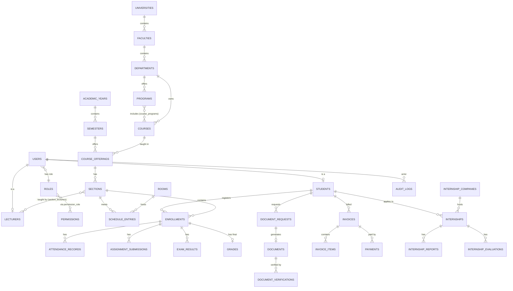
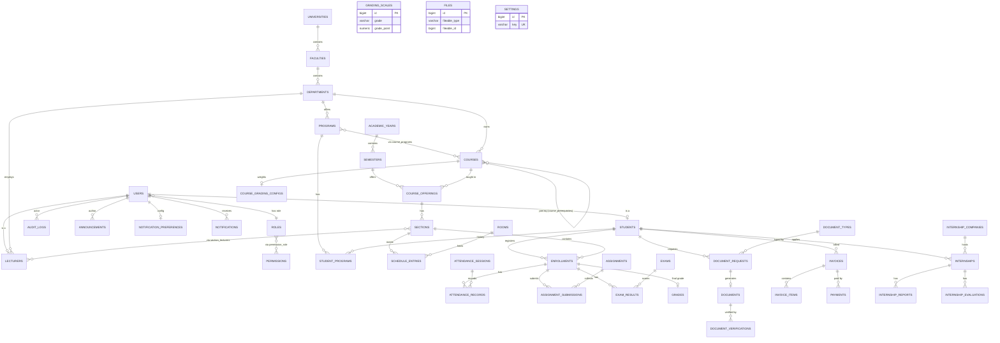

# EduCore Database ERD

Entity-relationship diagrams for the complete schema (49 domain tables). The
terminology follows `skills/academic-domain/SKILL.md` exactly.

## Contents

| Diagram | Where |
|---|---|
| High-level architecture | below (this file) |
| Complete database ERD | below (this file) |
| Identity & Access | [`erd/identity-access.md`](./erd/identity-access.md) |
| University Structure | [`erd/university-structure.md`](./erd/university-structure.md) |
| Academic Management | [`erd/academic.md`](./erd/academic.md) |
| Enrollment & Attendance | [`erd/enrollment-attendance.md`](./erd/enrollment-attendance.md) |
| Examination & Grading | [`erd/examination-grading.md`](./erd/examination-grading.md) |
| Documents | [`erd/documents.md`](./erd/documents.md) |
| Finance | [`erd/finance.md`](./erd/finance.md) |
| Communication | [`erd/communication.md`](./erd/communication.md) |
| Internship | [`erd/internship.md`](./erd/internship.md) |
| Audit | [`erd/audit.md`](./erd/audit.md) |

---

## 1. High-level architecture ERD

## 2. Complete database ERD

Per-domain diagrams with columns: see the [`erd/`](./erd/) folder.